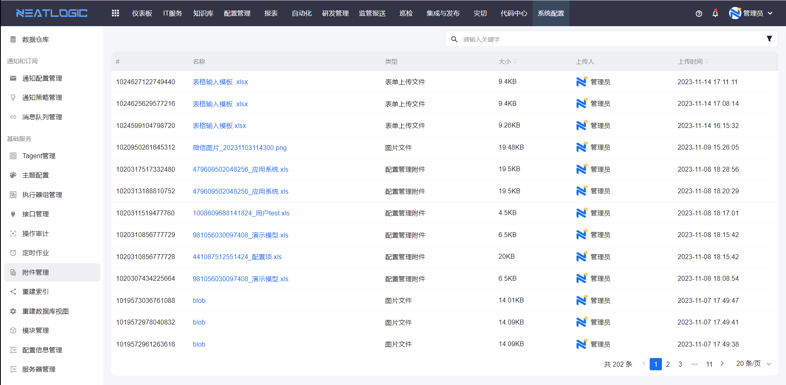

# 附件管理

附件管理用于汇总和下载当前系统所有用户在各个模块上传的文档。

当需要查看用户上传的附件、下载附件，或排查附件占用空间时，可以从附件管理开始。

本文以"附件查看和下载"为主线，说明附件管理中的常见操作。

## 权限

**操作权限**
- 配置：系统配置-[用户管理](../1.用户和权限/用户管理.md)-授权-附件管理权限
- 包含操作：查看附件、下载附件
- 配置人员：系统超级管理员

## 附件查看

附件查看用于汇总各模块用户上传的文档。

附件管理页面会汇总当前系统所有用户在各个模块上传的文档，便于管理员统一查看附件来源、上传人和上传时间。

## 附件下载

附件下载用于将附件保存到本地。

在附件列表中选择需要下载的附件，执行下载操作即可将附件保存到本地。
