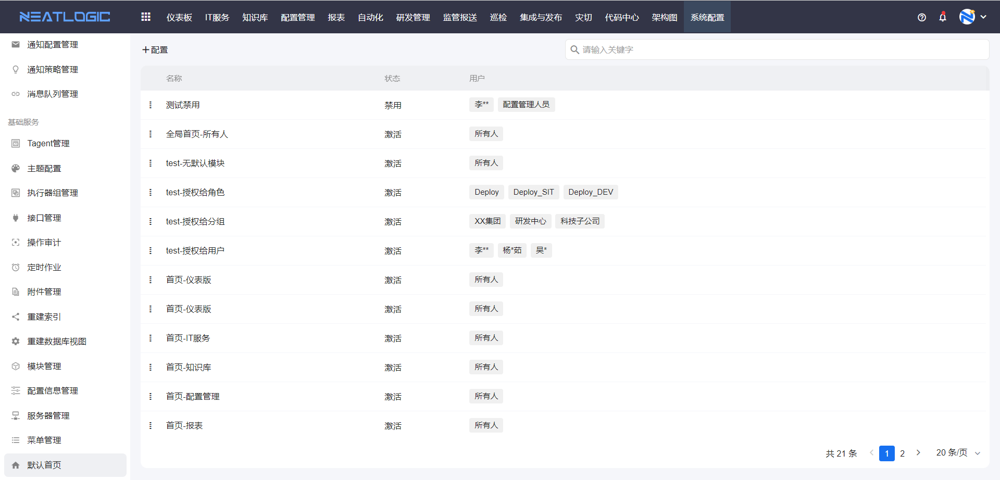
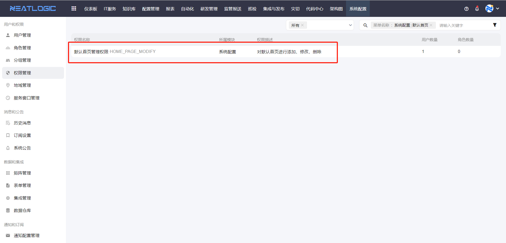
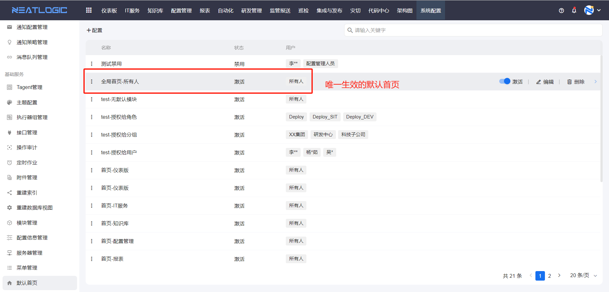
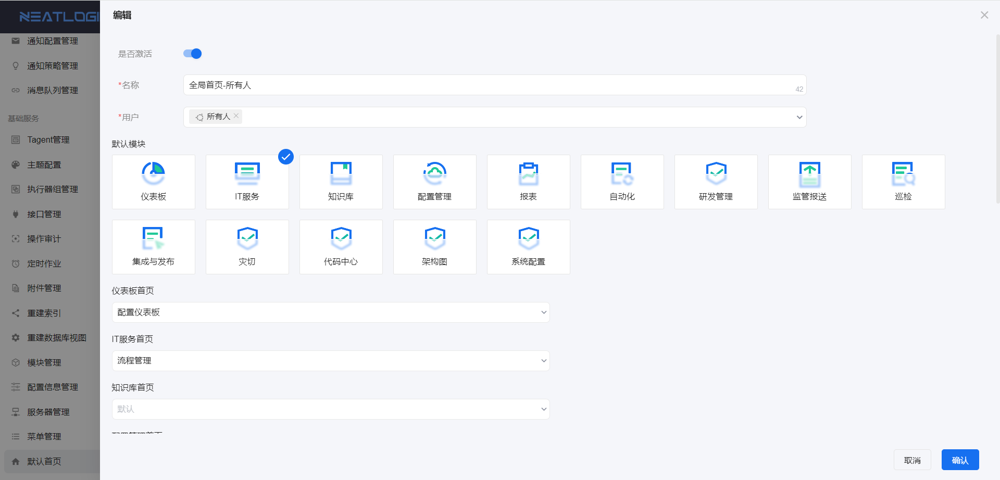
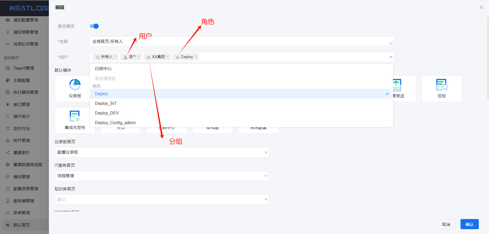

# 默认首页

默认首页用于管理系统的全局默认首页配置。管理员可以指定用户登录系统后默认打开的模块，以及访问模块时默认打开的页面。

当需要为不同用户群组配置不同的进入系统后默认展示内容，或希望某些角色直接进入工作模块时，可以从默认首页开始。生效的全局默认首页只有一个。

本文以"生效规则""权限"和"配置"为主线，说明默认首页的管理方式。

## 阅读路径

- 如果需要了解默认首页如何生效，阅读"生效规则"。
- 如果需要确认谁能维护默认首页，阅读"权限"。
- 如果需要为指定用户配置默认模块或模块默认首页，阅读"配置"。

## 权限

**操作权限**
- 配置：系统配置-[用户管理](../1.用户和权限/用户管理.md)-授权-默认首页管理权限
- 包含操作：新增、编辑、删除默认首页配置
- 配置人员：系统超级管理员

只有拥有默认首页管理权限的用户才能看到默认首页菜单，并执行新增、编辑、删除等操作。

## 生效规则

生效规则用于控制哪一条默认首页配置会对用户生效。

系统支持维护多条默认首页配置，但同一时刻生效的全局默认首页只有一条。唯一生效的配置需要同时满足以下两个条件：

1. 配置必须是激活状态。
2. 在所有激活的配置中排序第一。

## 配置

默认首页配置用于定义哪些用户使用这条配置，以及进入系统和模块时默认打开的内容。

默认首页的配置主要包括授权用户、默认模块和模块默认首页。

### 授权用户

授权用户用于限定这条默认首页配置的生效范围。

仅授权的用户能够使用生效的配置，支持授权给所有人、用户、角色和分组。未授权的用户在引用全局配置时，默认模块和模块默认首页均为空。

### 默认模块

默认模块用于指定用户登录系统后默认打开的模块。

如果未选择默认模块，则默认打开欢迎页。

### 模块默认首页

模块默认首页用于指定用户访问模块时默认打开的页面。

配置后，用户进入对应模块会直接展示该页面，便于快速进入常用工作界面。
