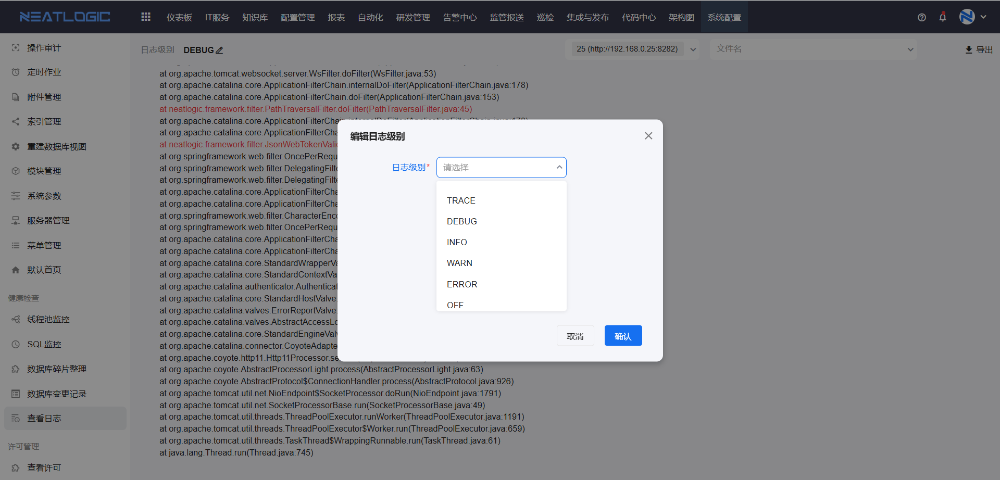

# 查看日志

查看日志用于查看系统应用服务器上的日志文件，并支持调整日志级别和导出日志文件。

当系统出现接口报错、后台异常、通知发送异常、慢 SQL、数据库死锁或 Tagent 注册问题时，可以先进入查看日志页面定位相关日志，再结合操作时间和报错信息继续排查。

## 阅读路径

可根据当前要解决的问题选择阅读入口。

- 如果需要调整系统日志输出级别，阅读“日志级别”。
- 如果需要判断应该查看哪个日志文件，阅读“日志文件”。
- 如果需要将日志提供给研发或运维分析，阅读“导出”。
- 如果需要确认可执行的操作范围，阅读“权限”。

## 权限

**操作权限**
- 配置：系统配置-[用户管理](../1.用户和权限/用户管理.md)-授权-系统核心基础权限
- 包含操作：访问查看日志页面、查看日志文件、调整日志级别和导出日志文件
- 配置人员：系统超级管理员

## 日志级别

日志级别用于控制系统打印日志的详细程度。

调整日志级别后，系统会按所选级别输出日志。排查问题时，可根据实际需要临时提高日志级别；问题排查完成后，建议恢复到常规级别，避免日志量过大影响查看和存储。

## 日志文件

日志文件记录不同类型的系统运行信息。排查问题时，可以根据问题类型选择对应日志文件查看。

| 文件名 | 描述 |
| - | - |
| debug.log | debug 级别日志 |
| error.log | error 级别日志 |
| info.log | info 级别日志 |
| warn.log | warn 级别日志 |
| deadlock.log | 数据库 SQL 死锁日志 |
| gc.log | JDK 垃圾回收日志 |
| neatlogic.2025-07-17.acc | Tomcat 接口请求日志 |
| neatlogic.out | Tomcat 控制台日志 |
| notifyAudit.log | 发送通知日志 |
| sqlTimeout.log | MySQL 慢 SQL 日志 |
| tagentRegisterAndNetty.log | Tagent 注册日志 |
| methodTimingAspect.log | 方法执行耗时日志，当前未启用 |

### 导出

日志文件支持导出到本地。

当需要离线分析、提交问题信息或转交研发排查时，可以先导出相关日志文件。

