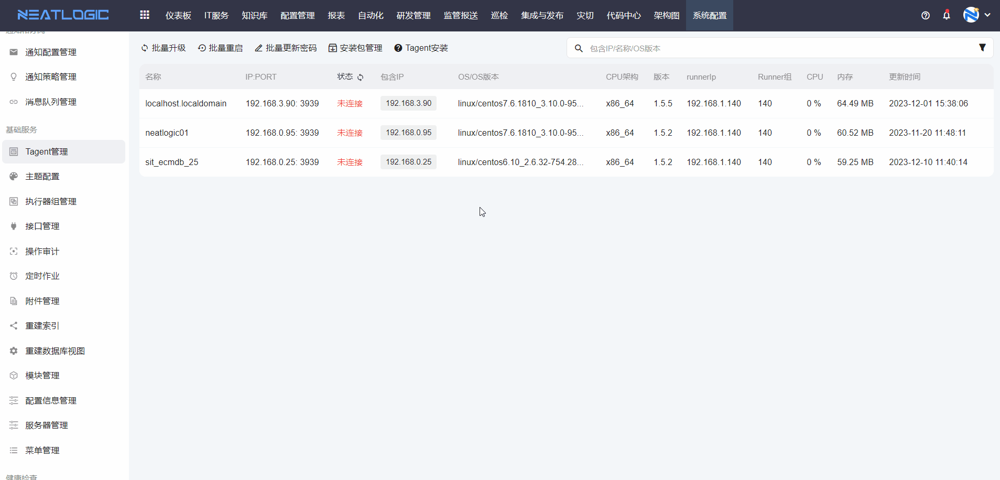
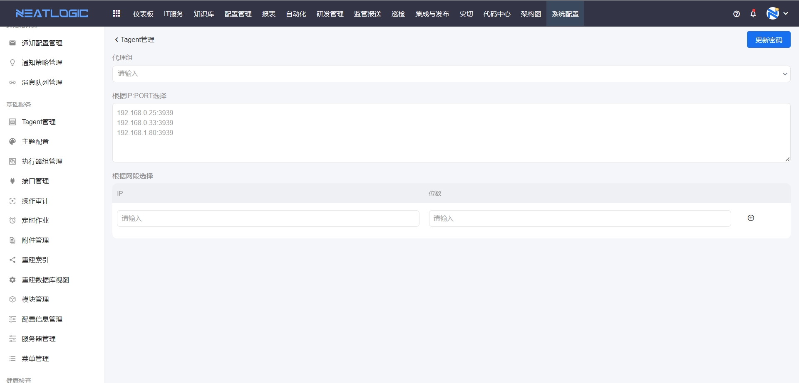

# Tagent管理
Tagent管理页面汇总了通过执行器在当前租户注册过的所有tagent服务，系统是通过执行器来并且显示其当前的连接状态。

## 执行器组和Tagent关系
首先要在执行器组管理中配置了执行器组（Runner组），通过配置的执行器组找到注册的tagent服务。关于执行器组和tagent服务的安装和注册，请查看[Tagent服务](../5.自动化/Tagent服务/Tagent服务.md)。

## 安装包管理
安装包管理中可添加版本并关联安装包，应用于单个tagent升级和批量升级。

## Tagent操作
Tagent管理支持编辑配置、重启、重置密码、升级、删除、查看日志和密码等操作。

- 编辑配置：即编辑tagent服务的配置信息，保存后重启tagent即可生效。
- 重启：重启tagent服务
- 重置密码：一键更新密码。
- 升级：通过已上传的安装包对tagent附近进行升级，需先在安装包管理中添加安装包版本并上传安装包。
- 查看日志：查看tagent服务的日志，支持下载日志。

## 批量操作
批量操作有：批量升级、批量重启和批量更新密码。

- 批量升级：选择升级版本，然后指定ip:port或者对指定的网段中的所有ip:port进行升级，两种指定升级对象的方式都支持，是并集关系。
  
  

- 批量重启：指定重启对象的方式有三种，分别是代理组下的所有tagent服务、指定ip:port对应的tagent服务、指定的网段中的所有ip:port对应的tagent服务，三者是并集关系。
  
  

- 批量更新密码：指定更新密码对象的方式有三种，分别是代理组下的所有tagent服务、指定ip:port对应的tagent服务、指定的网段中的所有ip:port对应的tagent服务，三者是并集关系。
  
  
