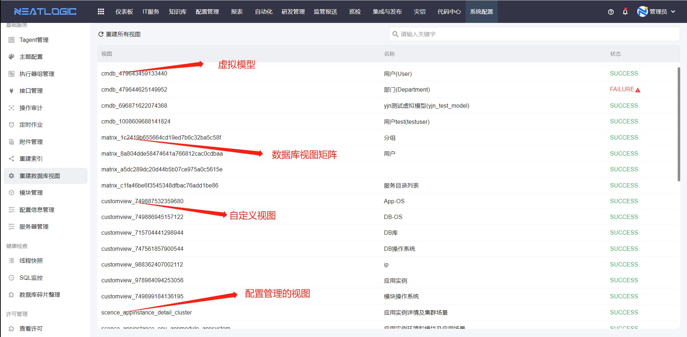

## 1、 附件管理
附件管理中汇总了当前系统所有用户在各个模块上传的文档，支持下载功能。

## 2、 重建数据库视图
租户中有些模块的数据，是先通过配置生成视图，然后查询视图数据并渲染到相应的数据列表，包括[数据库视图矩阵](../100.系统配置/矩阵管理.md)、[虚拟模型](../3.配置管理/模型管理/模型管理.md)、配置管理-[自定义视图](../3.配置管理/自定义视图/自定义视图.md)和配置管理模块-[视图设置](../3.配置管理/资源中心/视图设置.md)的视图。

重建视图失败后，鼠标聚焦到失败状态的提示图标，显示失败原因。

## 3、 重建索引
重建索引页面回显系统中所有存在索引的分类，支持重建分类索引来更新索引，支持增量重建和全部重建。增量重建是指只重建找不到的索引，全部重建是把所有的索引重建。

## 4、 配置信息管理
配置信息管理页面是管理系统代码中定义变量，支持修改变量的值，需要重启服务才能生效。
