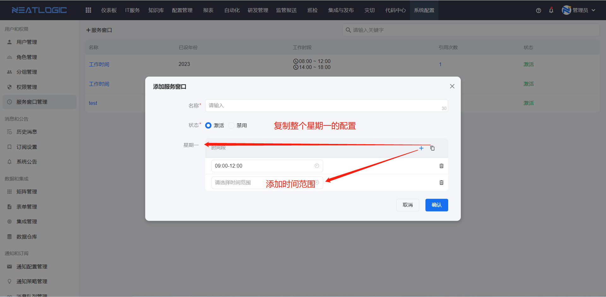
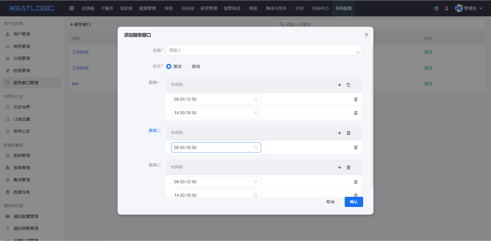
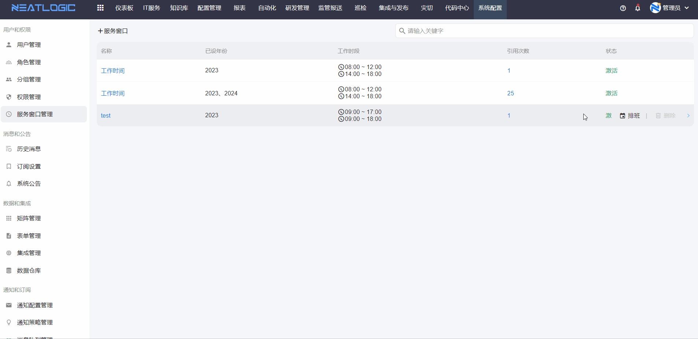
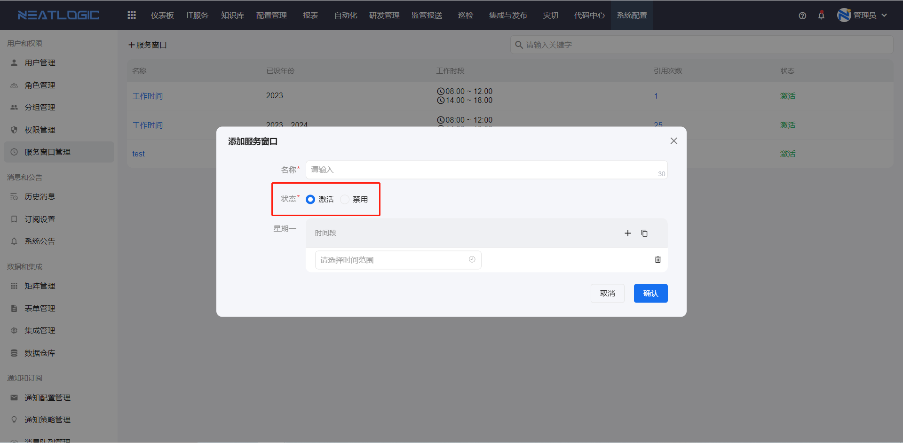
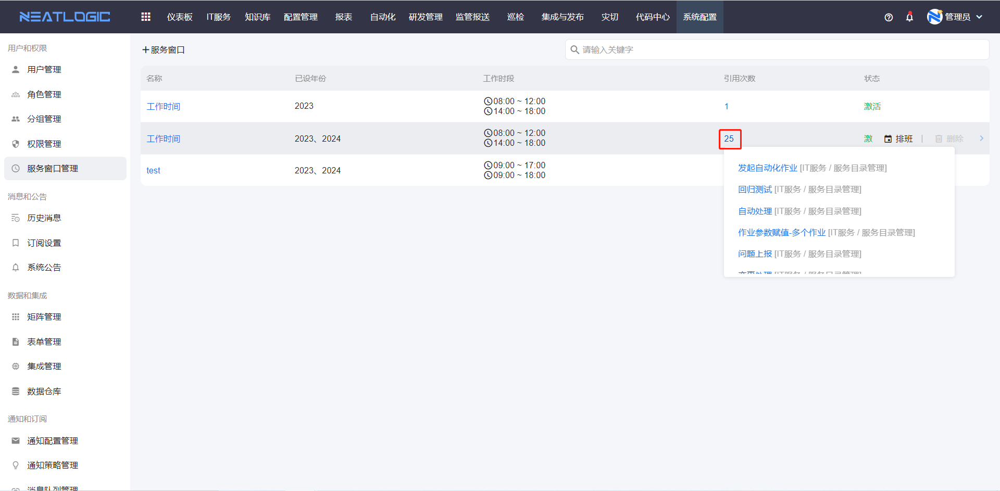

# 服务窗口
服务窗口主要是指定义工作人员的服务时间范围，比如说工作时间窗口是“9：00-17：00”，工单待处理的剩余时间只计算工作时间窗内的时长。服务窗口管理主要包括新增、编辑、删除、工作日时间段定义、工作日定义。
相关权限：系统配置-服务窗口管理

## 添加
添加服务窗口时，是吧一个星期作为组合单元，星期一到星期日可完全自定义时间段，支持添加时间段，支持复制星期一所有时间段到其他工作日。

按照实际场景配置完成星期一到星期日的时间窗口，周一到周日的时间窗口非全部必填，保存即可。

## 排班
排班是指将配置的时间窗口在具体的年份日期进行排班分配，每个日期会对应匹配的星期数排班，若排版时，没有选择指定日期排班，默认当天时间窗口为空。新增或修改完服务窗口后，需要重新排班才能生效。

提示 ：最终的选定的日期的结果与用户编辑时间段有关，那一天必须先有工作时间段排班日期才生效。

## 激活
服务窗口激活后，才可以被引用对象使用，在应用的场景中，未激活的服务窗口数据会被过滤掉。

服务窗口应用于服务目录管理页面。

## 查看引用
点击服务窗口数据上的引用次数，出现下拉框展示引用对象，点击标题跳转到对应的编辑页面。
