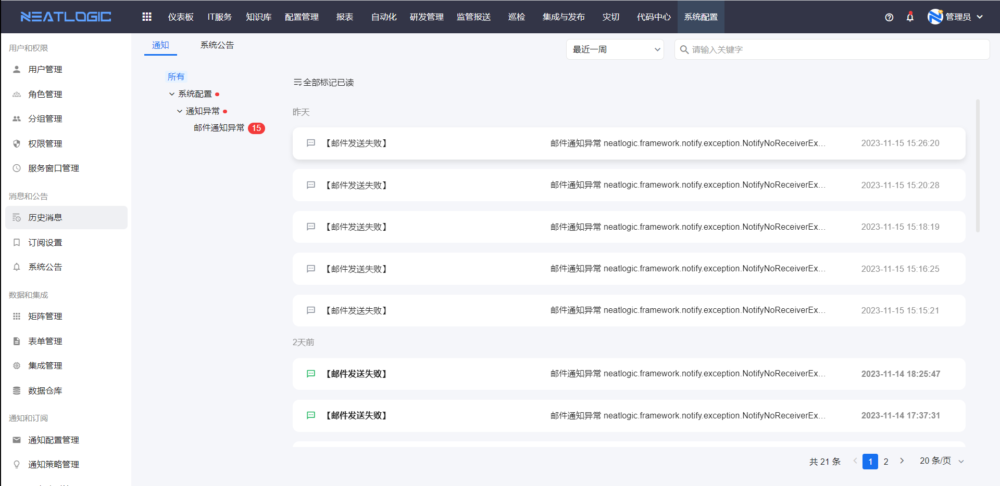
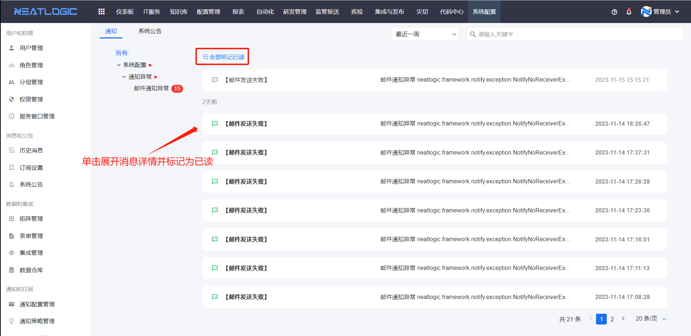
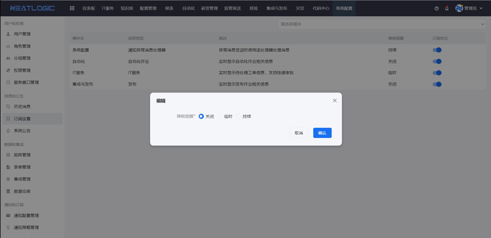

# 历史消息
历史消息页面是汇总当前用户收到的所有系统消息，消息的状态包括未读和已读。

### 标记为已读
单击消息可以展开查看详情，消息的状态变成已读，消息支持意见全部标记为已读。

### 通知
在页面右上方有一个系统通知图标，可以查看当前用户的未读消息，点击历史消息可以跳转到历史消息页面。

### 触发消息的场景
首先各个模块必须订阅了通知，相应模块才能发起通知，详情参考[订阅设置](#订阅设置)。
1. IT服务的通知，包括节点动作的通知、工单层面活动的通知、时效通知。详情参考流程管理的[通知设置](../2.IT服务/流程管理/流程管理.md/#节点设置)、[流程设置](../2.IT服务/流程管理/流程管理.md/#流程设置)和[时效设置](../2.IT服务/流程管理/流程管理.md/#时效设置)

2. 自动化的通知，详情参考组合工具的[失败通知](../5.自动化/组合工具/组合工具.md/#失败通知)。

3. 集成和发布的通知，详情参考[应用配置](../6.集成与发布/应用配置.md/#应用层)

# 订阅设置
订阅设置主要是控制模块的消息通知订阅状态和通知方式。

### 订阅状态
模块启用订阅，相应的消息通知才能发送。

### 通知方式
消息通知方式默认在通知列表中，另外还支持弹窗提醒。弹窗提醒状态包括关闭、临时还是持续。
