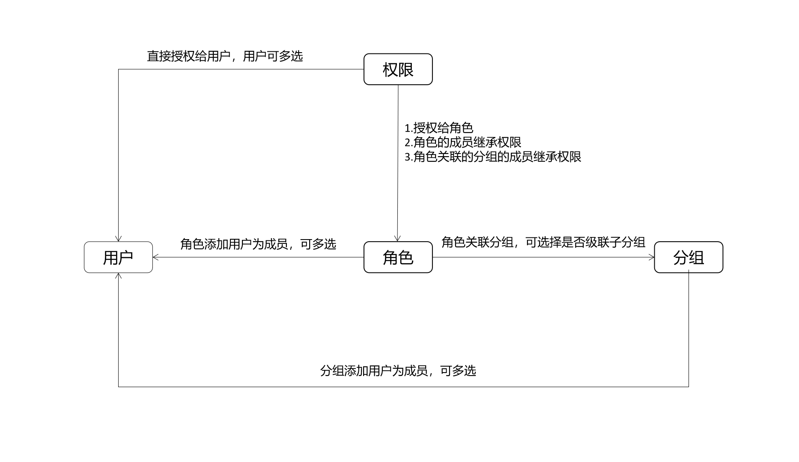
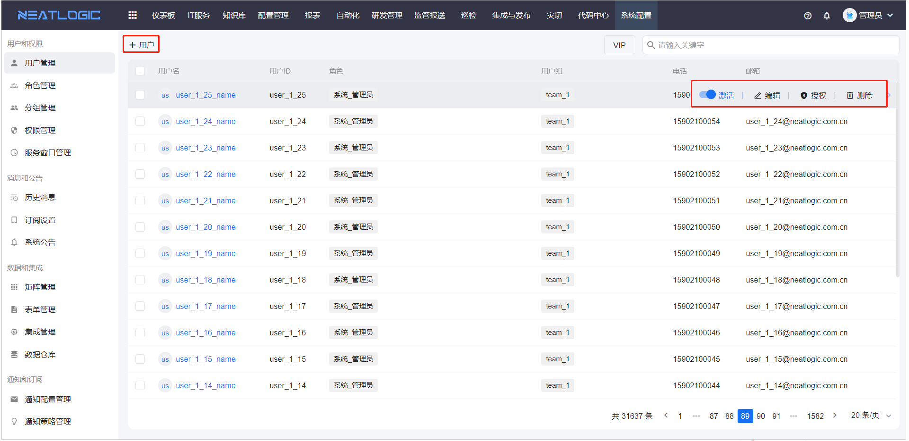
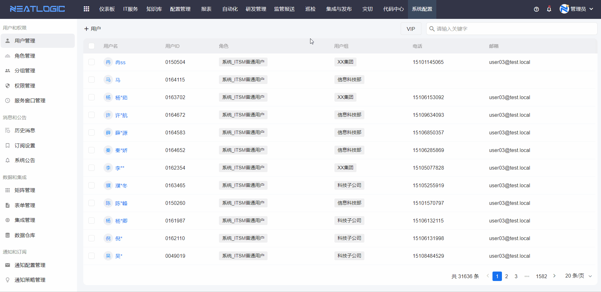
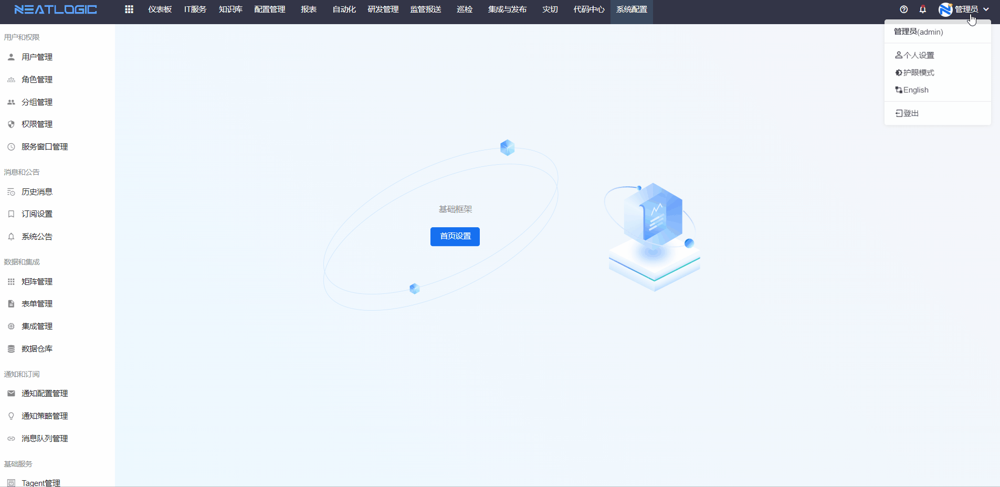
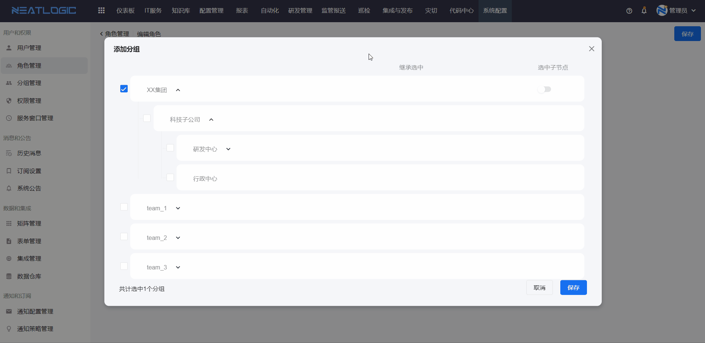
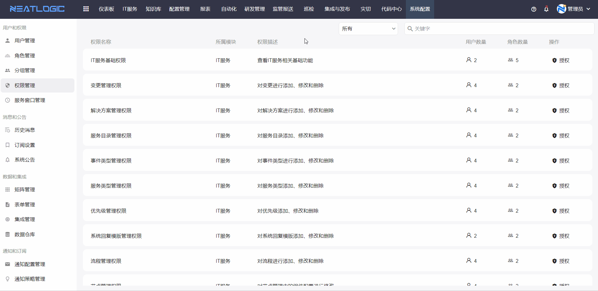
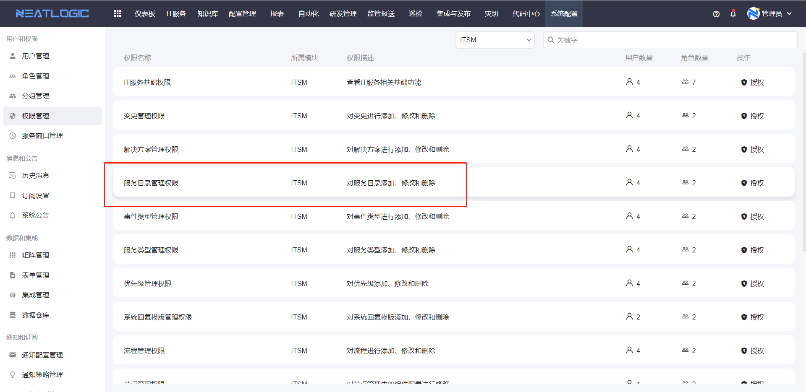
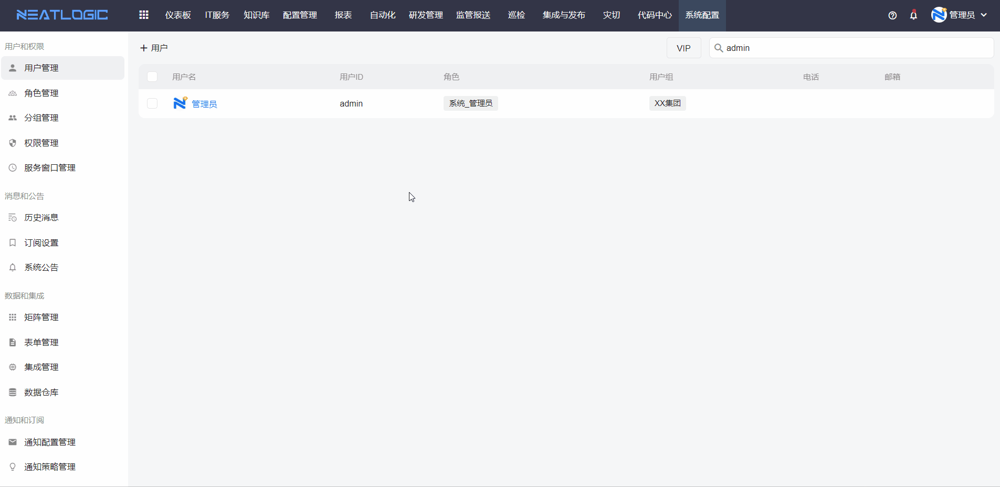

## 用户、角色、分组关系
用户是指系统的使用对象，用户根据权限大小分成普通用户和管理员用户。
- 管理员用户是指可对一些管理页面进行操作的用户。
- 普通用户则没有配置管理页面的操作权限，也看不到操作页面的入口，只能完成管理员授权的业务操作，例如服务上报和工单处理。

角色是用于定义具有相同身份的用户的集合，如运维人员和开发人员。

分组是指组织架构，例如企业管理层组织架构。

用户、角色和分组的关系：
- 角色的成员是用户，角色可以关联分组，被关联的分组的用户也继承角色的所有权限。分组的成员只有用户。
- 关于权限，授权对象可以是用户和角色，用户除了自己的权限，还继承角色的权限。

## 用户管理
用户管理页面支持添加、编辑、删除、激活、授权操作。

用户的状态必须是激活才能使用，禁用的用户账号不能登录。

外部系统访问neatlogic-webroot时，需要进行hmac认证（会使用到该用户token）。编辑用户信息时，可以手动更新令牌。

普通用户没有用户管理页面的权限时，没有访问用户管理页面的权限，可以在个人设置中更新自己的用户令牌。

## 角色管理
角色的基本信息包括ID、角色名和环境。

规则：登录认证的请求需要携带Header，在角色规则中定义表达式，用户登陆时header参数值满足表达式，则该角色生效，否则不生效。

应用场景： 
不同环境共用同一个数据库时，控制一个用户在不同环境中的权限差异。 
例如：当前环境是UAT，配置了角色“ROLE-UAT”，定义规则"${DATA.env}"=="UAT"，角色“ROLE-UAT”关联了用户“TEST-UAT”,用户“TEST-UAT”登录UAT环境时，满足表达式规则，这个角色生效，角色传递给用户的权限生效。若用户“TEST-UAT”登录其他环境，则不满足表达式，角色不生效，且角色传递给用户的权限也不生效。

角色管理页面支持添加、编辑、删除、添加角色成员、添加角色分组、授权操作。

角色添加关联分组时，可启用选中子节点，启用后可穿透该分组下的所有层级的分组。角色关联的所有分组的所有用户也会继承角色的权限。

## 分组管理
分组管理页面支持添加、编辑、删除、添加子分组、添加分组成员。分组的成员，会继承关联的角色的权限。

## 权限管理
权限管理页面是管理当前系统所有模块的权限，可进行授权操作，授权的对象包括用户和角色。

未授权的场景

1. 管理页面的菜单隐藏，例如用户缺少服务目录管理权限时，导航菜单不显示服务目录管理页面的访问入口。
   
    
2. 操作按钮禁用，例如用户在不是自动化管理员时，也无组合工具新建权限，
   