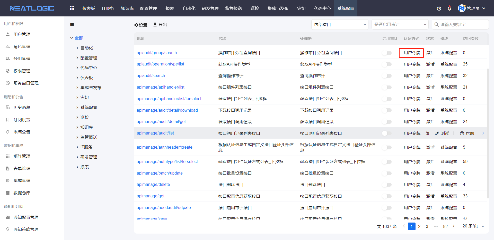

## 用户、角色、分组关系
[用户](#用户管理)是指系统的使用对象，用户根据权限大小分成普通用户和管理员用户。
- 管理员用户是指可对一些管理页面进行操作的用户。
- 普通用户则没有配置管理页面的操作权限，也看不到操作页面的入口，只能完成管理员授权的业务操作，例如服务上报和工单处理。

[角色](#角色管理)是用于定义具有相同身份的用户的集合，如运维人员和开发人员。
[分组](#分组管理)是指组织架构，例如企业管理层组织架构。

用户、角色和分组的关系：
- 角色的成员是用户，角色可以关联分组，被关联的分组的用户也继承角色的所有权限。分组的成员只有用户。
- 关于权限，授权对象可以是用户和角色，用户除了自己的权限，还继承角色的权限。

## 用户管理
用户管理页面支持添加、编辑、删除、激活、授权操作。

用户的状态必须是激活才能使用，禁用的用户账号不能登录。

每个用户都有用户令牌，用户令牌的作业是用于token认证。例如调用系统接口时，可以用用户令牌通过认证。为了安全性，用户令牌支持手动更新。

系统的内部接口都是用用户令牌认证。

## 角色管理
角色管理页面支持添加、编辑、删除、添加角色成员、添加角色分组、授权操作。

角色添加关联分组时，可启用选中子节点，启用后可穿透已选的分组下的所有子级分组。

## 分组管理
分组管理页面支持添加、编辑、删除、添加子分组、添加分组成员。分组的成员，会继承关联的角色的权限。

## 权限管理
权限管理页面是管理当前系统所有模块的权限，可进行授权操作，授权的对象包括用户和角色。

未授权的场景

1. 管理页面的菜单隐藏，例如用户缺少服务目录管理权限时，导航菜单不显示服务目录管理页面的访问入口。
   
    
2. 操作按钮禁用，例如用户在不是自动化管理员时，也无组合工具新建权限，
   