# 表单管理
表单是由各种组件组合成的表格，支持完全可视化配置，表单可应用于IT服务、自动化模块。

## 表单配置
表单基础配置有名称、组件和样式，还支持配置组件联动、行联动、场景、版本。

### 1. 表单组件
表单组件类型有五类，分为基础组件、布局组件、自动化组件、配置管理组件合自定义组件。  

- 基础组件：包括文本框、文本域、下拉框、单选框、复选框、日期、表格选择等等
- 布局组件：包括分割线、选项卡、折叠面板
- 自动化组件：连接协议、执行目标
- 配置管理组件：配置项修改、配置项选择
- 自定义组件

#### 组件配置
下面讲解的组件使用频较高，剩下未讲解的组件配置较简单，可自行摸索。组件引用的矩阵数据源都来自[矩阵管理](../100.系统配置/矩阵管理.md)。
1. 标签
   
   标签组件用于表单中写入固定的文本，例如一个组件前面的标题。
   

2. 文本框、文本域、富文本框、数字、密码
   
   这些是文本输入类组件，可在互相切换，包括名称、描述、默认状态、字符长度、输入提示、默认值等配置。唯独数字组件多了数字范围和小数位的配置，用于限制输入的数字格式。
   

3. 下拉框、单选框、复选框
   
   这些是选择类的组件，需要配置下拉框选项的数据源，其他配置与文本类组件相同。组件数据源分成静态数据源和矩阵数据源两种。
   
   静态数据源，人工输入选项的显示名和值。
   
   支持批量编辑
   

   矩阵数据源，关联矩阵，并且设置显示名和值与矩阵的属性字段映射关系。
   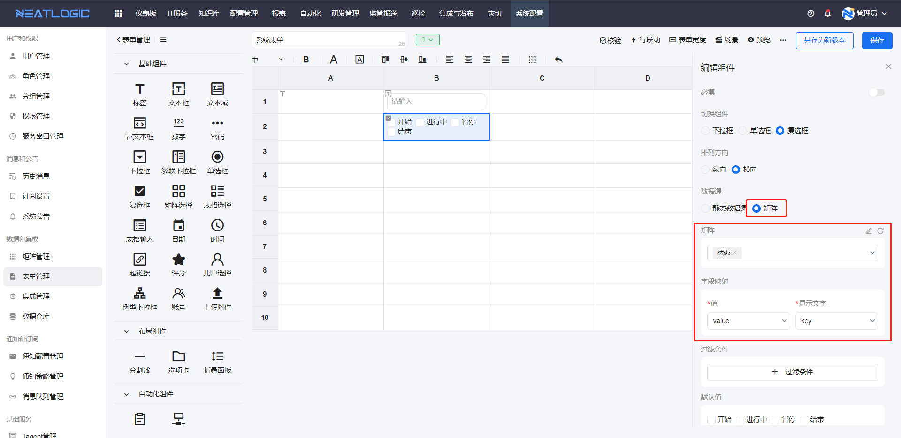
   
4. 表格选择、表格输入、矩阵选择
   
   这三个组件都是表格样式的组件。 
   表格选择组件是直接关联矩阵数据源，支持在矩阵数据源基础上再扩展属性，扩展属性的值自定义。组件应用效果是选择矩阵的数据行，如图需要展示相关配置项数据详情的场景。
   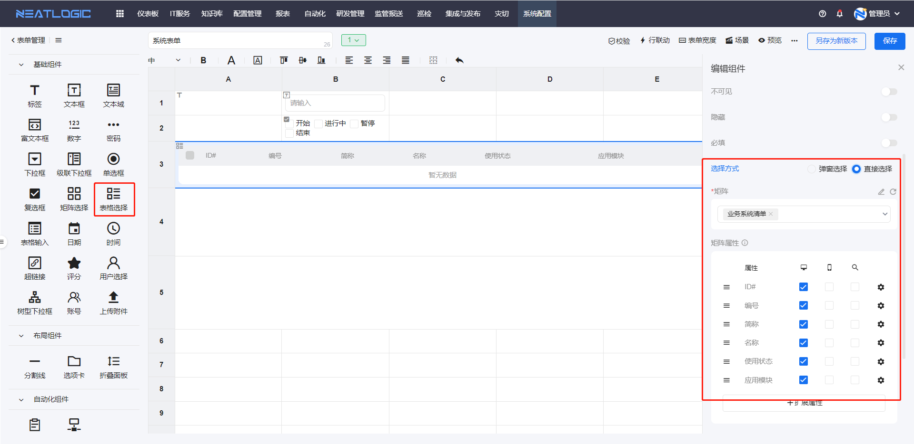
   表格输入组件是完全自定义表头属性字段，属性支持常见类型，包括文本框、下拉框、时间、日期等。组件应用效果是，在表格属性基础上添加空白行，然后输入数据，如图需要补充服务器信息的场景。
   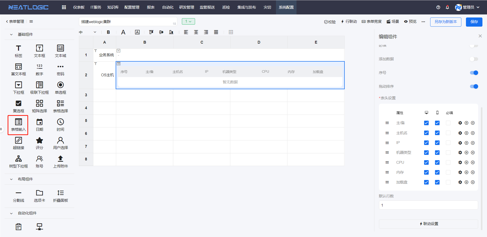

   矩阵选择组件是定义纵轴和横轴的类别和选项，其应用效果是生成一个选择矩阵，类别和选项的交点作为一个选项，支持设置为单选或多选。
   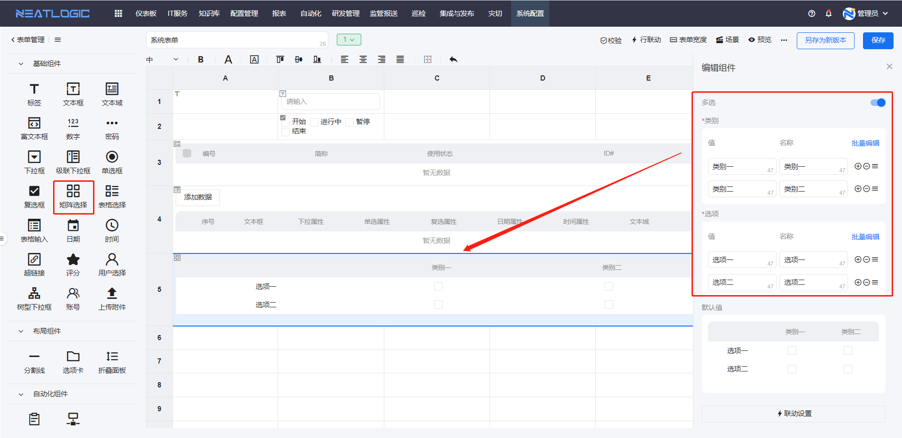

5. 用户选择组件
   
   这个组件引用系统用户、分组和角色的数据，满足需要选择系统用户的场景需求。
   
#### 组件联动
组件联动是指在同一表单中，一个组件发生变化，引发其他组件发生联动变化。表单组件联动的动作一共有9种，分别是过滤、隐藏、只读、赋值、禁用、显示、必填、不可见、触发。

- 过滤：过滤联动只应用于关联了同一个矩阵数据源的组件之间。用驱动过滤的组件已选项的值到矩阵中过滤，将过滤结果返回给被动的组件。
  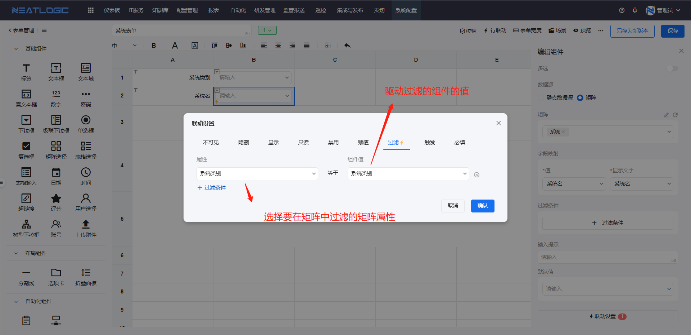
- 隐藏：隐藏当前组件。配置驱动条件，当驱动组件数据满足条件，当前组件隐藏。
  
- 只读：当前组件切换成只读，无法编辑数据。配置驱动条件，当驱动组件数据满足条件，当前组件只读。
  
- 赋值：赋予当前组件预设的值。配置驱动条件和预设值，当驱动组件数据满足条件，赋值给当前组件。
  
- 禁用：禁止使用，与只读的区别是，只读会保留值，但是禁用不保留值。配置驱动条件和预设值，当驱动组件数据满足条件，禁止使用当前组件。
  
- 显示：显示当前组件，这个联动一般要结合当前组件默认隐藏设置使用。配置驱动条件，当驱动组件数据满足条件，显示当前组件。
  
  
- 必填：组件必填，这个联动一般用于非必填的组件。
- 不可见：组件模糊处理。
- 触发：目前只有修改优先级一个触发动作，这个联动是应用于IT服务工单的，组件数据修改触发工单优先级改变。当前组件必须是选择类的组件，且引用优先级矩阵为数据源。
  

### 场景
场景是为了满足处理工单不同步骤时，不同步骤表单存在差异的情况。表单每个版本都有默认场景和自定义场景，默认场景即当前版本的配置，自定义场景可在版本默认场景基础上重定义表单组件布局和组件配置。
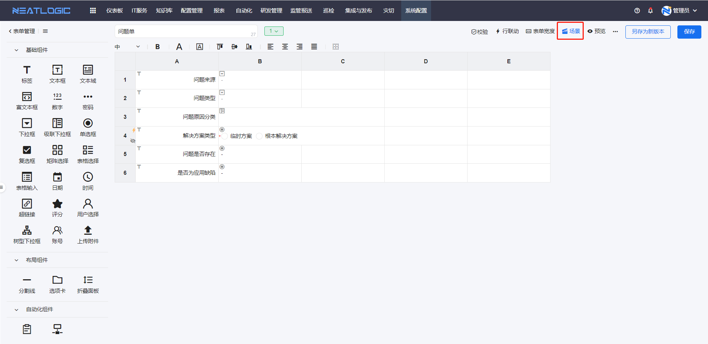
新增的场景中，只能使用当前表单已配的组件，且只能用一次。场景中的联动和组件配置可重定义或继承表单。
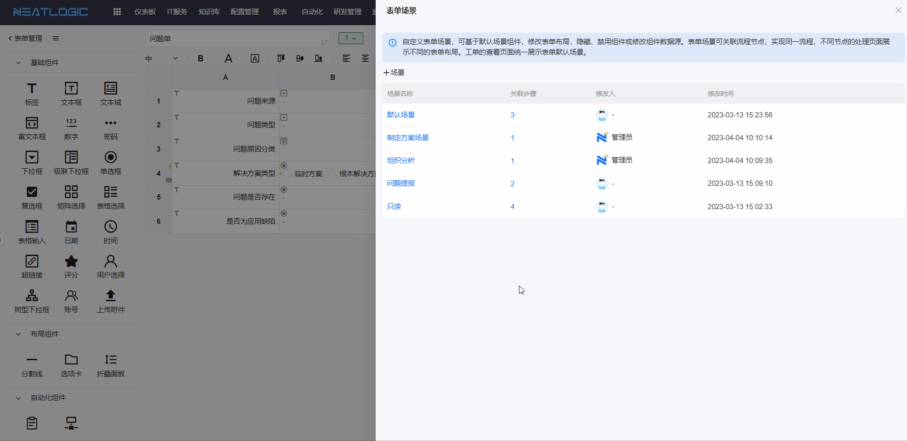
### 版本
版本是指表单版本，编辑表单后如果想保留上一版的配置，可选择“另存为新版本”。版本的操作包括保存、删除和激活。只有激活的版本是当前表单的应用版本，其余只是历史版本。

激活版本，激活和删除操作禁用。
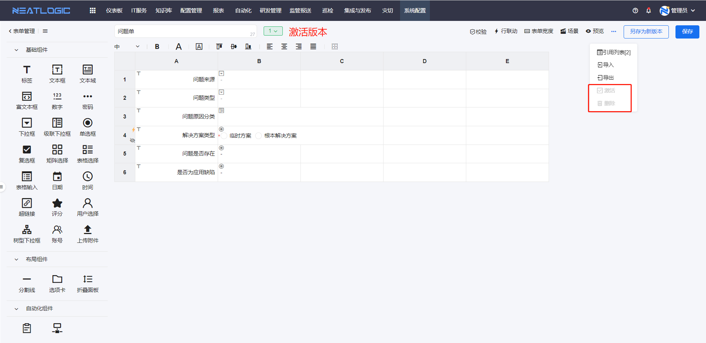
另存为新版本，保存成功后，生成新的版本，可在版本列表中查看。
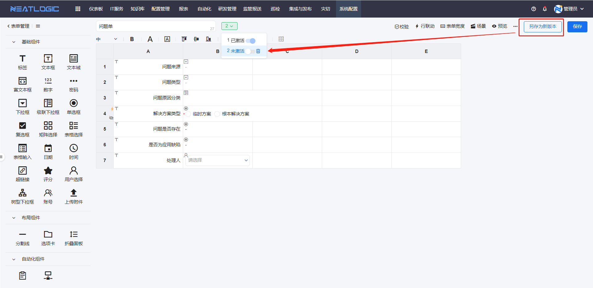
## 表单应用场景
### 1. IT服务-流程管理
流程引用表单，作为工单的表单模板，节点设置可关联表单的场景，用来解决不同步骤表单差异的需求。更多详情参考[流程管理](../2.IT服务/流程管理/流程管理.md)

### 2. 自动化-服务目录
自动化服务中，通过引用表单，将表单组件映射到自动化配置。更多详情参考[快捷服务](../5.自动化/快捷服务/快捷服务.md)
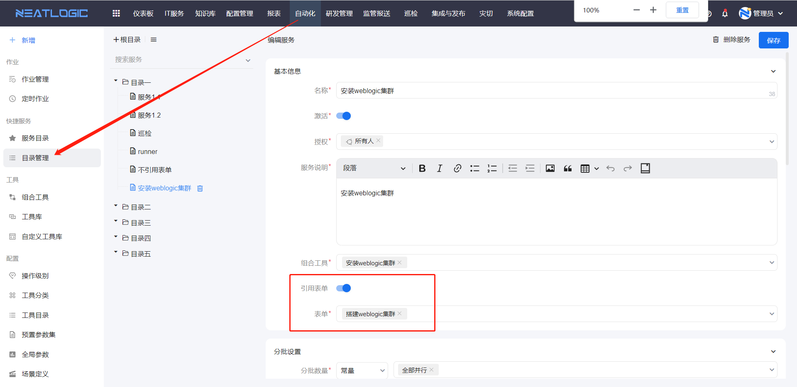

### 3. 结合配置项同步节点使用
配置项修改组件可用于在指定模型中添加、删除和编辑配置项，但必须与流程管理的配置项同步节点一起使用，工单执行到配置项同步节点，才能实现将修改的数据保存到配置项管理中。更多详情参考流程管理-[节点介绍](../2.IT服务/流程管理/流程管理.md/#节点介绍)更多详情参考[流程管理](../2.IT服务/流程管理/流程管理.md)

首先配置项修改组件关联需求修改的配置模型，并选择支持的操作类型，操作类型有新增、修改和删除。然后选择操作可修改的属性/关系对象，若未勾选任何对象，则表示支持所有。
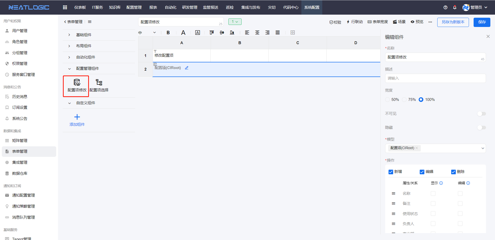
流程的配置项同步节点设置中，关联表单中的配置项修改组件。
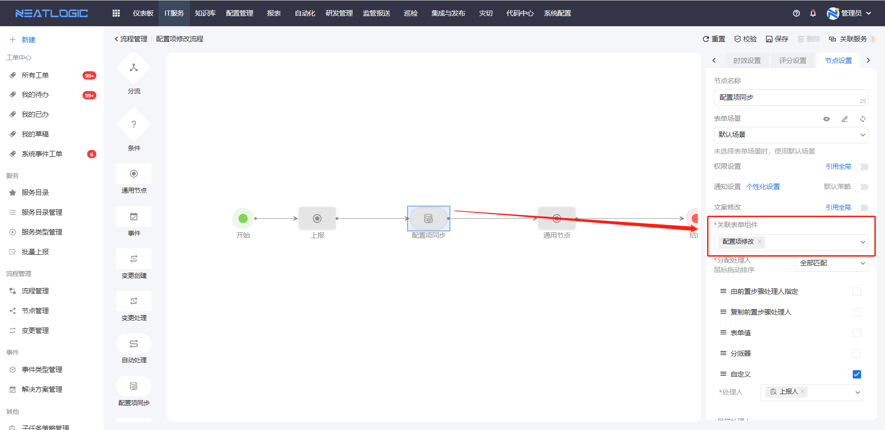

### 4. 结合自动化节点使用
自动化组件连接协议和执行目标组件，组件数据源与自动化模块中是一致的，在流程管理中要结合自动化节点使用，工单流转到自动化节点时，触发发起自动化作用，并将表单组件的值传到自动化作业对应参数。更多详情参考[流程管理](../2.IT服务/流程管理/流程管理.md)

首先在表单中添加连接协议和执行目标组件

然后在流程的自动化节点设置中添加作业详情配置，作业的连接协议和执行目标参数引用表单组件。
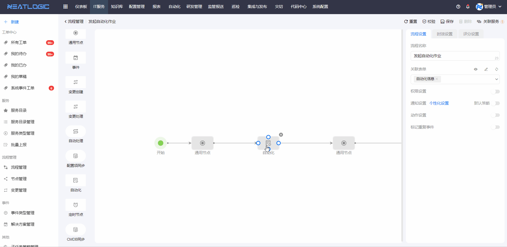

## 导入、导出
导入和导出功能分成两个维度，表单维度和表单版本维度。
- 导入导出表单
  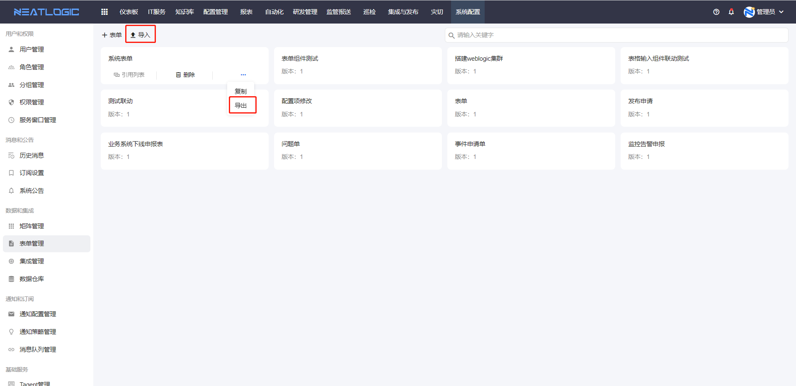
- 导入导出表单版本
  