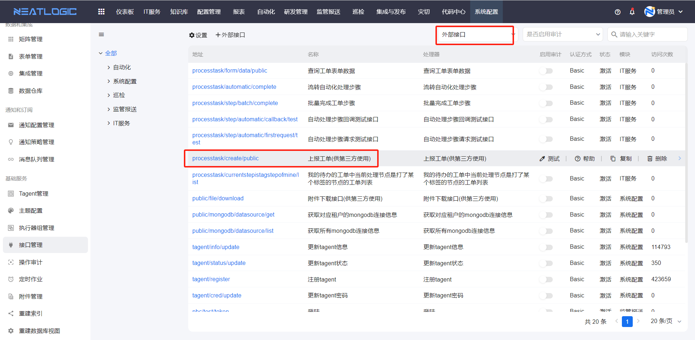
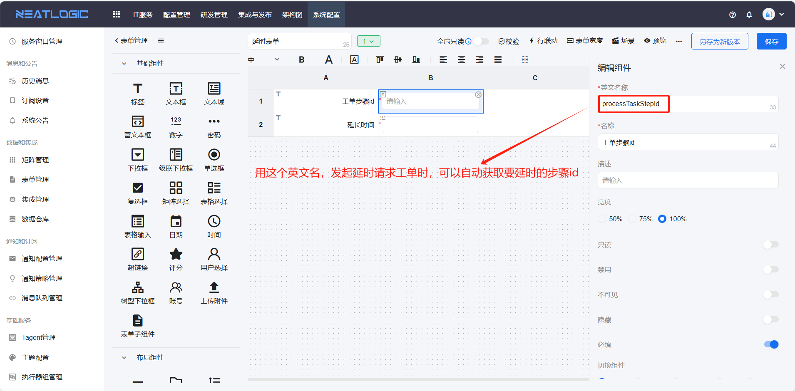
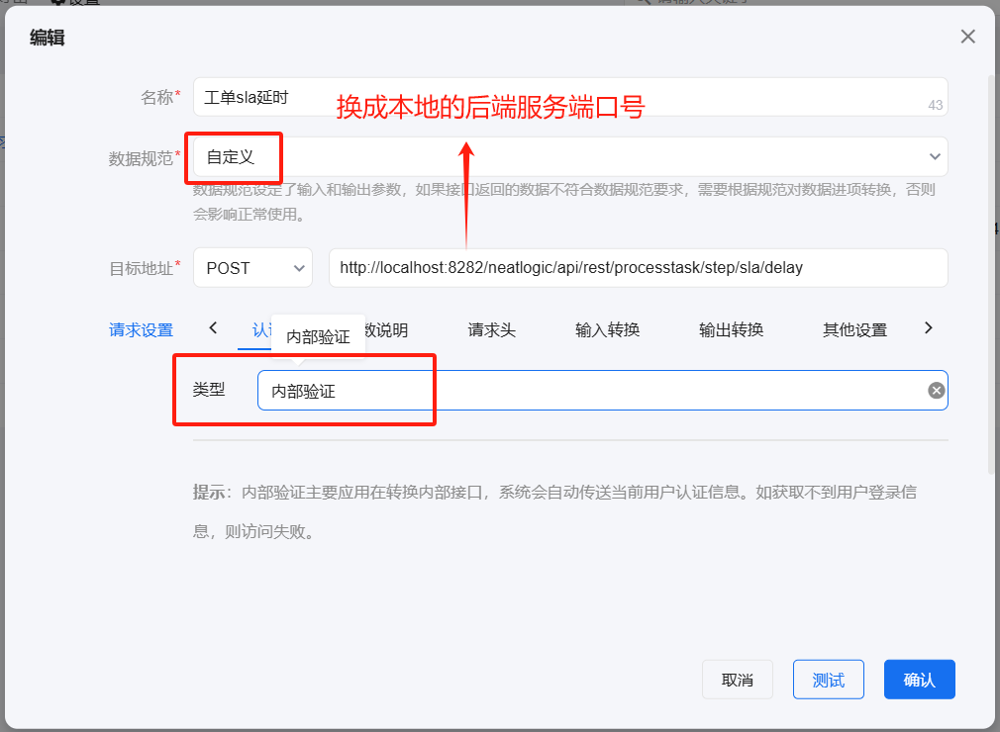
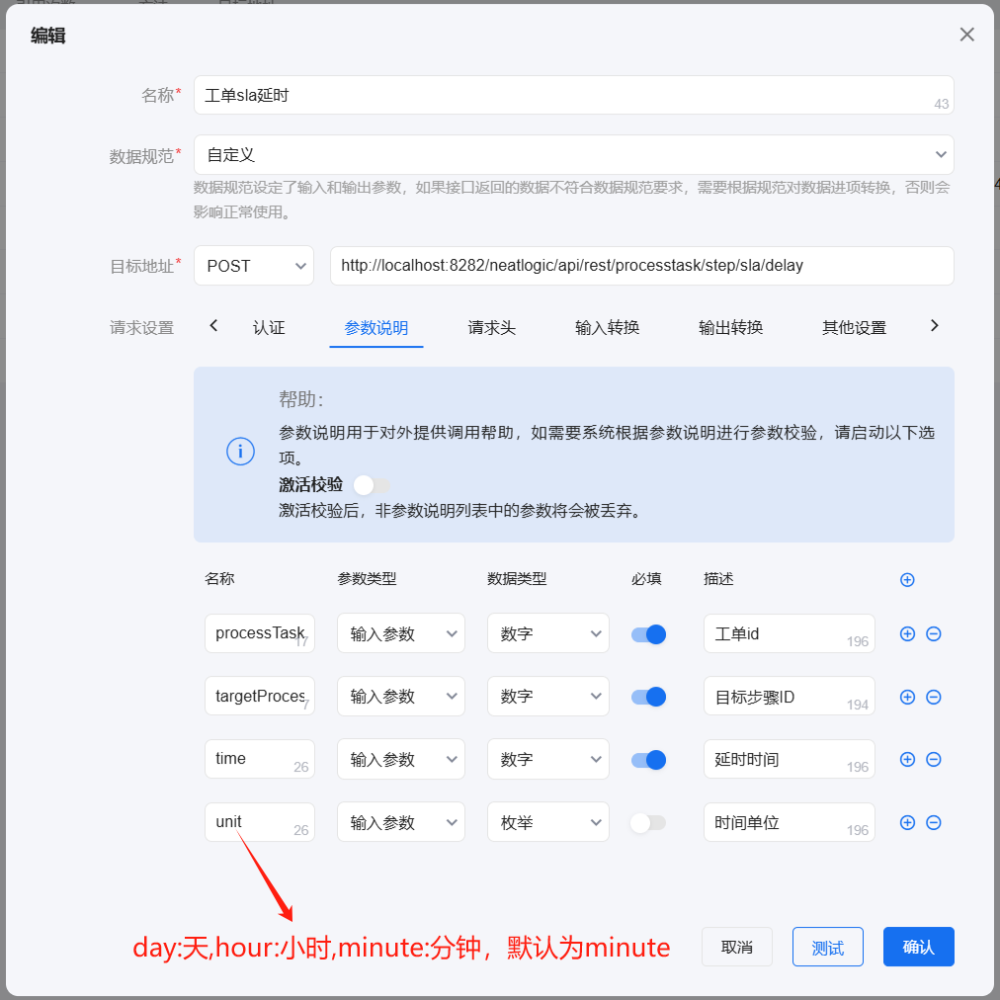
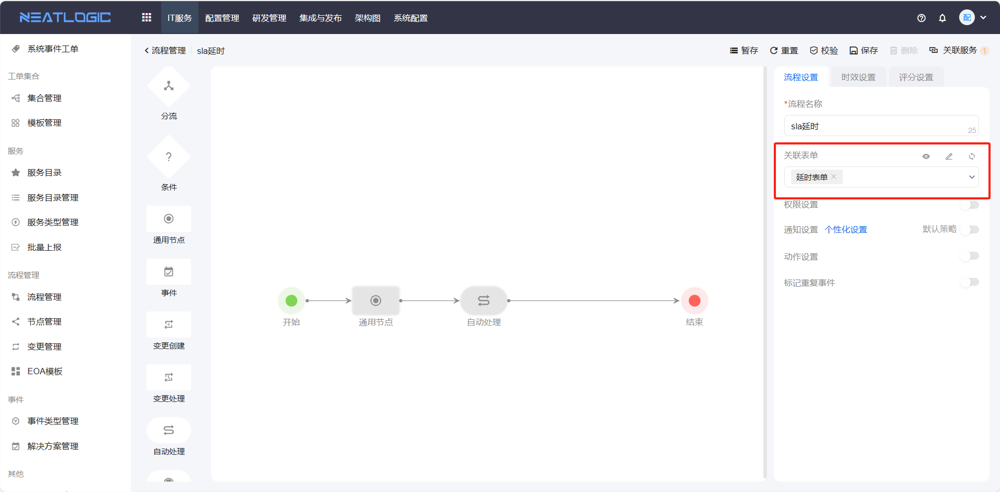
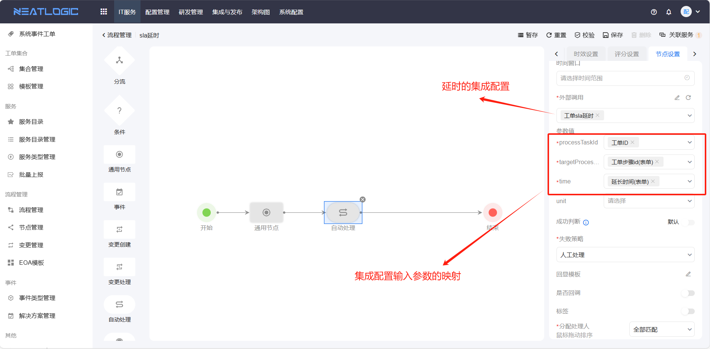
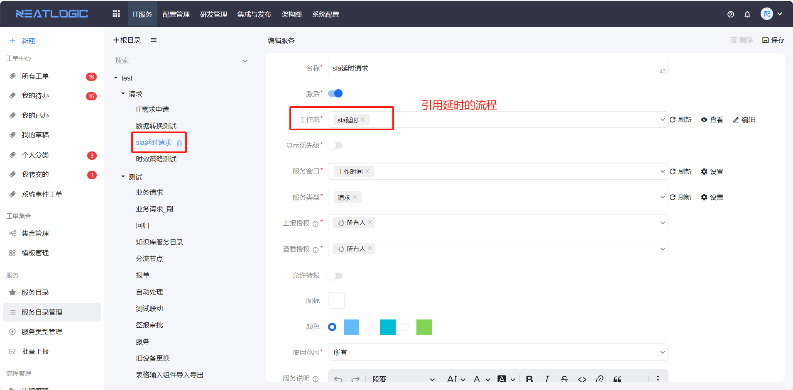
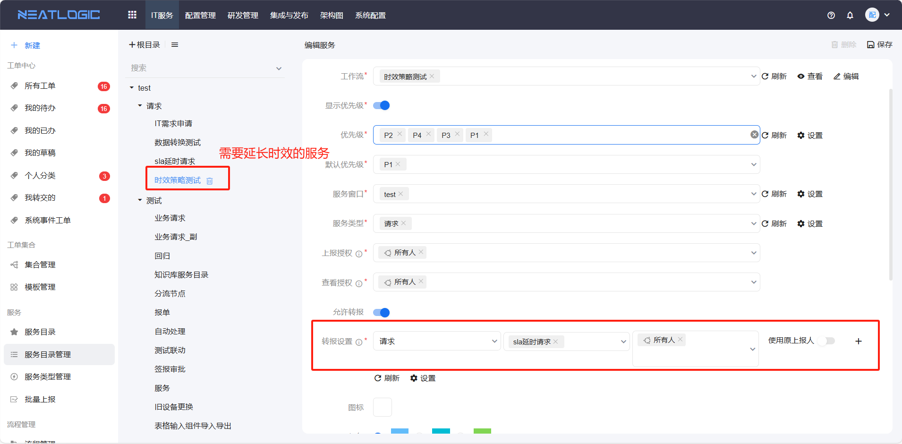

### 1、 工单生成策略在哪里配置？
打开IT服务-[服务类型管理](../2.IT服务/服务/服务类型管理.md)页面，点击服务类型名称，重新编辑服务类型并保存即可。

### 2、 提交工单后，打开处理工单页面，没有处理的文本框。
这个是因为工单当前步骤的状态是待处理，人工点击开始按钮即可。

如果不想每次都人工操作开始，需重新编辑流程，修改步骤对应的节点设置，启用自动开始，并且分配处理人的策略最终匹配到的处理人只能有一个，详情参考[流程管理](流程管理/流程管理.md)。

### 3、工单的服务窗口时间范围没有生效
例如：

服务配置的服务窗口，工作时间范围是9:00-12:00和14:00-18:00；超时策略为,节点激活后处理时间为30分钟；上报人提交工单，流转并激活超时策略关联的步骤，激活时间在“9:00-12:00”范围内，但工单步骤剩余处理时间不是30分钟。

首先检查下服务关联的服务窗口是否排班，可以通过已设年份和工作时段两个字段来检查，然后重新进行排班即可。相关内容可参考[服务窗口管理](../100.系统配置/5.基础服务/服务窗口管理.md)

### 4、ITSM能支持业务系统告警吗
ITSM提供api支持监控系统创建事件告警工单，api详情在系统配置-[接口管理](../100.系统配置/5.基础服务/接口管理.md)页面，外部接口分类下的“上报工单（供第三方使用）”接口。

### 5、工单的剩余时间怎么延长
工单的剩余时间可以通过转报一个延长时效的工单来实现。

配置步骤：
1. 设计延时的表单 
    在[表单管理](../100.系统配置/3.数据和集成/表单管理.md)添加新表单，在表单中添加两个文本框组件，分别用来填写“工单步骤id”和“延长时间”。
    

2. 添加延时集成配置
    在[集成管理](../100.系统配置/3.数据和集成/集成管理.md)添加新配置，配置的数据如下图所示。
    
    用到的参数（名）：工单id（processTaskId）、目标步骤ID（targetProcessTaskStepId）、延长时间（time）、时间单位（unit）
    

3. 设计延时流程
    在[流程管理](../2.IT服务/流程管理/流程管理.md)绘制延时的流程，引用1中的表单，流程图如下。
    
    其中自动处理节点的配置如下。
    

4. 添加延时服务
    在[服务目录管理](服务/服务目录管理.md)页面添加申请延时的服务。
    

5. 在需要延长剩余时效的工单服务中配置转报
    在需要延长时效的服务中配置发起申请延长时效工单的转报配置。
    