# 如何发起一个工单
发起工单前需要配置管理人员完成基础的配置，步骤如下：
1. 创建表单
2. 创建流程
3. 添加服务

完成服务的配置后，用户才能通过服务应用发起工单 。

## 权限
添加服务目录为系统管理功能，需要当前用户拥有以下权限。

- 表单管理权限

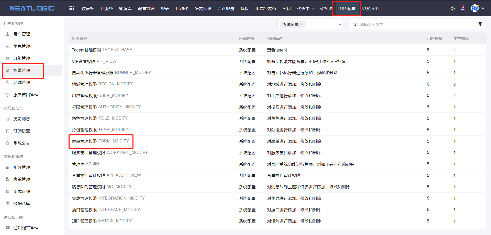

- 流程管理权限

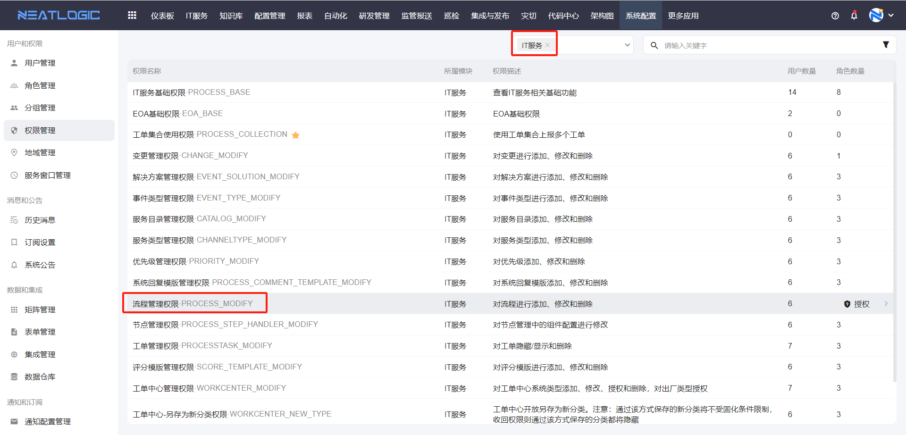

- 服务目录管理权限
 
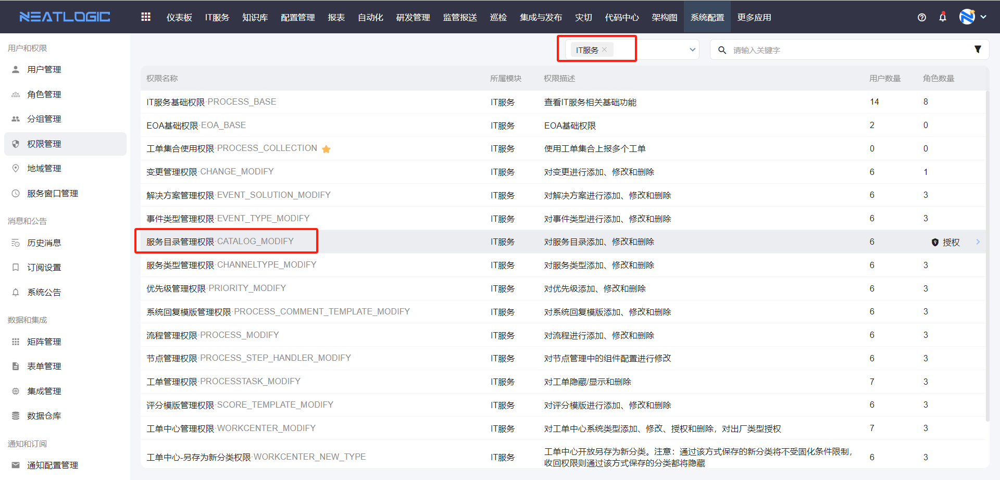

## 创建表单

**表单**：即用户在上报页面填写的上报内容，如下图

ITSM系统，需要用户根据不同的工单上报场景，添加自定义表单

- 添加表单入口

系统配置->表单管理->添加表单
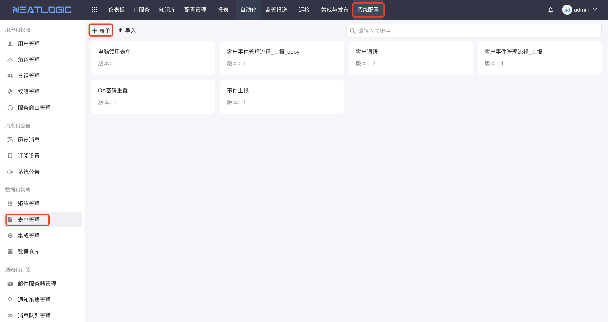

- 添加表单控件

支持文本框、富文本框、下拉、单选、多选、时间、等组件，根据服务需求，将需要的控件拖拽到表单区域即可
 
表单更多详情参考文档：[表单管理](../100.系统配置/3.数据和集成/表单管理.md).

## 添加流程

**流程**：即用户上报工单后，后台的处理过程，如下图

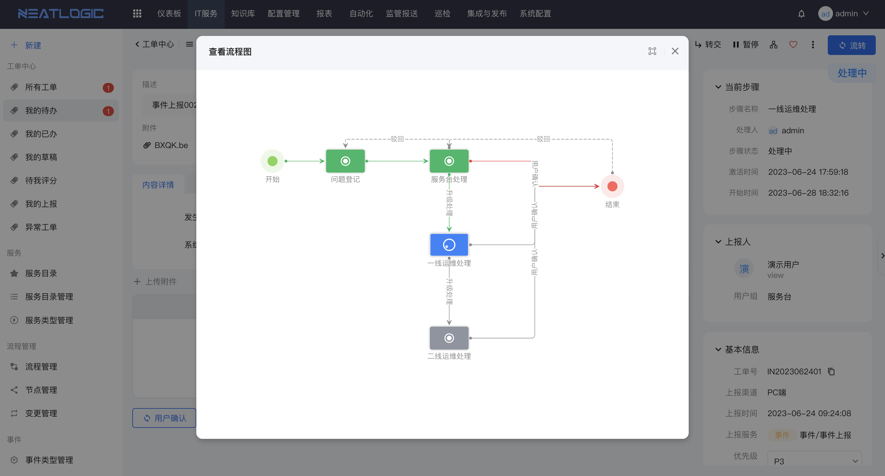

ITSM系统，需要用户根据不同的工单上报场景，添加自定义流程

- 添加入口

- 设置流程属性

选择关联表单、设置权限、选择通知策略

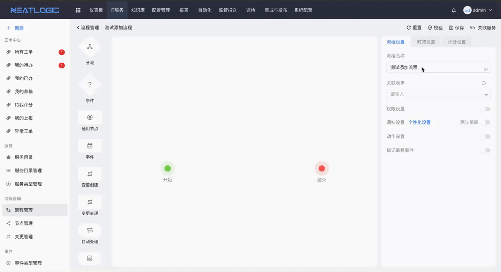

- 拖拽流程节点步骤

- 设置流程节点

设置节点名称、处理人、权限、通知策略等

流程更多详情请参考文档：[流程管理](流程管理/流程管理.md)。

## 添加服务目录

- 添加入口

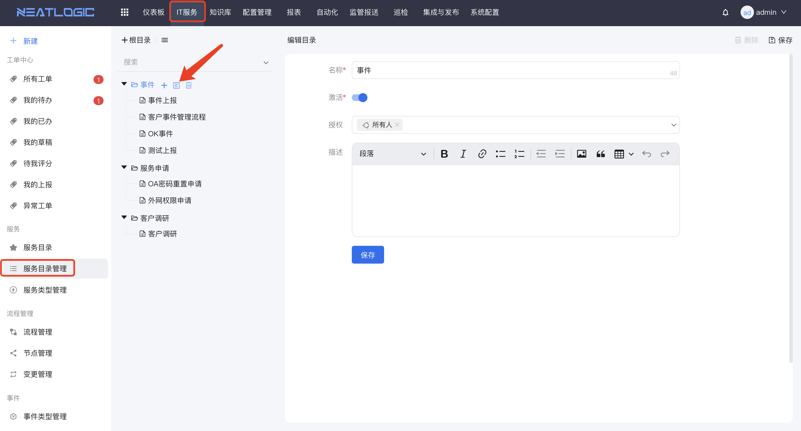

- 添加服务目录
设置服务名称、选择流程、选择优先级、服务窗口、服务类型等

服务目录更多详情请参考文档：[服务目录管理](服务/服务目录管理.md)。

## 上报工单

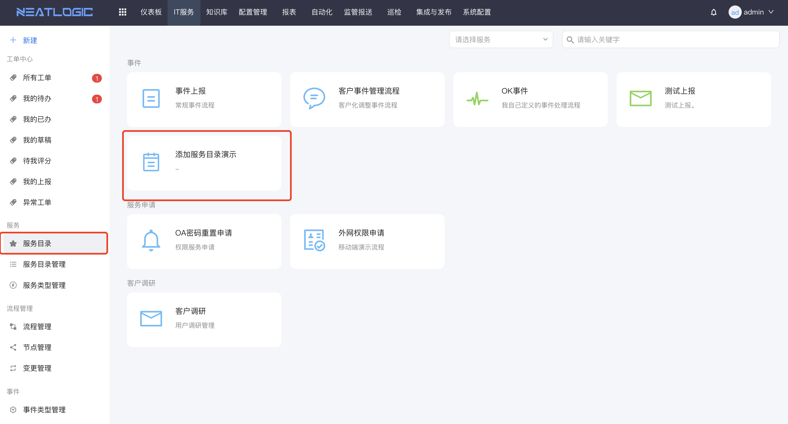
上报工单更多详情请参考文档：[工单上报](工单上报/工单上报.md)。

# 如何给工单步骤设置处理时效
当事件某个步骤有处理时间限制时，可以通过工单的时效策略来实现，效果如图所示，工单步骤显示剩余时间倒计时。
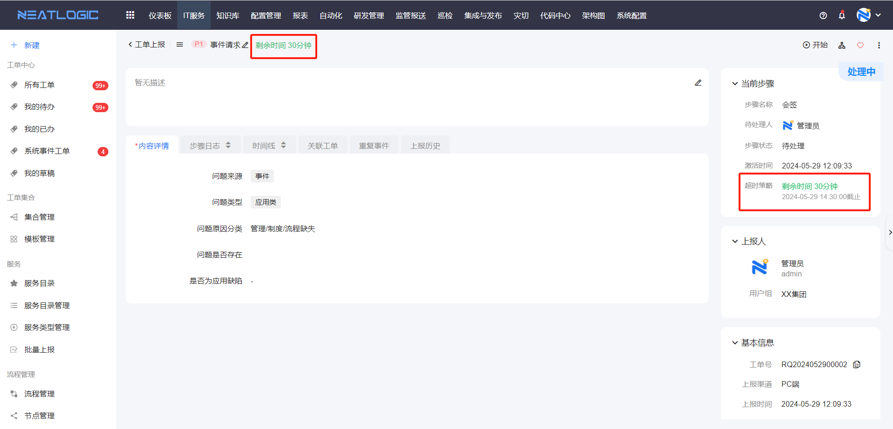
工单时效的配置包括： 服务窗口配置、流程管理-时效设置。 
当工单同时满足在服务窗口的时间范围内且满足步骤时效生效的条件时，流转到制定步骤时，就会提示剩余处理时间。

## 服务窗口配置
发起工单的服务有服务窗口配置，工单的时效策略只在服务窗口的时间内才能生效，且只按照服务窗口的时间计算，若当日服务窗口剩余时间小于时效剩余时间，则会跨日期计算。

配置服务窗口的操作步骤：添加服务窗口-排班，详情可参考[服务窗口管理](../100.系统配置/5.基础服务/服务窗口管理.md)。

## 流程-时效设置
发起工单的服务所引用的工作流程中，要在时效设置中配置步骤的时效，详情请参考 [流程管理](流程管理/流程管理.md)-时效设置。
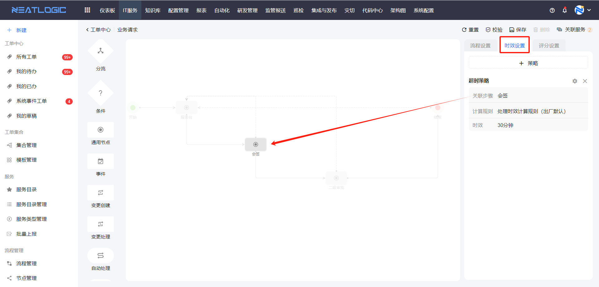

# 如何通过工单同步配置项数据

## 配置项同步
通过工单将配置项变更数据同步到配置管理，同步效果如图所示。
   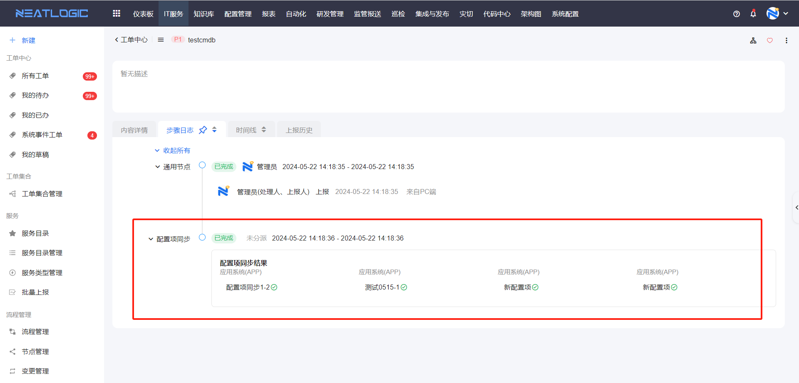
  1. 设计包含配置项修改组件的表单。
  2. 设计包含配置项同步节点的流程。
  3. 配置发起配置项变更的服务。
  4. 发起工单，并同步配置项数据。

### 表单配置
打开表单管理，设计配置项同步的表单，在表单中添加**配置项修改**组件，详情参考[表单管理](../100.系统配置/3.数据和集成/表单管理.md)-表单配置-表单组件-组件配置-配置项修改。

### 流程配置
打开流程管理，设计配置项修改并同步的流程，流程中要用到配置项同步节点，详情参考 [流程管理](流程管理/流程管理.md)-流程节点-配置项同步节点。

### 创建服务
在服务目录管理页面，添加一个服务，服务工作流引用上述的配置项同步流程，详情参考 [服务目录管理](服务/服务目录管理.md) 文档。
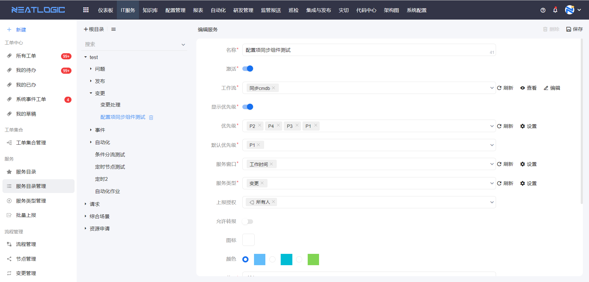

### 上报和处理
上报工单，在配置项修改组件中添加新增、编辑或删除配置项的操作。
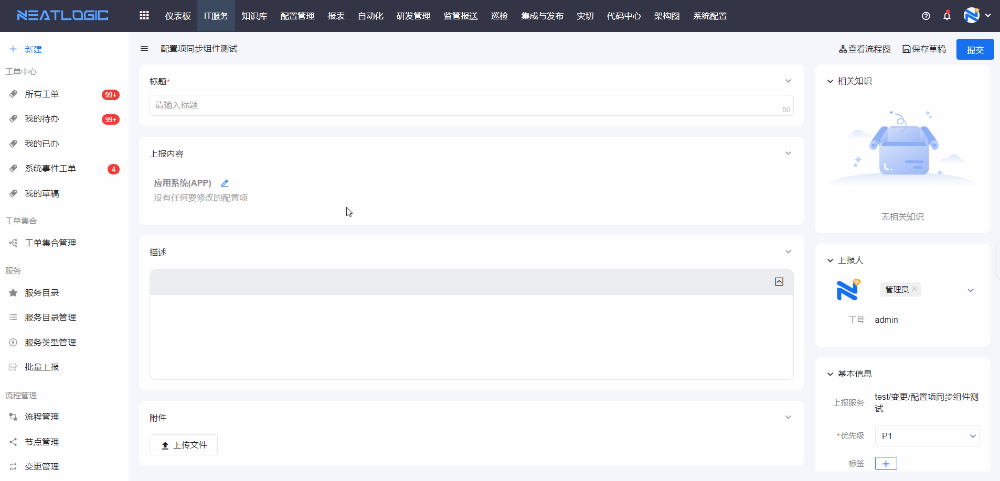
完成变更后提交工单，流转到配置项同步节点，自动将数据同步到配置管理中，可在步骤日志查看同步结果。
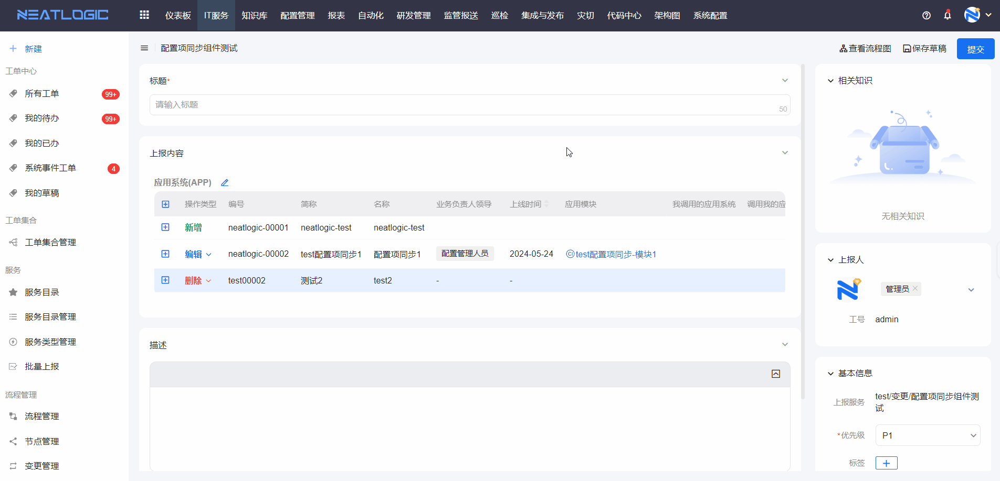
更多详情参考文档：[工单上报](工单上报/工单上报.md)，[工单处理](工单处理/工单处理.md)。