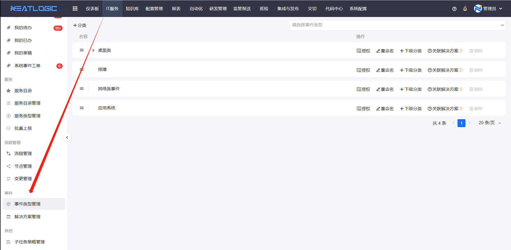
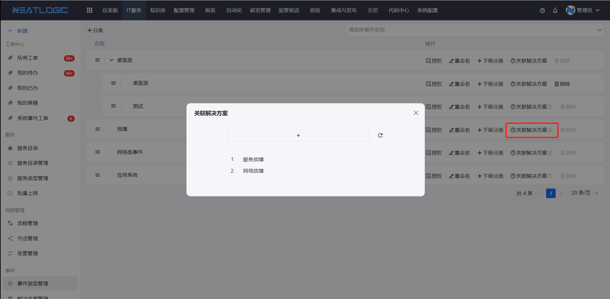
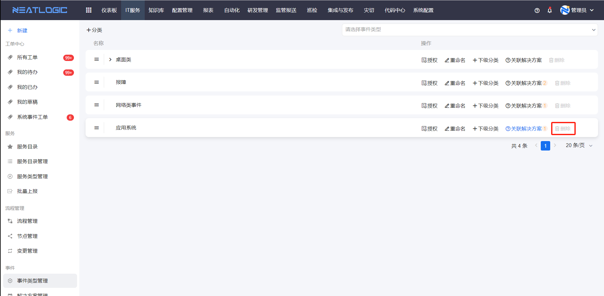
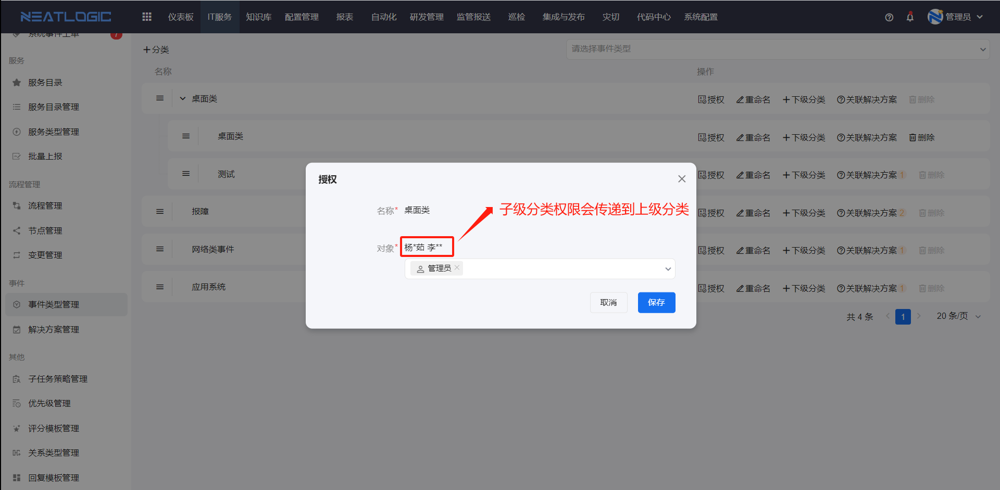

# 事件归档类型
事件归档类型是指上报事件所属的分类，例如桌面类、网络类、应用系统等分类的事件。事件归档类型支持关联解决方案，用户在处理事件时，可以通过选择所属的事件类型，快速找到解决方案。

### 添加分类
整个事件归档类型目录树，首先要添加一级分类，然后再此基础上去补充下级分类。

### 关联解决方案
一般是在结局方案管理中，解决方案主动关联分类，分类的中才会回显关联的解决方案。

事件分类支持快速添加解决方案，点击事件分类上的关联解决方案，然后在弹窗中，点击添加按钮，跳转到解决方案管理页面。

关联了解决方案的分类不能删除。

### 授权
事件归档类型支持通过授权控制用户可选事件归档类型范围。在处理事件时，事件归档类型下拉框只回显当前用户有权限的分类选项。

关于分类层级授权的逻辑
- 最底层的分类，只有本级授权的对象。
- 父级分类，除了自己的权限，还有从子级分类传递上来的权限。用户必须拥有父级分类的权限，才能访问下级分类，所以对子级分类授权后，子级分类的权限会逐级向上传递直到根级分类。
