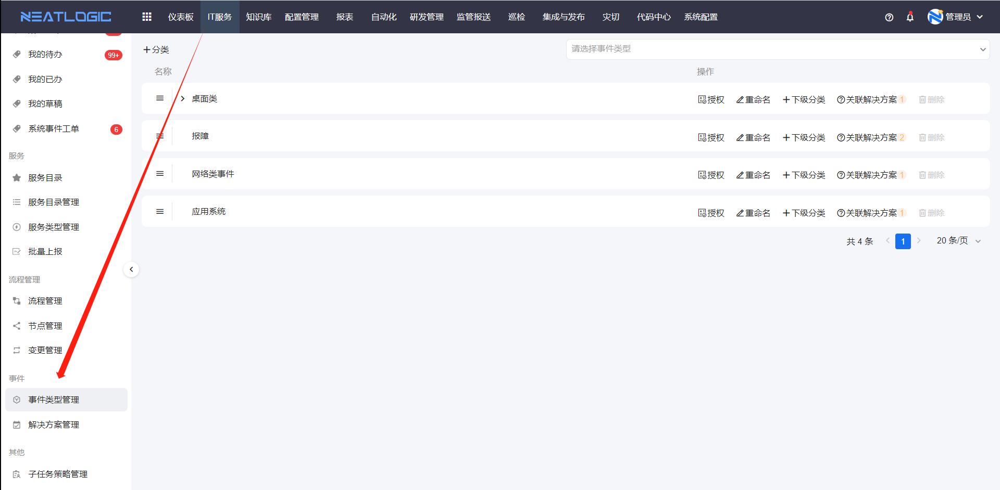
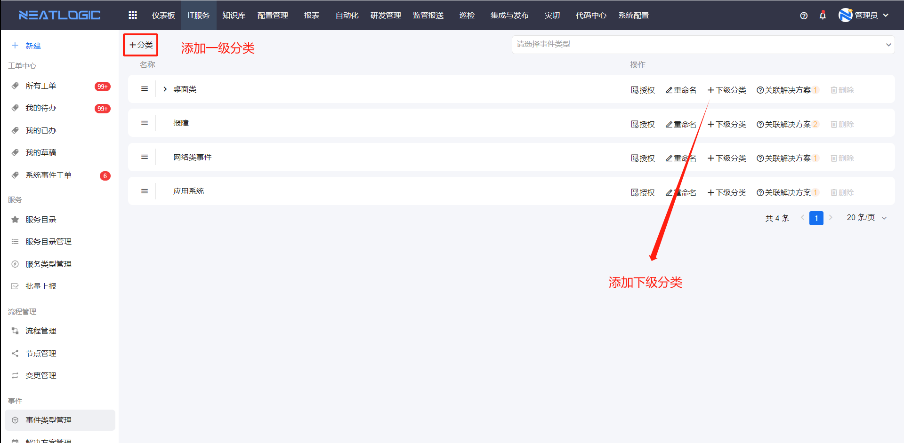
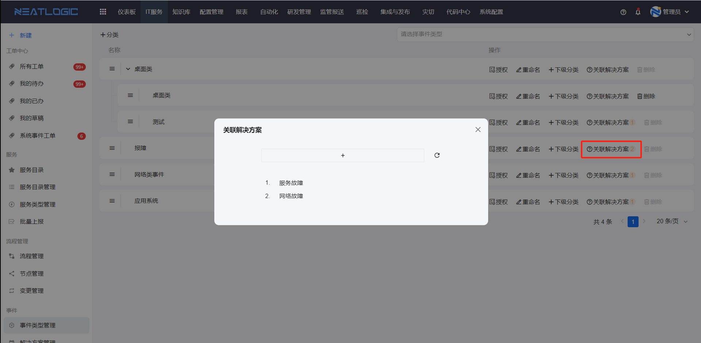
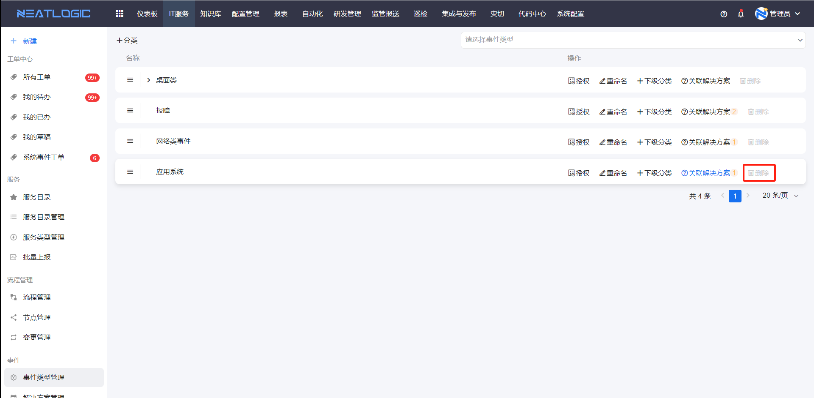
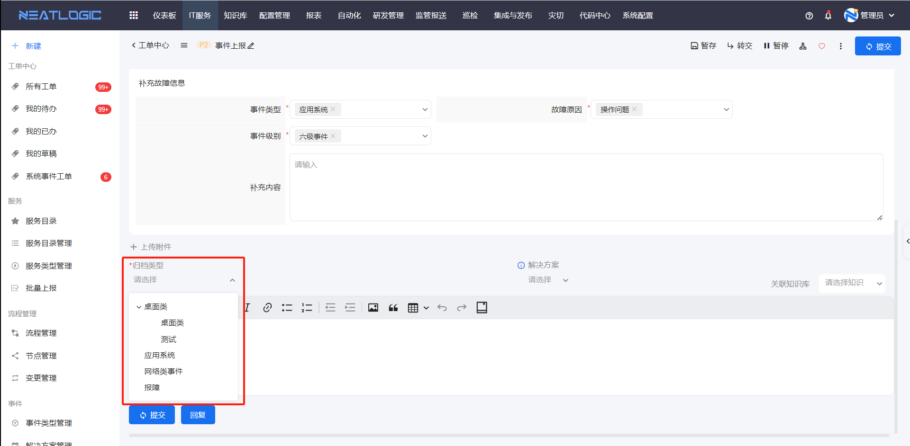
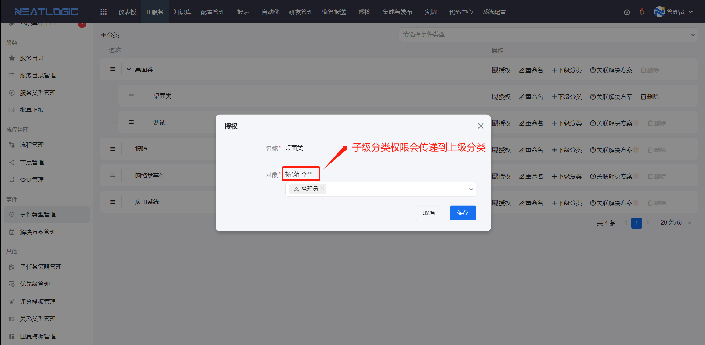

# 事件类型管理
事件类型是对上报事件进行分类的标准体系，例如桌面类、网络类、应用系统等分类。事件类型支持关联解决方案，用户在处理事件时，可通过选择所属事件类型快速找到对应的解决方案。

## 添加分类
事件类型采用目录树结构管理，需先添加一级分类，然后在此基础上补充下级分类。

## 关联解决方案
解决方案与事件类型的关联通常在解决方案管理中主动建立，关联后解决方案会自动回显在对应事件类型的关联解决方案列表中。

事件类型支持快速添加解决方案：点击事件分类上的“关联解决方案”，在弹窗中点击“添加”按钮，系统会跳转到解决方案管理页面。

**注意：** 已关联解决方案的分类不支持删除。

## 授权管理
事件类型支持通过授权控制用户可选择的事件类型范围。处理事件时，事件类型下拉框仅显示当前用户有权限的分类选项。

### 分类层级授权逻辑
- **最底层分类**：仅包含本级授权对象。
- **父级分类**：除包含自身权限外，还包含从子级分类传递上来的权限。用户必须拥有父级分类的权限才能访问下级分类，因此对子级分类授权后，权限会逐级向上传递至根级分类。

