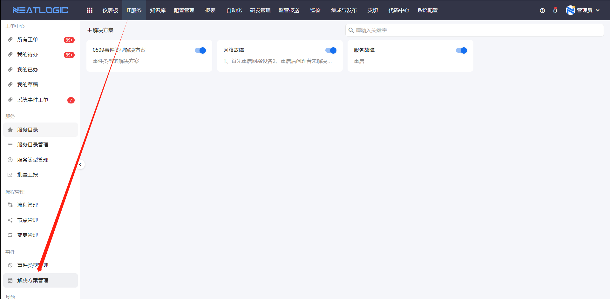
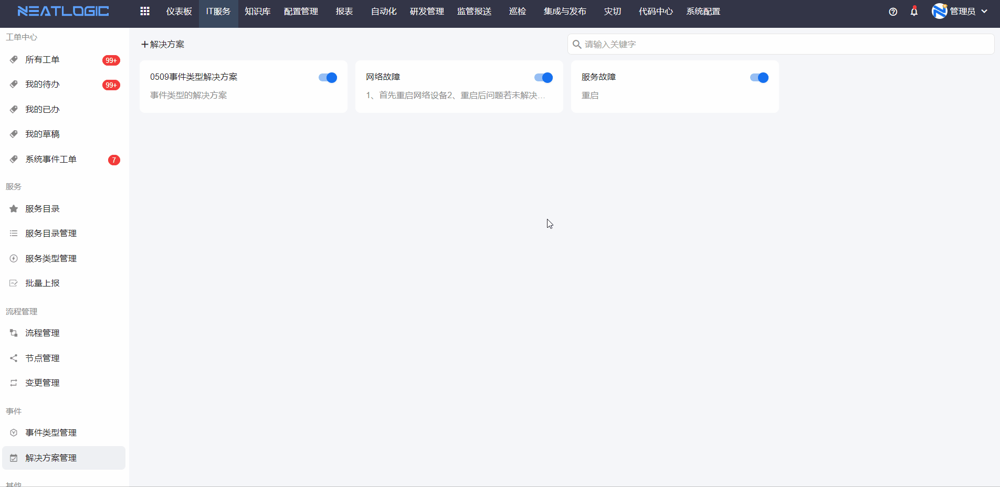
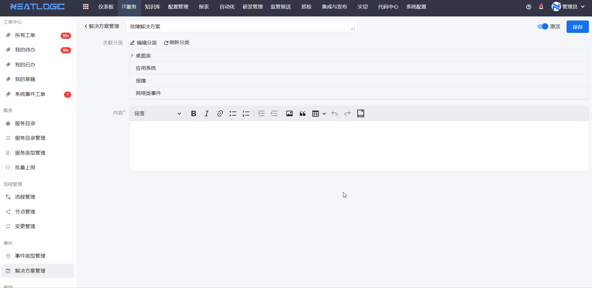

# 解决方案管理
解决方案用于沉淀事件处理经验。

当某类事件有固定的排查步骤、处理方法或注意事项时，可以把这些内容维护为解决方案，并关联到对应的[事件类型](../事件/事件类型管理.md)。处理人选择事件类型后，就能快速找到可参考的解决方案。

本文主要说明如何新增、编辑解决方案，以及解决方案与事件类型的关联关系。

## 阅读路径

可根据当前要解决的问题选择阅读入口。

- 如果需要新增知识型处理方案，阅读“添加解决方案”。
- 如果需要调整方案所属事件类型，阅读“编辑解决方案”。

## 添加解决方案

添加解决方案时，需要先确定它解决哪类事件。

点击“添加”按钮，填写解决方案名称并确认后，系统会跳转到编辑页面。在编辑页面中选择所属事件类型，填写解决方案详细内容，点击保存即可完成创建。创建后的解决方案会自动回显在[事件类型管理](../事件/事件类型管理.md)的关联解决方案列表中。

## 编辑解决方案

编辑解决方案用于调整方案内容或所属事件类型。

如果需要同步维护事件分类，可以通过快速跳转功能直接进入事件分类编辑页面。

