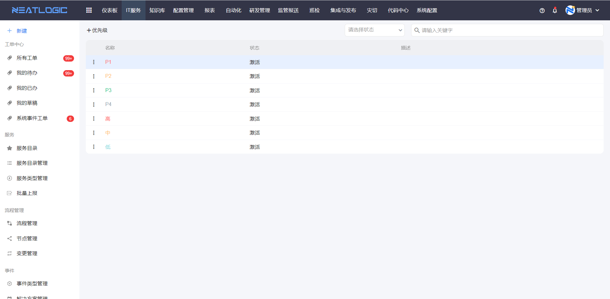

# 优先级管理
优先级用于表达工单的紧急程度或处理优先顺序。

管理员先在优先级管理中维护可选优先级，再到[服务目录管理](../服务/服务目录管理.md)中为服务启用优先级。用户上报工单或处理工单时，系统会根据服务配置决定是否展示优先级，以及默认使用哪个优先级。

## 阅读路径

可根据当前要解决的问题选择阅读入口。

- 如果需要新增或调整优先级，阅读优先级名称、状态和排序说明。
- 如果需要控制上报页面是否显示优先级，到[服务目录管理](../服务/服务目录管理.md)中配置服务的优先级显示规则。

只有激活状态的优先级才能被服务使用。

优先级支持排序。排序结果会应用到工单上报、详情和处理页面的优先级下拉列表中，方便用户按常用或业务约定的顺序选择。
