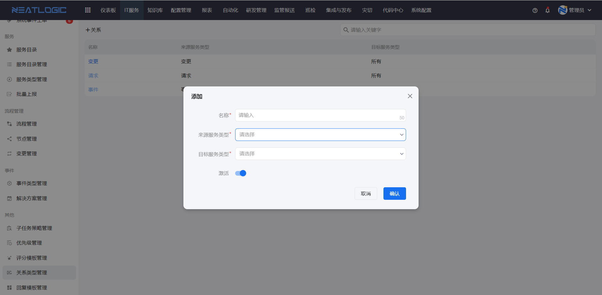

# 关系类型管理
关系类型用于说明两张转报工单之间是什么关系。

当处理一张工单时，如果需要转报出另一张工单，系统会用关系类型记录原工单和新工单之间的指向关系。这样后续在关联工单中查看时，可以知道这张工单是由哪类原因转出，或它与原工单承担什么处理关系。

本文主要说明关系类型的作用，以及它和[服务目录管理](../服务/服务目录管理.md)中转报设置的关系。

## 阅读路径

可根据当前要解决的问题选择阅读入口。

- 如果需要配置服务转报，先在这里准备关系类型，再到[服务目录管理](../服务/服务目录管理.md)的“转报设置”中选择可用关系和目标服务。

关系类型有方向，需要定义来源服务类型和目标服务类型。工单转报时，系统会根据服务目录中的转报配置生成关联关系。

详情参考：[服务目录管理](../服务/服务目录管理.md)-转报设置。
