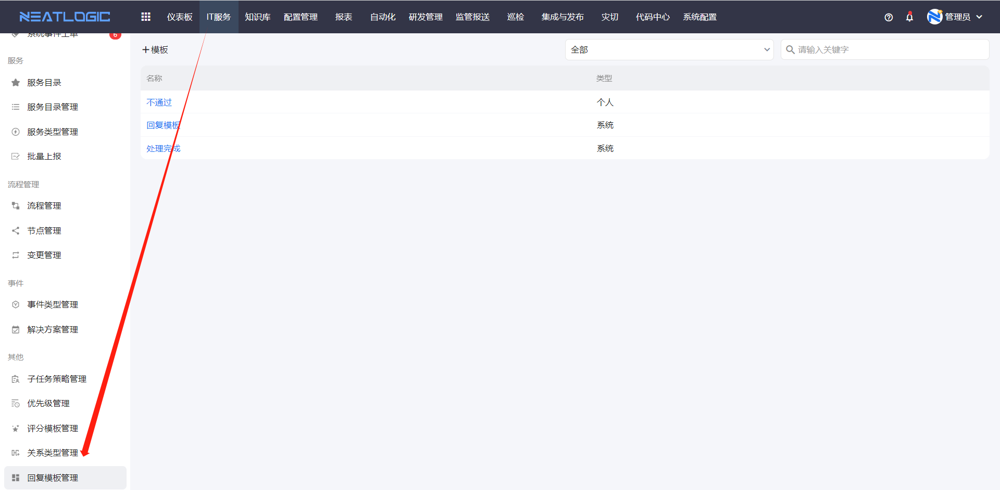
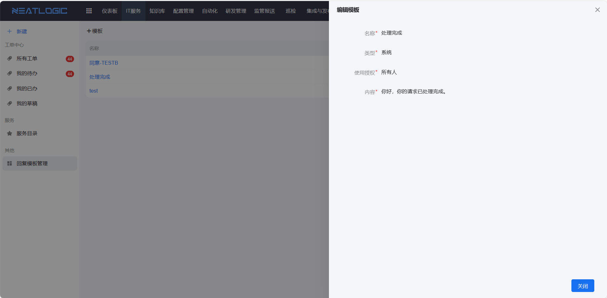

# 回复模板管理
回复模板支持用户将高频的回复内容保存为模板，在工单处理过程中，可选择回复模板，提高工单处理的效率。回复模板页面是开放的，所有用户都可见。

## 数据权限

关于回复模板管理页面的数据权限：

1. 有回复模板管理权限的用户，可见的数据范围是"所有系统模板+当前用户个人模板"
2. 无回复模板管理权限的用户，可见的数据范围是"有数据权限的系统模板+当前用户个人模板"

## 编辑权限

关于回复模板的编辑权限：

1. 有回复模板管理权限的用户，可添加、编辑和删除所有的系统模板和当前用户个人模板
2. 无回复模板管理权限的用户，可查看的系统模板只读，可添加、编辑和删除当前用户个人模板

## 工单处理页面回复模板的数据权限

回复模板列表只展示当前用户有数据权限的系统模板和当前用户的个人模板。
