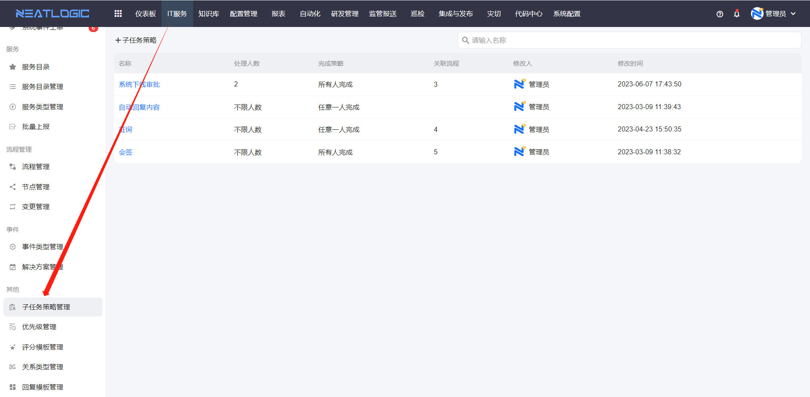
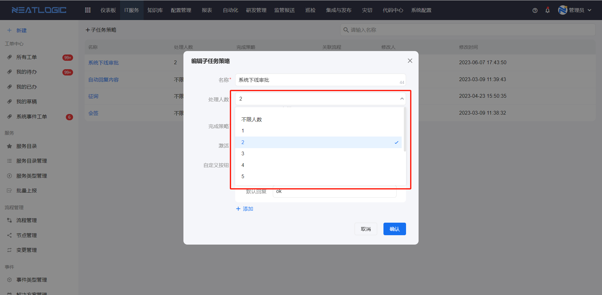
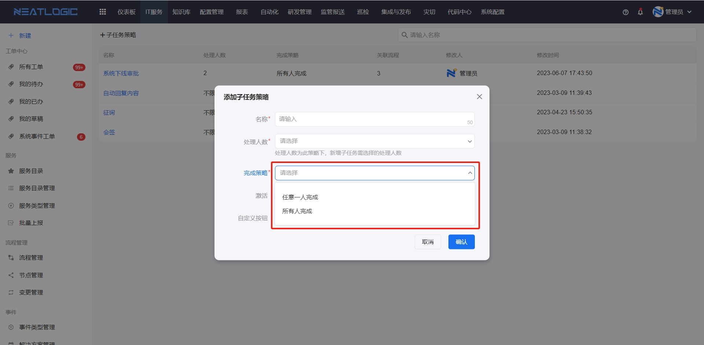
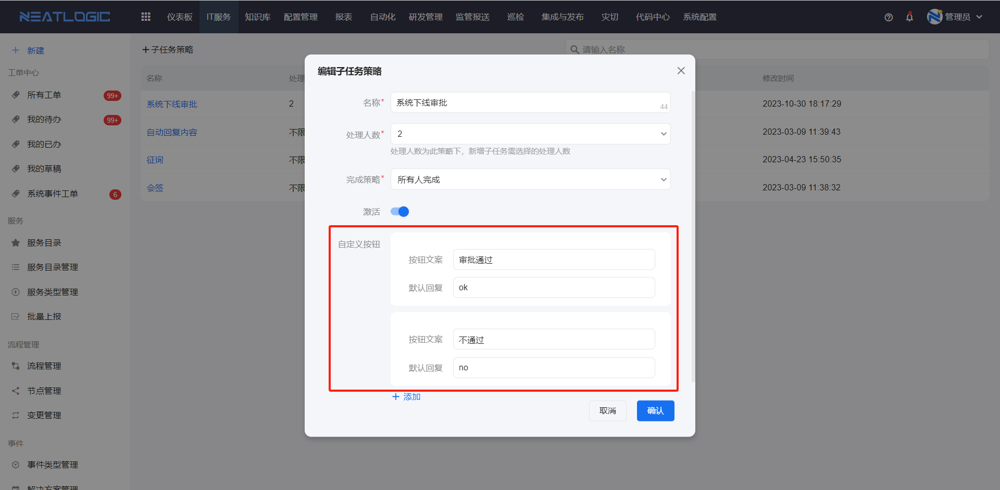
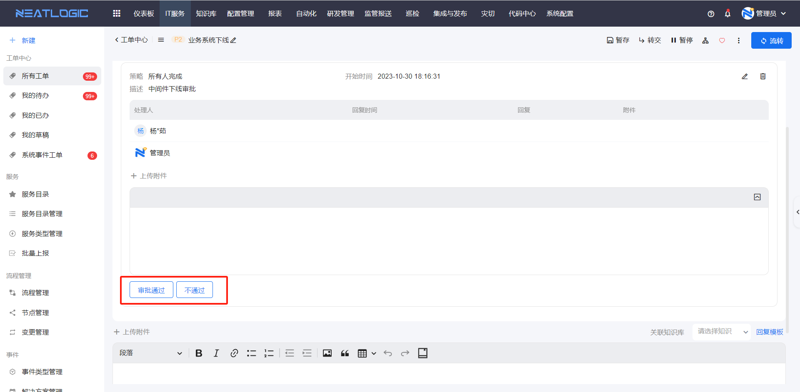
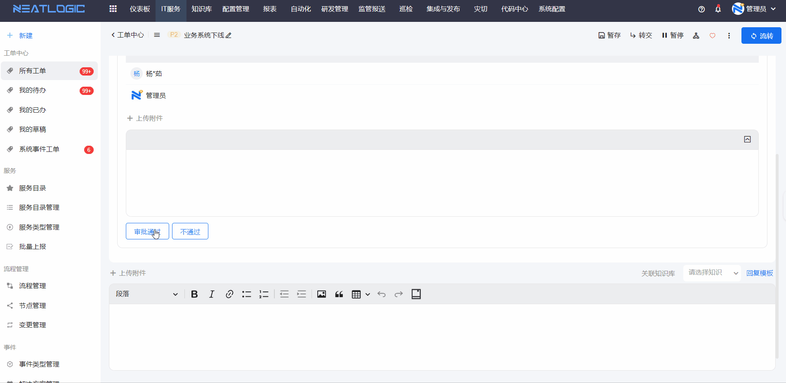

# 子任务策略管理
子任务策略用于规范工单节点中的协作任务。

当一个节点需要多人协助处理，但又不希望拆成独立流程时，可以在[流程管理](../流程管理/流程管理.md)的节点设置中引用子任务策略。策略会控制子任务可分配的人数、完成条件，以及协助人处理时可使用的快捷回复按钮。

本文主要说明子任务策略会限制哪些内容，以及这些配置在工单处理页面中的效果。

## 阅读路径

如果你需要控制子任务可选人数，查看“处理人数”。如果你需要控制主工单什么时候可以继续流转，查看“完成策略”。如果你想给子任务处理人提供快捷回复，查看“自定义按钮”。

## 处理人数

处理人数用于限制一条子任务可以分配给多少个处理人。

添加子任务时，系统会按策略校验处理人数量。不满足策略要求时，子任务无法保存。处理人数支持 1-10 人，也可以设置为不限人数。

## 完成策略

完成策略用于控制主工单是否可以继续流转。

当工单节点中添加了子任务后，必须满足策略中定义的完成条件，主工单才能流转到后续节点。完成策略包括“任意一人完成”和“所有人完成”。

## 自定义按钮

自定义按钮用于给子任务处理人提供常用回复入口。

配置按钮和默认回复内容后，处理子任务时，回复输入框会显示这些按钮。处理人点击按钮即可快速写入对应回复，适合“审批通过”“已确认”“无法处理”等固定反馈。

例如系统下线流程的节点引用了子任务策略，子任务的按钮配置如图所示：

在工单相应节点添加子任务，处理人操作时，输入框显示相应的处理按钮，如图所示：

点击"审批通过"按钮，自动回复"ok"：

