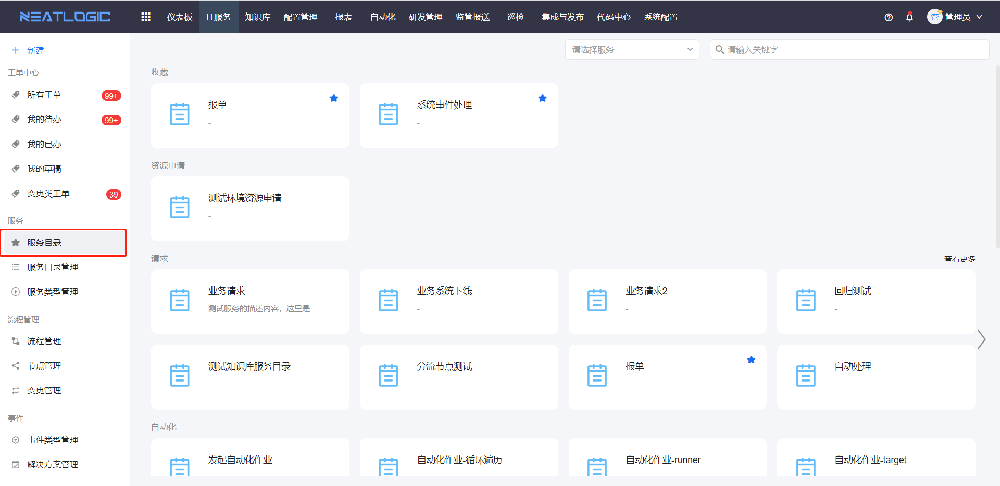
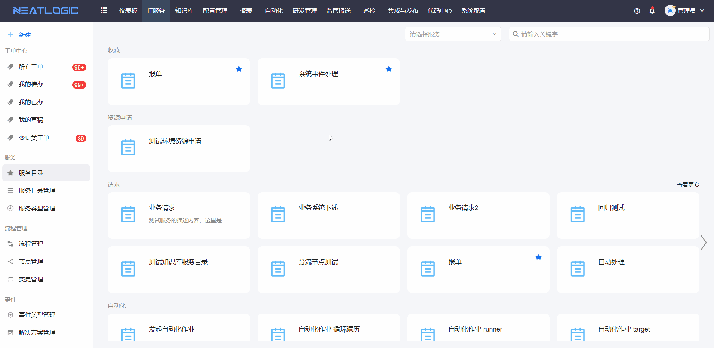

# 工单上报
工单上报的方式主要分为单个工单上报和批量上报。

## 单个工单上报
单个工单上报的入口有两个：

1. 服务目录页面

2. 快捷上报入口

工单上报的流程如图所示

上报工单时，未提交工单，点击暂存，工单将保存为上报人的草稿，上报人可在[我的草稿](../工单中心/工单中心.md/#工单分类)中查看。工单草稿可继续编辑并提交，草稿提交成功后，草稿列表将移除对应草稿。

## 批量上报
批量上报流程：下载模板--填写批量上报文档数据--导出工单

相关权限：系统配置-[权限管理](../../100.系统配置/用户管理.md/#权限管理)-批量上报权限