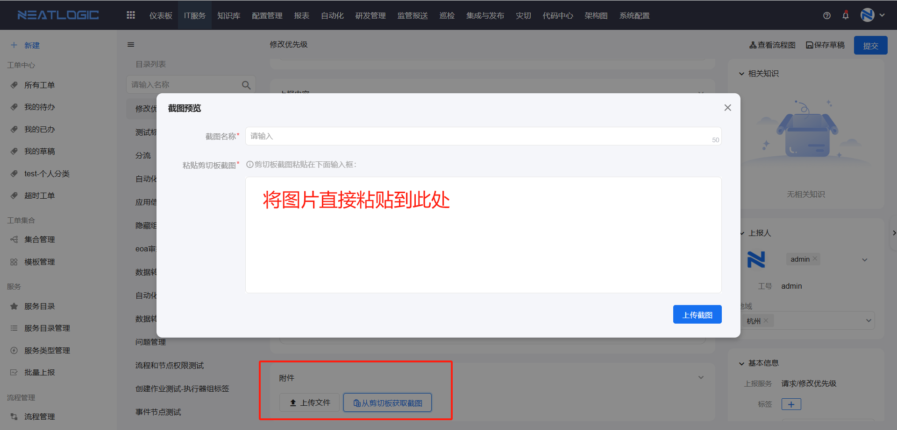
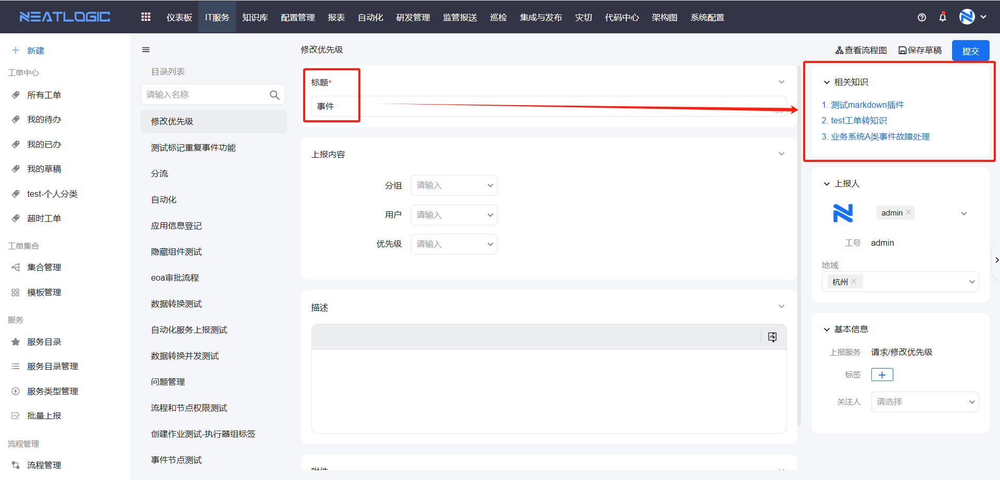

# 工单上报
工单上报的方式主要分为单个工单上报和批量上报。

## 单个工单上报
单个工单上报的入口有两个：

1. 服务目录页面

2. 快捷上报入口

### 提交、暂存工单
上报工单时，必须填写工单的标题和一些必填项，完成这些提交工单才能校验成功。

若填写了工单内容但暂时不想提交，可以点击暂存，工单保存到草稿，可在上报人可在“[我的草稿](../工单中心/工单中心.md)”列表中查找。工单草稿可继续编辑并提交，草稿提交成功后，草稿列表将移除对应草稿。

### 工单内容说明
工单的内容包括标题、上报内容、描述、附件、相关知识、上报人、基本信息
1. 标题：指工单名称，不校验唯一，但必须填写才能暂存或提交工单。
2. 上报内容即表单，按照[流程设置](../流程管理/流程管理.md)中上报节点关联的表单场景显示
3. 描述：工单的描述内容，在流程配置中，上报节点的节点设置有“启用描述”和“描述必填”的配置，控制描述启用状态和必填校验。
    
4. 附件：支持选择本地文件和把截图上传为图片文件，流程的上报节点设置有开关控制附件启用状态。
    
5. 相关知识：与标题关键字可能有相关性的知识文档，根据输入的标题搜索并返回匹配的知识文档，可以点击标题查看文档详情，数据来源是[知识库](../../98.知识库/新建知识文档.md)中所有审批通过的文档。
   
6. 上报人，指提报工单的用户，默认是当前登录人，上报人可以修改，若修改成其他用户（除当前登录以外的用户），当前登录人就会变成工单代报人。上报人的地域信息来自系统配置的[地域管理](../../100.系统配置/1.用户和权限/用户和权限.md)。
7. 基本信息：工单的基础信息，包括上报服务、优先级、标签和关注人。优先级受[服务目录管理](../服务/服务目录管理.md)中服务配置的优先级启用和显示开关控制，表单下拉框组件可以联动修改优先级选项。标签目前仅用于标记工单。

## 批量上报
批量上报流程：下载模板--填写批量上报文档数据--导出工单

相关权限：系统配置-[权限管理](../../100.系统配置/1.用户和权限/用户和权限.md)-批量上报权限