# 工单中心

工单中心用于处理工单相关的日常工作，包括查询工单、查看详情、处理任务、跟踪时效和配置通知。

本文以“怎么找到工单”和“怎么处理工单”为主线，帮助你了解工单从查询到处理完成的常见操作。

## 阅读路径

可根据当前要解决的问题选择阅读入口。

- 如果需要日常查询工单，阅读“工单列表”“工单搜索”和“列表展示”。
- 如果需要处理当前工单，阅读“工单处理”“工单展示”和“工单操作”。
- 如果需要排查权限和状态问题，阅读“名词解释”“查看权限说明”和“工单通知场景”。
- 如果需要配置相关能力，阅读文中关联的[流程管理](../流程管理/流程管理.md)、[服务目录管理](../服务/服务目录管理.md)和[系统参数](../../100.系统配置/5.基础服务/基础服务.md)说明。

## 工单分类

工单分类是工单中心的分类菜单。

当工单数量较多时，可以先通过工单分类缩小查看范围。

系统支持按常见处理场景、管理员维护的公共条件，或个人常用条件对工单进行归类。这样进入工单中心后，就不需要每次重新筛选。

工单数据支持自动刷新，由[系统参数](../../100.系统配置/5.基础服务/基础服务.md)“workcenter.auto.refresh”控制。当参数值为0时，自动刷新功能关闭。


### 系统分类

系统分类是公共的工单分类，管理员可以把常用的搜索条件保存为一个系统分类，并批量授权给普通用户访问。

**数据权限**
- 系统分类-[授权](#3授权)
- 数据：工单分类
- 配置人员：有“工单中心管理权限”的用户

#### 内置系统分类

系统出厂时会内置四个默认系统分类。这些默认分类不能删除。


| 内置系统分类 | 描述 |
| ----------- | ---- |
|**所有工单**|包含所有工单，默认显示最近一年。|
|**我的待办**|当前步骤的处理人、待处理人、审批链当前审批步骤的待处理人、子任务处理人为你的工单集合。|
|**我的已办**|包含历史步骤处理人为你的工单、已完成处理的子任务处理人包含你的工单、已完成的审批链处理人包含你的工单、由你转交过的工单。|
|**我的草稿**|工单处理人为你的草稿集合。草稿的上报人默认拥有删除权限，无需判断是否具备工单管理权限。|

#### 操作

系统分类支持编辑、授权、删除和保存。你也可以调整搜索条件后，另存为新的系统分类。


**操作权限**
- 系统配置-[用户管理](../../100.系统配置/1.用户和权限/用户管理.md)-授权-工单中心管理权限
- 包含操作：编辑、删除、保存、授权和另存为新分类（系统分类）
- 配置人员：系统超级管理员

1. 编辑

   添加系统分类时，你需要填写名称、菜单分类、使用范围、授权对象、显示总数及默认表头信息。

   

2. 保存

   

3. 授权
   管理该系统分类的数据权限。
   

4. 删除

   

### 个人分类

个人分类用于保存你自己常用的筛选条件。

如果某组条件经常使用，可以把它保存为个人分类。后续直接进入该分类，就能查看符合条件的工单，不需要每次重新设置。

**操作权限**
- 系统配置-[用户管理](../../100.系统配置/1.用户和权限/用户管理.md)-授权-工单中心另存为新分类权限
- 包含操作：编辑、删除、保存和另存为新分类（个人分类）
- 配置人员：系统超级管理员


个人分类的新增数量存在上限，由[系统参数](../../100.系统配置/5.基础服务/基础服务.md)“workcenter.custom.limit”控制。


## 工单搜索

工单分类只能帮助你先缩小大致范围。

如果还需要精确查找工单，可以继续使用工单搜索。搜索支持按关键字、工单属性、服务、表单内容或流程步骤过滤。搜索分为简单模式和高级模式，默认使用简单模式。


### 简单模式

简单模式适合日常查询。

当你知道部分线索，但不需要复杂条件组合时，可以通过关键字、工单属性或服务快速筛选工单。简单模式下，多条件之间默认需要同时满足。

**操作权限**
- 配置：系统配置-[用户管理](../../100.系统配置/1.用户和权限/用户管理.md)-授权-IT服务基础权限
- 配置人员：系统超级管理员

1. **关键字匹配**

   在搜索框输入关键字，支持对工单标题、上报内容（即工单描述）进行模糊搜索。

   

   已知工单号或工单ID时，支持精准搜索。

   

2. **工单属性过滤**

   工单属性包括上报人、优先级、服务类型、工单状态等。

   同一属性内选择多个选项时，选项之间是“或”的关系。不同属性之间默认是“且”的关系。最终只会返回同时满足这些属性条件的工单。

   

3. **服务过滤**

   通过服务过滤你可以筛选出指定服务上报的所有工单，支持服务多选。

   

   当“服务”为单选时，你可以启用表单过滤，选择需要的表单组件并填写过滤值后触发搜索。

   

   当“服务”为单选时，可以启用流程步骤过滤。

   流程步骤过滤通常需要和“步骤状态”一起使用。这样可以筛选出当前步骤为指定流程步骤，并且满足指定步骤状态的工单。

   如果只启用“流程步骤”过滤，但未选择步骤状态，系统只会筛选出该服务下的所有工单。

   

### 高级模式

当简单模式无法表达复杂查询条件时，可以使用高级模式。

例如，你需要同时按多个条件查询，并且要灵活控制条件之间是“同时满足”还是“满足任一项”，就可以使用高级搜索。

高级模式可以配置多个组件条件。组合条件之间可以设置为交集或并集关系。组合条件内部也可以添加多个属性作为子条件，子条件之间同样支持交集或并集关系。

**操作权限**
- 配置：系统配置-[用户管理](../../100.系统配置/1.用户和权限/用户管理.md)-授权-工单中心高级搜索权限+工单中心另存为新分类权限
- 配置人员：系统超级管理员


## 工单数据

不同场景下，查看工单的方式也不同。

如果需要批量比较、导出或查看更多字段，可以使用列表模式。如果只想快速浏览标题和关键信息，可以切换为卡片模式。


**自动刷新**：你查看工单列表时，若其他用户发起新工单或处理工单导致数据变更，列表默认自动更新。

### 列表模式

列表模式适合批量查看和对比工单。

你可以修改显示字段、调整字段顺序，并设置标题字段是否换行，让列表更贴合当前关注的信息。


支持隐藏/显示、删除、取消、催办、关注工单等操作。

**操作权限**
- 配置：系统配置-[用户管理](../../100.系统配置/1.用户和权限/用户管理.md)-授权-工单管理权限
- 配置人员：系统超级管理员


**关注工单**：整行聚焦工单时，左侧会显示爱心图标，点击后你即关注该工单，可通过“与我相关”搜索条件筛选关注的工单。

**点击标题跳转规则**：

1. [系统参数](../../100.系统配置/5.基础服务/基础服务.md)“workcenter.processtask.newpage”控制标题点击后的打开方式。

   参数值为0时，在当前页面打开；参数值为1时，打开新页签。

   

2. 你非步骤处理人或待处理人时，跳转到工单详情页面。

3. 你为工单步骤处理人（已接单）时，跳转到工单处理页面。

4. 你为工单步骤待处理人（未接单）时，跳转到工单处理页面，但步骤未开始处理。

**点击处理按钮场景**：

1. 你为工单步骤处理人时，直接跳转到工单处理页。

2. 你为工单步骤待处理人时，跳转到工单处理页，且自动接单开始处理。

### 卡片模式

卡片模式适合快速浏览工单摘要、状态和关键操作。

当你不需要横向对比大量字段时，可以用卡片模式更轻量地查看工单。


## 工单处理

工单进入流程后，需要在处理页完成接单、推进、协作和关闭等操作。

在工单处理页面中，你可以对整张工单操作，也可以对当前流程节点操作。系统会记录处理过程，便于追踪，并按照流程权限控制可执行的动作。

- **工单维度操作**：包括修改上报内容、催办、取消/恢复工单、删除、关注、转报、关联重复事件和编辑表单。
- **节点维度操作**：包括开始、流转、撤回、回退、暂停、转交、表单、回复、子任务、评分等。

**注意：** 流程和服务的配置变更仅对新发起的工单生效，历史工单的配置不会自动更新。

### 名词解释

名词解释用于统一工单处理过程中的角色、状态和节点含义，避免用户在判断“谁能处理”“工单到哪一步”“为什么不能操作”时产生理解偏差。

#### 工单成员

工单成员用于说明一张工单中不同参与人的职责边界。理解这些角色后，可以更准确地判断哪些用户能查看工单、处理节点、审批、协助或关注工单进展。

|工单成员|说明|图例|
| -- | -- | -- |
|**上报人**|提交工单的用户。|-|
|**代报人**|代替其他用户提交工单的用户。当提交工单时上报人不是你，你即为代报人。|<br>|
|**处理人**|可执行工单步骤流转和回退操作的用户。|-|
|**待处理人**|工单步骤已激活且分配给分组/角色，或同时分配给多个用户时，需执行“开始”操作完成接单后才能成为处理人的用户。|-|
|**协助处理人**|除步骤处理人外，参与工单步骤处理活动的其他用户，包括子任务处理人和审批链审批人。|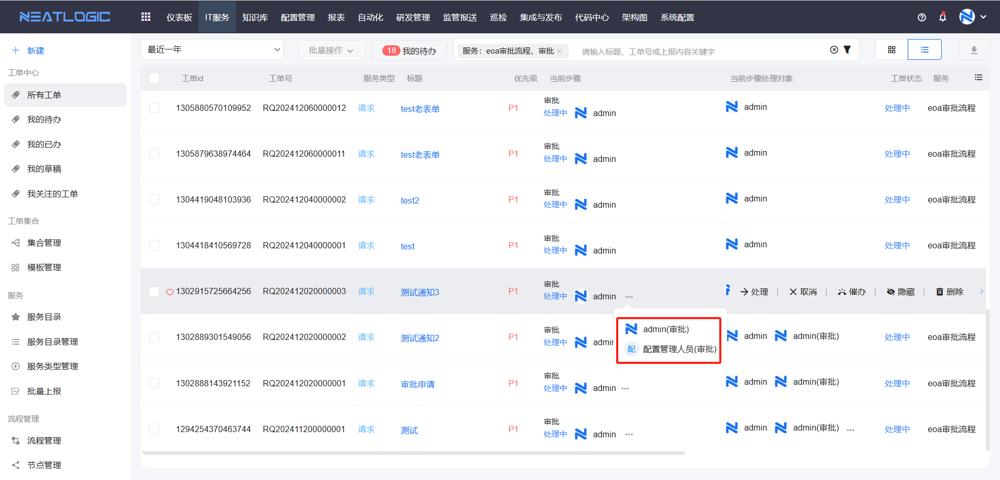|
|**代处理人**|你可以在[个人设置](../../100.系统配置/1.用户和权限/个人设置.md)中进行任务授权。授权后，指定用户可以代你处理相关工单，该用户即为代处理人。|-|
|**关注人**|关注工单的用户。|-|
|**工单干系人**|非步骤处理人但需参与步骤处理的用户，如审批步骤的审批人、子任务处理人。|-|

#### 工单状态

工单状态用于说明整张工单当前所处的生命周期阶段。通过状态可以判断工单是否仍在处理、是否异常、是否已经结束，以及后续是否还能继续操作。

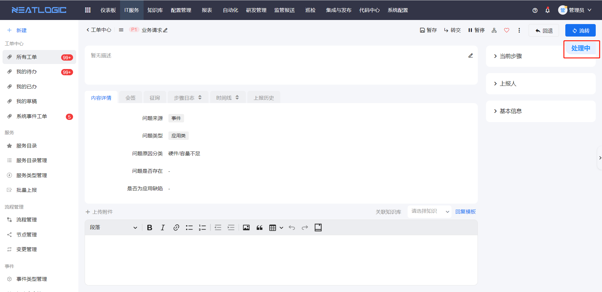

|状态|说明|
| -- | -- |
|**未提交**|工单尚未提交，仅可由上报人或代报人提交。|
| **处理中** | 工单存在未完成步骤，仅处理人和工单干系人可进行处理。 |
| **异常** | 工单处理失败，无法正常继续处理。 |
| **已完成** | 工单处理完毕。 |
| **已取消** | 工单已被取消。 |
| **已评分** | 工单处理完成且已完成评分。 |

#### 步骤状态

步骤状态用于说明当前流程节点的处理进度。它帮助处理人判断当前步骤是否已开始、是否出现异常、是否已经完成，以及为什么某些节点操作暂时不可用。


| 状态 | 说明 |
| -- | -- |
| **待处理** | 当前步骤节点尚未开始处理。 |
| **处理中** | 当前步骤已开始处理，但还未完成。 |
| **异常** | 当前步骤处理异常，例如条件分流节点未匹配到任何流转规则。 |
| **已完成** | 步骤处理完毕。 |
| **已挂起** | 步骤节点暂停，无法继续处理。例如撤回到上一步骤后，当前步骤会挂起。 |

#### 变更步骤状态

变更步骤状态用于说明变更类节点内部的处理进度。它解决了变更流程中“工单整体还在进行，但某个变更步骤是否已取消、已完成或仍可回复”的判断问题。


| 状态 | 说明 |
| -- | -- |
| **待处理** | 变更步骤未开始处理，待处理人可执行取消、开始和回复操作。 |
| **进行中** | 变更步骤正在处理中，处理人可执行取消、开始和回复操作。 |
| **已完成** | 变更步骤处理完毕，处理人可对步骤进行回复操作。 |
| **已取消** | 步骤已取消，无法再执行操作。 |

### 查看工单

不同用户进入同一张工单时，看到的页面可能不同。

系统会根据你的工单角色、权限和当前步骤，展示不同的内容和操作按钮。

工单详情页用于集中查看一张工单的完整信息。

常见内容包括上报内容、工单信息、表单数据、步骤日志、时间线、上报历史、附件清单和关联工单等。处理人可以通过这些信息了解工单背景，并判断下一步如何处理。

**数据权限**
- 配置位置：[服务目录管理](../服务/服务目录管理.md)-查看权限
- 配置人员：服务目录的管理员

#### 工单入口

1. 点击工单列表中的工单标题。

   标题是否在新页面打开，由[系统参数](../../100.系统配置/5.基础服务/基础服务.md)“workcenter.processtask.newpage”控制。
   
2. 点击工单列表上工单的处理按钮。
3. 点击工单卡片。

#### 工单详情页签排序说明

工单详情页包含内容详情、节点信息、步骤日志、时间线、关联工单、重复事件、附件清单和上报历史等页签。

页签顺序由[系统参数](../../100.系统配置/5.基础服务/基础服务.md)“processtask.tab.layout”控制：

- 参数值为空（"{}"）时，按系统默认顺序排序。
- 参数值为自定义JSON时，按自定义顺序展示。
- 参数值仅包含部分页签时，对应页签按参数值排序并置顶，其余页签默认不固定并按系统默认顺序排列。
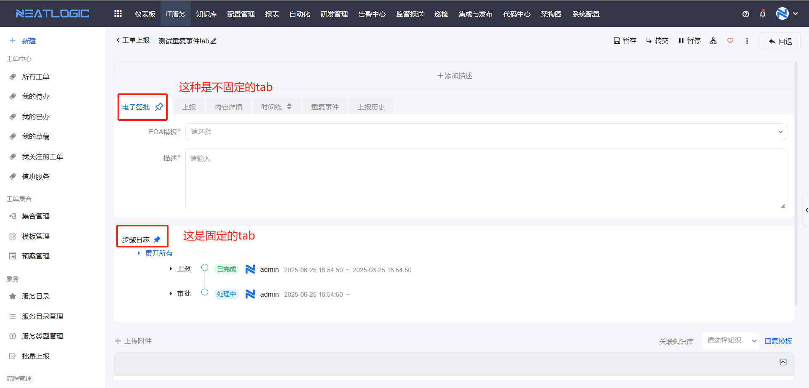

**参数值示例：**

```json
{
    "position": "below",
    "layoutList": [
        {
            "key": "eoa",
            "top": false,
            "description": "电子签批"
        },
        {
            "key": "preNode",
            "top": false,
            "description": "前置步骤"
        },
        {
            "key": "autoexec",
            "top": true,
            "description": "自动化"
        }
    ]
}
```

- `position`：控制取消固定的页签位置（置于固定页签下方）。
- `top`：控制页签是否固定（"true"表示固定，"false"表示不固定）。
- `key`：与页签的对应关系如下表：

| key 值 | 描述 |
|-------|------|
| report | 上报内容 |
| collection | 工单集合 |
| dataconversion | 数据转换 |
| eoa | 电子签批 |
| subProcess | 子流程 |
| autoexec | 自动化 |
| automatic | 自动处理 |
| changecreate | 创建变更 |
| changehandle | 变更处理 |
| cmdbsync | 配置项同步 |
| createjob | 创建作业 |
| diagram | 架构设计 |
| taskConfigList | 子任务策略 |
| preNode | 前置步骤节点信息（eoa） |
| step | 步骤日志 |
| activity | 时间线 |
| relevance | 关联工单 |
| markrepeat | 重复事件 |
| file | 附件清单 |
| reportingHistory | 上报历史 |

#### 工单信息

查看工单时，可以在工单信息中确认上报信息和当前步骤信息。

点击工单右侧的展开按钮后，可以查看当前步骤、上报人及工单基本信息。当前步骤信息包含处理人、步骤状态、开始时间和激活时间。


#### 步骤时效

步骤时效用于限制某个或某些步骤的处理时长。

配置步骤时效后，处理人可以在工单中看到当前步骤的剩余处理时间。如果工单超过规定时间仍未处理，时效状态会显示为超时。系统还支持发送超时通知，提醒处理人及时关注和处理。

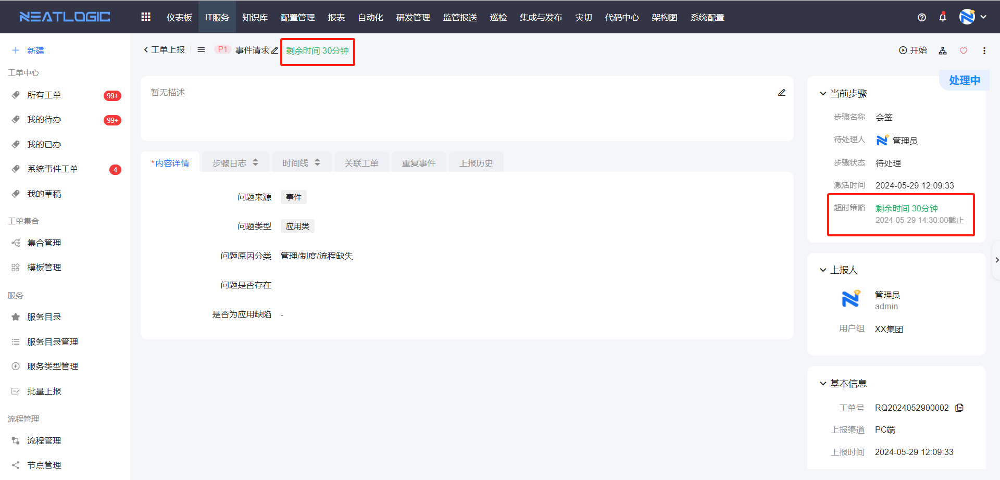

1. 时效策略相关配置

工单时效需要在流程中提前配置，否则工单无时效提醒。

- 流程管理-[时效策略](../流程管理/流程管理.md)-待处理步骤关联时效策略
- 发起工单的服务需配置有效服务窗口（即[服务窗口](../../100.系统配置/5.基础服务/服务窗口管理.md)需设置时间配置和排班）。

如果满足条件1，并且步骤激活时工单符合时效策略的生效条件，时效策略会立即生效。否则，工单不显示时效策略。

同时满足条件1和2时，系统显示正常倒计时。只满足条件1但不满足条件2时，时效策略会直接显示超时。

2. 时效关联优先级

如果你需要对不同紧急程度的工单，限制不同的处理时长，可以通过时效关联优先级实现。

当时效策略关联优先级时，可以为不同优先级设置不同处理时长。工单优先级变化后，剩余时间也会随之调整。

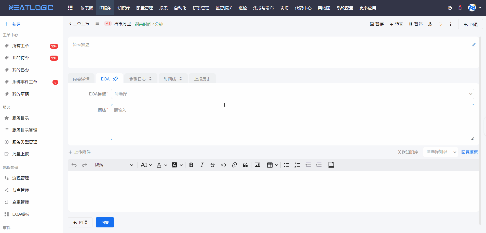

3. 关于剩余时间计算

剩余时间分别在工单中心列表、工单标题和当前步骤信息中显示。

系统会结合时效策略、服务窗口和当前日期来计算剩余时间。流程时效策略中的“时效”，指服务窗口时间（工作时间）内的剩余可处理时间。

如果当天剩余服务窗口时间短于“时效”时长，截止时间会顺延到下一天的服务窗口时间。

**示例：**

假设服务时间窗口为周一至周五的“8:00-12:00”和“14:00-17:00”。

如果步骤在周五16:30激活，时效策略时长为60分钟，当天只剩30分钟服务时间。此时未用完的30分钟会顺延到下一个服务窗口，步骤截止时间为下周一早上8:30。

剩余时间的**展示方式**分为两种，由[系统参数](../../100.系统配置/5.基础服务/基础服务.md)-“sla.time.display.mode”控制：

|展示方式|参数值|计算|图例|
| ---- | ---- | ---- | -- |
|**自然日**|naturalTime|剩余时间=截止时间-当前时间<br>步骤激活后持续倒计时直至超时。|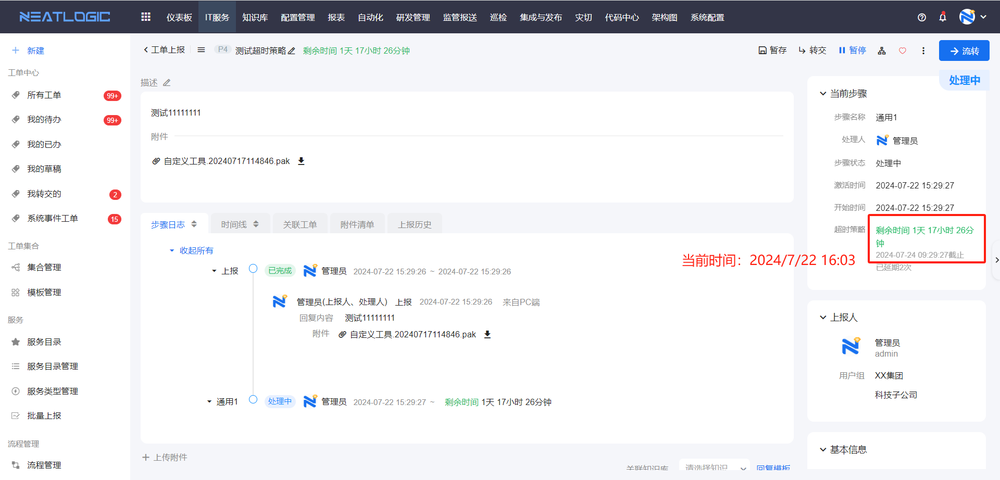|
|**工作日**|workTime|剩余时间按时效策略时长倒计时<br>非工作时间内剩余时间静止，直至下一个工作时间恢复倒计时||

超时未处理，提示已超时时长，文案变红。


#### 任务列表

任务列表可以帮助你快速切换到其他待办工单。它位于工单左侧，默认收起，汇总所有待你处理的工单步骤。


#### 内容详情

内容详情用于查看上报内容和业务表单信息。

该页签展示表单内容。详情页显示关联表单的主场景，处理页显示节点关联的表单场景。


#### 步骤日志

步骤日志用于记录工单处理过程。

它会展示步骤信息，包括处理人、时间、回复内容、子任务等，便于后续核查每个节点发生过什么。

[系统参数](../../100.系统配置/5.基础服务/基础服务.md)“processtask.step.list.show”控制步骤日志是否默认展开。

参数值为1时默认展开，参数值为0时默认收起。


#### 时间线

时间线用于按时间顺序还原工单变化过程。

该页签展示所有工单操作日志，默认按操作执行时间倒序排序。

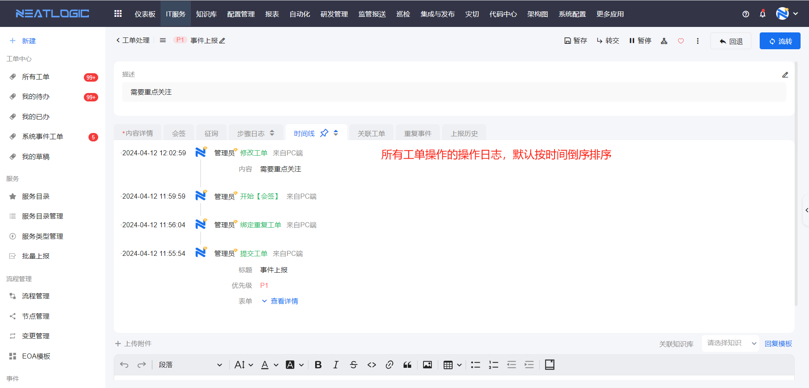

#### 上报历史

上报历史用于查看当前上报人过去提交过哪些工单。

处理人可以通过该页签了解上报人是否有相似问题或重复上报情况。例如当前工单上报人为admin，则上报历史会显示admin提交的所有工单。


#### 附件清单

附件清单用于集中查看当前工单的所有附件。

如果附件分散在上报、回复、子任务、审批等环节，可以在这里统一查找。


#### 关联工单

当一个问题引发多张工单，或多张工单之间存在处理依赖时，可以使用关联工单。

建立关联后，处理人可以在当前工单中查看相关工单，了解上下游处理情况。关联工单分为两种情况：

1. **主动关联**

   允许转报的服务发起的工单，通过转报操作发起新工单后，两者互为关联工单。允许转报的工单还支持你直接选择可转报服务下的工单作为关联工单。

   **操作权限**
   - 配置：服务的转报权限，[服务目录](../服务/服务目录管理.md)-转报配置
   - 配置人员：IT服务模块管理员

   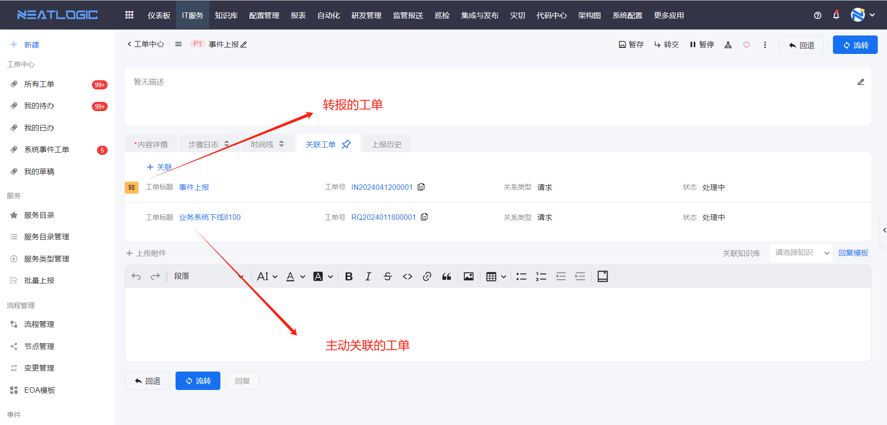

2. **被动关联**

   通过转报发起的工单，若所在服务不允许转报，则仅有一个关联工单（即发起转报的原工单）。

   

#### 查看流程图

查看流程图可以帮助处理人了解当前工单走到哪一步。

你可以查看完整流程图，通过连线状态识别已完成节点、可能经过的路径和当前处理节点。鼠标聚焦节点时，可以查看节点详情。

在弹窗中，你点击编辑按钮可跳转到流程编辑页面（最新版流程配置），点击快照图标可打开新页签查看当前工单的流程配置。


**连线、节点颜色与状态说明：**

| 颜色 | 节点状态 | 连线状态 |
|------|---------|----------|
| 绿色 | 已完成 | 已经过的路径 |
| 红色 | - | 不会经过的路径 |
| 蓝色 | 处理中 | - |
| 灰色 | 未激活 | 可能经过的路径 |

工单流程图快照支持修改节点配置。

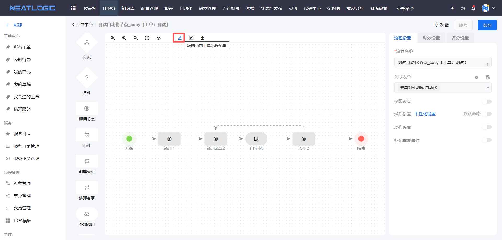

### 工单操作

工单操作用于推进流程、补充信息、协同他人或调整工单状态。

根据影响范围不同，操作分为工单维度和节点维度两类。

#### 工单维度的操作

工单维度操作会影响整张工单。

当需要调整工单信息、工单状态或关联关系时，可以使用这类操作。例如修改上报内容、取消、转报、关联重复事件等。

1. 修改上报内容

修改上报内容用于补充或纠正已提交工单的信息。

**操作权限**
- 配置：[流程管理](../流程管理/流程管理.md)-流程设置-修改上报权限。
- 配置人员：流程管理员

可修改内容包括工单标题、优先级、上报描述、标签、关注人等内容。

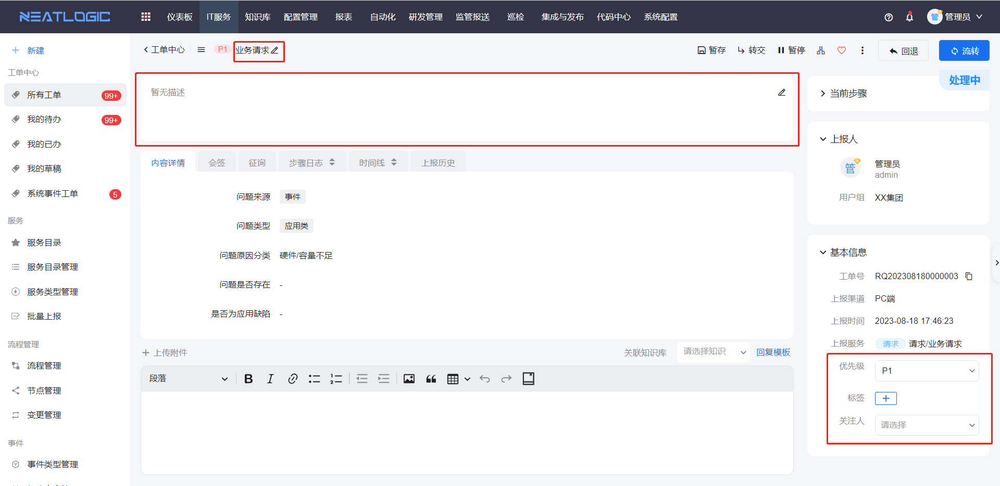

工单支持通过表单组件联动修改优先级，详情参考文档：[IT服务-场景](../IT服务-场景.md)-场景4。

2. 催办

当工单长时间未处理，或即将超时时，可以使用催办提醒相关人员。

催办可以配合通知策略，把催办信息发送给指定对象。

**操作权限**：
- 配置：[流程管理](../流程管理/流程管理.md)-流程设置-催办权限。
- 配置人员：流程管理员

催办功能可与通知功能结合使用，[流程设置](../流程管理/流程管理.md)关联的通知模板中包含催办通知配置，你发起催办时可通知指定用户。

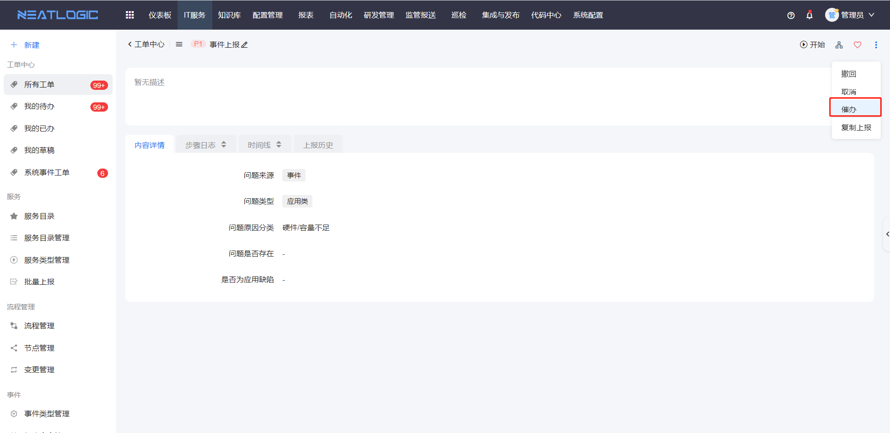

3. 取消/恢复

当工单不再需要继续处理时，可以取消工单。

如果被取消的工单后续还需要处理，也可以恢复工单。

**操作权限**：
- 配置：[流程管理](../流程管理/流程管理.md)-流程设置-取消权限。
- 配置人员：流程管理员

你可以取消或恢复工单，取消成功后工单状态变为已取消。仅处理中或异常状态的工单支持取消。

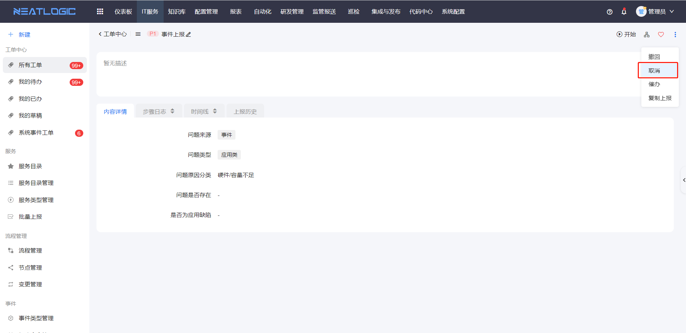

4. 关注工单

如果你不是当前处理人，但仍需要跟进工单，可以关注该工单。

工单页面右上角设有爱心图标。点击后，你就会关注该工单。后续可以在工单中心通过“与我相关”搜索条件快速筛选关注的工单。

5. 转报

处理当前工单时，如果发现还需要发起另一张相关工单，可以使用转报。

转报会保留原工单和新工单之间的关联关系，便于后续追踪事件来源和处理结果。

**操作权限**
- 配置：[服务目录管理](../服务/服务目录管理.md)-转报设置
- 配置人员：服务目录管理员

事件处理过程中引发其他事件时，你可以通过转报方式快速发起新事件单。


允许转报的工单会显示关联工单页签，支持你主动关联可转报服务下的任意工单，转报的工单也会显示在关联工单列表中。


6. 批量关闭重复事件

当同一问题被多人重复上报时，可以使用批量关闭重复事件。

该功能可批量关闭重复工单，仅限同一服务上报的工单。

你在关联重复事件列表中，可添加并关联重复工单。

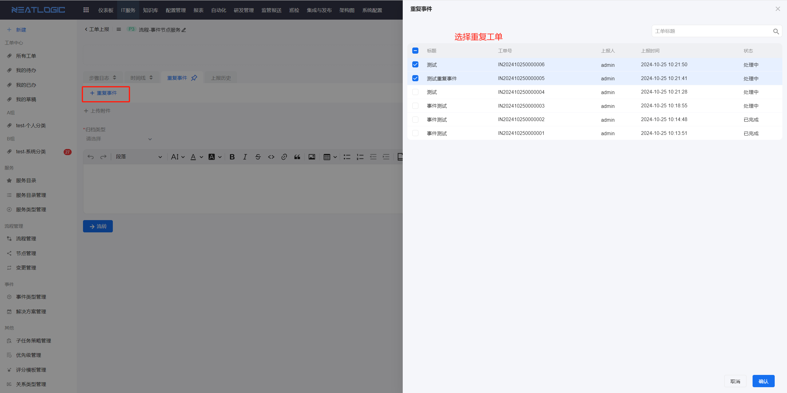

多个工单关联为重复工单后，关联工单的重复事件列表会显示其他所有重复工单。当其中任意一个工单处理完成后，剩余重复工单自动转为已取消状态。


**操作权限**
- 配置：[流程管理](../流程管理/流程管理.md)-流程设置-关联重复事件。

7. 编辑表单

编辑表单用于修正、补录或同步工单中的表单信息。

它适合在不重新发起工单的情况下维护表单数据。

**操作权限**：
- 配置：[流程管理](../流程管理/流程管理.md)-流程设置-修改上报权限，或[用户管理](../../100.系统配置/1.用户和权限/用户管理.md)-授权-工单管理权限。
- 配置人员：流程管理员，系统超级管理员

你可以随时编辑表单内容，无论工单处于何种状态。编辑时回显表单主场景内容，保存时不校验表单必填项。

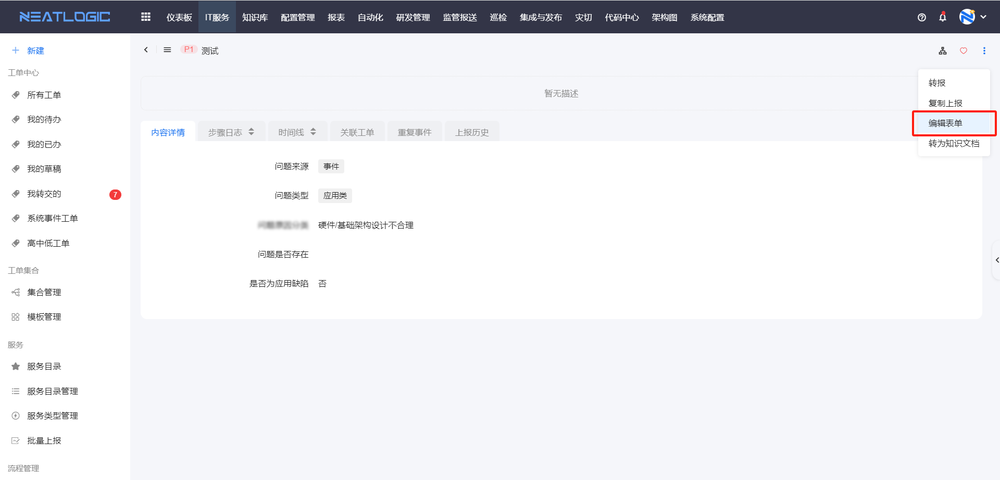


8. 工单转知识

工单转知识用于沉淀已处理问题的经验。

你可以把典型工单的上报内容、表单、回复等转换为知识库文档，供后续相似问题参考。

**操作权限**
- 工单状态：已完成或已评分
- 配置：系统配置-[用户管理](../../100.系统配置/1.用户和权限/用户管理.md)-授权-知识库基础权限

**数据权限**
- 配置：知识库-[知识圈管理](../../98.知识库/知识圈管理.md)-成员，成为知识圈成员才能选择知识圈的分类

你可以将工单内容（包括上报内容、表单、回复等）转换为知识库文档。


#### 工单节点维度的操作

工单节点维度操作用于处理当前步骤。

这类操作通常只影响当前流程节点，包括接单、流转、回退、协作和记录等动作，也会决定工单能否继续流转到后续步骤。

1. 开始

多人或分组待处理时需要明确实际处理人，任一[待处理人](#工单成员)点击开始后，系统将该用户确认为处理人，后续才能执行节点处理操作。

**操作权限**
- 配置：[流程管理](../流程管理/流程管理.md)-节点设置-分配处理人
- 配置人员：流程管理员

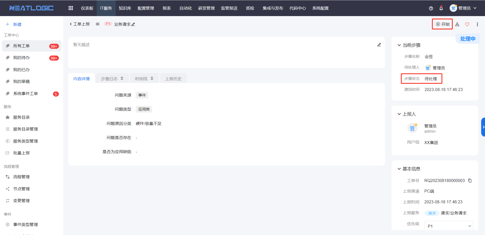

2. 流转

流转即流转到下一步骤。处理人完成必要表单、回复或审批后，可通过流转让工单进入后续节点。

**操作权限**
- 配置：步骤处理人可操作，处理人分配策略参考 [流程管理](../流程管理/流程管理.md/#413-分配处理人)-节点设置-分配处理人

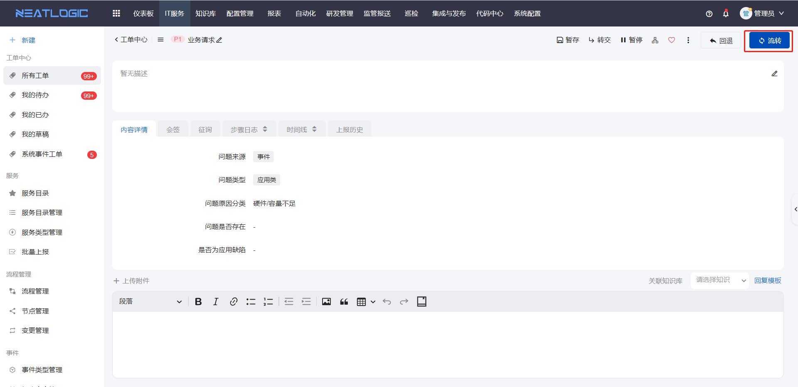

3. 指派

指派功能用于在流转时分配后续步骤处理人。

工单节点的处理人分派策略：由前置步骤处理人指定。配置详情参考文档[流程管理](../流程管理/流程管理.md/#4131-由前置步骤处理人指定)。

**由前置步骤处理人指定**效果如图：

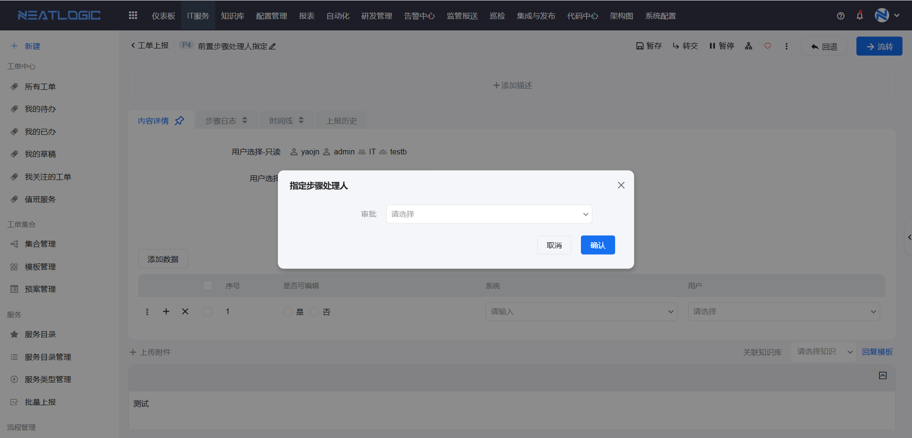

若分派策略无法匹配到用户，步骤会自动分派给异常处理人。


4. 撤回

工单已流转到后续节点后，如果上一节点处理人发现需要重新处理，可以使用撤回。

撤回会把工单拉回上一处理节点，避免错误流转继续扩大影响。

**操作权限**：
- 仅上一个节点的处理人有操作权限。

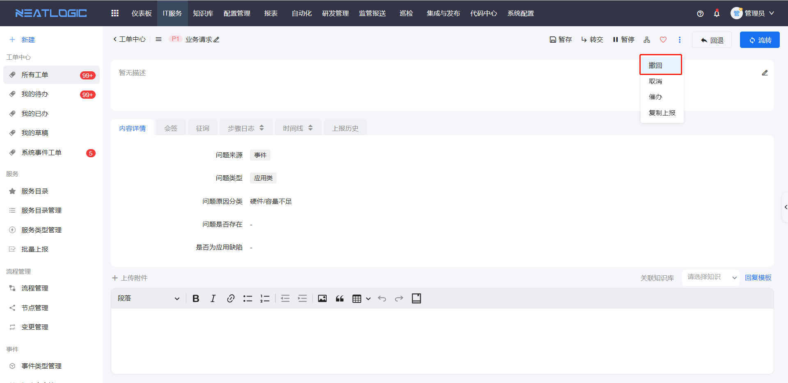

5. 回退

回退用于你在处理当前节点过程中发现前置步骤信息不完整、处理结论有误或需要重新处理的问题。它可以按照流程中已配置的回退线，将工单退回到前置步骤。

**操作权限**
- 配置：步骤处理人可操作，处理人分配策略参考 [流程管理](../流程管理/流程管理.md)-节点设置-分配处理人

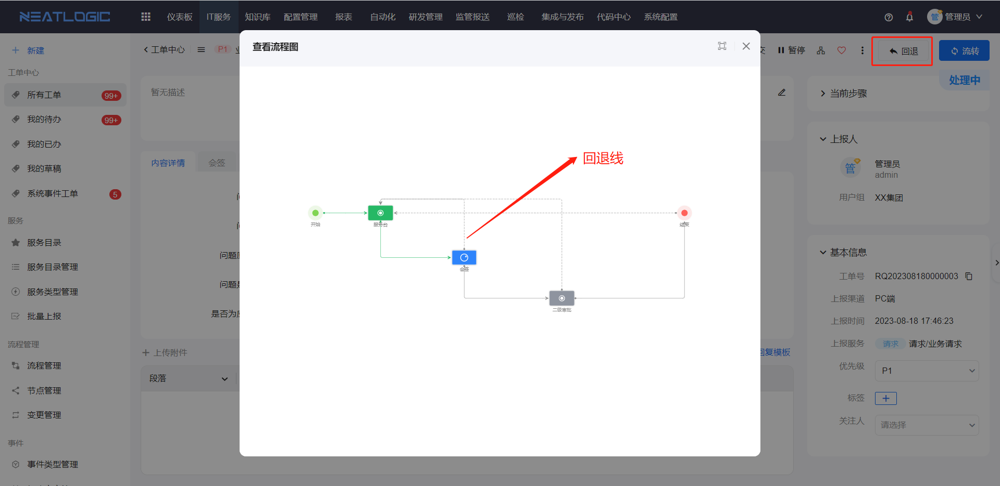

回退到前置步骤后，前置步骤会重新激活并分配处理人。

系统会根据[系统参数](../../100.系统配置/5.基础服务/基础服务.md)“processtask.workerpolicy.isonlyonceexecute”判断分配方式。

分配方式包括两种：重新执行分派策略，或分配给步骤原处理人。步骤转交后，原处理人可能与分派策略对象不一致。

6. 转交

当当前处理人不适合继续处理当前步骤时，可以使用转交。

转交后，新的处理对象将继续承担当前节点的处理职责。

**操作权限**
- 配置：[流程管理](../流程管理/流程管理.md)-节点设置-权限设置-转交权限

支持转交给用户、分组或角色。


转交操作分为两种模式：

- **保存并转交**：保存当前表单和回复内容后执行转交。
- **转交**：不保存当前表单和回复内容，直接执行转交。

7. 子任务

当当前步骤需要多人协助，但不希望拆分主流程时，可以使用子任务。

处理人可以在当前节点内发起子任务，让协助人完成并反馈各自负责的事项。

**操作权限**
- 配置：[流程管理](../流程管理/流程管理.md)-节点设置-子任务策略
- 配置人员：流程管理员

处理步骤需多人协助时，你可以通过发起子任务实现。子任务完成策略包括“所有人完成”和“任意一人完成”，需在子任务策略管理页面配置。


8. 节点表单数据

节点表单用于采集、修正或补充当前节点的结构化业务数据。

处理人在节点中编辑表单后，数据会随流程流转保存，并供后续节点使用。

**操作权限**
- 配置：处理人才能编辑，[流程管理](../流程管理/流程管理.md)-节点设置-分配处理人
- 配置人员：流程管理员
  
工单内容详情回显当前节点引用的[表单场景](../流程管理/流程管理.md)。你可以编辑表单组件并暂存数据，工单流转时表单修改数据会自动保存。

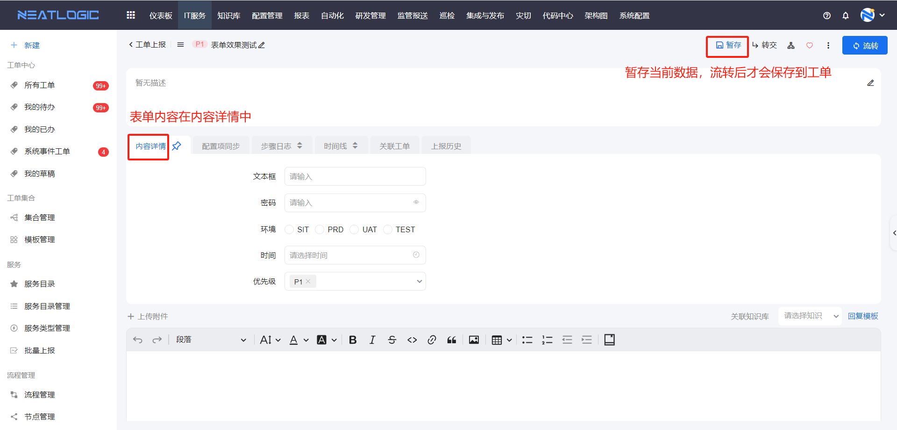

9. 回复

回复用于沟通说明、记录处理结论或上传过程附件。

回复内容会进入步骤日志，便于后续处理人和审计人员追溯上下文。

   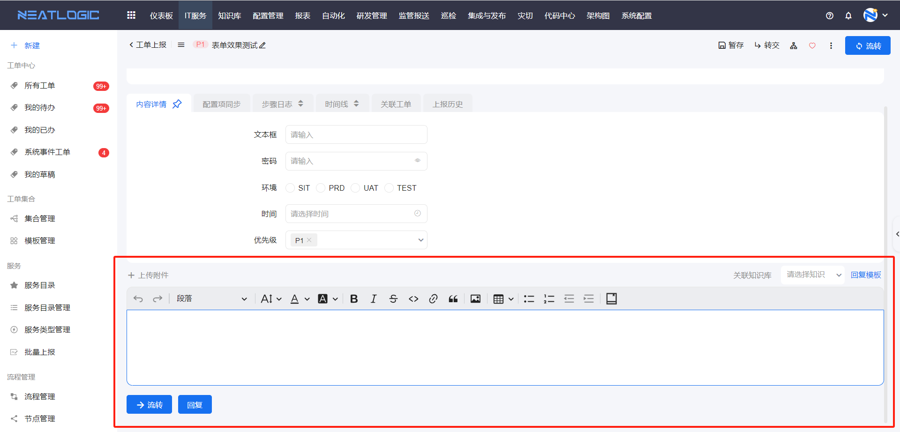

- **回复必填**：回复分为必填和非必填两种模式，取决于配置 [流程管理](../流程管理/流程管理.md)-节点设置-回复必填

- **附件**：回复支持你上传附件，点击回复按钮后附件保存到当前步骤。上传的附件可在当前步骤的步骤日志或附件列表中查看。

- **关联知识库**：支持你输入关键字匹配包含该关键字的[知识库](../../98.知识库/新建知识文档.md)文档。

- **回复模板**：把一些高频使用的回复内容保存为模板，方便你下次处理类似事件时快速回复。

   模板包含个人模板和系统模板，详情参考[回复模板管理](../其他/回复模板管理.md)。

   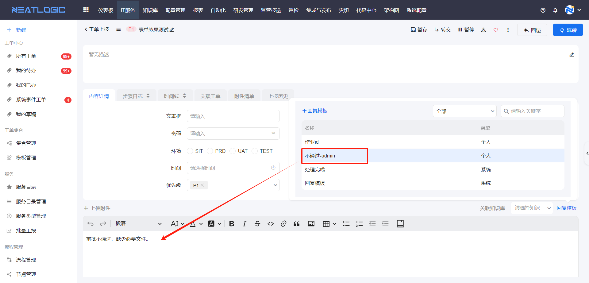

- **回复功能的系统配置**
  
   回复功能的交互效果受两个系统参数影响。
   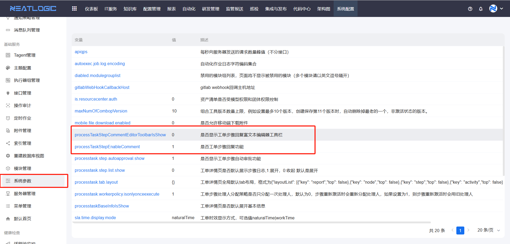

   |参数名|参数值|描述|图示|
   | --- | --- | -- | -- |
   | processTaskStepEnableComment | 1 | 可以单独执行回复操作 |  |
   | processTaskStepEnableComment | 0 | 禁止单独执行回复操作 | 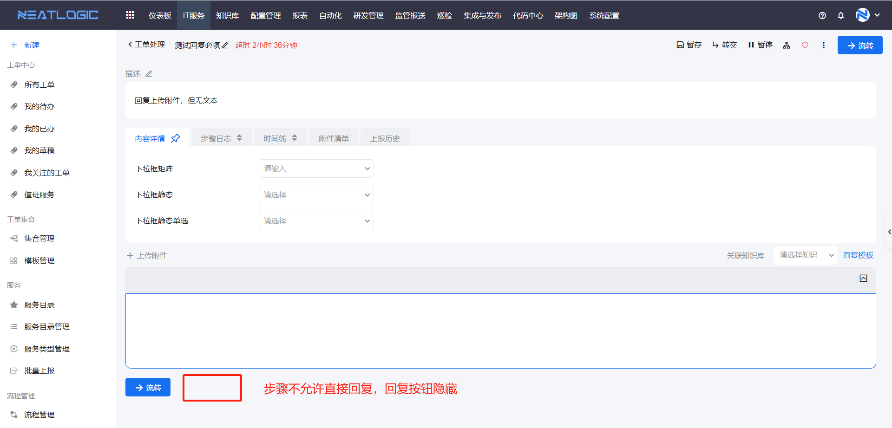 |
   | processTaskStepCommentEditorToolbarIsShow | 1 | 默认展开编辑器工具栏 |  |
   | processTaskStepCommentEditorToolbarIsShow | 0 | 默认收起编辑器工具栏 | 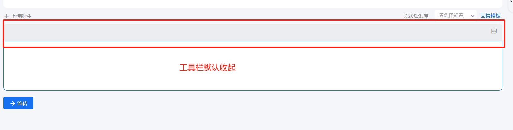 |

10. 重新激活

重新激活可以解决自动执行节点失败后，需要修正数据并重新运行的问题。自动执行的节点包括自动化、条件、外部调用、数据转换。

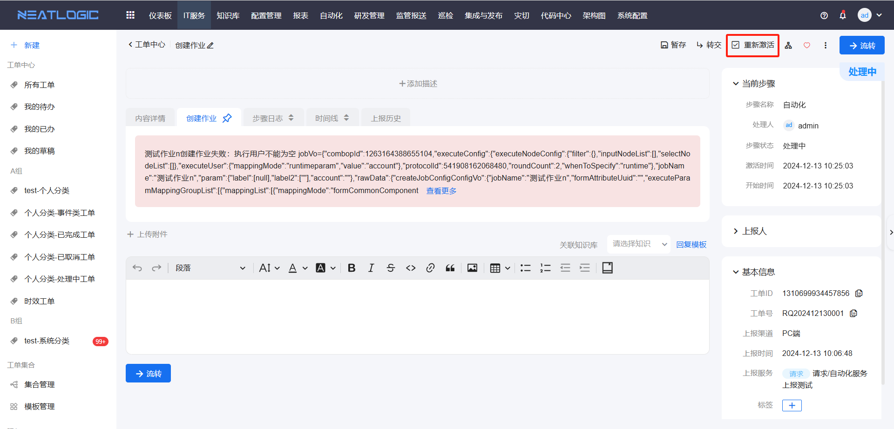

11. 评分

评分是用来满足工单完成后收集服务满意度或处理质量反馈的场景。评分结果可作为服务改进、质量统计和后续考核的依据。

**操作权限**
- 配置：工单处理人才能操作，处理人分配参考 [流程管理](../流程管理/流程管理.md/#413-分配处理人)-节点管理-分配处理人
- 前置条件：工单引用的流程需启用[评分设置](../流程管理/流程管理.md/#6-评分设置)
- 工单状态：已完成

评分维度是由评分模板定义的，详情参考 [流程管理](../流程管理/流程管理.md)-评分设置-评分模板。

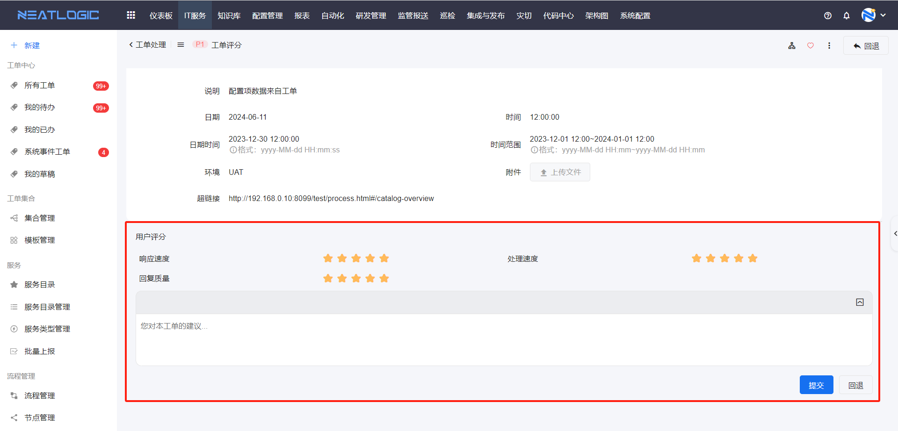

- **提交**：你填写评分维度和内容后点击提交，评分操作完成，工单状态变为已评分。
- **回退**：若结束节点有连接到前置节点的回退线，你未完成评分前可执行回退操作。

### 节点介绍

节点介绍用于说明特殊流程节点在工单处理中的作用，帮助配置人员和处理人理解这些节点解决的业务问题，以及它们与普通处理节点的区别。

#### 事件节点

事件节点用于在流程中承载人工处理动作。

处理人可以在节点中查看上报内容、编辑表单、回复处理记录，并根据流程配置执行流转、回退、转交等操作。

#### 审批功能

当工单处理结果需要多人确认、分级审批或留存审批记录时，可以使用审批功能。

发起审批后，审批人会作为工单干系人参与当前步骤处理。审批过程可以在审批页签或步骤日志中查看。

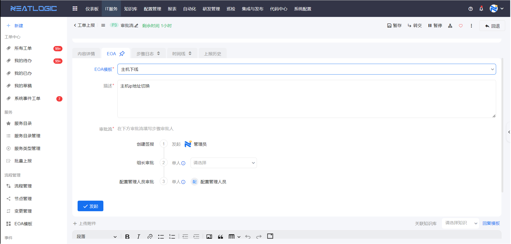

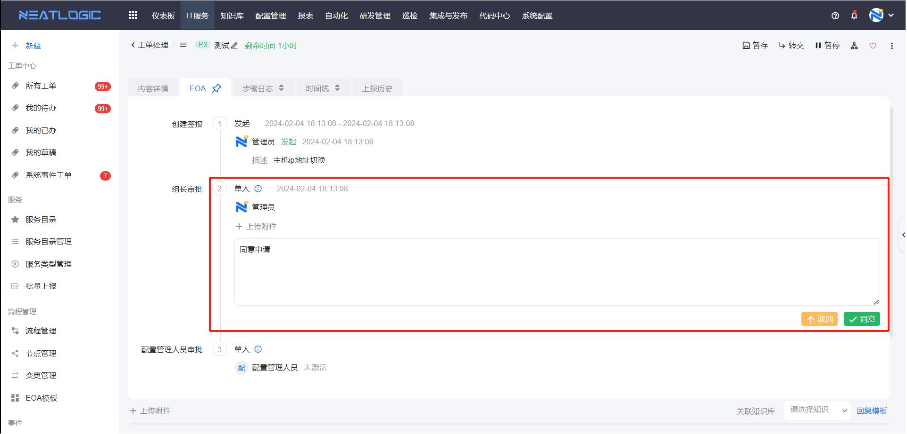

#### 子流程功能

当主流程中的某个事项需要独立流程承接时，可以使用子流程。

子流程适合跨团队协作，或需要拆分处理链路的场景。子流程执行结果会回写到主工单，主工单可根据子流程状态继续流转。

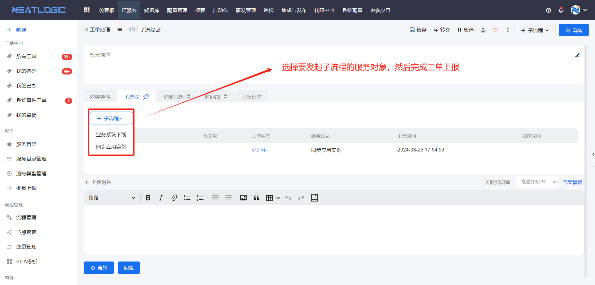

### 通知

工单处理过程中，有些关键动作或超时信息需要及时提醒相关人员。

工单操作和工单超时都支持通知功能。通知方式包括邮件通知、站内消息通知、微信通知等。

#### 工单维度操作的通知

取消、催办、修改上报内容等整单动作，通常需要同步给相关人员。

你执行工单维度操作后，可以通知指定对象。通知模板需在工单引用流程的流程设置-通知设置中配置。详情参考文档：[流程管理](../流程管理/流程管理.md)-流程设置。

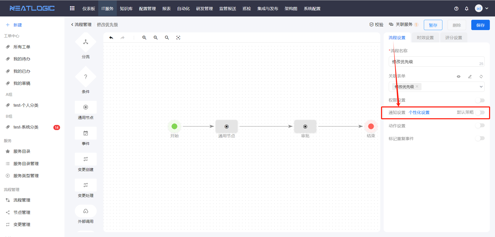

#### 节点操作的通知

开始、流转、回退、转交等步骤动作，通常需要提醒后续处理人或相关协作人。

你执行节点维度操作后，可以通知指定对象。通知模板需在工单流程对应节点的节点设置-通知设置中配置。详情参考文档：[流程管理](../流程管理/流程管理.md)-节点设置。

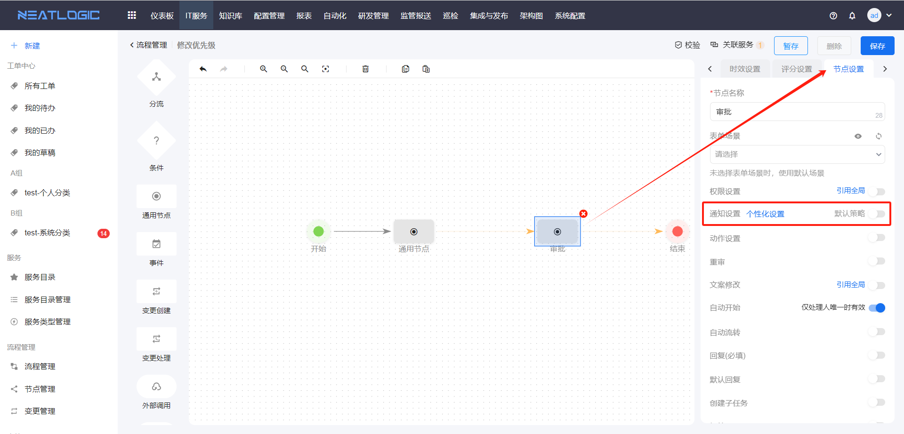

#### 步骤时效通知

步骤即将超时或已经超时时，可以发送步骤时效通知。

通知对象和通知时机需在工单流程的时效设置中配置。


