# 工单中心
工单中心的分类是根据搜索条件对工单分类的工单列表，工单列表的字段有初始默认字段及初始排序，用户可个性化重定义显示字段及字段排序。已有分类支持保存、编辑、授权和删除等操作，另外还可以修改搜索条件并另存为新分类。用户可对分类重新拖动排序，该排序仅对本人有效。
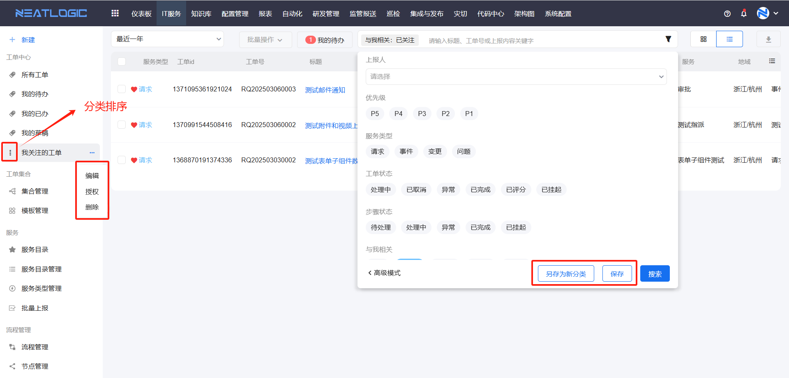

## 工单分类
工单分类主要分为系统出厂分类、系统分类和个人分类。

工单数据有自动刷新功能，由[系统参数](../../100.系统配置/5.基础服务/基础服务.md)“workcenter.auto.refresh”控制的，当变量值为0时，自动刷新功能关闭。
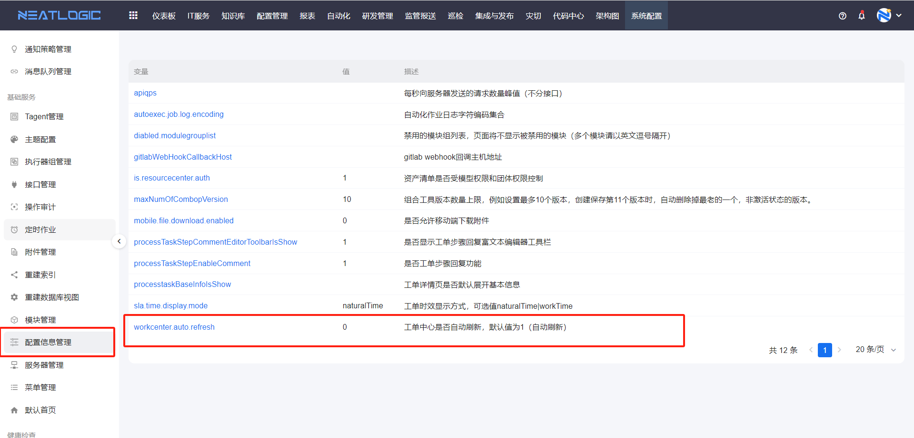

### 系统出厂分类
工单中心有四个系统出厂分类，分别为所有工单、我的待办、我的已办、我的草稿，管理员（有工单中心管理权限）能进行编辑和授权操作，出厂分类不能删除。

- 所有工单：所有最近一年上报的工单。
- 我的待办：当前步骤的处理人、待处理人、审批链当前审批步骤的待处理人、子任务处理人是当前登录人的工单集合。
- 我的已办：包括历史步骤的处理人是当前登录人的工单、已完成处理的子任务的处理人包含当前登录人的工单、已完成的审批链的处理人包含当前登录人的工单、由当前登录人转交过的工单
- 我的草稿：工单处理人是当前登录人的草稿集合，草稿的上报人默认可以删除草稿，不用判断是否拥有工单管理权限。

### 系统分类
系统分类是公共分类，由工单中心管理员添加的，可授权给任意用户使用的工单分类，管理员可对其进行修改条件并保存、重命名、授权和删除等操作。
1. 编辑
   
   添加系统分类时，填写的信息有名称、菜单分类、使用范围、授权对象、显示总数和默认表头
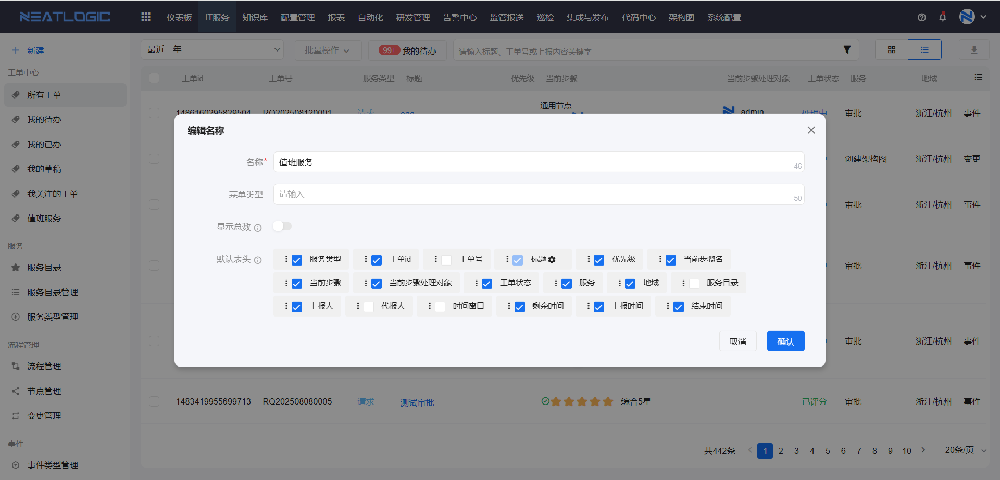

1. 保存
   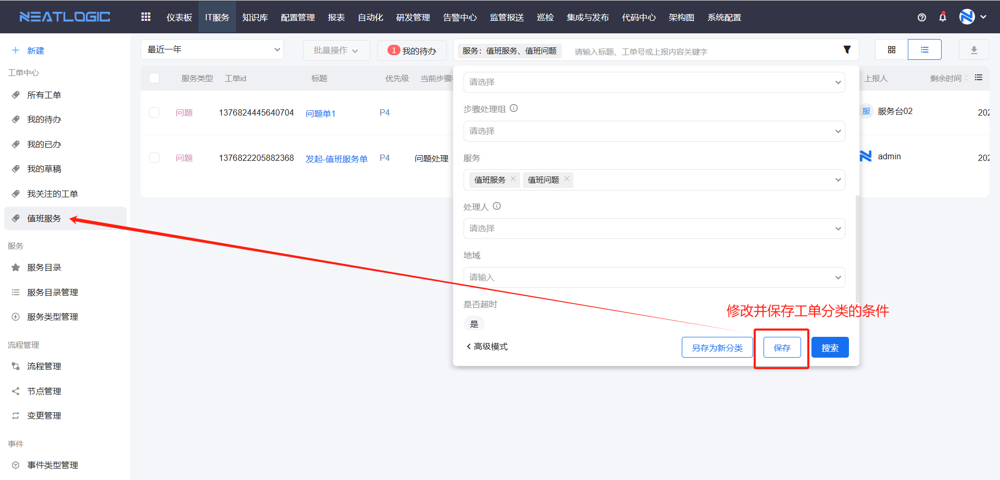

2. 授权
   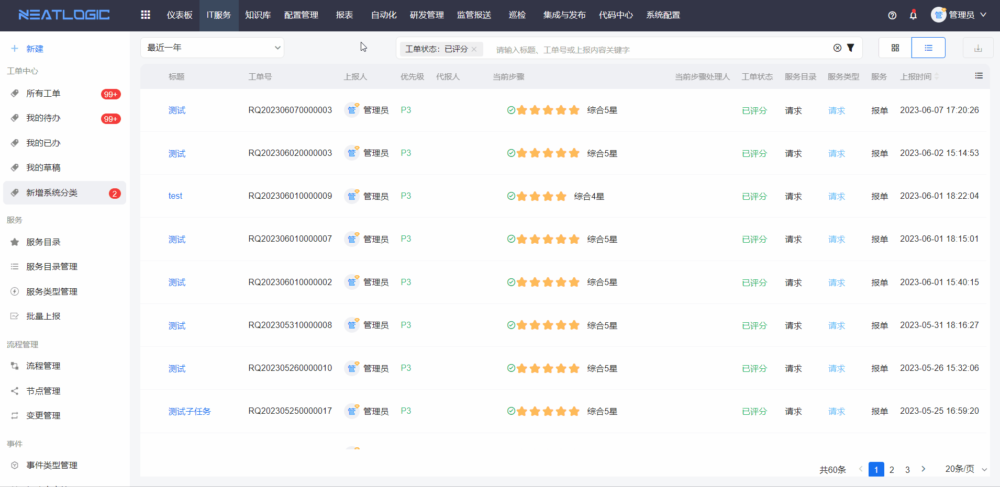
3. 删除
   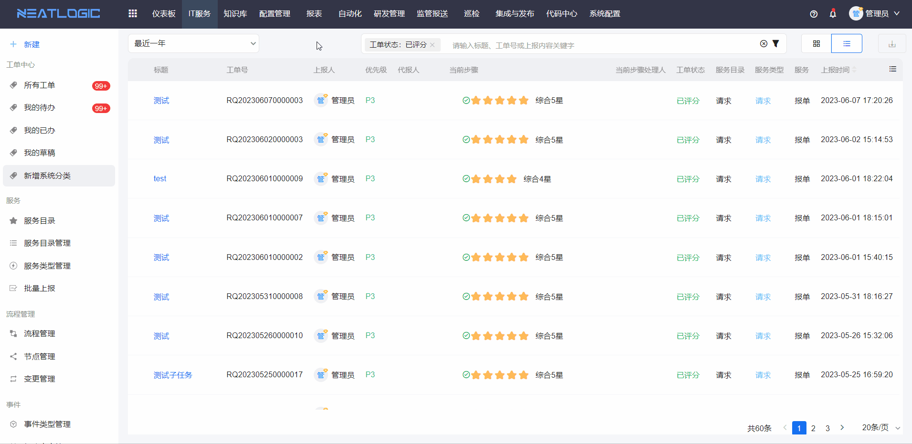
   
### 个人分类
个人分类是用户个人使用的分类，个人分类支持修改条件并保存、重命名和删除等操作。若用户的另存为新分类权限收回后，该分类也会收回。
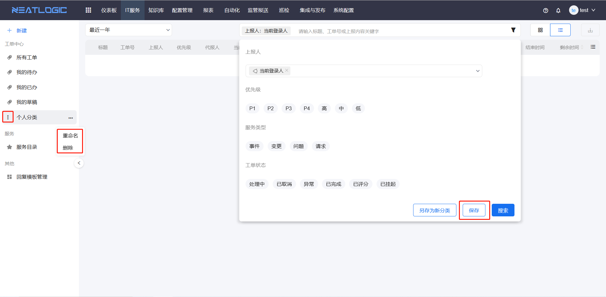
用户新增个人分类有上限，这个上限是由[系统参数](../../100.系统配置/5.基础服务/基础服务.md)“workcenter.custom.limit”控制。
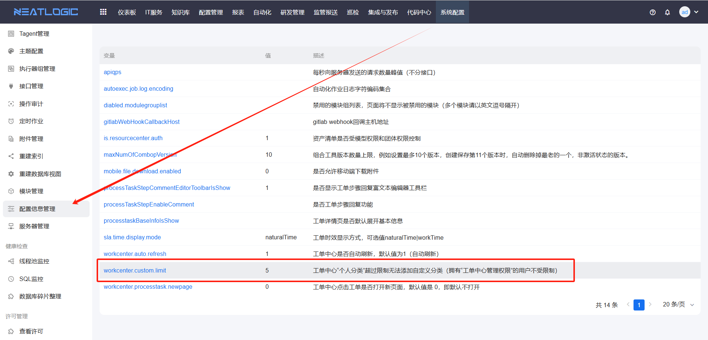

## 工单搜索
工单搜索分为简单模式和高级模式，默认为简单模式。
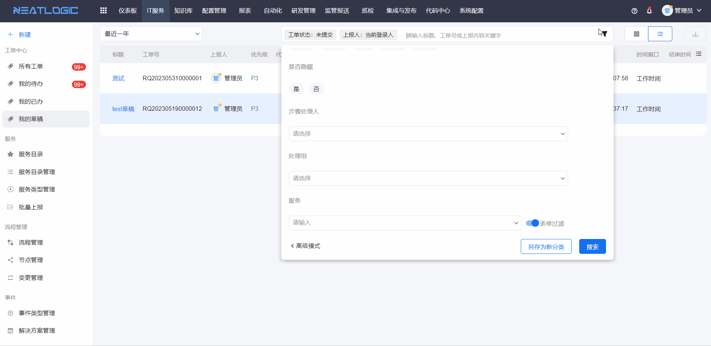

### 简单模式
简单模式下，搜索框支持输入关键字匹配，也支持通过工单属性过滤工单，还可以通过工单表单属性过滤工单。
1. 输入框关键字匹配 
   在搜索框输入关键字，支持标题、上报内容（即工单描述）的模糊搜索
   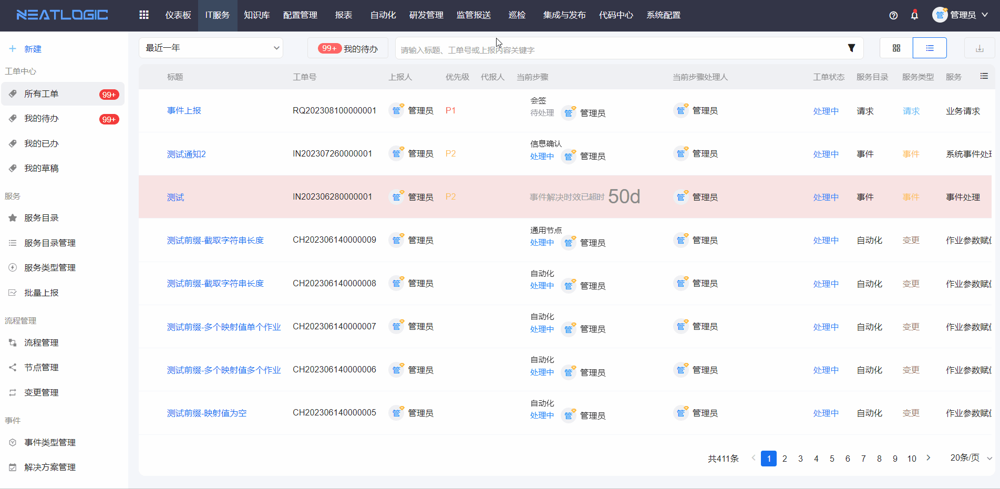
   在已知工单号或工单ID的情况下，支持输入精准搜索工单号和工单ID。
   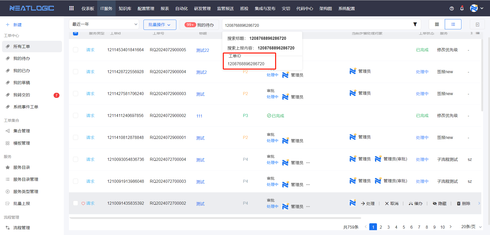

2. 工单属性过滤 
   工单属性有上报人、优先级、服务类型、工单状态等，在属性中选择搜索的选项，属性中的选项是并集关系，每个属性间的关系默认是交集关系，最终的搜索结果是满足所有属性条件的工单。
   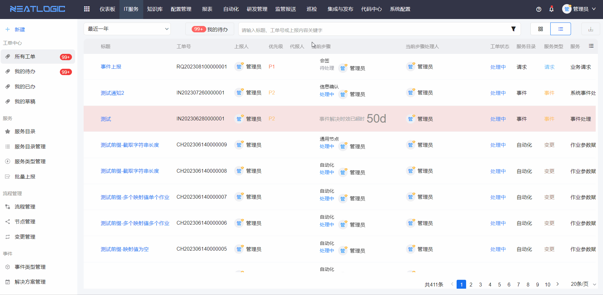

3. 服务过滤 
   
   通过服务过滤，服务支持多选，过滤出通过该服务上报的所有工单
   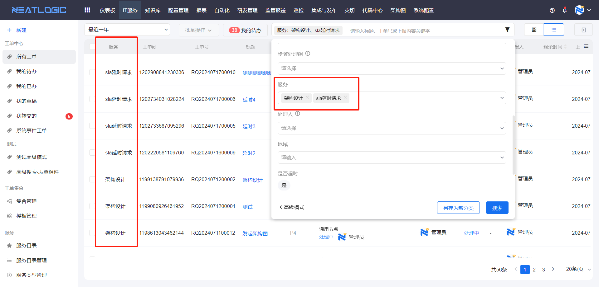
   “服务”单选时，可启用表单过滤，选择需要用于过滤的表单组件，然后在组件中填选过滤值并触发搜索即可。
   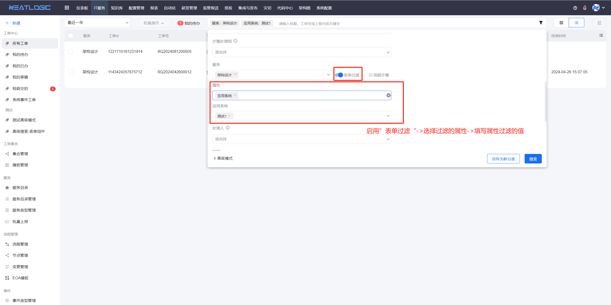
   “服务”单选时，可启用流程步骤过滤，这个需要与“步骤状态”条件组合搜索，过滤出工单当前步骤为过已选的“流程步骤”且满足过滤状态的工单。 
   若启用了“流程步骤”过滤，但是没有选择步骤状态过滤，仍然只会过滤出“服务”的所有工单。
   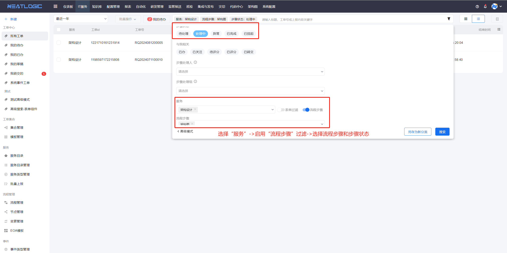

### 高级模式
高级模式是自由度比较高的搜索条件配置，通过添加配置组合条件实现，支持配置多个组件条件，组合条件之间的关系可以是交集也可以是并集，组合条件内可添加多个属性作为条件，条件见的关系也支持交集或并集。
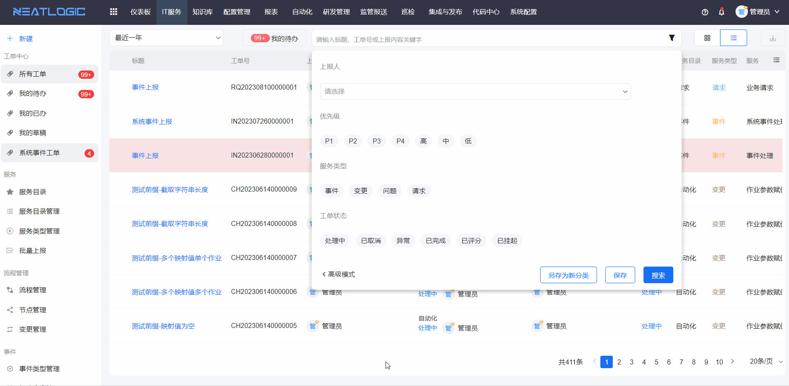

## 工单列表
工单列表的查看方式支持表格和卡片两种方式，列表模式下，可修改显示字段并调整字段顺序。工单列表还支持下载当前搜索结果中的所有工单数据。
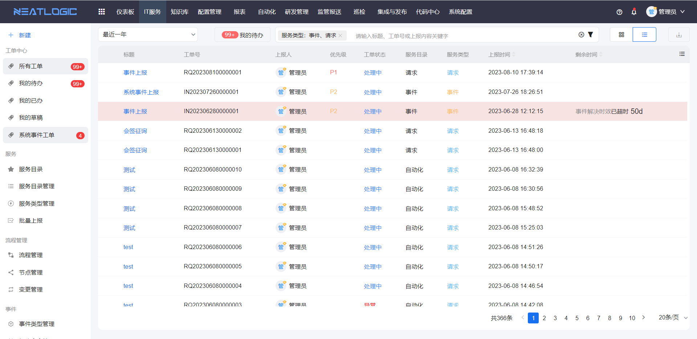
自动刷新：用户正在查看工单列表时，如果有其他用户发起新工单或处理工单，导致工单列表数据变更，工单列表默认自动更新。 

### 列表模式
修改显示字段和调整字段顺序，标题的字段支持设置是否启用换行。
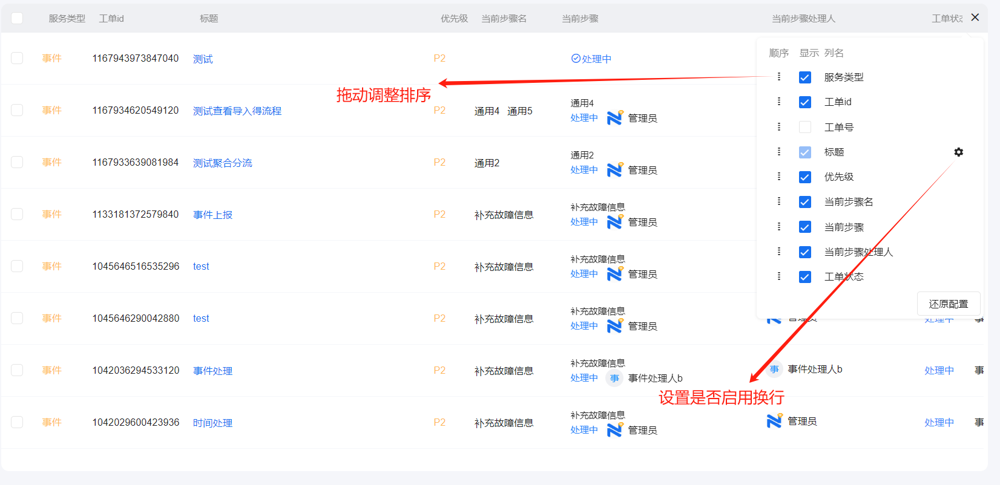
隐藏/显示、删除、取消、催办、关注工单
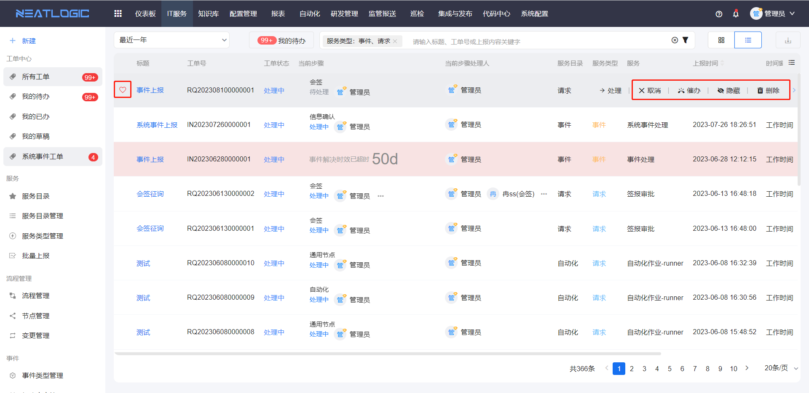
关于关注工单，整行聚焦工单时，左侧出现一个爱心图标，点击后即表示当前用户关注了该工单，用户可以通过“与我相关”的搜索条件过滤我关注的工单。

点击标题的说明： 
1. [系统参数](../../100.系统配置/5.基础服务/基础服务.md)“workcenter.processtask.newpage”可控制是否打开新页面跳转。若参数值为0时，直接刷新当前页面跳转；若参数值为1时，打开新页签跳转。
   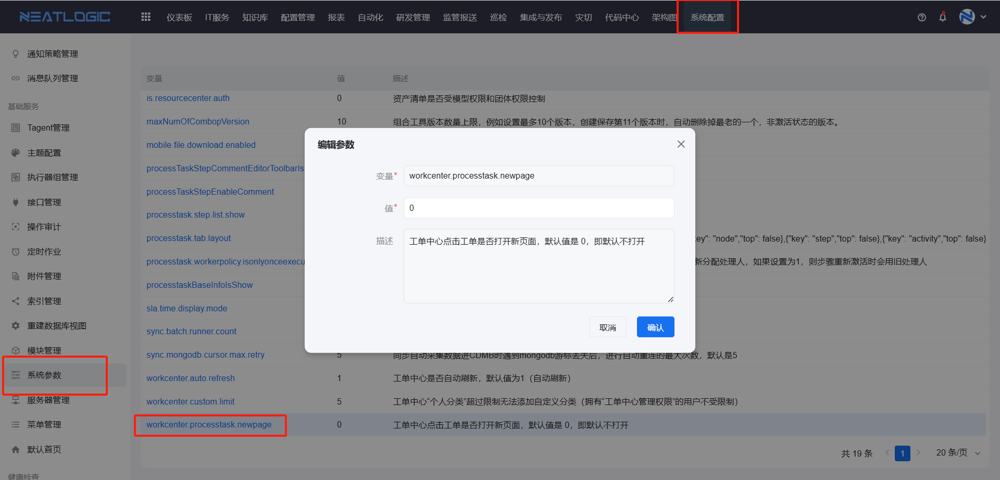
2. 登录人不是步骤处理人和待处理人，跳转到工单详情页面
3. 登录人是工单步骤处理人（已接单），跳转到工单处理页面
4. 登录人是工单步骤待处理人（未接单），跳转到工单处理页面，但步骤未开始处理
   
点击处理按钮的场景： 
1. 如登录人是工单步骤的处理人，直接跳转到工单处理页
2. 如登录人是工单步骤的待处理人，跳转到工单处理页，且待处理人自动接单开始处理
   
   处理工单操作详情参考 [工单处理](../工单处理/工单处理.md) 文档。
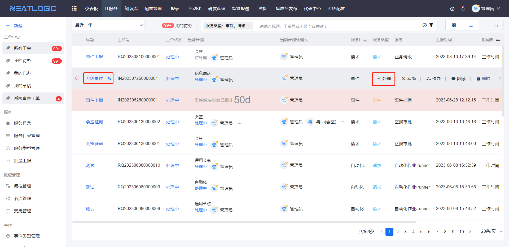

### 卡片模式
点击切换卡片模式的按钮即可
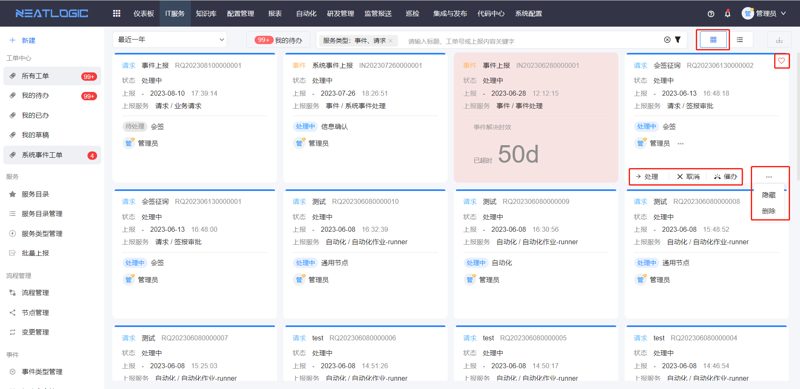

## 相关权限
工单中心相关的权限有IT服务基础权限、工单中心管理权限、工单中心-另存为新分类权限、工单中心-高级搜索权限、工单管理权限，权限详情参考系统配置-[权限管理](../../100.系统配置/1.用户和权限/权限管理.md)。
- IT服务基础权限：只有该权限的用户，只能查看管理员授权给当前用户的工单分类。
  
- 工单中心管理权限：有该权限的用户可对工单中心系统类型添加、修改、授权和删除，对出厂类型授权。
  
- 工单中心-另存为新分类权限：该权限控制另存为新分类操作。有这个权限的用户可以另存为新分类和保存个人分类的搜索条件，仅支持个人分类。
  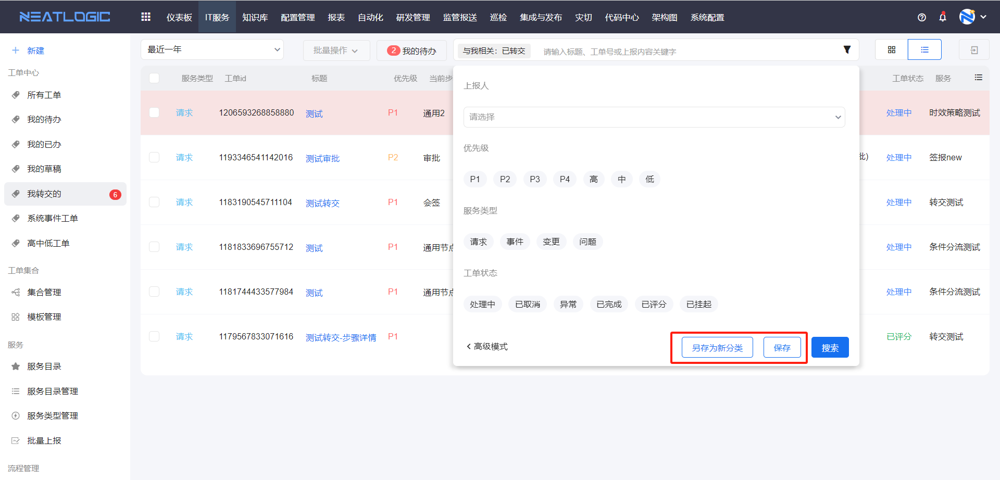
  **注意：通过该方式保存的新分类将不受固化条件限制，收回权限则通过该方式保存的个人分类都将隐藏。**

- 工单中心-高级搜索权限：使用这个权限的前提条件是有工单中心-另存为新分类权限，有该权限的用户才会开放工单中心高级搜索。
  
- 工单管理权限：有该权限的用户，可在工单列表中删除、隐藏/显示工单。