# 工单处理
工单处理是指处理人填写工单的信息并向后流转，直到工单处理完成。在工单处理页面，有工单维度的操作和节点维度的操作。 
工单维度的操作有：修改上报内容、催办、取消/恢复工单、转报、关联重复事件等。 
节点维度的操作有：开始、流转、撤回、回退、暂停、转交、表单、回复、子任务、评分等。

## 名词解释
### 工单状态

- 未提交：工单目前还没有提交，只能由上报人或代报人来提交。
- 处理中：工单目前有步骤未处理完成，只有处理人和工单干系人能进行处理。
- 异常：工单目前已经失败，无法正常处理。
- 已完成：工单已经处理完成。
- 已取消：工单已取消。
- 已评分：工单已处理完成并且完成评分。

### 步骤状态

- 待处理：当前步骤节点还没有开始处理。
- 处理中：当前处理步骤已开始处理，还未处理完成。
- 异常：当前步骤节点处理异常，例如条件分流节点没有匹配到任何流转规则
- 已完成：步骤已经处理完成
- 已挂起：步骤节点挂起，无法继续处理。例如撤回到上一步骤，当前步骤挂起。

### 变更步骤状态

- 待处理：变更步骤还未开始处理，此时待处理人可进行取消、开始和回复操作。
- 进行中：变更步骤正在处理中，还未完成，此时处理人可进行取消、开始和回复操作。
- 已完成：变更步骤已经处理完成，此时处理人可对步骤进行回复操作。
- 已取消，步骤直接取消，无法再进行操作。

## 工单展示

### 处理页和详情页
查看工单时，如果用户是当前步骤处理人，会跳转到处理页，若用户不是当前步骤处理人，则跳转到详情页。

详情页只能查看工单的基本信息、表单信息、步骤日志、时间线、上报历史。

处理页显示的信息有处理详情页信息外，还显示当前可执行的处理操作，包括流转、暂停、撤回、编辑表单、修改上报内容等。

### 工单信息
点击工单右侧的展开按钮，可以展开工单的信息，包括步骤信息、上报人和工单基本信息。 
步骤信息中可以找到当前步骤处理人、步骤的状态、步骤开始和激活的时间。
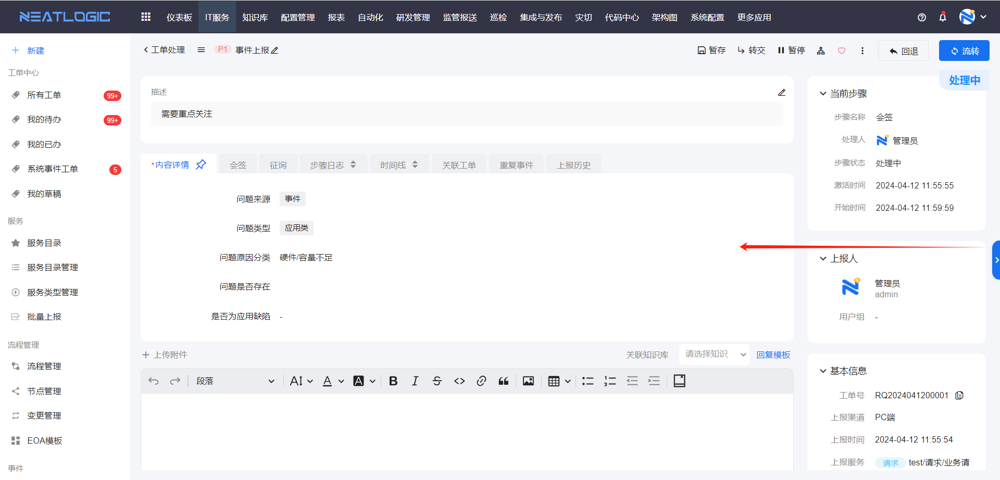

### 步骤时效
工单步骤引用的流程添加了[时效设置](../流程管理/流程管理.md)，并且工单步骤满足时效策略生效的条件，在工单标题右侧和步骤信息中会显示时效策略的剩余时间，如果时效策略关联优先级，剩余时间还可以随优先级改变而变化。
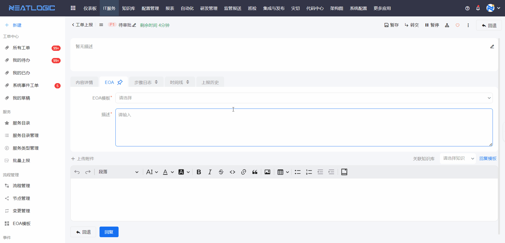
若超时未处理，失效策略会变红并提示已超时的时间。

### 任务列表
任务列表在工单左侧，是一个默认收起的列表，列表中显示处理人是登录人的工单的待处理步骤。
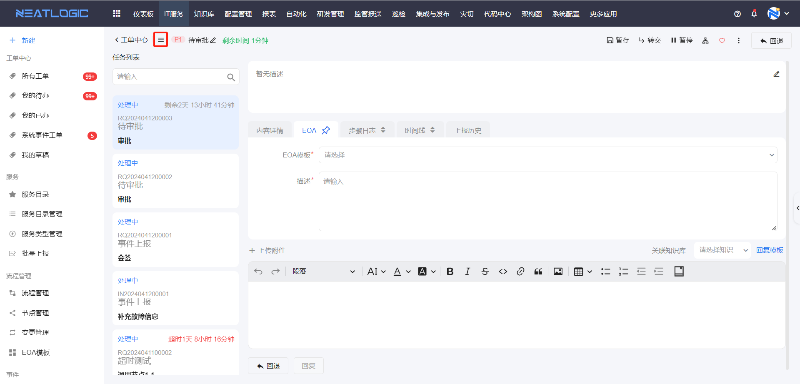

### 内容详情
内容详情tab中展示的是表单内容，详情页显示的是关联表单的主场景，处理页显示的是节点关联的表单场景。
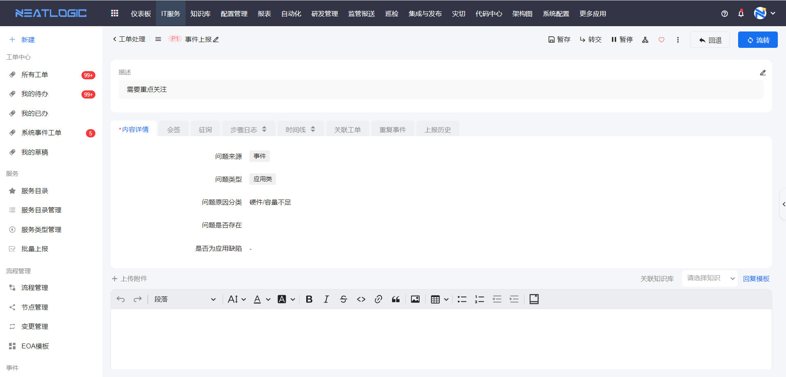

### 步骤日志
步骤日志展示了步骤的信息，包括步骤处理人、时间、回复内容、子任务等。
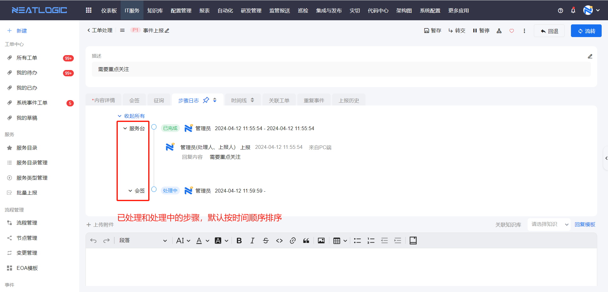

### 时间线
时间线tab中展示了所有工单操作的操作日志，默认按操作执行的时间倒序排序。
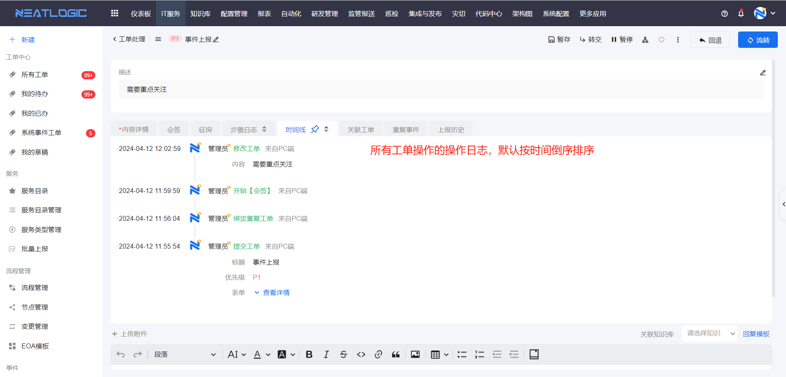

### 上报历史
上报历史tab的列表中统计了上报人是当前登录用户的所有工单。

### 附件列表

### 关联工单

### 查看流程图
查看流程图 
可以看到整个流程图，并且通过连线的状态看到已完成的节点，流程图弹窗的标题点击可跳转到流程编辑页面。

下面是连线和节点各种颜色和状态的对应关系表
<table style="width:80%">
<thead>
    <tr>
        <td></td>
        <td>节点状态</td>
        <td>连线</td>
    </tr>
</thead>
<tbody>
    <tr>
        <td>绿色</td>
        <td>已完成</td>
        <td>已经过的路径</td>
    </tr>
    <tr>
        <td>红色</td>
        <td>-</td>
        <td>不会经过的路径</td>
    </tr>
    <tr>
        <td>蓝色</td>
        <td>处理中</td>
        <td>-</td>
    </tr>
    <tr>
        <td>灰色</td>
        <td>未激活</td>
        <td>可能经过的路径</td>
    </tr>
</tbody>
</table>

## 工单操作
### 工单维度的操作
- 修改上报内容：修改工单标题、优先级、上报描述、标签、关注人等内容，有修改上报权限的用户才能操作，权限详情参考[流程管理](../流程管理/流程管理.md)-流程设置。
  

- 催办：催办功能可结合通知功能使用，[流程设置](../流程管理/流程管理.md)关联的通知模板中有催办的通知配置，发起催办同时可通知指定用户。有催办权限的用户才能操作，权限详情参考[流程管理](../流程管理/流程管理.md)-流程设置。
  

- 取消/恢复:取消或恢复工单，取消工单成功后，工单状态变成已取消。有取消权限的用户才能操作，权限详情参考[流程管理](../流程管理/流程管理.md)-流程设置。
  

- 删除工单：这个操作在工单中心的工单列表中，详情参考[工单管理](../工单中心/工单中心.md)-工单列表。
  
- 关注工单：工单页面右上角有个爱心图标，点击后即表示当前用户关注了该工单，这个功能可以帮助用户在工单中心可以快速过滤关注的工单。

- 转报：事件处理时引发另一个事件，这种场景可以采用转报的方式解决，通过快速转报入口发起新的事件单。 
  转报权限：当前工单所在服务配置中启用转报设置，详情参考[服务目录管理](../服务/服务目录管理.md)。
  
  另外，允许转报的工单会显示关联工单的tab，也支持主动关联可以转报的服务下的任意工单，转报的工单也会显示再关联工单列表中。
  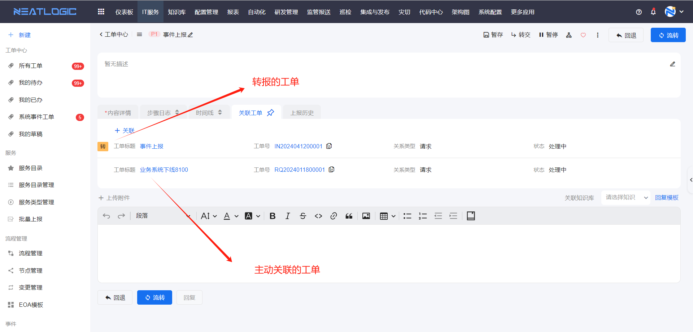

- 关联重复事件：存在一个已上报但和当前工单重复的工单，再关联重复事件列表中，添加并关联重复的功能，被关联的工单会自动关闭。
  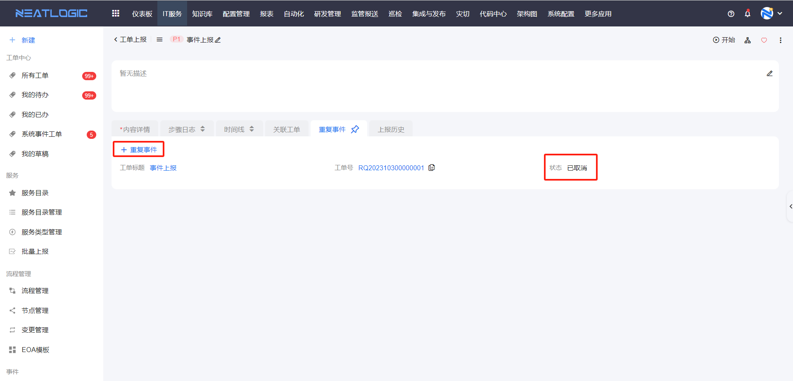
  关联重复事件功能是否启用在 流程管理-[流程设置](../流程管理/流程管理.md) 中控制。

### 工单节点维度的操作
- 开始：工单节点的状态为待处理时，显示开始操作，开始后才能处理工单，只有待处理人有操作权限。
  

- 流转：流转到下一步，只有处理人有操作权限。
  

- 撤回：撤回到上一个处理节点，这个操作只有上一个节点的处理人有操作权限
  

- 回退：回退到前置步骤，有回退线的节点才显示这个操作，只有处理人有操作权限。 
  如果当前节点有多条回退线，只有激活过的回退线才能回退。
  

- 转交：把当前步骤转交给其他用户处理，有节点转交权限的用户才能执行转交操作，支持转交给用户、分组或角色，权限详情参考流程管理-[节点设置](../流程管理/流程管理.md)-权限设置。
  

- 子任务：处理步骤时，需要多人协助处理的情况，可通过发起子任务来实现。子任务完成的策略有两种，所有人完成和任意一人完成，这个在子任务策略管理页面完成配置。节点配置了子任务策略才现实子任务窗口，详情参考[流程管理](../流程管理/流程管理.md)的节点设置。
  

- 表单：工单内容详情回显当前节点引用的[表单场景](../流程管理/流程管理.md)。只有步骤处理人可编辑表单组件（场景设置了只读或禁用的组件除外）的数据，并暂存数据，工单流转后表单修改的数据才会保存到工单。
  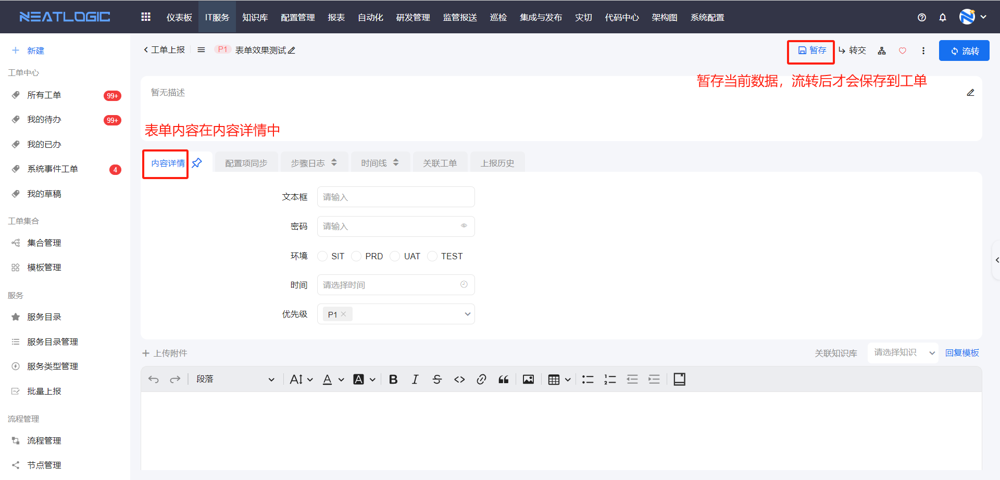
  
- 回复：回复的效果如图所示，回复有必填和非必填两种，取决于流程的[节点设置](../流程管理/流程管理.md)是否启用回复必填。
  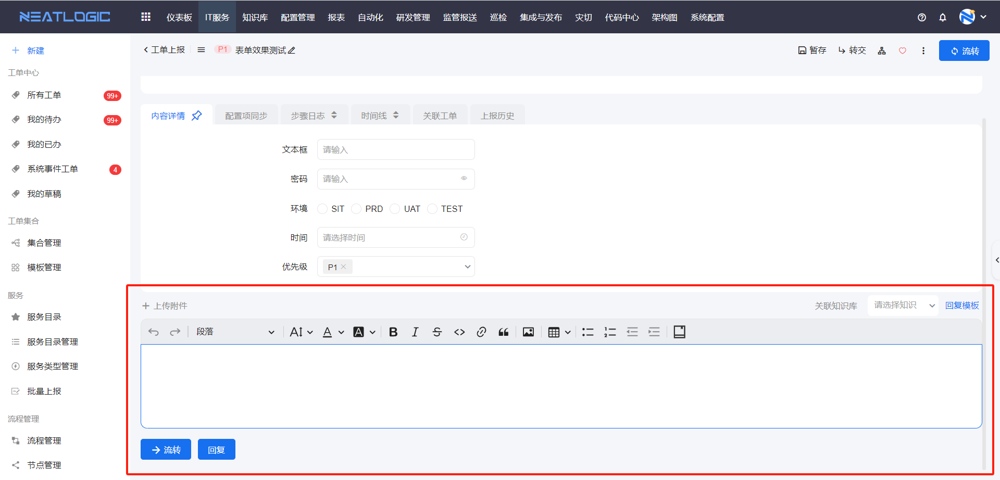
  附件：回复支持上传附件，点击回复按钮，附件保存到当前步骤。上传的附件可以在当前步骤的步骤日志，或者在附件列表中查看。 
  关联知识库：支持输入关键字，匹配内容包含关键字的[知识库](../../98.知识库/新建知识文档.md)文档。 
  回复模板：展开回复模板列表，选择回复模板后，回复框中自动填充回复模板的内容。每个用户可用的回复模板包括个人模板和被授权使用的系统模板，详情参考[回复模板管理](../其他配置管理/配置管理.md)。
  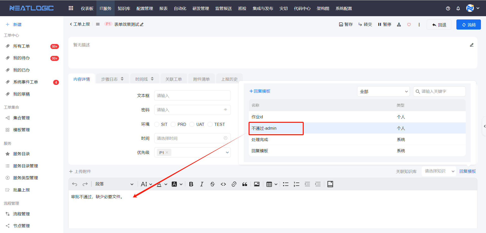
  **说明：** 如果不需要使用回复操作，可以在 系统配置-配置信息管理 中禁用，把变量 "processTaskStepCommentEditorToolbarIsShow" 的值改成0即可。
  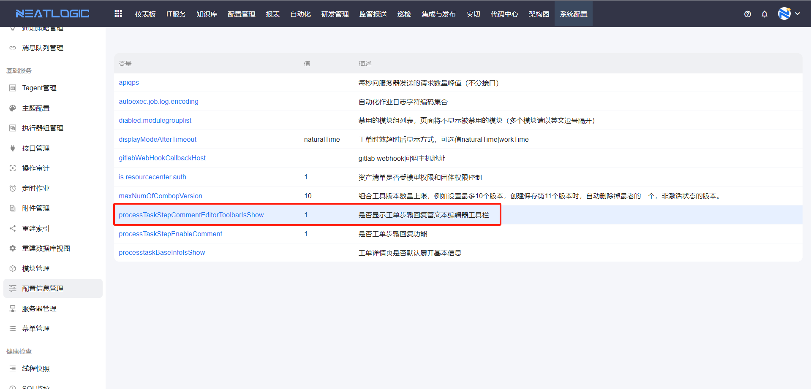
  
- 评分：工单关联的流程中，启用了评分设置，在工单流转到已完成的状态时，可以进行评分操作，评分的维度与评分设置的模板一致，详情参考 [流程管理](../流程管理/流程管理.md)-评分设置。
  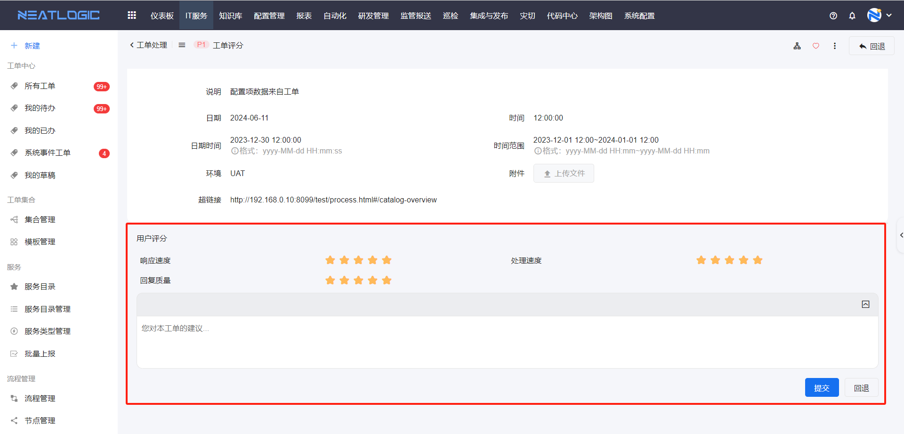
  提交：填写评分维度和内容，点击提交按钮，评分操作完成，此时工单状态变成已评分。 
  回退：若结束节点有连接到前置节点的回退线，未完成评分前可执行回退操作。
  
- 审批功能详情参考[高级场景](工单处理-高级场景.md)

- 子流程功能详情参考[高级场景](工单处理-高级场景.md)