# 工单处理
工单处理是指处理人对工单进行操作处理。在工单处理页面，有工单维度的操作和节点维度的操作。<br>
工单维度的操作有：修改上报内容、催办、取消/恢复工单、删除、关注、转报、关联重复事件和编辑表单。<br>
节点维度的操作有：开始、流转、撤回、回退、暂停、转交、表单、回复、子任务、评分等。

**注意：** 流程和服务的配置变更后，只对新发起的工单生效，历史工单的配置不会更新。
## 1. 名词解释
### 1.1. 工单成员
- 上报人：上报工单的用户。
- 代报人：代替其他用户上报工单的用户。在提交工单时，上报人非当前登录人的情况下，当前登录人即为代报人。
  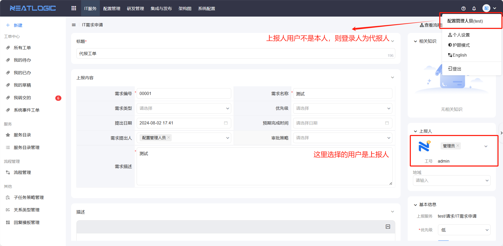
  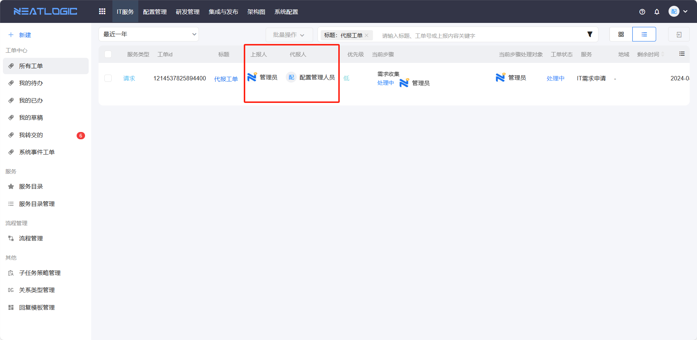
- 处理人：可以进行工单步骤的流转和回退操作的用户。
- 待处理人：工单步骤已激活，分配给分组或角色时，或者同时分配给了多个用户，他们需要执行“开始”操作完成接单，才能成为步骤处理人，这些可以接单的用户就是待处理人。
- 协助处理人：除了步骤处理人以外，工单步骤还需要其他用户参与活动才能继续流转，这些参与活动的用户即为协助处理人，包括子任务的处理人和审批链的审批人。
  
- 处理人（代）：用户-[个人设置](../../100.系统配置/1.用户和权限/个人设置.md)支持任务授权，可将处理人或待处理人是自己的工单授权给指定的人代替自己处理，被指定的用户代替处理后，该用户成为代处理人。
- 关注人：关注工单的用户。
- 工单干系人：用户不是步骤处理人，但是需要参与步骤的处理，即为工单干系人，比如审批步骤的审批人、子任务处理人。

### 1.2. 工单状态

- 未提交：工单目前还没有提交，只能由上报人或代报人来提交。
- 处理中：工单目前有步骤未处理完成，只有处理人和工单干系人能进行处理。
- 异常：工单目前已经失败，无法正常处理。
- 已完成：工单已经处理完成。
- 已取消：工单已取消。
- 已评分：工单已处理完成并且完成评分。

### 1.3. 步骤状态
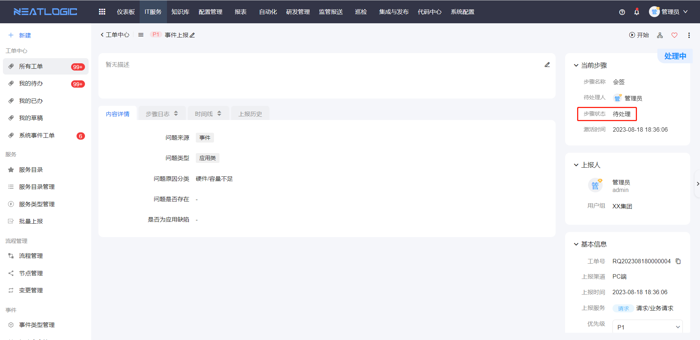
- 待处理：当前步骤节点还没有开始处理。
- 处理中：当前处理步骤已开始处理，还未处理完成。
- 异常：当前步骤节点处理异常，例如条件分流节点没有匹配到任何流转规则
- 已完成：步骤已经处理完成
- 已挂起：步骤节点挂起，无法继续处理。例如撤回到上一步骤，当前步骤挂起。

### 1.4. 变更步骤状态
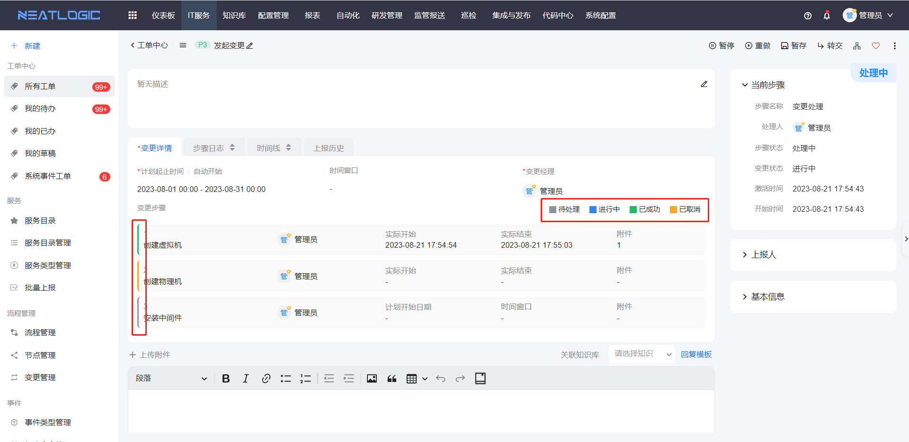
- 待处理：变更步骤还未开始处理，此时待处理人可进行取消、开始和回复操作。
- 进行中：变更步骤正在处理中，还未完成，此时处理人可进行取消、开始和回复操作。
- 已完成：变更步骤已经处理完成，此时处理人可对步骤进行回复操作。
- 已取消，步骤直接取消，无法再进行操作。

## 2. 工单展示
**查看工单权限说明：**
1. 工单处理人和工单干系人查看工单，跳转到**工单处理页**。
2. 非工单处理人且非工单干系人，但有工单所在 **服务** 及其 **级联目录** 的查看权限的用户查看工单，跳转到**工单详情页**。
3. 非工单处理人且非工单干系人，也无工单所在 **服务** 或其 **级联目录** 的查看权限的用户查看工单，无法查看工单内容并提示用户缺少查看工单的权限。

**工单详情tab排序说明：**

工单详情页面tab有内容详情、节点信息、步骤日志、时间线、关联工单、重复事件、附件清单和上报历史。这些tab的顺序受[系统参数](../../100.系统配置/5.基础服务/基础服务.md)“processtask.tab.layout”控制，当参数值为空即“{}”时，tab按照系统的默认排序；当参数值为自定义的json，则按照自定义的顺序展示；若参数值只写了部分tab，对应的tab会按照参数值回显排序以及是否置顶，剩下的tab则按照系统默认设置显示。

参数值示例:
```
{"layoutList": 
    [
        {"key": "report","top": false},
        {"key": "node","top": false},
        {"key": "step","top": false},
        {"key": "activity","top": false},
        {"key": "relevance","top": false},
        {"key": "markrepeat","top": false},
        {"key": "file","top": false},
        {"key": "reportingHistory","top": false}
    ]
}

```
top的值控制tab是否置顶，“true”表示置顶，“false”表示不置顶。<br>
key的值与tab的对应关系如下图所示。
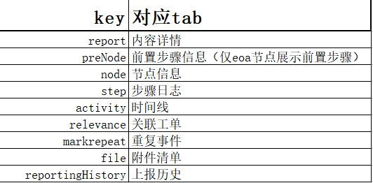


### 2.1. 处理页和详情页
详情页只能查看工单的基本信息和一些tab窗口，tab包括内容详情（表单信息）、节点信息（如图的电子签报）步骤日志、时间线、上报历史。
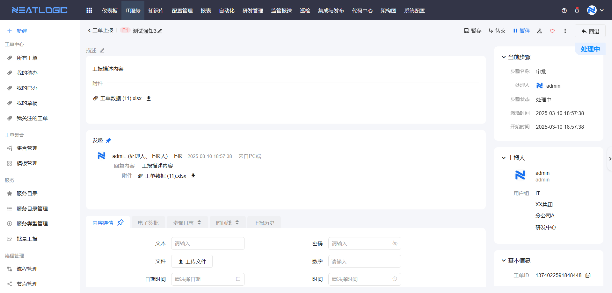
处理页除了详情信息外，还显示当前可执行的处理操作，包括流转、回退、转交、暂停、撤回、转报、编辑表单、修改上报内容等。
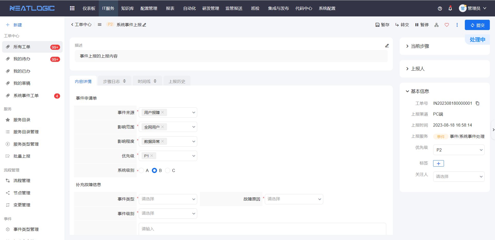

### 2.2. 工单信息
点击工单右侧的展开按钮，可以展开工单的信息，包括步骤信息、上报人和工单基本信息。<br>
步骤信息中可以找到当前步骤处理人、步骤的状态、步骤开始和激活的时间。
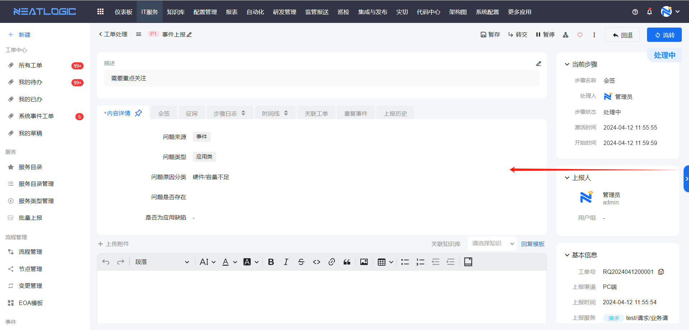

### 2.3. 步骤时效
步骤时效是一个用来提示处理人当前步骤剩余处理时间的倒计时提示功能。


#### 2.3.1. 时效策略相关配置
1、工单引用的流程配置了[时效策略](../流程管理/流程管理.md)，待处理的步骤被时效策略关联

2、发起工单的服务配置了有效服务窗口（即[服务窗口](../../100.系统配置/5.基础服务/服务窗口管理.md)有时间配置和排班）
 
若满足条件1，步骤激活时工单满足时效策略生效的条件，时效策略当即生效，否则工单不显示时效策略。<br>
同时满足条件1和2，则显示正常的倒计时。若满足条件1，但是不满足条件2，失效策略直接显示超时。

#### 2.3.2. 时效关联优先级
当时效策略关联了优先级时，可以给不同优先级设置不同时长，剩余时间可随优先级变化而变化。


#### 2.3.3. 剩余时间计算
首先，流程时效策略的“时效”是指在服务窗口时间（可以理解为工作时间）内剩余的可处理时间，当前剩余的服务窗口时间比“时效”的时长短，则截止时间会跨到下一天的服务窗口时间。

例如：
服务时间窗口是周一到周五的“8:00-12:00”和“14:00-17:00”，步骤激活的时间是周五的16:30，时效策略的“时效时长”是60分钟，当天可处理的服务时间只剩下30分钟。<br>
这个步骤的截止时间就会跨到下一个周一早上的8:30。

剩余时间的展示方式有两种，分别是自然日和工作日，由[系统参数](../../100.系统配置/5.基础服务/基础服务.md)“sla.time.display.mode”控制。
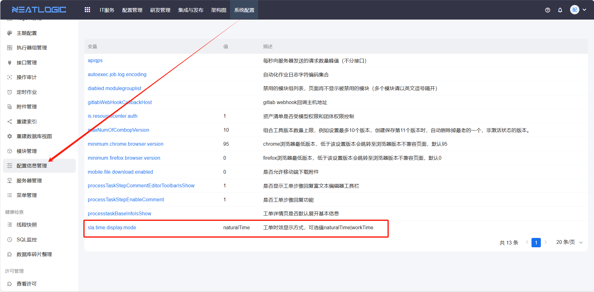

1. 自然日（naturalTime）：剩余时间等于截止时间减去当前时间，在步骤激活开始就一直倒数，直到超时。
  


1. 工作日（workTime）：剩余时间按照时效策略的“时效”时长倒数计算，若当前时间不在工作时间内，剩余时间会静止，直到下一个工作时间恢复倒数，直到超时。
  
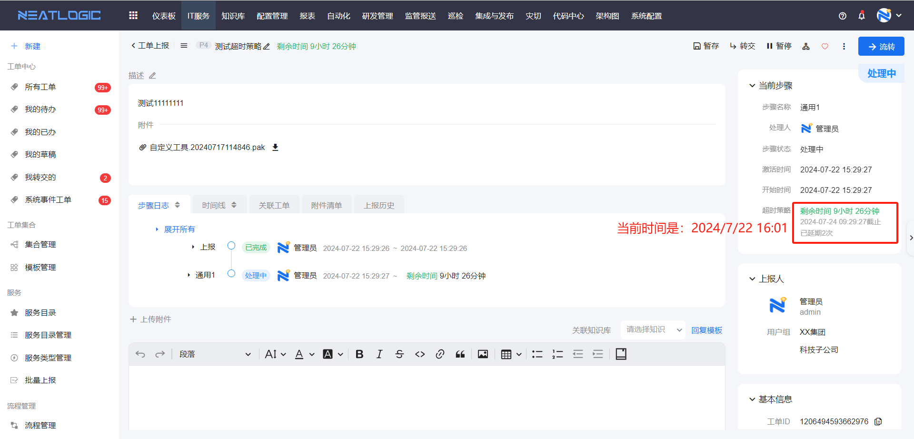
   
若超时未处理，失效策略会变红并提示已超时的时间。
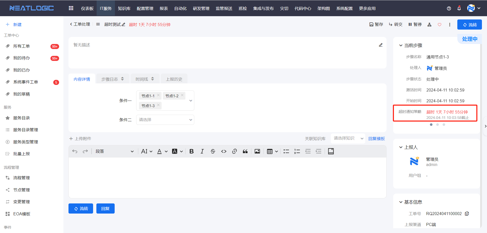

### 2.4. 任务列表
任务列表在工单左侧，是一个默认收起的列表，列表中显示处理人是登录人的工单的待处理步骤。
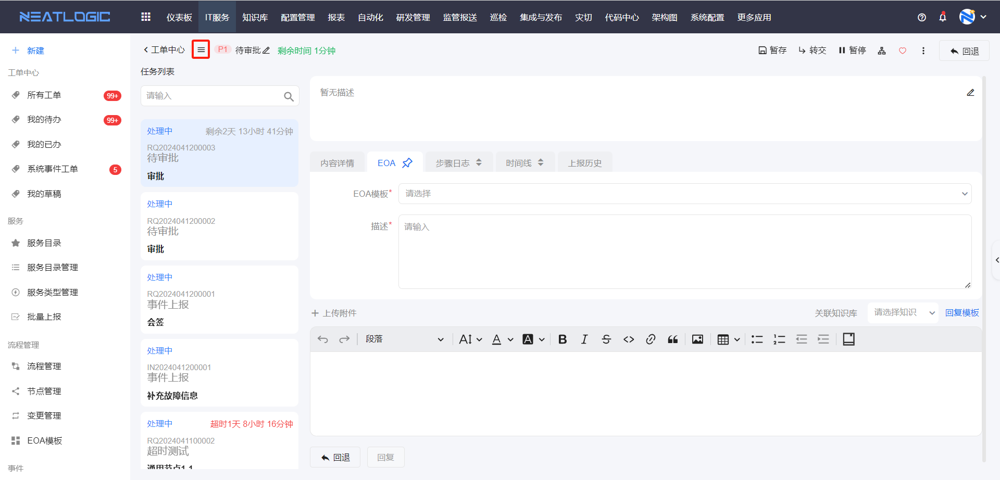

### 2.5. 内容详情
内容详情tab中展示的是表单内容，详情页显示的是关联表单的主场景，处理页显示的是节点关联的表单场景。
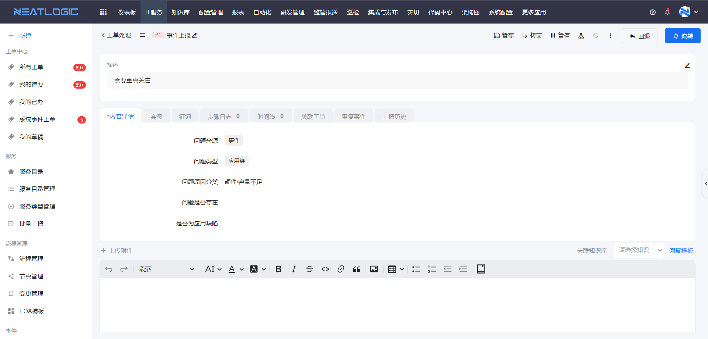

### 2.5. 步骤日志
步骤日志展示了步骤的信息，包括步骤处理人、时间、回复内容、子任务等。

[系统参数](../../100.系统配置/5.基础服务/基础服务.md)“processtask.step.list.show”控制步骤日志是否默认展开，参数值为1时，默认展开，参数值为0，默认收起。
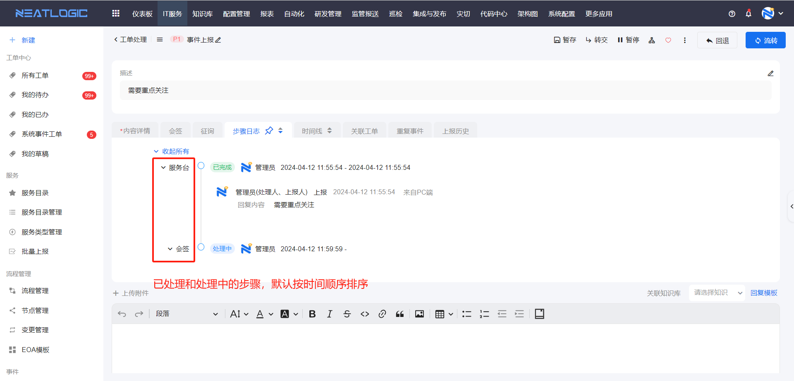

### 2.6. 时间线
时间线tab中展示了所有工单操作的操作日志，默认按操作执行的时间倒序排序。


### 2.7. 上报历史
上报历史tab的列表中统计了当前查看的工单上报人用户上报的所有工单，比如当前工单上报人是admin，上报历史中会回显admin上报的所有工单。
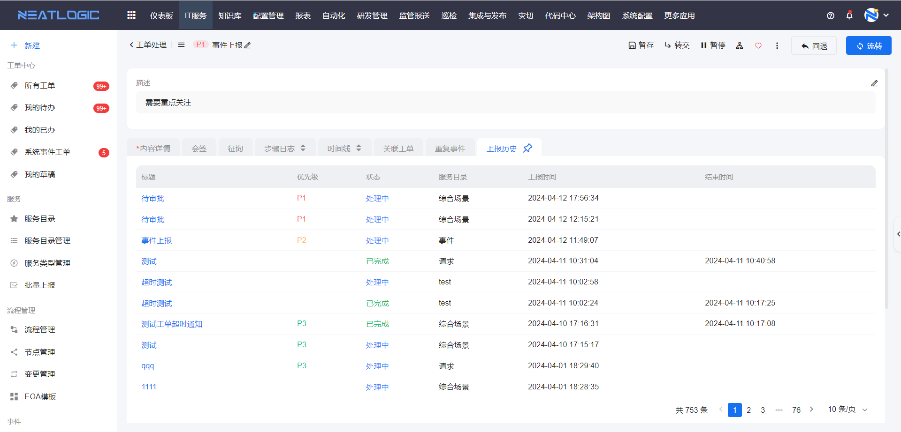

### 2.8. 附件清单
附件列表中会显示上传到当前工单的所有附件，包括上报内容、回复、子任务、审批步骤等上传的附件。
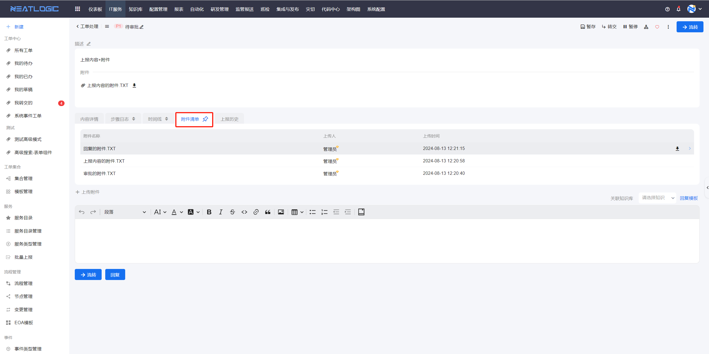

### 2.9. 关联工单
关联工单有两种情况
1. 主动关联
   
   允许转报的服务发起的工单，通过转报操作发起工单后，两者互为关联工单。另外允许转报的工单也支持直接选择可转报的服务发起的工单作为关联工单。
   

2. 被动关联

    通过转报发起的工单，该工单所在服务不允许转报，其有且只有一个关联工单，即发起转报的原工单。
    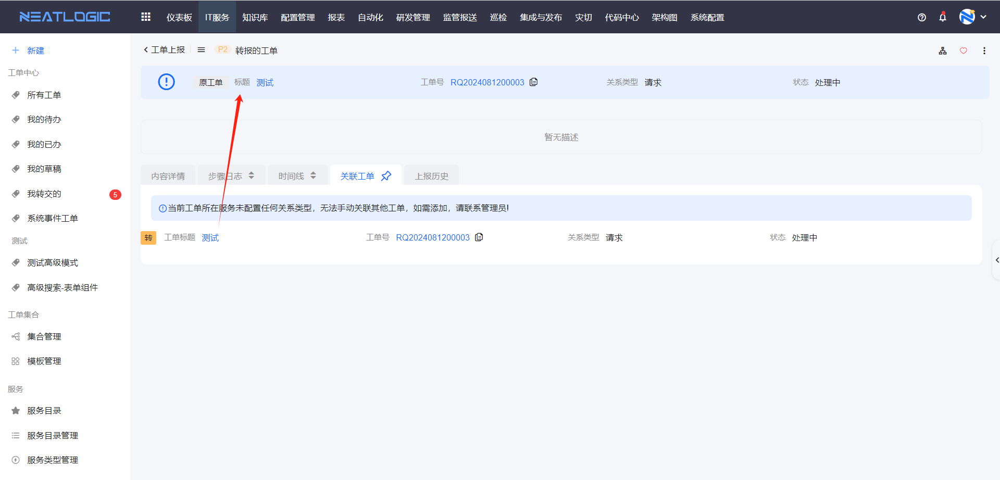
    
### 2.10. 查看流程图

工单支持看到整个流程图，并且通过连线的状态看到已完成的节点，鼠标聚焦节点时可以查看节点信息。

在弹窗中，点击编辑按钮可跳转到流程编辑页面（最新版流程配置），点击快照图标可以打开新页签查看当前工单的流程配置。
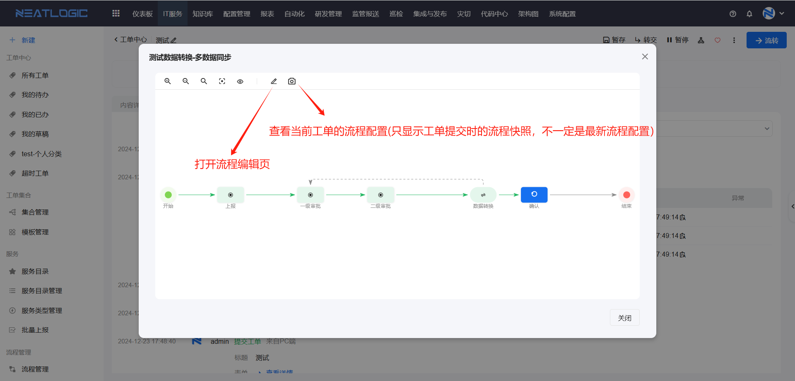

连线、节点的颜色与状态的说明表
<table style="width:80%">
<thead>
    <tr>
        <td>颜色</td>
        <td>节点状态</td>
        <td>连线状态</td>
    </tr>
</thead>
<tbody>
    <tr>
        <td>绿色</td>
        <td>已完成</td>
        <td>已经过的路径</td>
    </tr>
    <tr>
        <td>红色</td>
        <td>-</td>
        <td>不会经过的路径</td>
    </tr>
    <tr>
        <td>蓝色</td>
        <td>处理中</td>
        <td>-</td>
    </tr>
    <tr>
        <td>灰色</td>
        <td>未激活</td>
        <td>可能经过的路径</td>
    </tr>
</tbody>
</table>

## 3. 工单操作
### 3.1. 工单维度的操作
#### 3.1.1. 修改上报内容
修改工单标题、优先级、上报描述、标签、关注人等内容，有修改上报权限的用户才能操作，权限详情参考[流程管理](../流程管理/流程管理.md)-流程设置。

工单还支持通过表单组件联动修改优先级，详情参考文档：[IT服务-场景](../IT服务-场景.md)-场景4。

#### 3.1.2. 催办
催办功能可结合通知功能使用，[流程设置](../流程管理/流程管理.md)关联的通知模板中有催办的通知配置，发起催办同时可通知指定用户。有催办权限的用户才能操作，权限详情参考[流程管理](../流程管理/流程管理.md)-流程设置。


#### 3.1.3. 取消/恢复
取消或恢复工单，取消工单成功后，工单状态变成已取消。有取消权限的用户才能操作，权限详情参考[流程管理](../流程管理/流程管理.md)-流程设置。还在处理中或者异常的工单支持取消。


#### 3.1.4. 删除工单
这个操作在工单中心的工单列表中，详情参考[工单管理](../工单中心/工单中心.md)-工单列表。
  
#### 3.1.5. 关注工单
工单页面右上角有个爱心图标，点击后即表示当前用户关注了该工单，这个功能可以帮助用户在工单中心可以快速过滤关注的工单。

#### 3.1.6. 转报
事件处理时引发另一个事件，这种场景可以采用转报的方式解决，通过快速转报入口发起新的事件单。
  
转报权限：当前工单所在服务配置中启用转报设置，详情参考[服务目录管理](../服务/服务目录管理.md)。
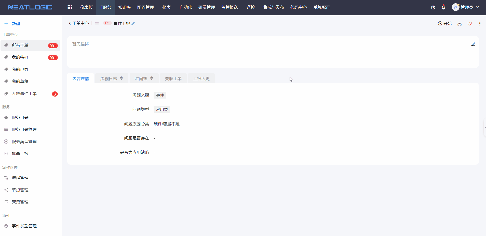
另外，允许转报的工单会显示关联工单的tab，也支持主动关联可以转报的服务下的任意工单，转报的工单也会显示再关联工单列表中。


#### 3.1.7.批量关闭重复事件
这个功能可以批量关闭重复工单，仅限同一个服务上报的工单。

在关联重复事件列表中，添加并关联重复的功能。

多个工单关联为重复工单后，关联到一起的工单的重复事件列表会显示其他所有重复工单，当其中任意一个工单处理完成后，剩下的重复工单自动转为已取消状态。
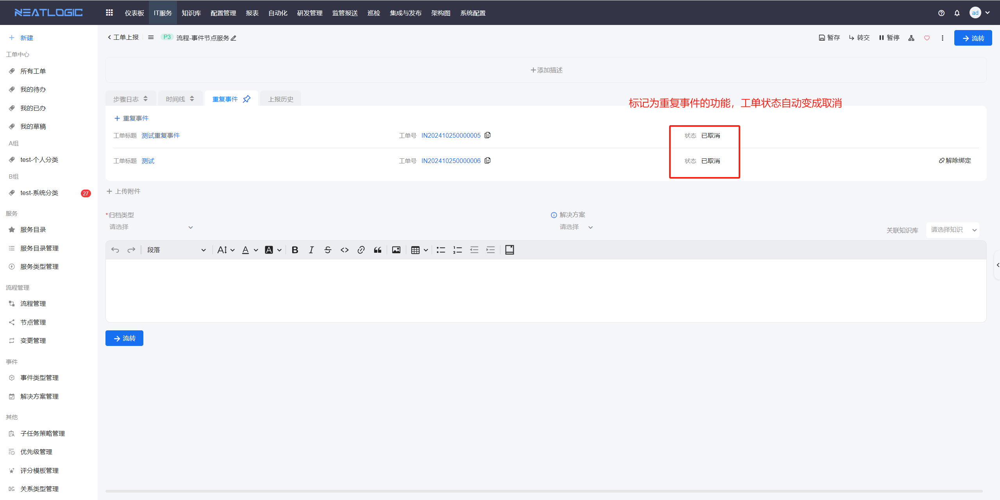
关联重复事件功能是否启用在 流程管理-[流程设置](../流程管理/流程管理.md) 中控制。

#### 3.1.8. 编辑表单
随时编辑表单内容的功能，无论当前工单处于什么状态，编辑时回显的是表单主场景内容，保存时不校验表单必填项。关联表单的工单才会有这个功能，且有[修改上报内容权限](../流程管理/流程管理.md)或[权限管理](../../100.系统配置/1.用户和权限/用户和权限.md)-IT服务-工单管理权限的用户才能执行操作。
  
  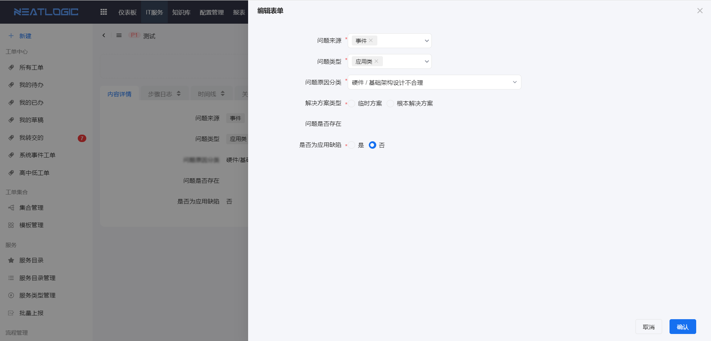

#### 3.1.9. 工单转知识
工单的状态为已完成或已评分时，可以将工单的内容转成知识库文档，包括工单上报内容、表单、回复等。<br>
满足以下条件的用户都才能发起工单转知识操作：
1. 用户有知识库基础权限。
2. 用户是知识圈的成员。  
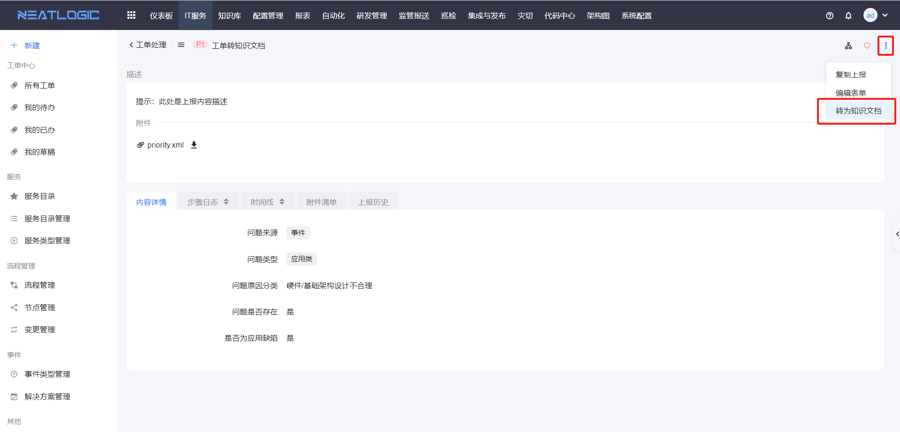
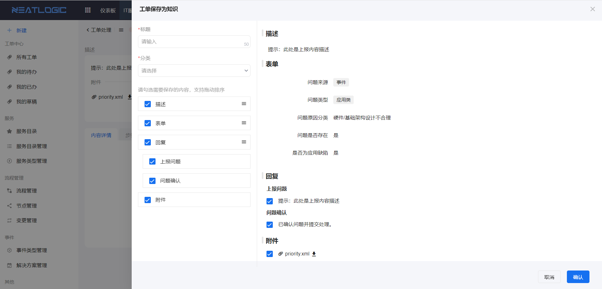

### 3.2. 工单节点维度的操作
### 3.2.1. 开始
工单节点的状态为待处理时，显示开始操作，开始后才能处理工单，只有待处理人有操作权限。


### 3.2.2. 流转
流转到下一步，只有处理人有操作权限。


### 3.2.3. 指派
工单节点的处理人分派策略有五种，分别是 由前置步骤处理人指定、复制前置步骤处理人、表单值、分派器、自定义，配置详情参考文档[流程管理](../流程管理/流程管理.md)。

由前置步骤处理人指定效果如图

若分派策略匹配不到用户，步骤会自动分派给异常处理人。
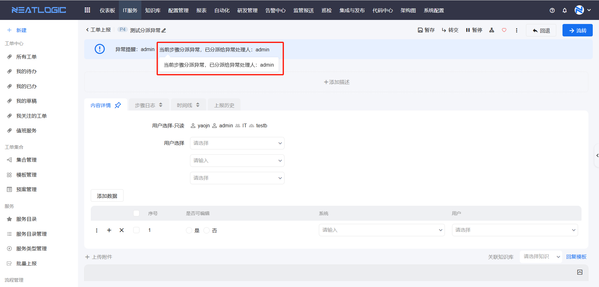

### 3.2.3. 撤回
撤回到上一个处理节点，这个操作只有上一个节点的处理人有操作权限


### 3.2.4. 回退
回退到前置步骤，有回退线的节点才显示这个操作，只有处理人有操作权限。<br>
如果当前节点有多条回退线，只有激活过的回退线才能回退。

回退到前置步骤后，前置步骤重新激活并分配处理人，根据[系统参数](../../100.系统配置/5.基础服务/基础服务.md)“processtask.workerpolicy.isonlyonceexecute”判断是重新执行分派策略或分配给步骤原处理人（步骤转交过，处理人可能不是分派策略的分派对象）。

### 3.2.5. 转交
转交操作是把当前步骤转交给其他用户处理，有节点转交权限的用户才能执行转交操作，支持转交给用户、分组或角色，权限详情参考流程管理-[节点设置](../流程管理/流程管理.md)-权限设置。
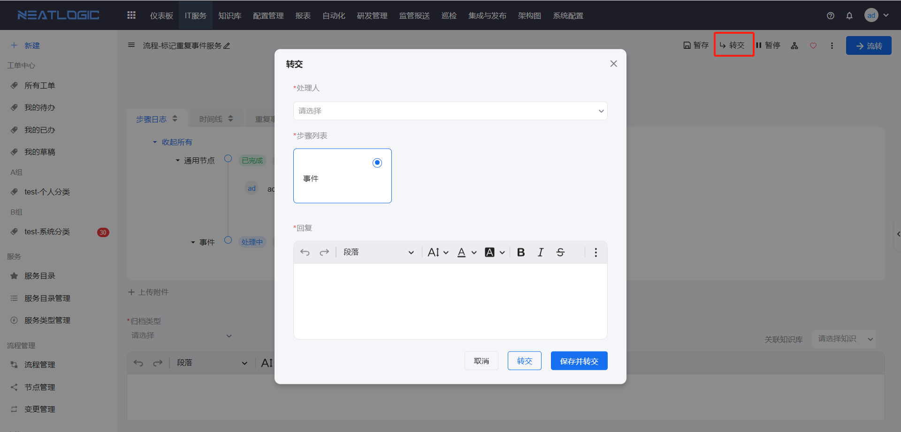
转交时可进行 **保存并转交** 或 **转交**。
- 保存并转交：保存当前表单和回复的内容，然后执行转交操作。
- 转交：不保存当前表单和回复的内容，直接执行转交操作。

### 3.2.6. 子任务
处理步骤时，需要多人协助处理的情况，可通过发起子任务来实现。子任务完成的策略有两种，所有人完成和任意一人完成，这个在子任务策略管理页面完成配置。节点配置了子任务策略才现实子任务窗口，详情参考[流程管理](../流程管理/流程管理.md)的节点设置。
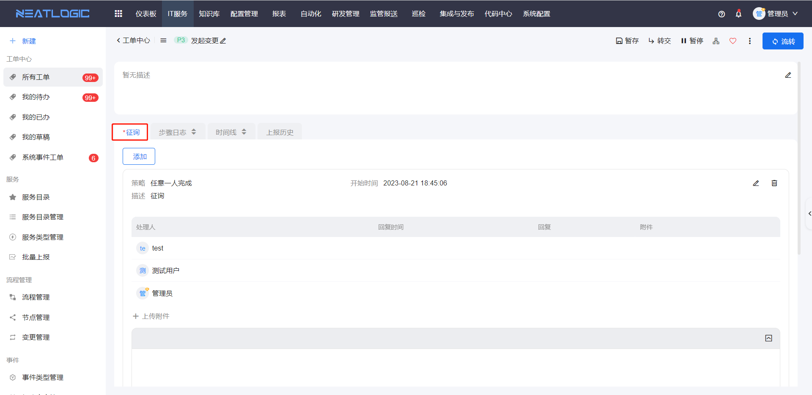

### 3.2.7. 表单
工单内容详情回显当前节点引用的[表单场景](../流程管理/流程管理.md)。只有步骤处理人可编辑表单组件（场景设置了只读或禁用的组件除外）的数据，并暂存数据，工单流转后表单修改的数据才会保存到工单。

  
### 3.2.8. 回复

1. 回复必填
   
    回复的效果如图所示，回复有必填和非必填两种，取决于流程的[节点设置](../流程管理/流程管理.md)是否启用回复必填。
    

2. 附件
   
   回复支持上传附件，点击回复按钮，附件保存到当前步骤。上传的附件可以在当前步骤的步骤日志，或者在附件列表中查看。<br>

3. 关联知识库
   
   支持输入关键字，匹配内容包含关键字的[知识库](../../98.知识库/新建知识文档.md)文档。

4. 回复模板
   
   展开回复模板列表，选择回复模板后，回复框中自动填充回复模板的内容。每个用户可用的回复模板包括个人模板和被授权使用的系统模板，详情参考[回复模板管理](../其他配置管理/配置管理.md)。
    

5. 回复功能的系统配置
   
   启用步骤直接提交回复操作，[系统参数](../../100.系统配置/5.基础服务/基础服务.md)"processTaskStepEnableComment" 可控制是否工单步骤回复功能，若参数值为1，则启用步骤回复功能；
   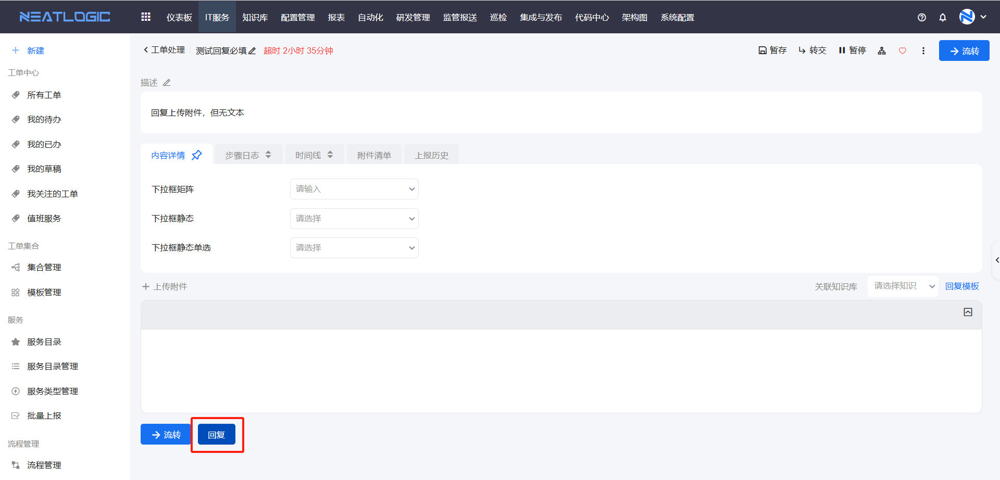
   参数值为0，不能再处理步骤过程中直接提交回复，只能流转时回复。
   
   [系统参数](../../100.系统配置/5.基础服务/基础服务.md)"processTaskStepCommentEditorToolbarIsShow" 可控制回复的富文本框是否默认显示编辑器工具栏，参数值为1，默认显示编辑器工具栏；
   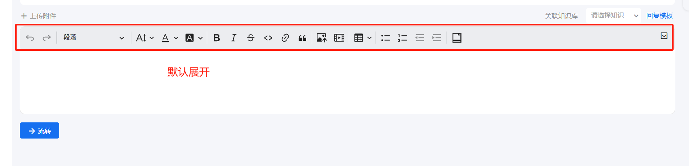
   参数值为0，默认收起编辑器工具栏。
   

### 3.2.9 重新激活
重新激活操作支持重新跑自动执行失败的步骤，用户可在执行失败后，修改工单内容并重跑，包括自动化、条件节点、数据转换节点。

  
### 3.2.10. 评分
工单关联的流程中，启用了评分设置，在工单流转到已完成的状态时，可以进行评分操作，评分的维度与评分设置的模板一致，详情参考 [流程管理](../流程管理/流程管理.md)-评分设置。

提交：填写评分维度和内容，点击提交按钮，评分操作完成，此时工单状态变成已评分。<br>
回退：若结束节点有连接到前置节点的回退线，未完成评分前可执行回退操作。
  
## 3.3. 节点功能介绍

### 3.3.1 事件节点

### 3.3.2. 审批功能
详情参考[高级场景](工单处理-高级场景.md)

### 3.2.11. 子流程功能
详情参考[高级场景](工单处理-高级场景.md)

## 4. 工单通知场景
工单操作和工单超时支持通知功能，通知的方式有邮件通知、站内消息通知、微信通知，更多的通知方式。

### 4.1. 工单维度操作的通知
执行[工单维度的操作](#31-工单维度的操作)后支持发起通知到指定的对象，需要在工单引用流程的流程设置-通知设置中，配置通知模板。详情可参考文档：[流程管理](../流程管理/流程管理.md)-流程设置。


### 4.2. 节点操作的通知
执行[节点维度的操作](#32-工单节点维度的操作)后支持发起通知到指定的对象，需要在工单流程的对应节点的节点设置-通知设置中，配置通知模板。详情可参考文档：[流程管理](../流程管理/流程管理.md)-节点设置。


### 4.3. 步骤时效超时通知
[步骤时效](#23-步骤时效)超时支持发起通知到指定的对象，需要在工单流程的时效设置中，配置超时通知策略。
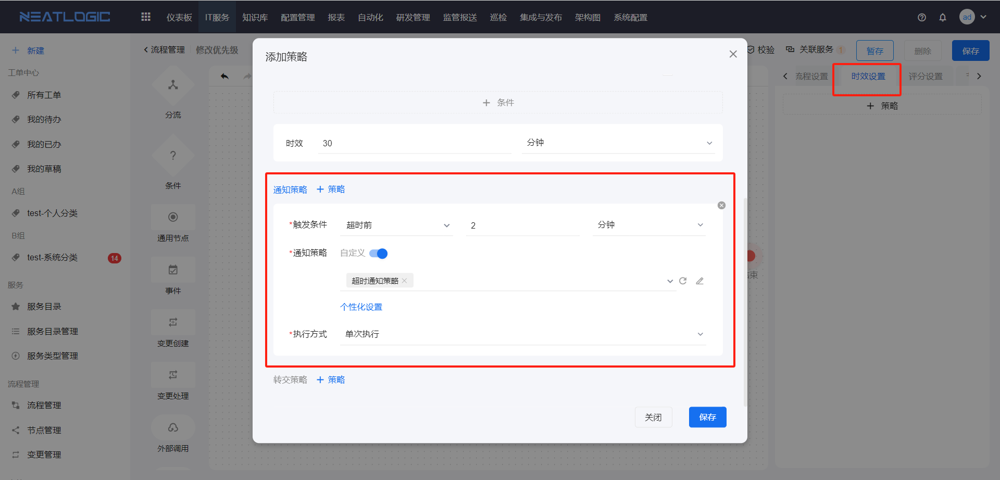
