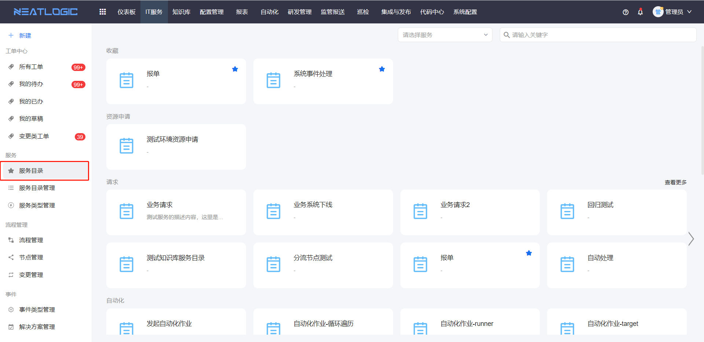
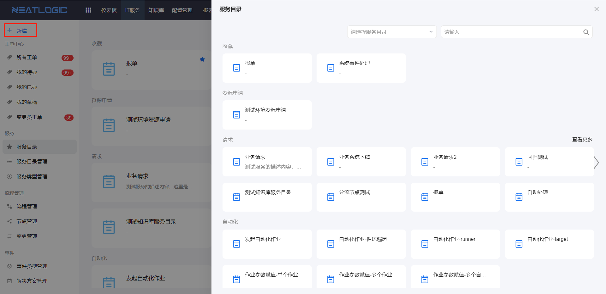
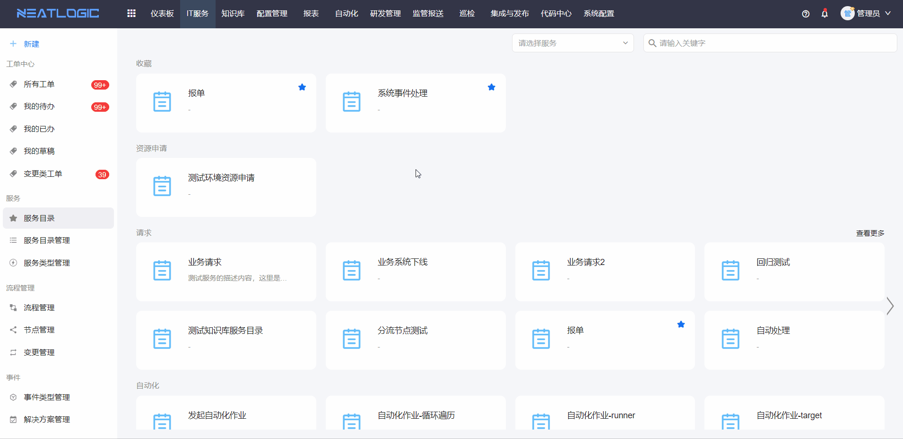
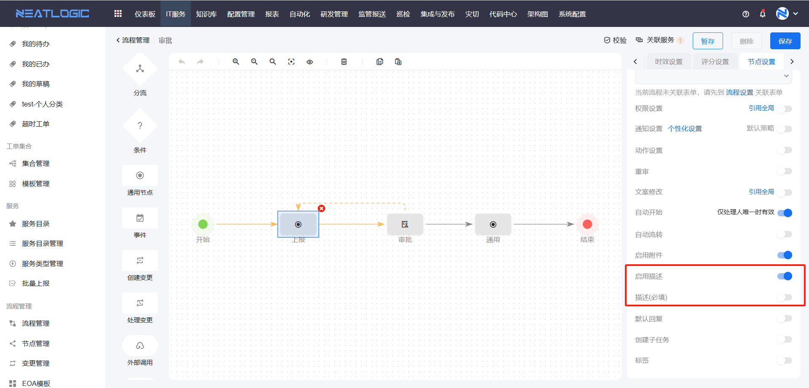
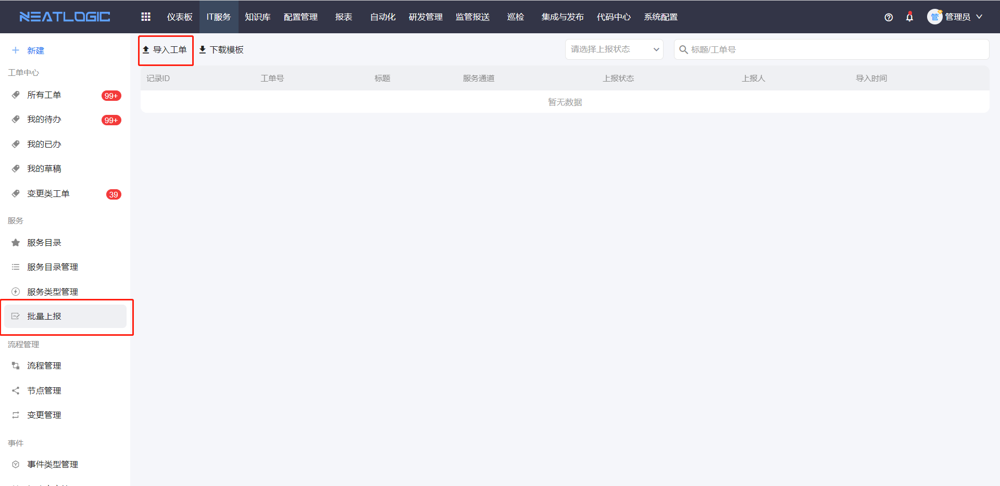

# 工单上报
工单上报是用户把服务请求、故障事件或其他事项提交到IT服务流程的入口。

用户可以通过服务目录或快捷入口提交单个工单，也可以使用批量上报一次性导入多条工单。工单提交后，会根据服务关联的[流程](../流程管理/流程管理.md)进入后续处理环节。

本文主要说明上报入口、提交与暂存、工单字段含义，以及批量上报的使用条件。

## 阅读路径

如果你只需要提交一张工单，阅读“单个工单上报”。如果你已经填写内容但暂时不想提交，重点看“工单提交与暂存”。如果你需要一次导入多条工单，直接查看“批量上报”。

## 单个工单上报

单个工单上报适合处理一条明确的服务请求或事件。

系统提供两个常用入口：

1. 服务目录页面

2. 快捷上报入口

**操作权限**
- 权限配置：系统配置-[用户管理](../../100.系统配置/1.用户和权限/用户管理.md)-授权-IT服务基础权限
- 配置人员：系统超级管理员
  
**数据权限**

需要服务的上报权限，详情参考[服务目录](../服务/服务目录管理.md/#数据权限)

### 工单提交与暂存

工单提交用于正式发起流程。提交前，用户需要填写标题和页面中的必填字段，系统校验通过后才会创建工单并进入流程。

如果内容还没确认，可以点击“暂存”保存为草稿。上报人可在[工单中心](../工单中心/工单中心.md)的“我的草稿”中继续编辑和提交。草稿提交成功后，系统会自动从草稿列表中移除对应记录。

### 工单内容说明

工单内容决定后续处理人能看到什么信息，也会影响流程中的表单、优先级和知识推荐。

常见内容包括标题、上报内容、描述、附件、相关知识、上报人和基本信息。

1. **标题**：即工单名称，系统不做唯一性校验，但为暂存或提交工单的必填项。
2. **上报内容**：以表单形式呈现，根据[流程设置](../流程管理/流程管理.md)中上报节点关联的表单场景动态显示。
3. **描述**：用于补充工单相关信息，其启用状态及必填校验由流程配置中上报节点的“启用描述”和“描述必填”设置控制。
    
4. **附件**：支持上传本地文件及截图，其启用状态由流程上报节点的开关配置控制。
    
5. **相关知识**：基于工单标题关键字智能匹配相关知识文档，点击标题可查看文档详情。数据来源为[知识库](../../98.知识库/新建知识文档.md)中所有已审批通过的文档。
   
6. **上报人**：指提交工单的用户，默认值为当前登录用户。支持修改上报人，若修改为非当前登录用户，则当前登录用户自动成为工单代报人。上报人的地域信息来源于系统配置的[地域管理](../../100.系统配置/1.用户和权限/地域管理.md)。
7. **基本信息**：包含上报服务、优先级、标签及关注人等工单基础信息。优先级显示受[服务目录管理](../服务/服务目录管理.md)中服务配置的优先级启用和显示开关控制，表单下拉框组件支持联动修改优先级选项。标签功能目前仅用于工单标记。

## 批量上报

批量上报适合一次提交多条相同服务下的工单，例如批量录入线下收集的问题或集中导入巡检发现的事项。

操作流程为：下载模板 → 填写批量上报数据 → 导入工单。

**操作权限**
- 权限配置：系统配置-[用户管理](../../100.系统配置/1.用户和权限/用户管理.md)-授权-批量上报权限
- 配置人员：系统超级管理员
