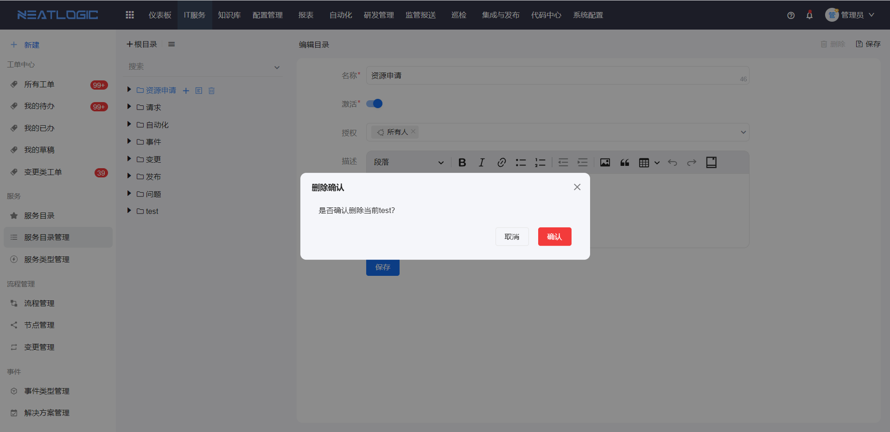
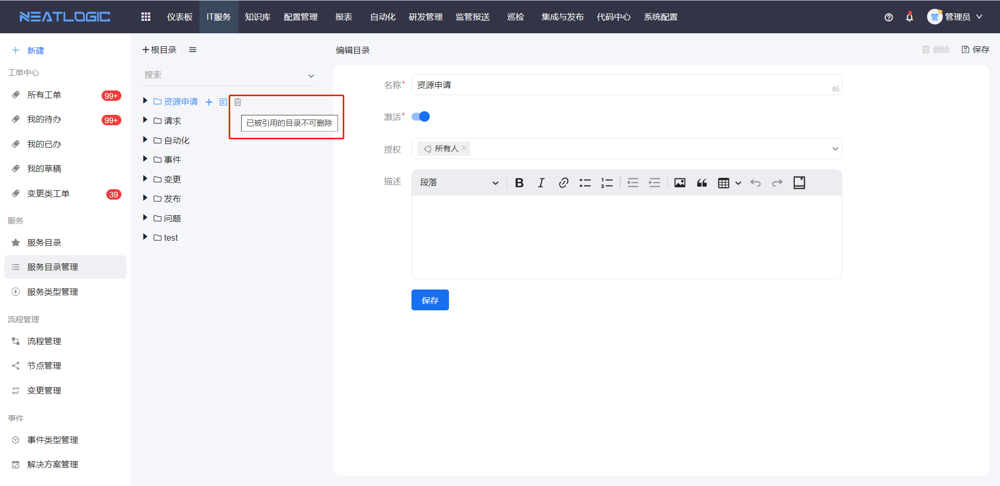

# 服务目录管理
服务目录管理包括[目录](#目录)和[服务](#服务)的新增、修改、删除和授权等功能，服务可建立与流程的联系，并个性化配置服务的字段属性，如优先级、并用于发起工单。 
关于目录和服务的权限，父目录的权限 > 子目录的权限 > 目录下服务的权限 
若目录未授权给用户，目录下级的子目录和服务均不显示在服务目录页面中，无论用户是否被授予子目录和服务的权限。
## 目录

- 添加
  
- 编辑
  
- 删除
  
  

## 服务

  服务支持添加、编辑、删除和授权，有服务上报权限的用户才能通过该服务上报工单。
  
  添加服务，服务的配置包括流水线（即[流程](../流程管理/流程管理.md)）、[优先级](../其他配置管理/配置管理.md/#2优先级管理)、[服务窗口](../../100.系统配置/服务窗口管理.md)、[服务类型](../服务/服务类型管理.md#)、上报权限、转报设置和使用范围等。

- 上报权限
  
  用户有服务的上报权限，才能在服务目录页面找到相应的服务并进行上报操作。

- 关于转报设置
  
  允许转报功能启用后，通过服务上报的工单，在处理的过程中，可以通过转报设置中配置的目标服务来转报新的工单。
  
  转报设置中要求配置转报的关系类型、转报的目标服务以及允许进行转报操作的对象，一个服务允许添加多个[关系类型](../其他配置管理/配置管理.md/#4关系类型管理)。

- 服务在PC端和移动端展示情况表
<table style="width:100%">
<thead>
    <tr>
        <td>服务所在目录激活状态</td>
        <td>服务激活状态</td>
        <td>使用范围</td>
        <td>是否在PC端展示</td>
        <td>是否在移动端展示</td>
    </tr>
</thead>
<tbody>
    <tr>
        <td>已激活</td>
        <td>已激活</td>
        <td>所有</td>
        <td>是</td>
        <td>是</td>
    </tr>
    <tr>
        <td>已激活</td>
        <td>未激活</td>
        <td>所有</td>
        <td>否</td>
        <td>否</td>
    </tr>
    <tr>
        <td>未激活</td>
        <td>已激活</td>
        <td>所有</td>
        <td>否</td>
        <td>否</td>
    </tr>
    <tr>
        <td>未激活</td>
        <td>未激活</td>
        <td>所有</td>
        <td>否</td>
        <td>否</td>
    </tr>
    <tr>
        <td>已激活</td>
        <td>已激活</td>
        <td>手机端</td>
        <td>否</td>
        <td>是</td>
    </tr>
    <tr>
        <td>已激活</td>
        <td>已激活</td>
        <td>电脑端</td>
        <td>是</td>
        <td>否</td>
    </tr>
</tbody>
</table>