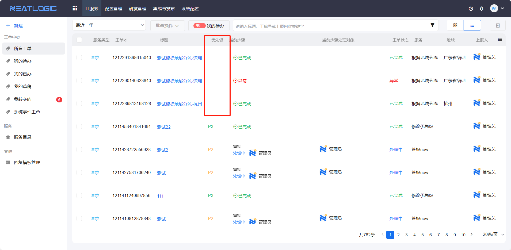
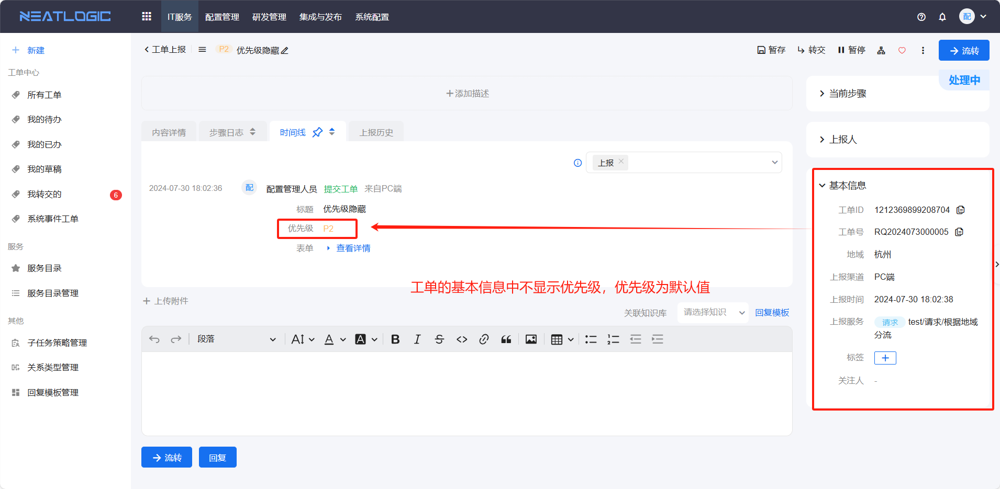
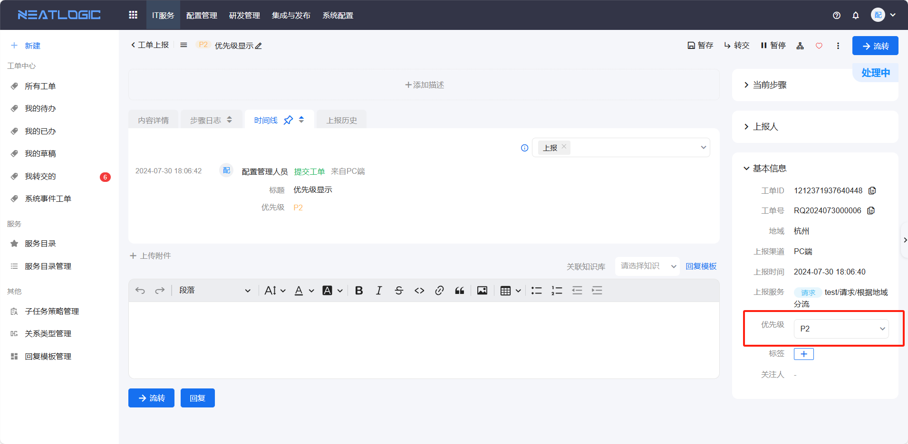
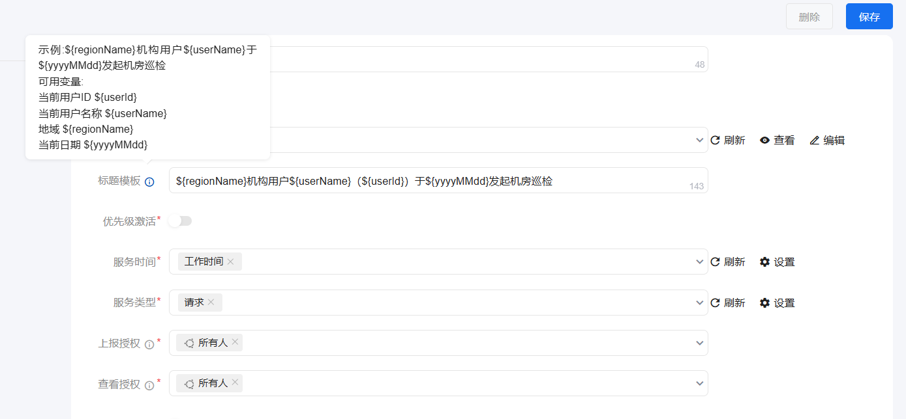

# 服务目录管理
服务目录管理包括[目录](#目录)和[服务](#服务)的配置。目录用于定义服务的层级结构，服务则是用户发起工单的媒介。

## 权限说明

目录和服务的权限继承关系为：**父目录的权限 > 子目录的权限 > 目录下服务的权限**。

若目录未授权给用户，则用户访问服务目录页面时，无论其是否拥有子目录或服务的权限，该目录及其所有子目录和服务均会被过滤隐藏。

## 目录

目录支持添加、编辑、删除和权限配置。

### 添加目录

### 编辑目录

### 删除目录

- **可删除状态**：目录下无服务或被引用的服务时，可直接删除。

- **不可删除状态**：目录下存在服务或被引用时，无法删除。

### 目录权限  

- **上报权限**：用户需在“目录-服务”全路径各级均拥有上报权限，才能通过当前目录下的服务创建工单。无上报权限的服务将自动隐藏。
- **查看权限**：用户需在“目录-服务”全路径各级均拥有查看权限，才能查看通过当前目录下服务创建的工单。

---

## 服务

服务支持添加、编辑、删除和授权。只有拥有服务上报权限的用户才能通过该服务上报工单。
  
### 添加服务

添加服务时，需配置以下参数：
- **工作流**：关联的[流程](../流程管理/流程管理.md)
- **标题模板**：定义工单标题生成规则
- **优先级**：关联的[优先级配置](../其他配置管理/配置管理.md)
- **服务窗口**：关联的[服务窗口](../../100.系统配置/5.基础服务/服务窗口管理.md)
- **服务类型**：关联的[服务类型](../服务/服务类型管理.md)
- **上报权限**：谁可以使用该服务上报工单
- **查看权限**：谁可以查看该服务创建的工单
- **转报设置**：配置工单转报规则
- **使用范围**：指定服务在PC端或移动端的可见性

### 优先级配置

优先级的状态及显示配置影响工单页面的展示效果：

- **优先级未激活**：通过该服务上报的工单无优先级数据。
  

- **优先级激活，但设置为隐藏**：工单上报页、详情页和处理页均不显示优先级，工单优先级取默认值。此情况下仍支持通过表单组件触发联动修改优先级值。
  
  

- **优先级激活且不隐藏**：工单上报页、详情页和处理页均正常显示优先级。
  
  

### 标题模板

标题模板支持定义常量和变量，上报工单时系统将根据模板自动生成工单标题。

### 转报设置

启用“允许转报”功能后，该服务下的工单（操作用户需为转报授权对象）可通过转报配置的目标服务发起新的转报工单。

转报配置包含以下要素：
- **转报关系类型**：一个服务可关联多个[关系类型](../其他配置管理/配置管理.md)
- **转报目标服务**：指定转报时使用的目标服务
- **转报授权对象**：允许执行转报操作的用户或角色
  

### 服务在PC端和移动端的展示规则

服务的展示状态受目录激活状态、服务激活状态和使用范围共同影响，具体规则如下：
| 目录激活状态 | 服务激活状态 | 使用范围 | PC端展示 | 移动端展示 |
|:------------:|:------------:|:--------:|:--------:|:----------:|
| 已激活 | 已激活 | 所有 | 是 | 是 |
| 已激活 | 未激活 | 所有 | 否 | 否 |
| 未激活 | 已激活 | 所有 | 否 | 否 |
| 未激活 | 未激活 | 所有 | 否 | 否 |
| 已激活 | 已激活 | 手机端 | 否 | 是 |
| 已激活 | 已激活 | 电脑端 | 是 | 否 |