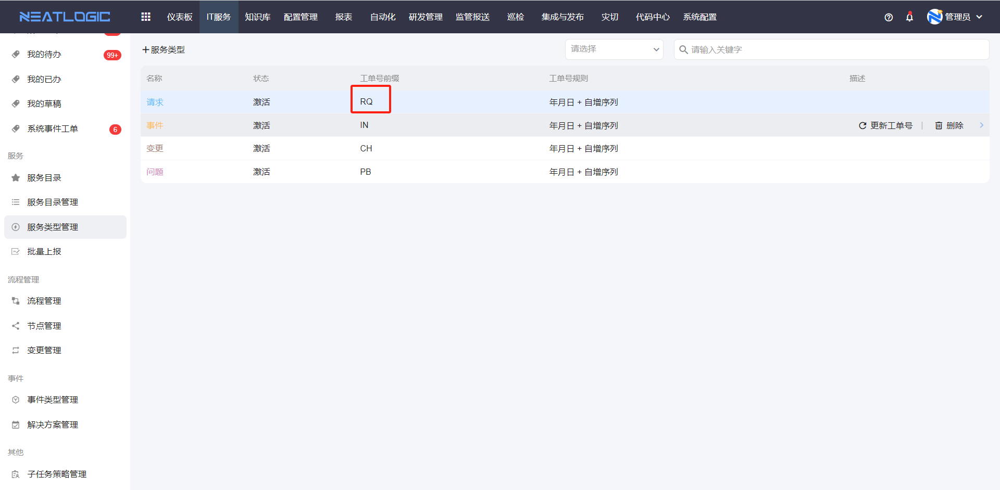
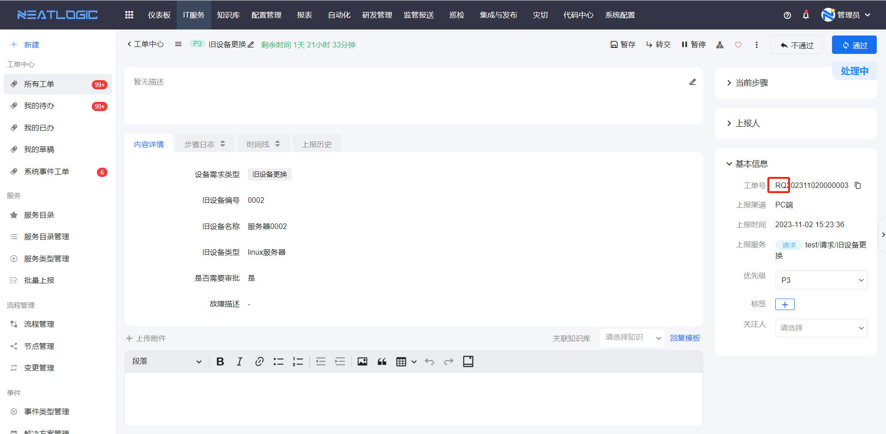
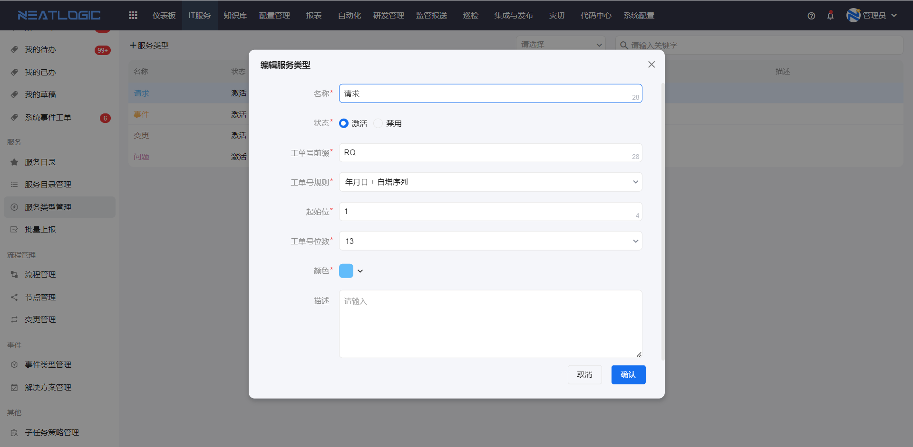
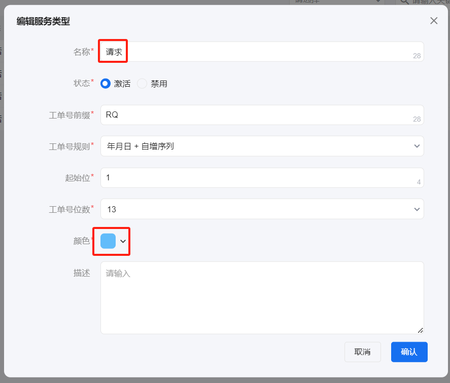
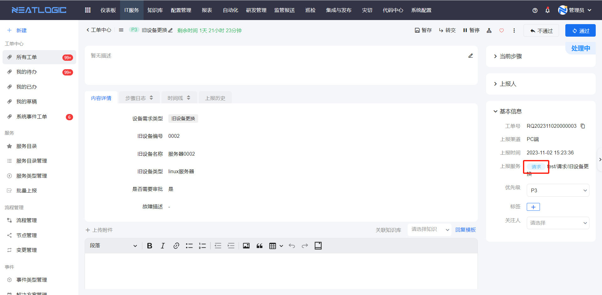
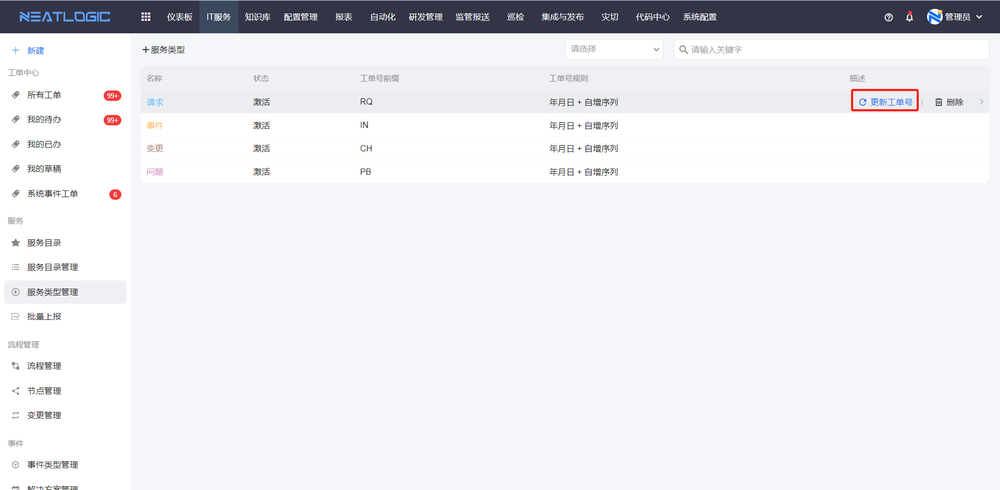

# 服务类型管理
服务类型是指工单所属的服务分类，服务类型完全由用户根据需求自定义。

## 服务类型配置
服务类型的基本配置包括名称、状态、工单号前缀、工单号规则、颜色和描述。
- 状态：包括激活和禁用，激活的类型才能使用。
- 工单号前缀：工单上报成功后，会生成一段工单号，工单号会根据工单所属服务类型分配前缀。
  
  
- 工单号规则：工单号规则是，发起工单时工单号生成的规则，服务类型缺少工单号规则，该类型的服务无法发起工单。
  
  例如：“请求”类型的工单号规则是“年月日+自增序列”，起始位是1，工单号位数为13。

  在2023年1月1日发起的第5个请求类型工单的工单号是：2023010100005
  
- 颜色：工单的服务类型文本显示的颜色。
  
  “请求”类型的颜色如图
  
  工单的服务类型文本颜色如图
  

## 更新工单号
重新编辑服务类型的工单号前缀和工单号规则后，如果要批量更新历史工单，需要执行更新工单号操作，否则新工单才会按照更新的配置来生成工单号。
