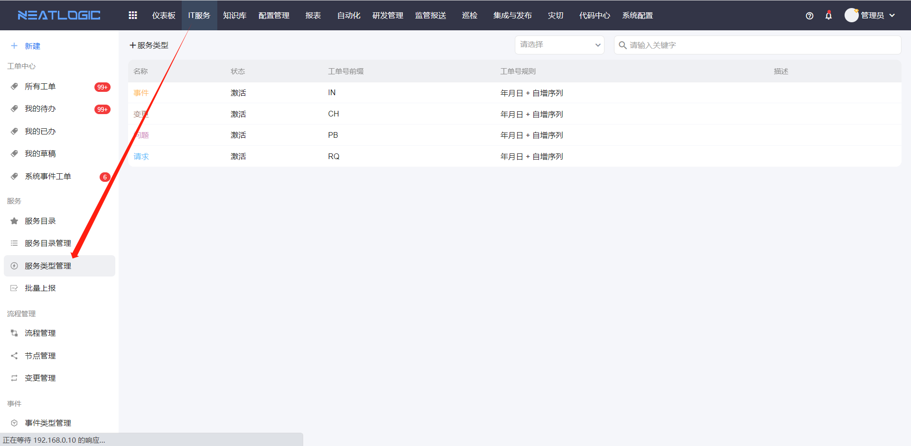
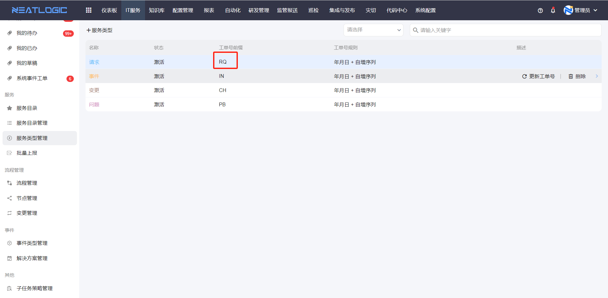
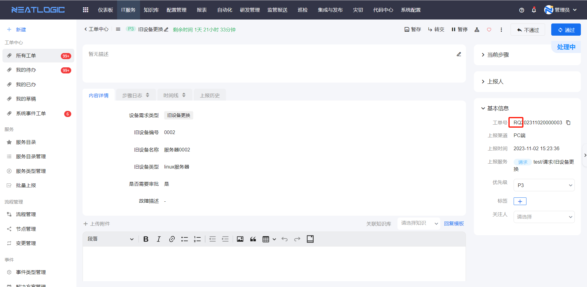
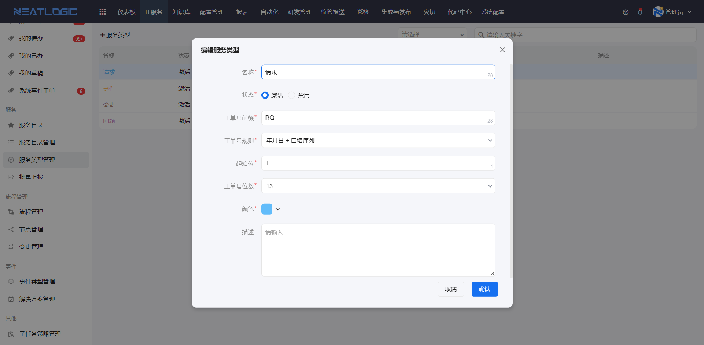
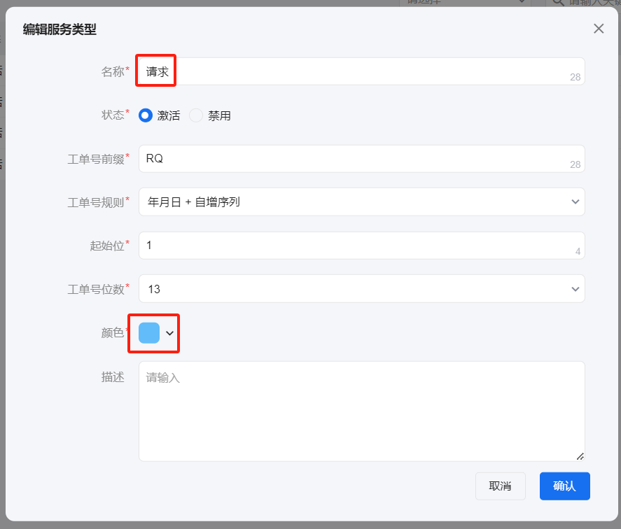
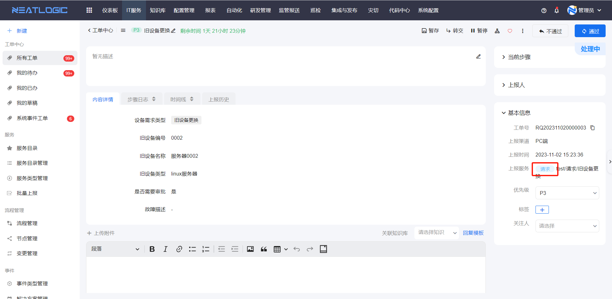
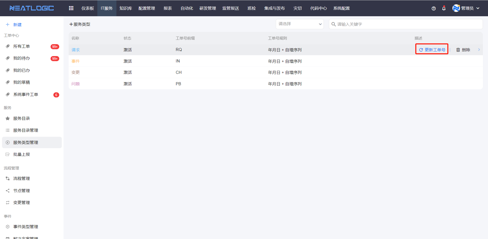

# 服务类型管理

服务类型用于区分工单所属的业务类别，例如请求、事件、问题或变更。

配置服务类型后，可以统一控制该类型工单的工单号前缀、编号规则和展示颜色。服务目录中的服务会关联服务类型，用户上报工单后，系统会根据服务类型生成工单号并展示分类信息。

本文主要说明服务类型如何影响工单号、工单展示和历史工单编号更新。

## 阅读路径

如果你正在新增服务类型，先看“服务类型配置”。如果你已经调整了工单号规则，并且需要同步历史工单编号，再看“更新工单号”。

**操作权限**

- 权限配置：系统配置-[用户管理](../../100.系统配置/1.用户和权限/用户管理.md)-授权-服务类型管理权限
- 配置人员：系统超级管理员

## 服务类型配置

服务类型配置决定该类型能否被服务引用，以及引用后工单号和页面标签如何展示。

基础配置项包括名称、状态、工单号前缀、工单号规则、颜色和描述。

- **状态**：包括“激活”和“禁用”两种状态。只有激活状态的服务类型可以被服务引用。
  
- **工单号前缀**：工单提交成功后，系统会根据服务类型为工单号添加对应前缀，便于从编号上快速识别工单类别。
  
  
  

- **工单号规则**：定义工单号的生成方式。若服务类型未配置工单号规则，该类型下的工单将无法成功发起。
  
  > **示例**：“请求”类型的工单号规则设置为“年月日 + 自增序列”，起始序号为 1，工单号总位数为 13 位。  
  > 在 2023 年 1 月 1 日发起的第 5 个“请求”类型工单，其工单号为：`2023010100005`

  

- **颜色**：设置工单中服务类型文本的显示颜色，用于在列表、详情或处理页面中快速区分不同类型。
  
  > **示例**：“请求”类型的颜色配置及效果如下：

  
  
  

## 更新工单号

更新工单号用于处理规则变更后的历史数据。

当服务类型的工单号前缀或工单号规则发生变化后，后续新工单会按新规则生成编号。如果历史工单也需要统一编号规则，可以执行“更新工单号”操作，对已有工单批量更新工单号。

