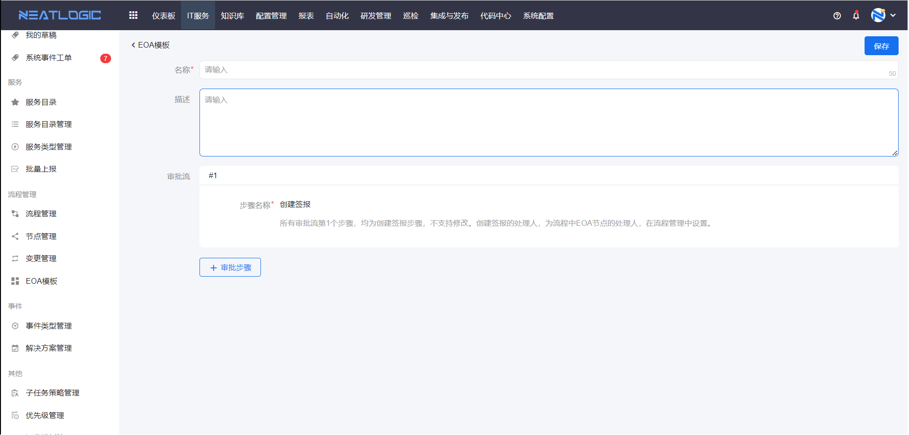
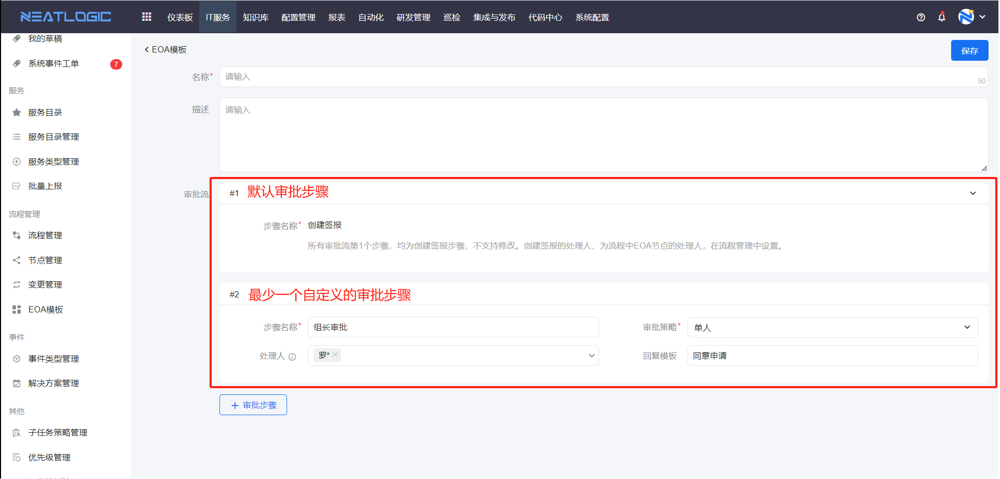
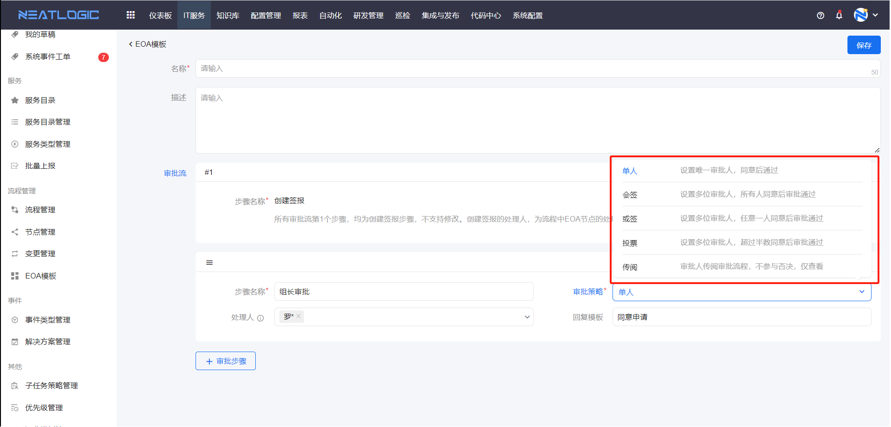

# EOA模板
EOA模板是指审批流模板，应用于流程的审批节点，支持添加、编辑、删除和查看关联流程等操作，其中只有关联流程为0的模板可删除。

## 审批流
EOA模板有名称、描述和审批流，其中最核心的内容是审批流。

审批流是由审批步骤组成的，有一个默认的创建签报的步骤，以及最少有一个自定义的审批步骤。

### 审批策略
审批策略是指满足步骤审批完成的策略，一共有五种审批策略，包括单人、会签、或签、投票和传阅。

- 单人：只有一个审批人，该用户同意即成功完成审批，并流转到下一审批步骤。
- 会签：不指定审批人数量，所有用户都同意即成功完成审批；任意一个用户驳回，审批流驳回并结束。
- 或签：不指定审批人数量，任意一个用户同意即成功完成审批；任意一个用户驳回，审批流驳回并结束。
- 投票：不指定审批人数量，超过半数用户同意即成功完成审批；大于等于半数用户驳回，审批流驳回并结束。
- 传阅：用户只能传阅审批流程，不参与审批。

### 模板预设内容
1. 描述，创建审批时，选择模板后，模板的描述会自动带到审批描述当中，描述内容可修改。
2. 处理人，审批步骤预设处理人后，后续步骤的处理人不能再修改。
3. 回复模板，审批步骤预设回复模板后，处理人处理审批步骤时，回复框自动填充回复模板的内容，支持修改。