# 流程管理
流程管理是把ITSM内的模块转换成不同的流程节点，对应的流程节点都有自己的节点特性，配置流程时，请按照业务需求灵活配置。流程管理中除了配置工作流，还支持SLA时效、通知功能、评分和步骤处理人分派策略等功能。

相关权限：[权限管理](../../100.系统配置/1.用户和权限/用户和权限.md)-IT服务-流程管理权限
## 流程图
流程图连线规则：
- 开始节点不允许连入，结束节点不允许连出。
- 流程必须从起始节点（绿色节点）出发，结束节点（红色节点）终止，开始和结束节点无意义。
- 除起始和结束节点，其他节点不能孤立存在，必须有连入和连出的线。
- 开始节点后面只能连接普通节点和创建变更节点。
- 节点拉线连接到后置节点，显示为**实线**，代表流转路径；节点拉线连接到前置的节点，显示为**虚线**，代表回退路径。

## 流程节点
流程节点包括分流、条件、通用节点、事件、变更创建、变更处理、自动处理、数据转换、自动化、定时节点等节点。

### 分流节点
连接作用的节点，分流节点不用处理，流转到该节点同时激活与分流节点相连的后置节点。

### 条件节点
有条件判断的连接节点，条件节点不用处理，流转到该节点时，同时激活匹配到的条件的流转节点。
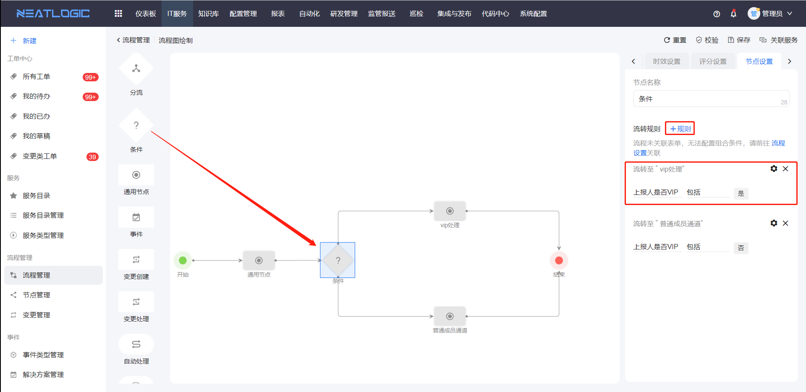

### 通用节点
包括所有的基础节点功能，通用节点要处理才能流转，只能选一条流转路径并激活后置节点。
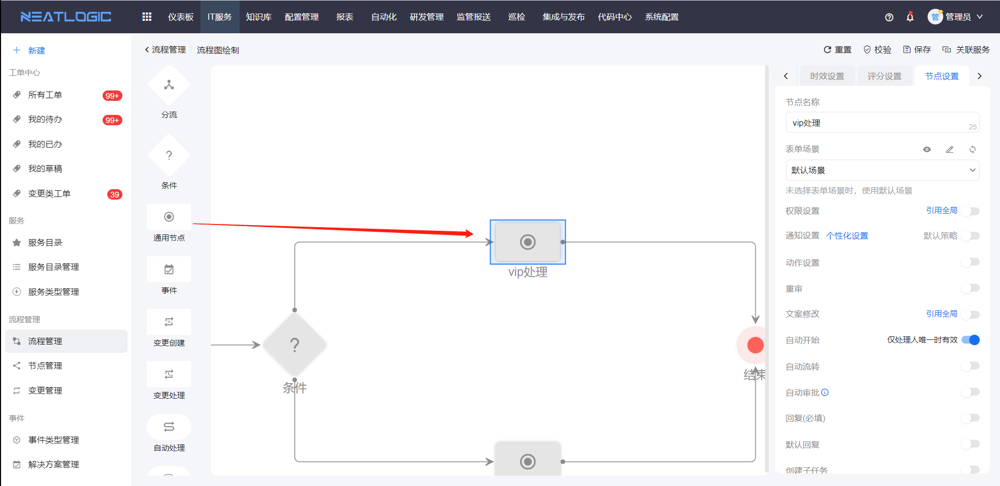

### 变更创建节点
创建变更步骤的节点，与变更处理节点成对存在，不能有独立的变更创建节点。

### 变更处理节点
处理变更步骤的节点，必须关联变更创建节点，一个变更创建节点只能引用一次。

### 事件节点
处理事件的节点。

### 自动处理节点
引用集成管理的集成配置接口，流转到该节点时自动向配置的接口发起请求。

### 配置项同步节点
配置项同步节点是用来同步 **表单组件-配置项修改** 组件对模型配置项数据的变更，节点设置中必须关联一个配置项修改的表单组件。
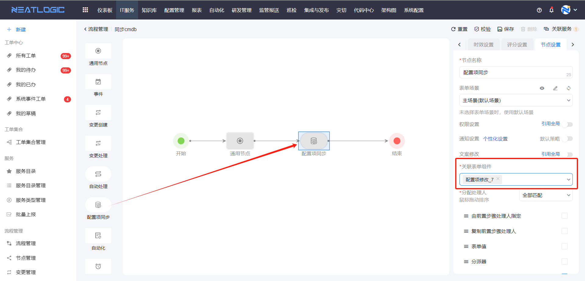

### 自动化节点
自动化节点是结合自动化模块的节点，关联自动化模块的组合工具，并配置参数映射，通过工单节点发起自动化作业。

自动化节点的作业参数映射配置时，映射对象支持常量、表单普通组件、表单表格组件、工单信息和表达式。
- 常量：写入一个固定的值。
- 表单普通组件：除了表格组件以外的表单组件。
- 表单表格组件：表格类型组件，包括表格输入组件和表格选择组件，支持设置数据过滤条件。
  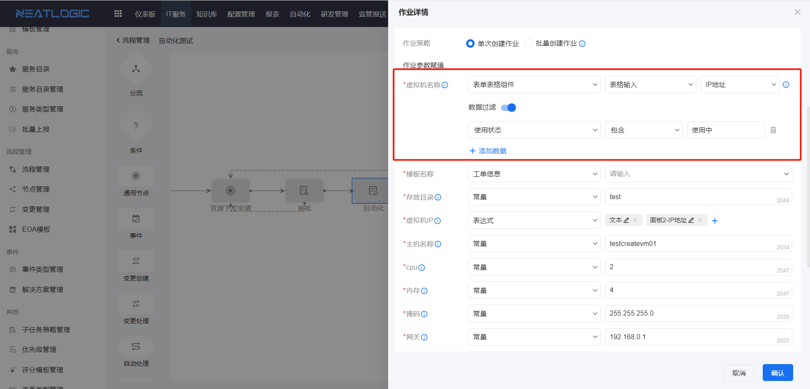
- 工单信息：参数支持引用工单信息的值作为映射值，包括工单id、步骤id、标题、服务类型、上报内容等。
  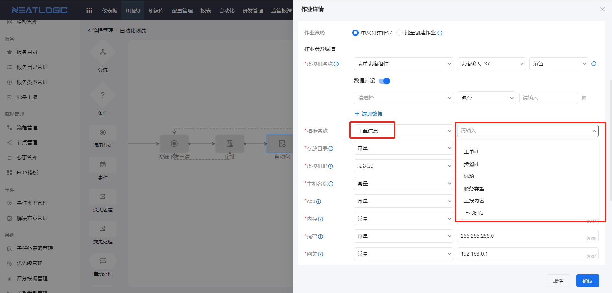
- 表达式：文本类型的参数的映射方式支持表达式，表达式可以由自定义的文本内容和表单组件的值拼接成。
  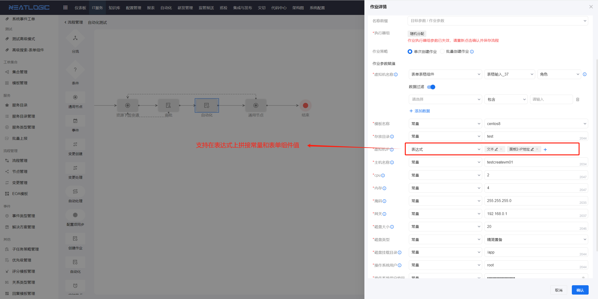

### 定时节点
定时节点是定时自动处理的节点，必须关联表单中必填的日期组件使用，该节点无法人工处理，当系统时间达到日期组件的时间，自动流转到后置节点。
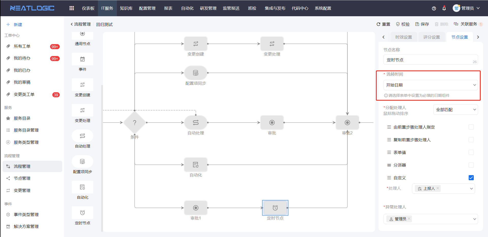

### 审批节点
详情参考[高级场景](流程管理-高级场景.md)

### 数据转换节点
详情参考[高级场景](流程管理-高级场景.md)
  
### 子流程节点
详情参考[高级场景](流程管理-高级场景.md)

### 架构图节点
详情参考[高级场景](流程管理-高级场景.md)

## 流程设置
流程设置时作用于整个流程阶段的，包括流程名称、关联表单、权限设置、通知设置、动作设置、标记重复事件。

- 权限设置 
包括了取消、修改上报内容、催办权限，未启用则默认所有用户都无这三个权限，启用后，仅授权对象有权限。取消是指取消工单，修改上报内容是指修改标题、优先级、上报描述、附件等工单信息，催办是指催办工单。

- 通知设置 
启用后，需要引用 [通知策略管理](../../100.系统配置/4.通知和订阅/通知策略管理.md)-IT服务-工单 的模板；若不启用，则引用“通知策略管理-IT服务-工单”的默认模板。

- 动作设置 
满足在工单操作时需要触发调用外部接口的场景，外部接口配置来源于[集成管理](../../100.系统配置/3.数据和集成/集成管理.md)。

- 标记重复事件 
发起重复的工单，可通过关联重复工单，来关闭其他重复的工单。

## 节点设置
点击节点图标，打开相应节点的节点设置。

### 表单场景
表单场景有默认场景和自定义场景，若未修改，默认选择默认场景。

### 权限设置
节点权限包括查看节点信息、转交、暂停、撤回权限。
- 查看节点信息：查看步骤详情中对应节点的信息，缺少权限的用户，。
- 转交：将工单当前节点处理权限转给其他用户。
- 暂停：暂停处理当前节点，工单挂起。
- 撤回：撤回到上一个处理节点。
  
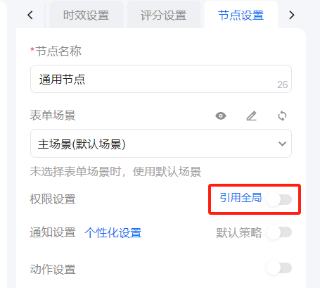

启用开关表示在当前节点自定义授权，仅当前流程的该节点有效。不启用开关则表示引用全局，即使用[节点设置](节点管理.md)中该类型节点的授权。工单中判断权限范围时，局部权限高于全局。

### 通知设置
通知设置默认引用全局，启用自定义后，需关联流程步骤模块的[通知策略](../../100.系统配置/4.通知和订阅/通知策略管理.md)，关联通知策略后，可自定义通知策略中触发时机和参数的映射。参数支持选择流程属性、表单组件，也支持输入常量。

### 动作设置
节点的动作设置与流程设置中的一致，只是触发点不同。

### 重审
重审是指回退后一键处理并流转到回退前的节点，所以启用重审的节点应该有连入的回退线，才是有效设置。

### 文案修改
未启用时，默认引用全局设置；启用修改文案后，可修改工单按钮、节点状态以及详情页页签标题的文案。

### 自动开始
自动开始设置是应用于节点只分派到一个处理人的场景，节点可自动开始处理。

### 自动流转
节点启用自动流转，当工单处理到该节点时，系统自动流转，不需要人工处理。

### 回复必填
启用回复必填，工单处理该节点时，校验回复必填，回复为空无法流转。

### 默认回复
节点配置默认回复模板，模板来自[回复模板管理](../其他配置管理/配置管理.md)，处理工单对应节点时，回复框自动填充默认回复模板内容。默认回复的生效有条件，处理人有默认回复模板的权限才能生效。

### 创建子任务
配置了[子任务策略](../其他配置管理/配置管理.md)的节点，工单处理时，支持添加子任务。
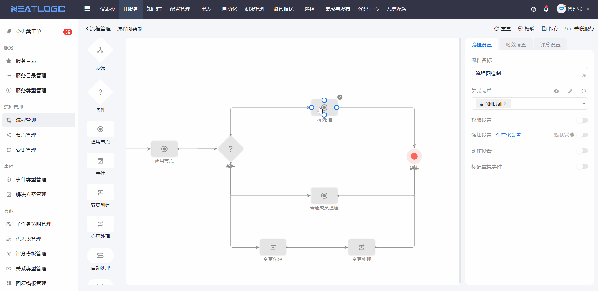

### 分配处理人
节点分配处理人的策略：前置步骤处理人指定、复制前置步骤处理人、表单值、分派器、自定义分派策略。 匹配方式支持全部匹配和顺序匹配。全部匹配的对象是指匹配成功的策略分配到的所有用户，顺序匹配的对象是指按顺序匹配到的第一个匹配成功的策略所分配的用户。

1. 由前置步骤处理人指定：前置步骤流转时可指定当该节点的处理人，此策略需关联前置步骤。
   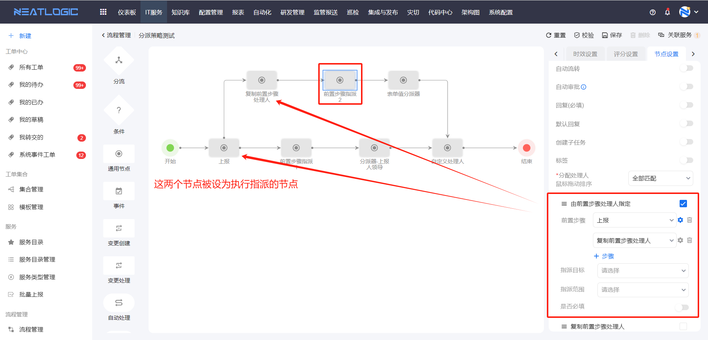
   前置步骤支持设置条件路径，若不设置条件路径，则该步骤流转时默认显示指派操作； 
   若设置了条件路径，则该前置步骤流转时，只有选择条件路径的节点才会显示指派操作。
   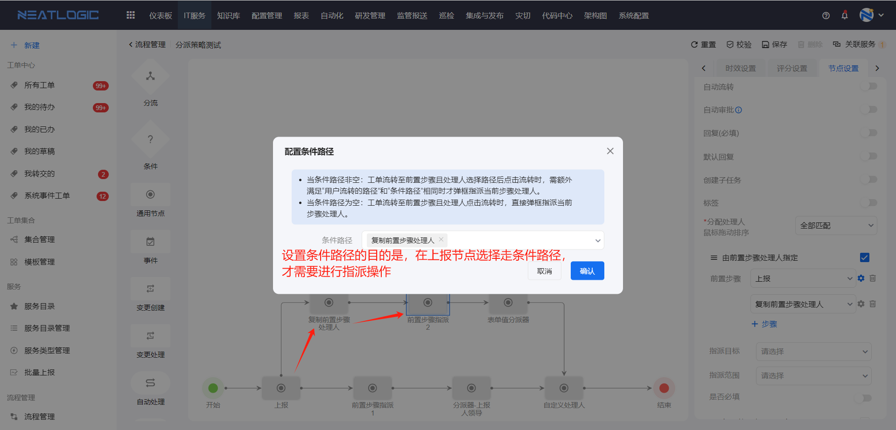
   另外，指派目标和指派范围是在指派时，用来限制可指派的对象类型和范围的。
   
2. 复制前置步骤处理人：工单流转至节点时，会复制关联的前置节点的处理人作为处理人，此策略需关联前置步骤。

3. 表单值：需关联映射的表单组件，只支持用户选择器和下拉框组件，其中下拉框组件只有引用矩阵中的用户类型属性时才能匹配成功。

4. 分派器：需关联分派器，工单流转至节点时，会根据分派器的分派逻辑自动指定处理人，以CMDB分派器为例。
  
    CMDB分派器：支持用通过模型或者视图的属性和表单组件做映射，将匹配到的用户、分组、角色作为节点待处理人。

    配置包括数据类型、数据来源、匹配映射、处理人和优先级。匹配映射的关键点在于，[表单](../../100.系统配置/3.数据和集成/表单管理.md)的组件必须引用[配置项矩阵](../../100.系统配置/3.数据和集成/矩阵管理.md)，且矩阵引用的配置模型与匹配映射的属性是同一个。
    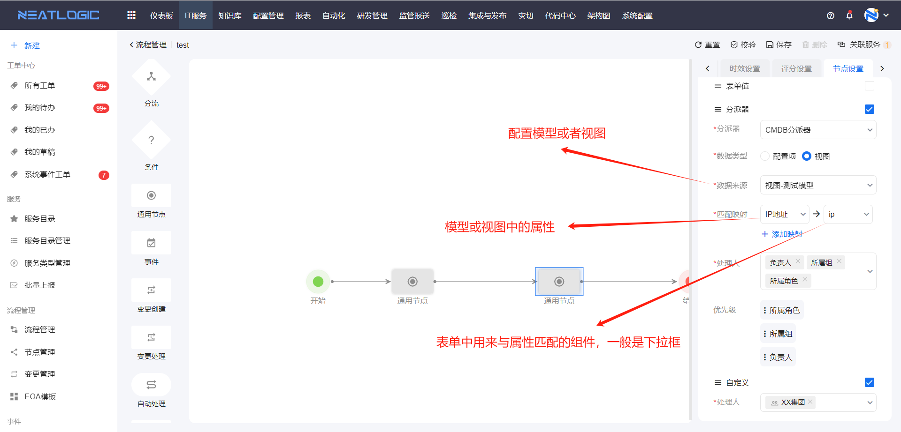

    注意：当匹配到的配置项不唯一，或匹配到唯一对象，但系统不存在该对象，CMDB分派器无法生效，将自动分配给节点的异常处理人。

5. 自定义：直接选择分派对象，分派对象支持上报人、代报人、用户、角色和分组。
   

### 异常处理人
异常处理人是节点分配处理人异常时才生效，节点自动分配给异常处理人，异常处理人必填。
  
## 时效设置
添加时效策略步骤：点击添加时效策略--配置时效--保存时效

## 评分设置
评分设置步骤：启用评分-选择[评分模板](../其他配置管理/配置管理.md)、配置自动评分
流程启用评分设置后，结束节点支持拉回退线到前置节点，未启用评分，则结束节点不支持回退。

