# 流程管理
流程管理是将ITSM内的模块转换为不同的流程节点，每个节点具备独立的特性。配置流程时，请根据业务需求灵活组合。除工作流配置外，流程管理还支持SLA时效、通知、评分及步骤处理人分派策略等功能。

相关权限：[权限管理](../../100.系统配置/1.用户和权限/权限管理.md)-IT服务-流程管理权限
## 1. 流程图
流程图连线规则：
- 开始节点不允许有连入线，结束节点不允许有连出线。
- 流程必须从起始节点（绿色）出发，在结束节点（红色）终止。开始与结束节点仅表示起止，无实际业务含义。
- 除起始和结束节点外，其他节点必须同时有连入和连出线，不能孤立存在。
- 开始节点后只能连接普通节点或创建变更节点。
- 节点拉线连接到后置节点时，显示为**实线**，代表流转路径；连接到前置节点时，显示为**虚线**，代表回退路径。

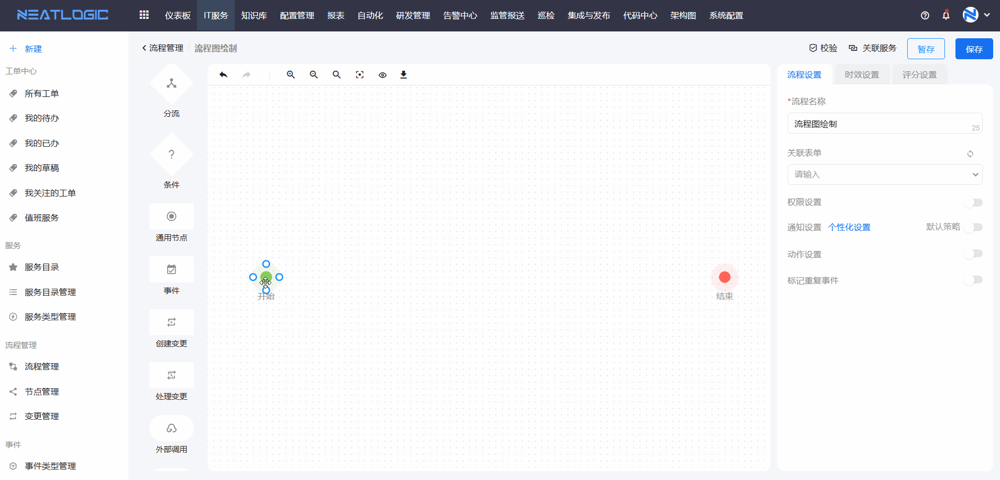

## 2. 流程节点
流程节点包括分流、条件、通用、事件、变更创建、变更处理、自动处理、数据转换、自动化、定时等类型。

### 2.1. 分流节点
用于条件判断的连接节点，无需处理。流转到该节点时，会激活匹配到的条件所对应的流转节点。
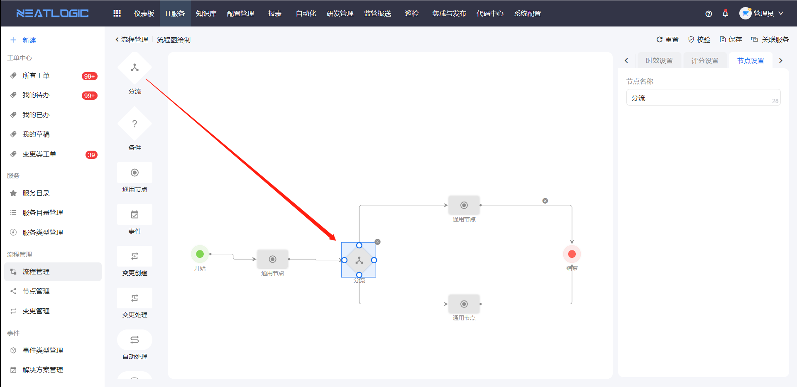

### 2.2. 条件节点
有条件判断的连接节点，条件节点不用处理，流转到该节点时，同时激活匹配到的条件的流转节点。
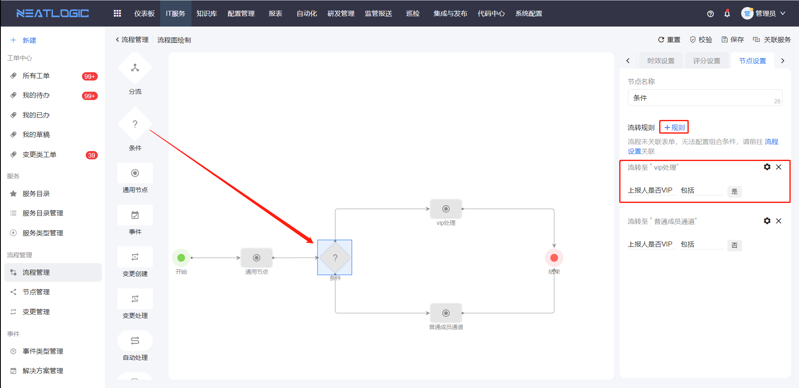

### 2.3. 通用节点
包含基础节点功能，需处理后才可流转。只能选择一条流转路径并激活对应的后置节点。
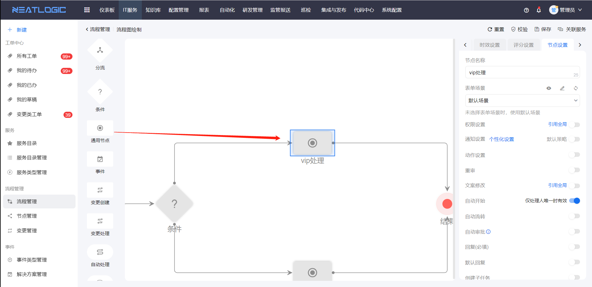

### 2.4. 变更创建节点
用于创建变更步骤的节点，必须与变更处理节点成对存在，不可独立使用。

### 2.5. 变更处理节点
处理变更步骤的节点，必须关联变更创建节点，一个变更创建节点只能引用一次。
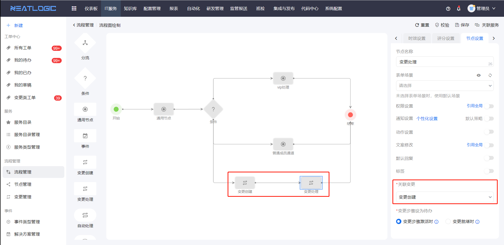

### 2.6. 事件节点
用于处理事件的节点。
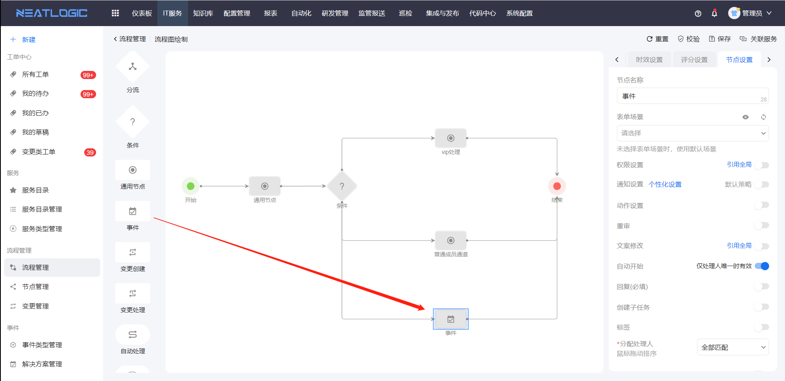

### 2.7. 外部调用节点
用于引用集成管理中的集成配置接口。流转到该节点时，自动调用配置的接口发起请求，并根据返回结果判断是否成功。

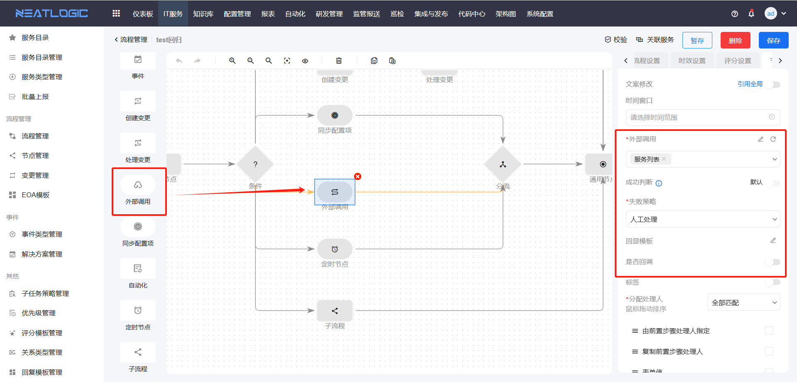
外部调用对象来自 [系统配置-集成管理](../../100.系统配置/3.数据和集成/集成管理.md) ，仅支持自定义类型的集成配置。 
参数值对象来自所引用的集成配置的输入参数，成功判断的自定义参数同样来源于该集成配置的输入参数。

### 2.8. 配置项同步节点
用于同步 **表单组件-配置项修改** 组件对模型配置项数据的变更。节点设置中必须关联一个配置项修改的表单组件。
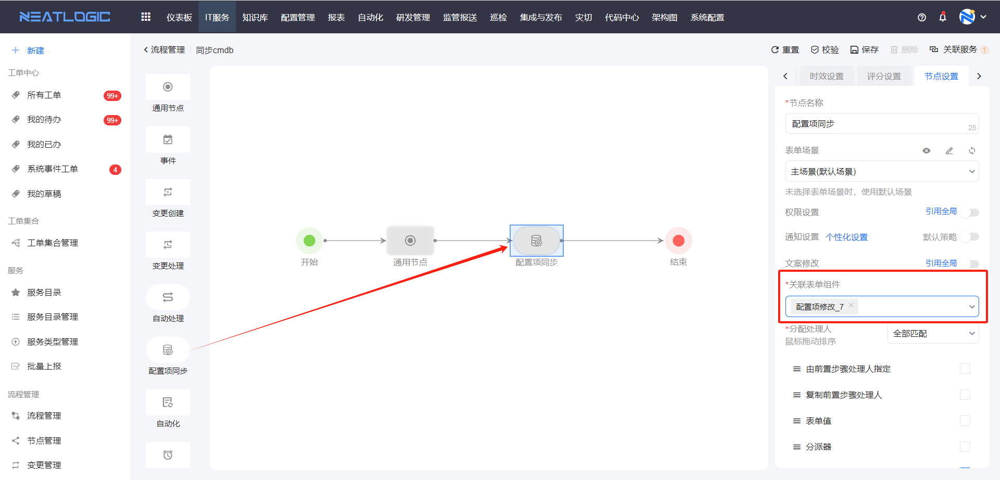

### 2.9. 自动化节点
结合自动化模块的节点，支持通过工单发起自动化作业。
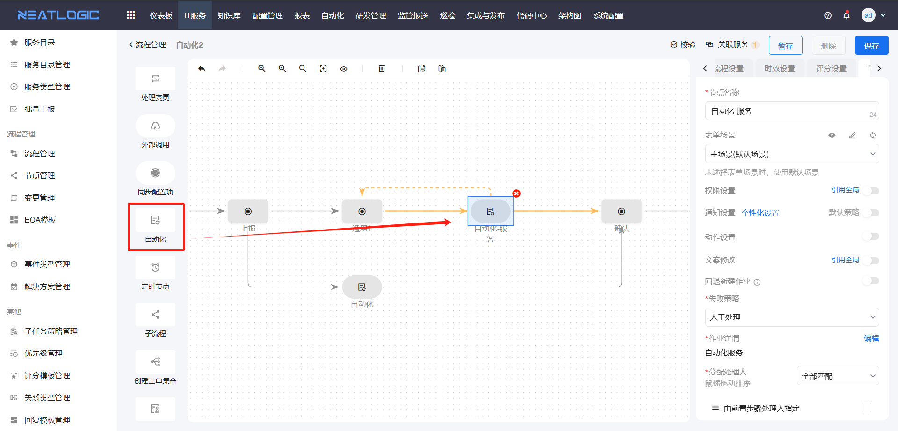
自动化节点的作业详情为必填项。每个节点可添加单个或多个作业，支持引用组合工具或服务两种作业类型。
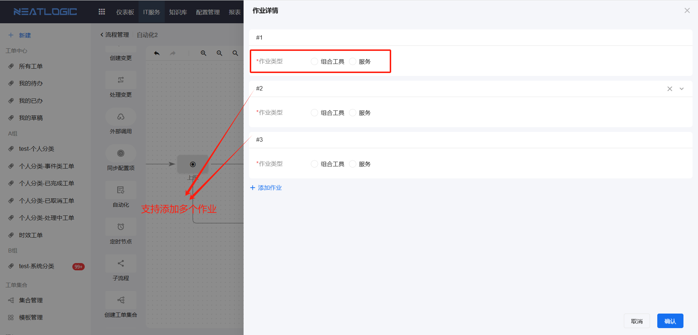

#### 1. 引用组合工具
关联自动化模块中已激活的[组合工具](../../5.自动化/组合工具/组合工具.md)，并配置参数映射。工单节点将根据映射值发起自动化作业。

自动化节点的目标参数与作业参数映射时，映射对象支持常量、表单普通组件、表单表格组件、工单信息和表达式。
- 常量：写入一个固定的值。
  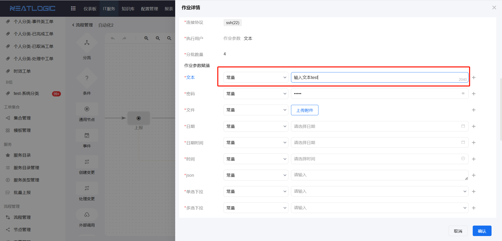
- 表单普通组件：包括表格输入组件和表格选择组件，支持设置数据过滤条件。
  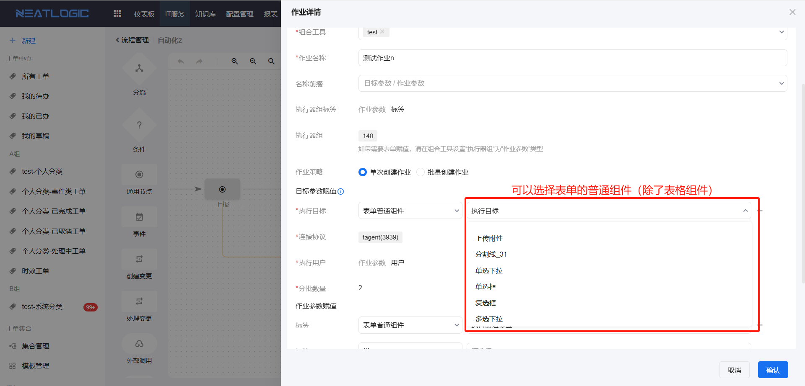
- 表单表格组件：包括表格输入组件和表格选择组件，支持设置数据过滤条件。
  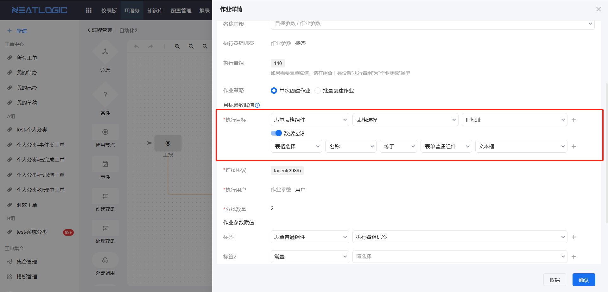
- 工单信息：支持引用工单ID、步骤ID、步骤名称、标题、服务类型、上报内容、上报人等工单信息作为映射值。
  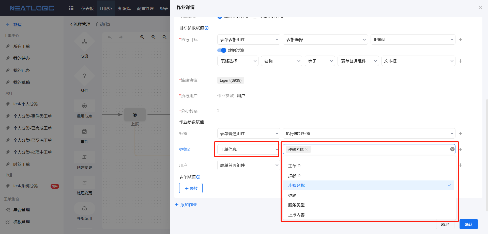
- 表达式：适用于文本类型参数的映射，可由自定义文本与表单组件的值拼接而成。
  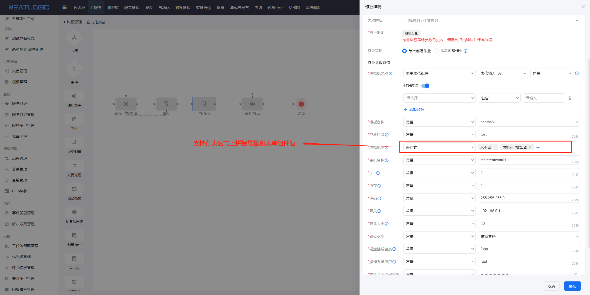

#### 2. 引用服务
关联表单中的自动化服务组件，该组件的数据来源于自动化模块的[服务目录](../../5.自动化/快捷服务/快捷服务.md)。
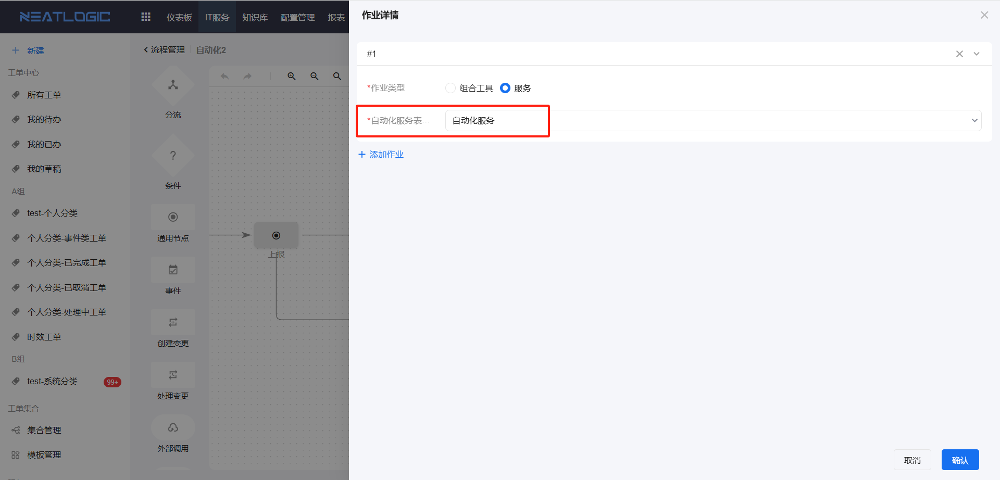

### 2.10. 定时节点
用于定时自动处理的节点，必须关联表单中必填的日期组件。该节点无法人工处理，当系统时间达到设定的日期时间后，自动流转至后置节点。
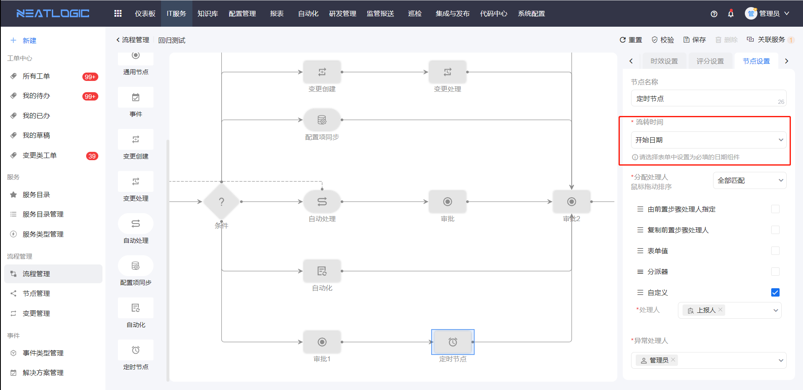

### 2.11. 审批节点
详见[高级场景](流程管理-高级场景.md)

### 2.12. 数据转换节点
详见[高级场景](流程管理-高级场景.md)
  
### 2.13. 子流程节点
详见[高级场景](流程管理-高级场景.md)

### 2.14. 架构图节点
详见[高级场景](流程管理-高级场景.md)

## 3. 流程设置
流程设置作用于整个流程生命周期，包括流程名称、关联表单、权限设置、通知设置、动作设置、标记重复事件。
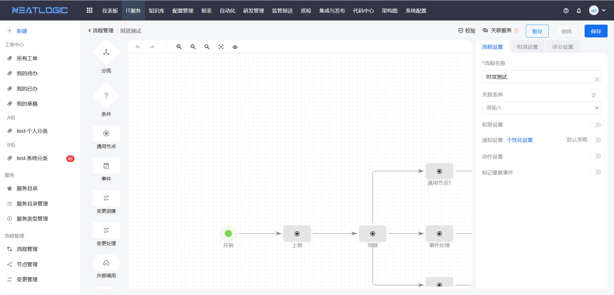

- 权限设置 
包括取消、修改上报内容、催办权限。未启用自定义时，取消和催办权限默认授予上报人，修改上报权限默认授予处理人。启用自定义后，仅授权对象拥有相应权限。 

  * 取消：取消工单，工单状态转为“已取消”，时效策略暂停。

  * 修改上报内容：修改标题、优先级、表单、描述、附件等工单信息。修改表单指修改上报节点的表单场景。
  
  * 催办：对工单进行催办。

- 通知设置 
启用后，需要引用 [通知策略管理](../../100.系统配置/4.通知和订阅/通知策略管理.md)中的“IT服务-工单”模板；若不启用，则使用该模块的默认模板。

- 动作设置 
满足工单操作时触发外部接口调用的场景。外部接口配置来源于[集成管理](../../100.系统配置/3.数据和集成/集成管理.md)。
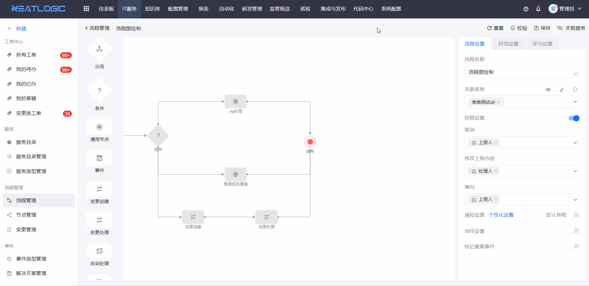

- 标记重复事件 
对于已发起的重复工单，可通过关联重复工单来关闭其他重复的工单。

## 4. 节点设置
点击节点图标，可打开对应节点的设置面板。

### 4.1. 表单场景
表单场景分为默认场景和自定义场景。若未修改，默认使用默认场景。
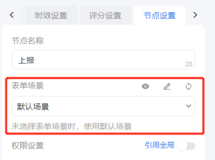

### 4.2. 权限设置
节点权限包括查看节点信息、转交、暂停、撤回。
- 查看节点信息：查看步骤详情中对应节点的信息。若无权限，则无法查看。
- 转交：将工单当前节点的处理权限转交给其他用户。
- 暂停：暂停处理当前节点，工单挂起。
- 撤回：撤回到上一个处理节点。
  
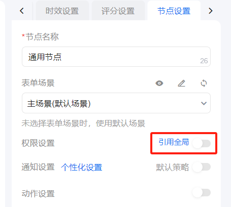

启用开关表示在当前节点进行自定义授权，仅对当前流程的该节点有效。不启用则表示引用全局设置，即使用[节点设置](节点管理.md)中该类型节点的默认授权。工单权限判断时，局部权限优先级高于全局。

### 4.3. 通知设置
通知设置默认引用全局配置。启用自定义后，需关联流程步骤模块的[通知策略](../../100.系统配置/4.通知和订阅/通知策略管理.md)，并可自定义通知策略的触发时机和参数映射。参数支持选择流程属性、表单组件，也支持输入常量。

### 4.4. 动作设置
节点的动作设置与流程设置中的动作设置一致，区别在于触发条件不同。

流程动作触发条件说明：
1. 上报：在工单上报页面完成“提交”操作。
2. 取消工单：在工单详情页/处理页完成取消操作，工单状态变为“已取消”。
3. 恢复工单：在工单详情页，对已取消的工单成功进行恢复操作，工单状态恢复到取消前的状态。
4. 完成工单：工单流转到结束节点，工单状态变为“已完成”。
5. 待评分：启用评分的工单流转到结束节点后，状态变为“待评分”。
6. 评分：启用评分的工单完成评分提交后，状态变为“已评分”。
7. 重新打开工单：启用评分且允许从结束节点回退到前置步骤的工单，在流转到结束节点并完成回退操作后，状态重新变为“处理中”。
8. 标记重复事件：启用标记重复事件的工单，完成关联重复工单的操作。
9. 删除工单：删除当前流程的工单。

节点动作触发条件说明：
1. 步骤激活：工单流转到该步骤节点时立即触发。需在被激活的节点上配置。
2. 分配异常：工单流转到某步骤，但按节点处理人分配策略未匹配到任何用户时触发。需在发生分配异常的节点上配置。
3. 步骤开始：工单步骤激活后，执行开始操作时触发。需在开始的节点上配置。
4. 步骤转交：转交工单当前步骤的处理人时触发。需在转交的节点上配置。
5. 步骤成功：工单流转到下一个步骤，即前一步处理完成时触发。需在处理完成的节点上配置。
6. 步骤回退：在有回退路径的节点发起回退时触发。需在发起回退的节点上配置。
7. 步骤撤回：撤回到上一个节点时触发。需在发起撤回的节点上配置。
8. 步骤暂停：暂停当前正在处理的节点时触发。需在暂停的节点上配置。
9. 步骤恢复：恢复已暂停的步骤时触发。需在恢复暂停的节点上配置。
10. 步骤失败：自动执行的步骤执行失败时触发。需在失败的节点上配置。
11. 步骤催办：在处理中的步骤发起催办时触发。需在发起催办的节点上配置。
12. 步骤回复：在处理中的步骤回复内容时触发。需在回复的节点上配置。
13. 发起审批：处理审批节点时，发起审批链的操作。仅审批节点有此触发点。
14. 激活审批步骤：审批节点发起审批链后，链中的审批步骤被激活时触发。仅审批节点有此触发点。
15. 转交审批步骤：审批节点已发起审批链，转交当前正在处理的审批步骤处理人时触发。仅审批节点有此触发点。
16. 同意审批步骤：审批节点已发起审批链，审批步骤处理人执行同意操作时触发。仅审批节点有此触发点。
17. 驳回审批步骤：审批节点已发起审批链，审批步骤处理人执行驳回操作时触发。仅审批节点有此触发点。
18. 审批成功：审批节点的审批链结束，节点处理人确认审批成功时触发。仅审批节点有此触发点。
19. 审批失败：审批节点的审批链结束，节点处理人确认审批失败时触发。仅审批节点有此触发点。

### 4.5. 重审
重审指回退后一键处理并流转回回退前的节点。因此，启用重审的节点必须存在连入的回退线，该设置才有效。
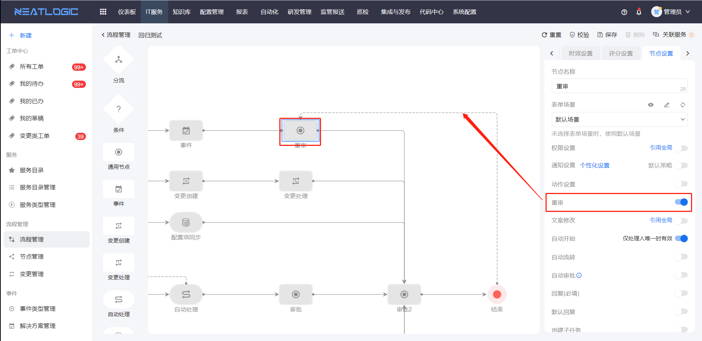

### 4.6. 文案修改
未启用时，默认引用全局设置。启用修改文案后，可自定义工单按钮、节点状态以及详情页页签标题的文案。
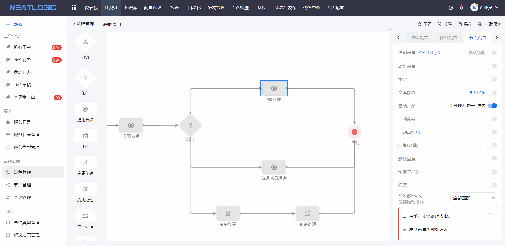

### 4.7.自动开始
该设置适用于节点仅分派给一个处理人的场景。启用后，节点可自动开始处理。

### 4.8. 自动流转
启用自动流转后，当工单处理到该节点时，系统将自动完成流转，无需人工处理。

### 4.9. 自动审批
自动审批指当前节点分派的处理人包含上一个节点的处理人时，当前节点自动完成处理。该功能由[系统参数](../../100.系统配置/5.基础服务/基础服务.md)“processtask.step.autoapproval.show”控制，参数值为 1 时，流程节点可使用自动审批功能；参数值为 0 时，该功能隐藏。

配置条件：
1. 在需要自动审批的节点启用自动审批配置。
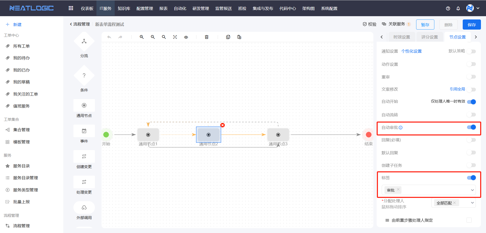
2. 在启用自动审批的节点及其上一个节点，添加相同的标签（例如“审批”）。
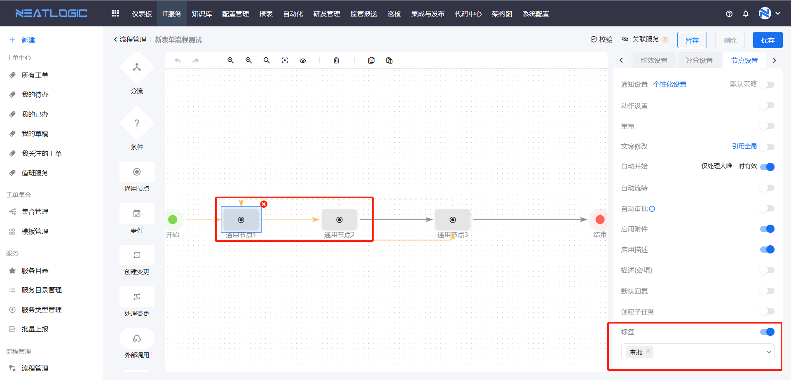

### 4.10. 回复必填
启用回复必填后，工单处理到该节点时，将校验回复内容是否为空。若为空，则无法流转。

### 4.11. 默认回复
节点可配置默认回复模板，模板来源于[回复模板管理](../其他/其他.md)。处理工单对应节点时，回复框将自动填充模板内容。默认回复生效需满足条件：处理人拥有该回复模板的权限。
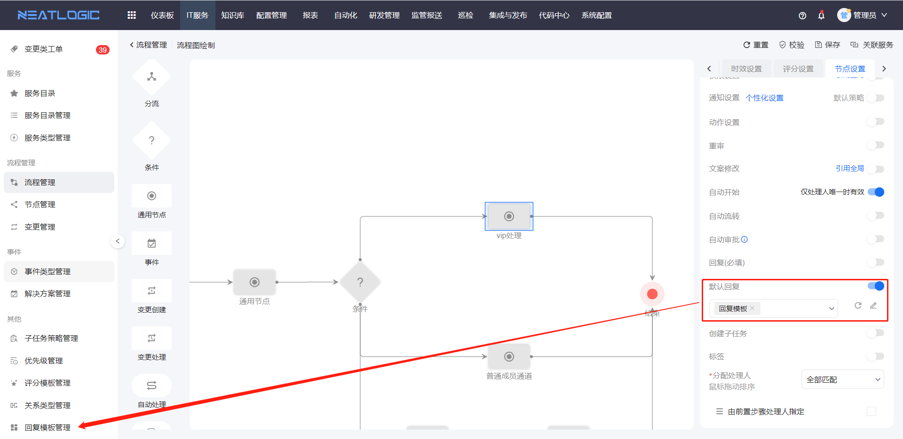

### 4.12. 创建子任务
配置了[子任务策略](../其他/其他.md)的节点，在工单处理时支持添加子任务。
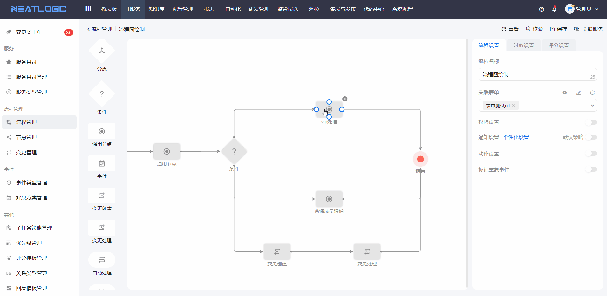

### 4.13. 分配处理人
节点分配处理人的策略包括：前置步骤处理人指定、复制前置步骤处理人、表单值、分派器、自定义分派。匹配方式支持全部匹配和顺序匹配。

- 全部匹配：将匹配成功的所有策略分配到的用户全部作为处理人。
- 顺序匹配：按顺序匹配第一个成功的策略，并将其分配到的用户作为处理人。

#### 4.13.1. 由前置步骤处理人指定
前置步骤流转时，可指定当前节点的处理人。此策略需关联前置步骤。
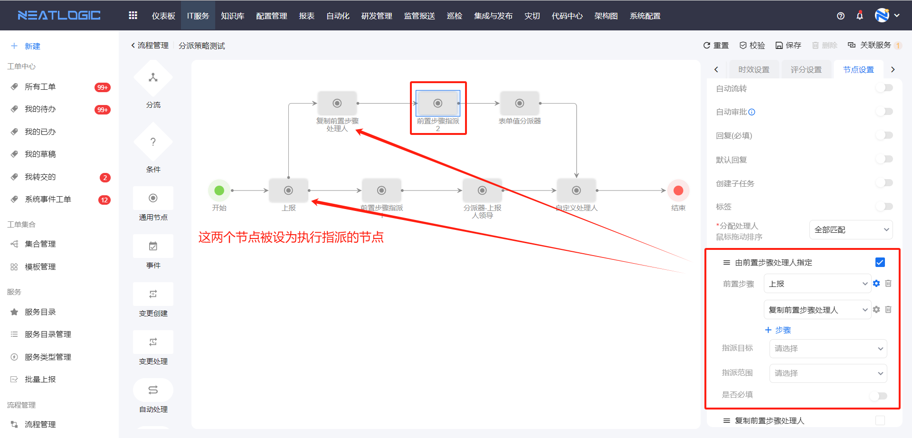
- 若前置步骤未设置条件路径，则流转时默认显示指派操作。

- 若设置了条件路径，则仅当选择该条件路径时，才显示指派操作。
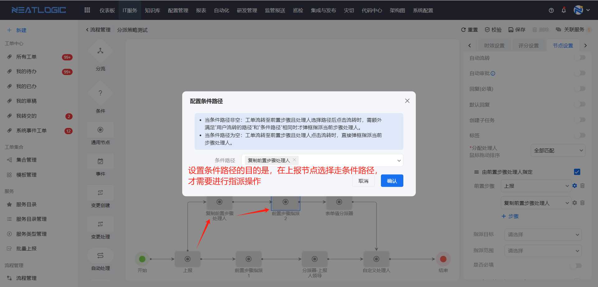

指派目标：指派时可选择的对象类型，包括用户、分组和角色。若仅选择用户，则指派对象下拉框只显示用户。
指派范围：指派时可选择的具体对象范围，可选对象类型根据指派目标展示。
- 指派范围为空，则不限制范围。
- 若指派目标是角色或分组，则指派时的分组或角色需与指派范围一致。
- 选择指派范围后，可选择的用户对象为指派范围的并集，包括指定的用户、分组成员、角色成员，以及角色关联的分组成员。如下图所示。
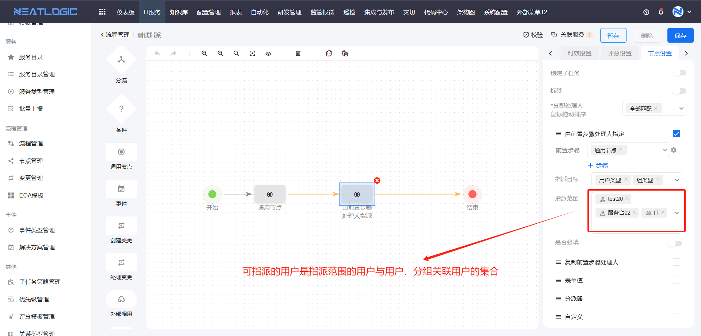
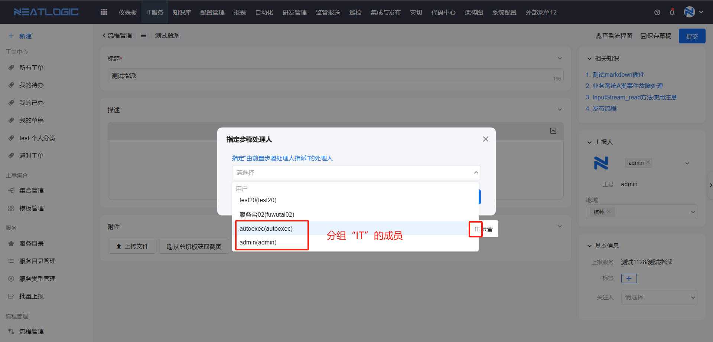
   
#### 4.13.2. 复制前置步骤处理人
工单流转至当前节点时，将复制关联的前置节点的处理人作为本节点的处理人。此策略需关联前置步骤。

#### 4.13.3. 表单值
需关联用于映射的表单组件，支持用户选择器、下拉框和文本框组件。

- 引用下拉框组件时，其“值”的映射对象支持用户的 uuid 和 userid。
- 引用文本框组件时，输入值需匹配用户的 userid 或 uuid。
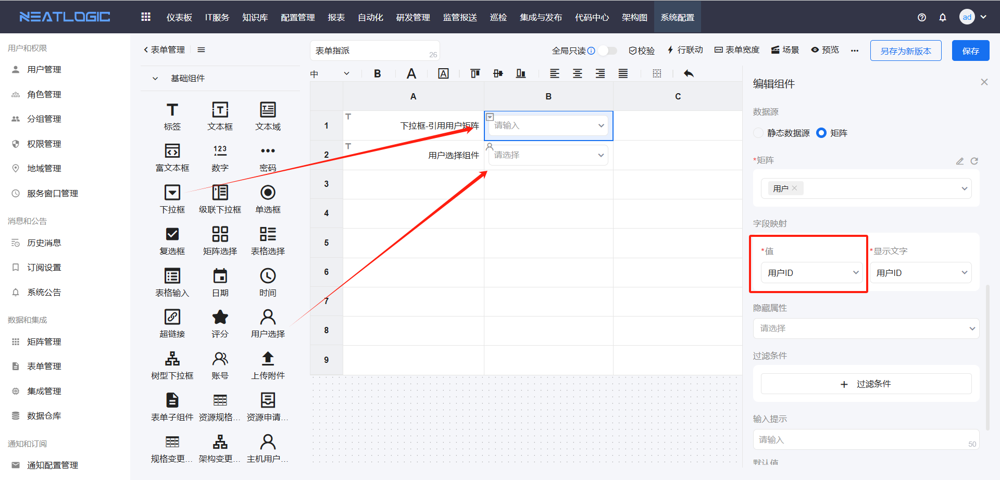

#### 4.13.4. 分派器
需关联分派器。工单流转至节点时，将根据分派器的逻辑自动指定处理人。

1. 处理人领导分派器

    根据前置步骤的处理人，查找其所在的所有分组的所有领导，并将匹配到的所有用户指定为待处理人。
    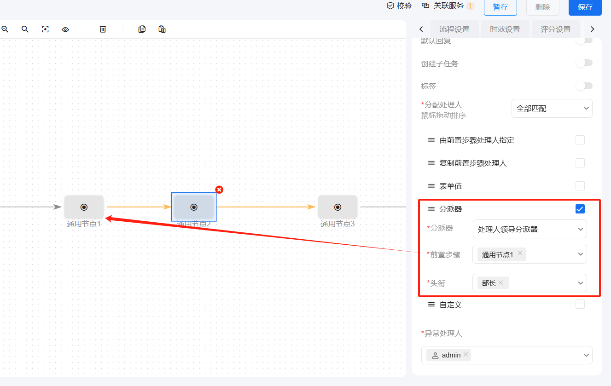

2. 分组领导分派器

    查找指定分组的全部领导，并将匹配到的所有用户指定为待处理人。
    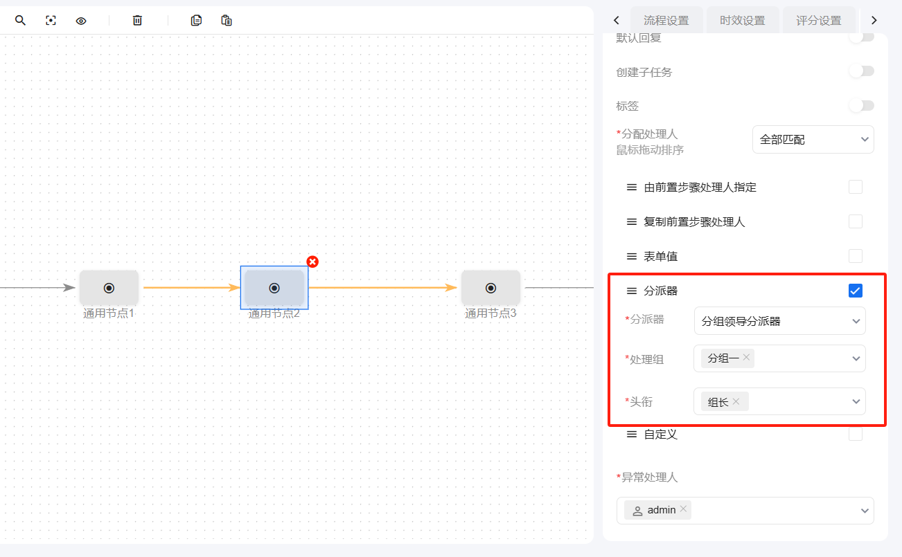

3. 根据工作量分配处理人

    在指定分组中，将任务分配给待处理工单数量最少的成员。若最少数量对应多个成员，则全部匹配为待处理人。
    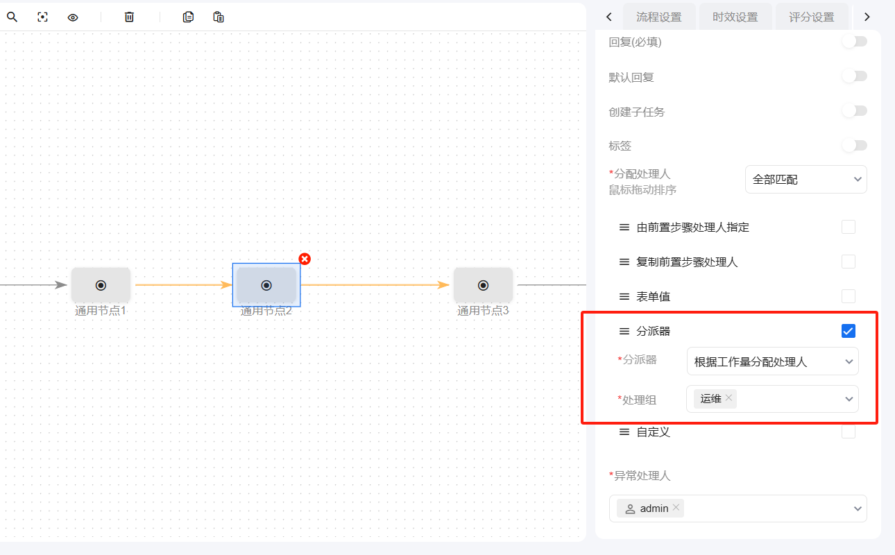

4. 上报人领导分派器

    查找上报人所在的所有分组的全部领导，并将匹配到的所有用户指定为待处理人。
    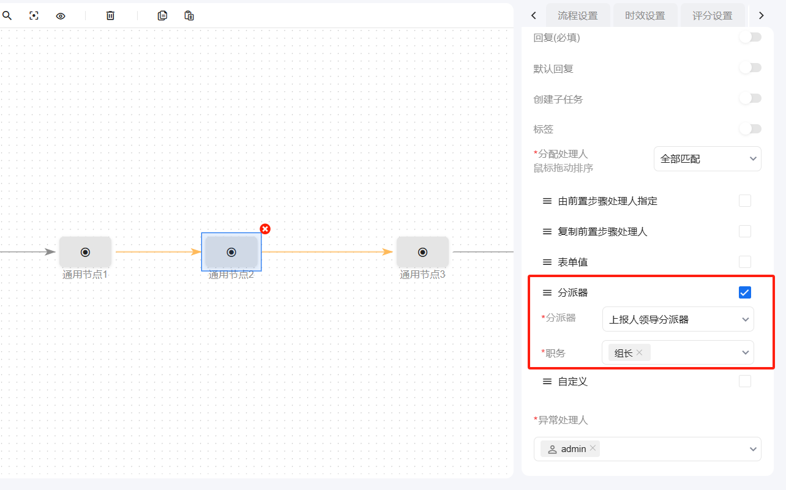

5. CMDB分派器。
  
    支持通过模型或视图的属性与表单组件进行映射，将匹配到的用户、分组或角色作为节点待处理人。

    配置项包括数据类型、数据来源、匹配映射、处理人和优先级。匹配映射的关键在于：[表单](../../100.系统配置/3.数据和集成/表单管理.md)组件必须引用[配置项矩阵](../../100.系统配置/3.数据和集成/矩阵管理.md)，且该矩阵引用的配置模型需与匹配映射的属性为同一模型。
    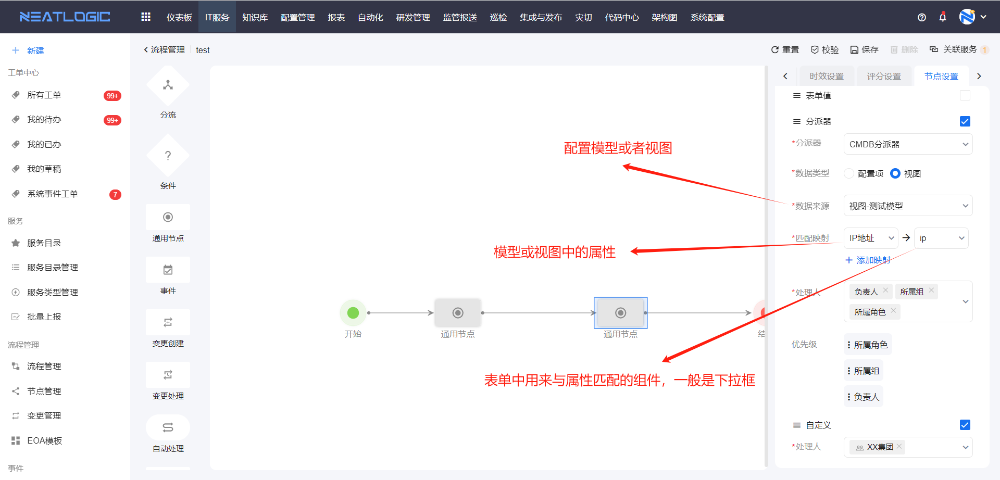

    注意：当匹配到的配置项不唯一，或匹配到唯一对象但系统中不存在该对象时，CMDB分派器无法生效，节点将自动分配给异常处理人。

#### 4.13.5. 自定义
直接选择分派对象，支持上报人、代报人、用户、角色和分组。
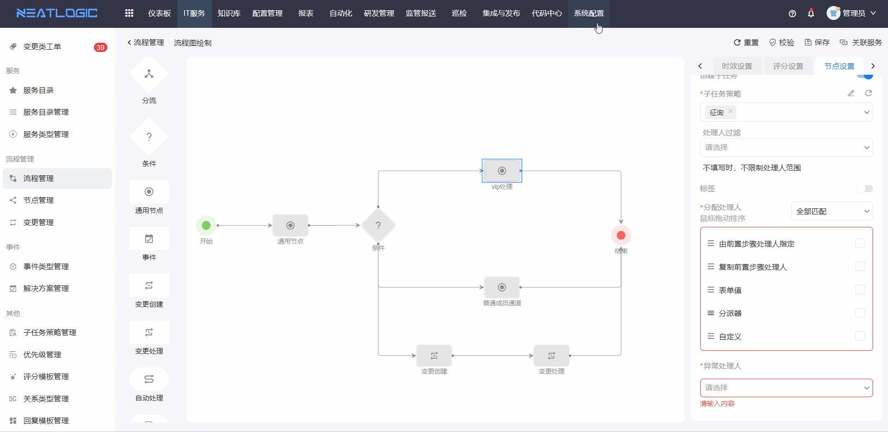

### 4.14.异常处理人
当节点分配处理人出现异常时生效，节点将自动分配给此处指定的异常处理人。该字段为必填项。
  
## 5. 时效设置
添加时效策略步骤：点击“添加时效策略” → 配置时效 → 保存。
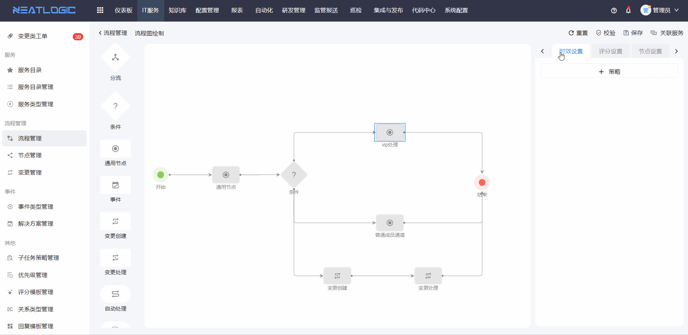
关联步骤：选择时效关联的步骤。若关联多个步骤，步骤耗时详情请参考计算规则提示。当流转到关联步骤（满足生效条件）时，时效即被激活。
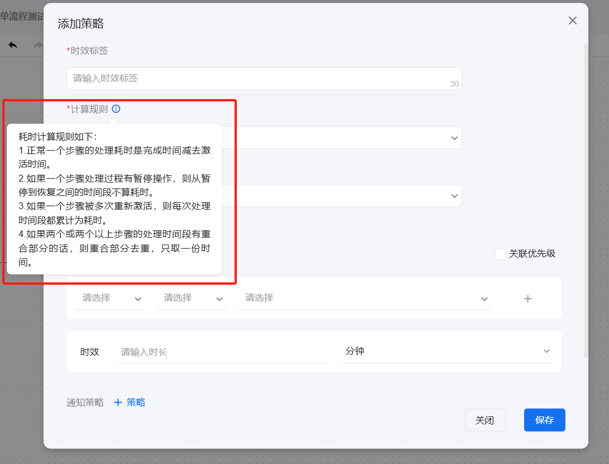

## 6. 评分设置
评分设置步骤：启用评分 → 选择[评分模板](../其他/其他.md)→ 配置自动评分。

流程启用评分设置后，结束节点支持拉取回退线到前置节点；未启用评分时，结束节点不支持回退。
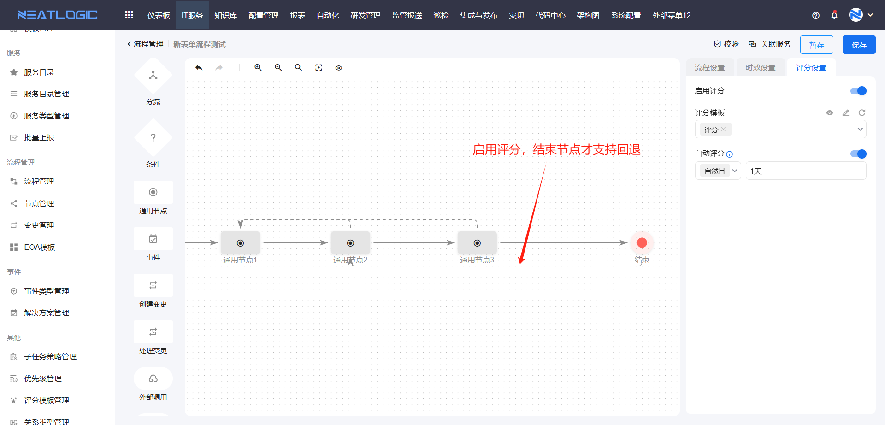
自动评分：若未在指定时间段内完成评分，系统将自动给予好评。
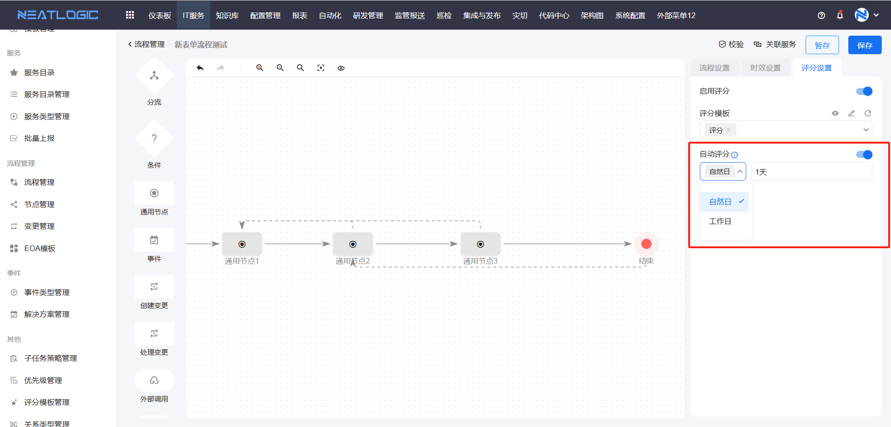
