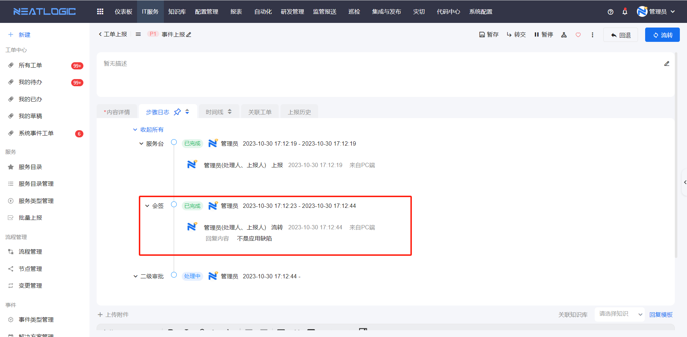
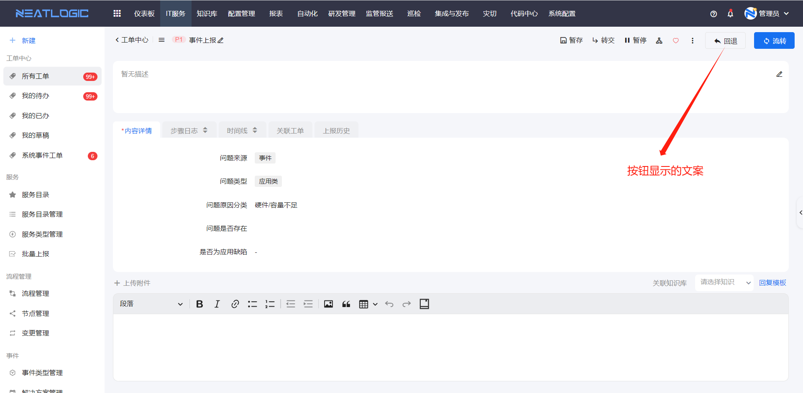
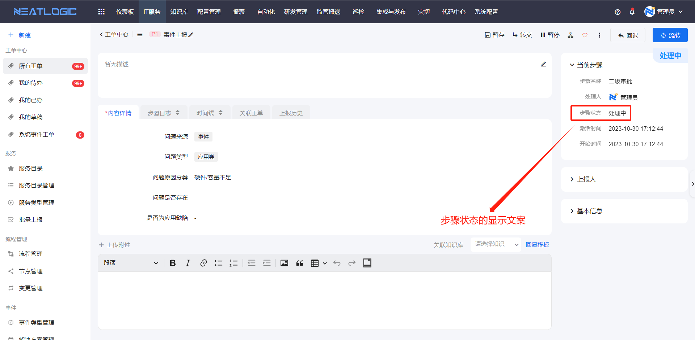
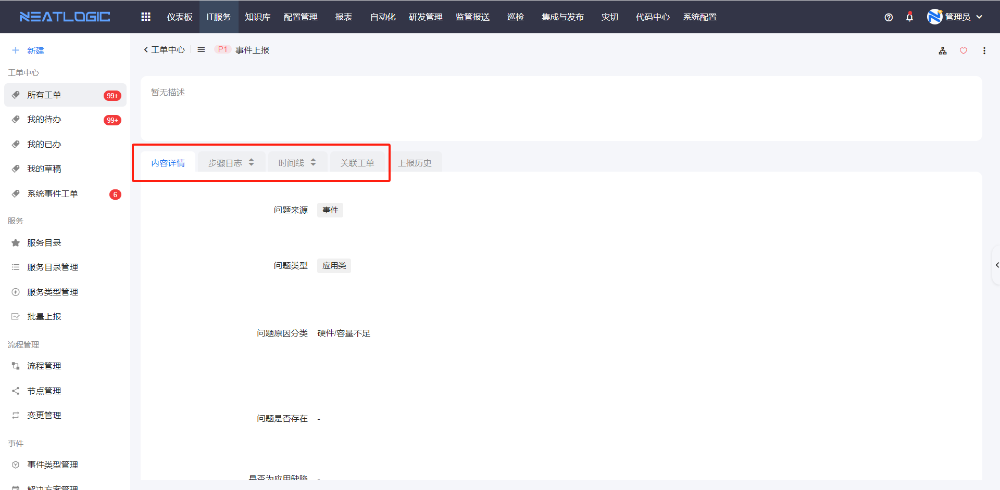

# 节点管理
节点管理页面是管理所有流程节点的全局配置，包括授权、按钮映射、状态映射和其他映射。

权限类型，不同流程节点包含的权限不完全一样，但是可以汇总成下面四个权限。
- 查看节点信息：节点信息是指工单步骤日志中，节点的信息。用户缺少该权限时，步骤日志中对应节点的信息无法查看，并提示缺少查看权限。
  
- 转交：将工单节点转给其他用户处理。
- 暂停：暂停处理工单步骤。
- 撤回：撤回到上一个处理节点。

按钮映射，指按钮上的显示文案，修改后，该类型节点的对应按钮全局显示文案更新。

状态映射，指步骤节点的状态显示文案，修改后，该类型节点的对应状态全局显示文案更新。

其他映射，这里是指工单详情页面，内容详情、步骤日志、时间线、关联工单几个页签的显示名称。
