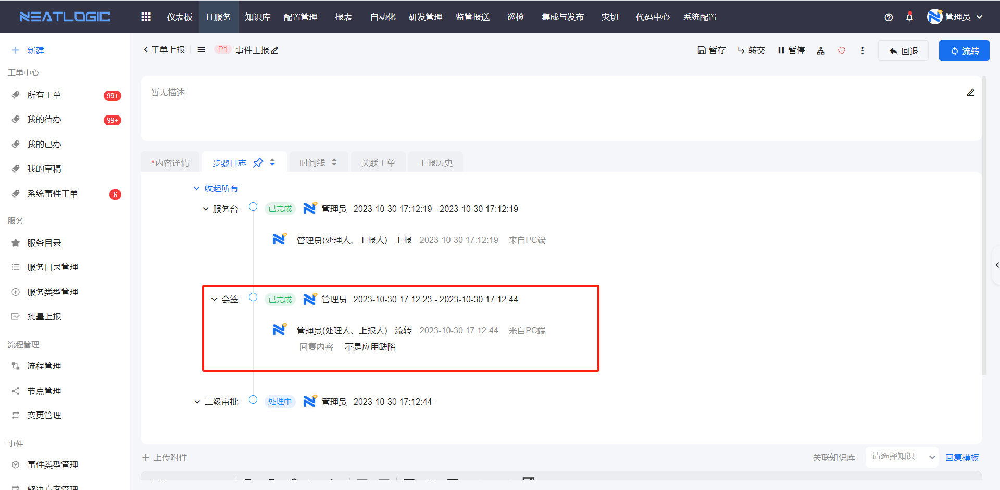
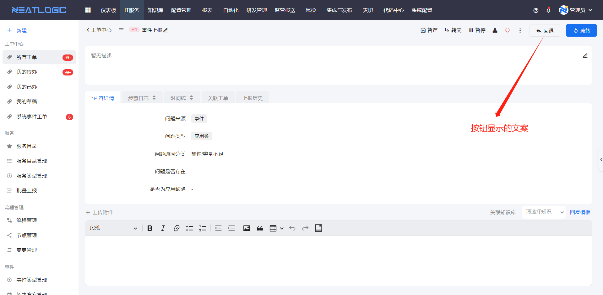
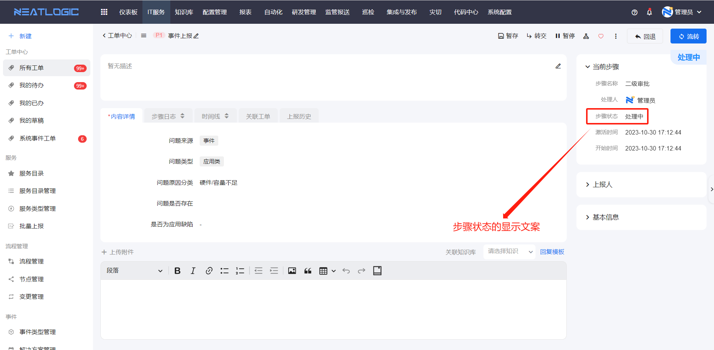
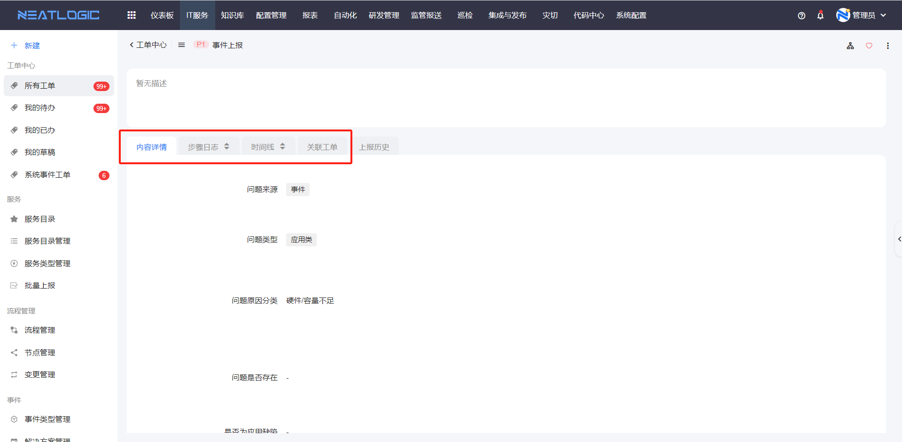

# 节点管理
节点管理用于维护流程节点的全局显示和默认权限。

当多个流程都会用到同一类节点时，可以先在这里统一配置查看权限、按钮文案、状态名称和页签名称。后续流程如果没有单独覆盖节点设置，就会沿用这里的全局规则。

本文主要说明节点管理会影响哪些工单处理行为，以及这些全局配置和[流程管理](流程管理.md)中节点局部配置的关系。

## 阅读路径

如果你只是想确认用户为什么看不到节点内容，先看“权限类型”。如果你需要调整工单处理页面上的按钮、状态或页签文案，可以直接查看“按钮映射”“状态映射”和“其他映射”。

**操作权限**
- 配置权限：系统配置-[用户管理](../../100.系统配置/1.用户和权限/用户管理.md)-授权-节点管理权限
- 配置人员：系统超级管理员

## 权限类型
权限类型决定用户在工单处理过程中能不能查看节点内容、转交当前步骤，或把工单拉回前面的处理节点。

不同节点可配置的权限略有差异，但常见权限可以归为以下几类：

- **查看节点信息**：控制用户能否在工单步骤日志中查看该节点的详细内容。若用户没有权限，节点信息不可见，并提示“缺少查看权限”。
  
- **转交**：允许将当前工单节点转交给其他用户处理。
- **暂停**：允许暂停当前工单节点的处理流程。
- **撤回**：允许将工单撤回至上一个处理节点。

## 按钮映射
按钮映射用于统一工单处理页面上的操作按钮文案。

如果某类节点的按钮名称不符合业务表达，可以在这里调整。修改后，所有未单独配置文案的同类型节点都会使用新的按钮名称。

## 状态映射
状态映射用于统一步骤状态在工单页面中的展示名称。

当业务人员更习惯使用自己的状态叫法时，可以通过状态映射调整显示文案。修改后，同类型节点下对应状态的展示名称会全局生效。

## 其他映射
其他映射用于调整工单详情页和处理页中的页签名称。

常见页签包括“内容详情”“步骤日志”“时间线”和“关联工单”等。通过这里统一命名，可以让不同流程中的工单页面保持一致。

