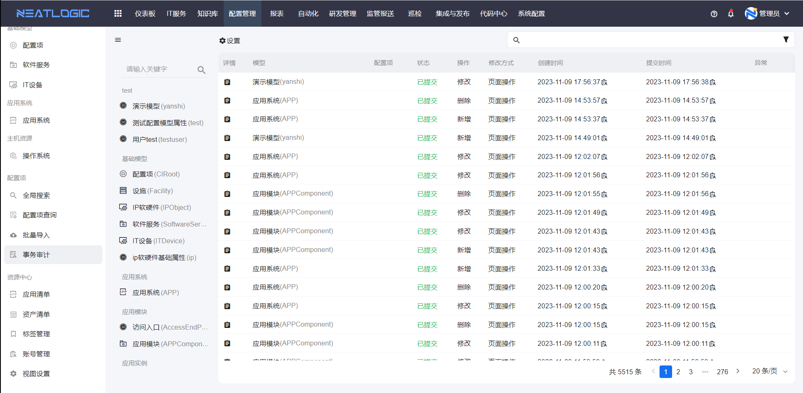
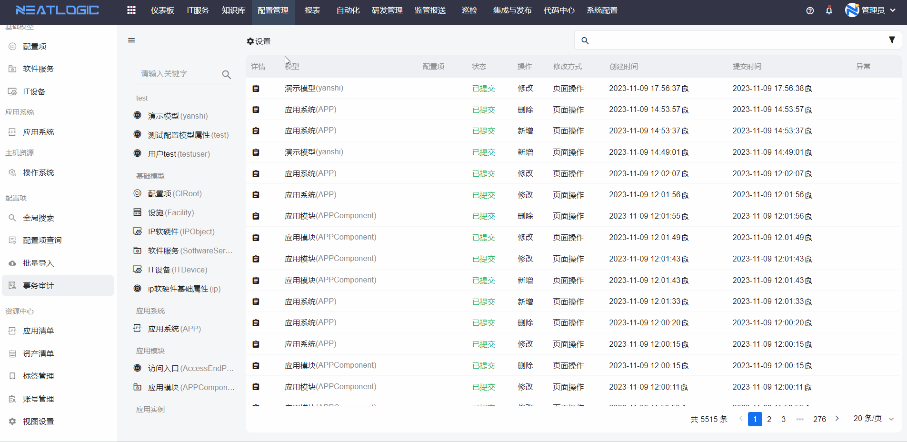
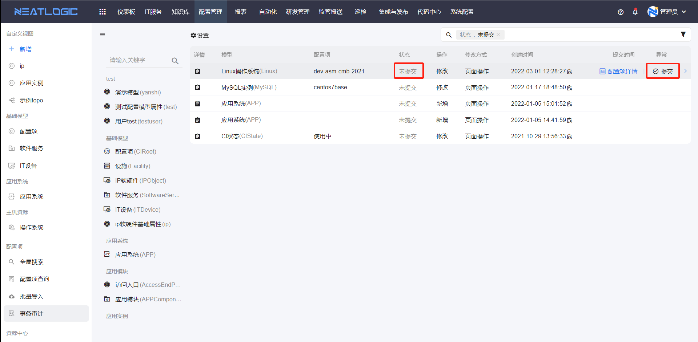
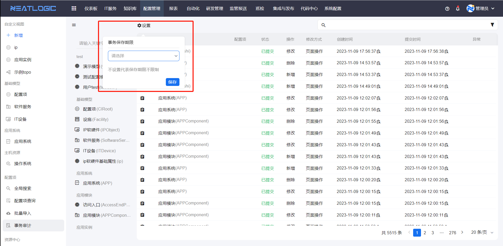

# 事务审计
事务是指配置项增删改操作的事务。

事务审计中汇总了所有模型的配置项的操作事务，包括事务所属模型、操作类型、状态、创建时间、提交时间和异常信息等。

事务审计页面支持按模型、状态、操作、时间过滤事务，并且可以查看事务所属的配置项详情，还可以提交或者恢复事务。事务审计的数据会不断累加，客户可以设置事务保存期限，实现只保留一段时间内的事务。
- 事务过滤
  
- 查看配置项详情，操作类型为删除且已提交的事务无查看配置项详情操作。
  
- 恢复，恢复到操作前的配置项数据。
  
- 提交，状态为未提交的事务，可以执行提交操作，提交完成后配置项才会根据事务操作更新。
  
- 事务保存期限，以事务的创建时间为标准，保留创建时间在保存期限内的事务，超出期限的事务系统自动删除，事务保存期限为空，则保留所有事务。
  