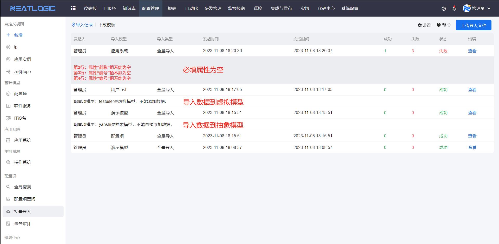

# 批量导入
批量导入是为了满足批量将配置项数据导入到同一个模型，添加的方式有只添加、只更新和添加并更新，属性数据更新的方式包括全局更新和非全局更新。

批量导入的步骤：下载模板-填写模板数据-导入模板并添加数据

## 下载模板
在批量导入页面，切换到下载模板窗口，选择需要导入数据的模型并勾选属性，接着下载模板即可，导出的模板包括选择的属性和配置项id和uuid。

## 导入
在配置模型模板中填写数据后并保存文件，上传到系统并添加即可，配置项id为空的数据只能用于增量导入。

关于添加数据的方式说明：
- 只添加，是指增量导入，只导入id列为空的配置项。
- 只更新，是指存量导入，只导入id列不为空的配置项，如果id对应的配置项不存在，则忽略。
- 添加并更新，是指全量导入，添加id列为空的配置项，编辑id不为空的配置项，如果id对应的配置项不存在，则忽略。

关于属性数据更新方式说明：
- 全局更新，配置项的所有属性都以表格内容为准，全部更新；
- 非全局更新，只更新表格中存在的属性，不存在的属性保持不变。

关于无法导入数据的场景：
- 导入数据的模型是虚拟模型。
- 导入数据的模型是抽象模型。
- 导入的数据中，必填属性或关系为空，对应的数据导入失败
