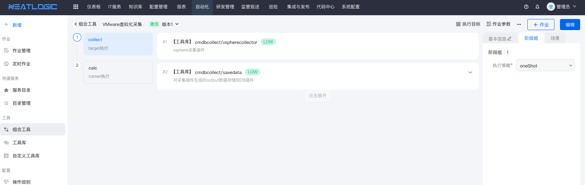
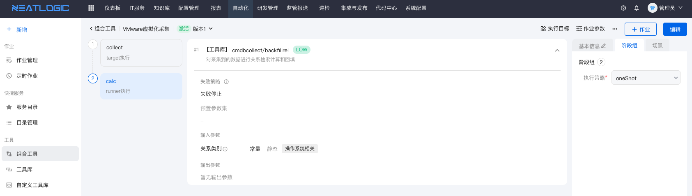
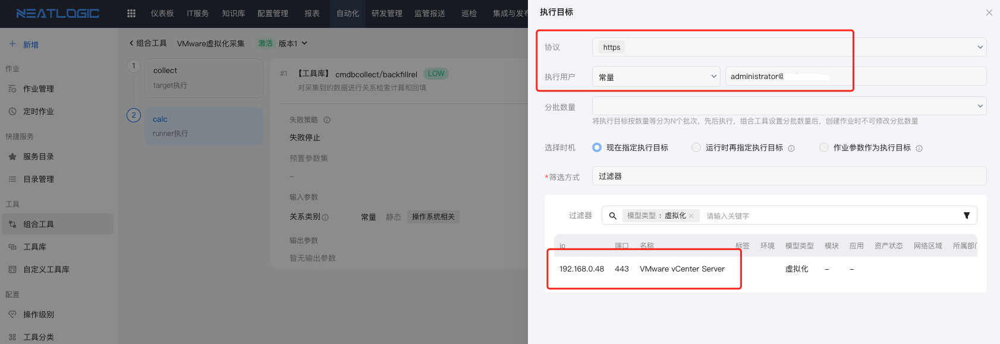

# 虚拟化平台采集
虚拟化采集主体包括：数据中心、集群、集群与物理机关系、集群与操作系统关系、存储关系等，同时也是对[操作系统采集](2.操作系统采集.md)的数据进行关系计算和数据补充。

## 支持虚拟化列表
<table style="width:100%">
<thead>
    <tr>
        <td>类型</td>
        <td>协议</td>
        <td>必要条件</td>
        <td>采集概要描述</td>
    </tr>
</thead>
<tbody>
    <tr>
        <td>VMware vSphere</td>
        <td>https</td>
        <td>提供管理账号/密码</td>
        <td>采集基础信息、数据中心、集群、物理机、存储等</td>
    </tr>
    <tr>
        <td>FusionCompute</td>
        <td>https</td>
        <td>提供管理账号/密码</td>
        <td>采集基础信息、数据中心、集群、物理机、存储等</td>
    </tr>
    <tr>
        <td>SMTX</td>
        <td>https</td>
        <td>提供管理账号/密码</td>
        <td>采集基础信息、数据中心、集群、物理机、存储等</td>
    </tr>
</tbody>
</table>

# 组合工具和采集工具
虚拟化采集可以是以runner或runner_target执行方式，基于虚拟化平台提供的SDK或API方式抓取和采集数据。

<b>说明：</b>此处只枚举一个案例，更多同类工具和使用参见[工具库](../../5.自动化/工具/工具库.md)的工具帮助和说明。

## 虚拟化Vcenter采集组合工具示例
虚拟化采集工具和采集的数据归档到MongoDB，详情参考 [组合工具](../../5.自动化/工具/组合工具.md)、[工具库](../../5.自动化/工具/工具库.md)文档。

计算采集数据关系

## 采集目标和节点范围
虚拟化采集以配置模型内的虚拟化数据为执行节点，插件执行时自动获取节点的IP、端口、以及用户和密码，配置详情参考 [组合工具](../../5.自动化/工具/组合工具.md)文档。

## 采集数据同步到配置管理
<b>关于配置映射和策略执行:</b> 详细参考[同步数据配置映射](8.同步数据配置.md)。

