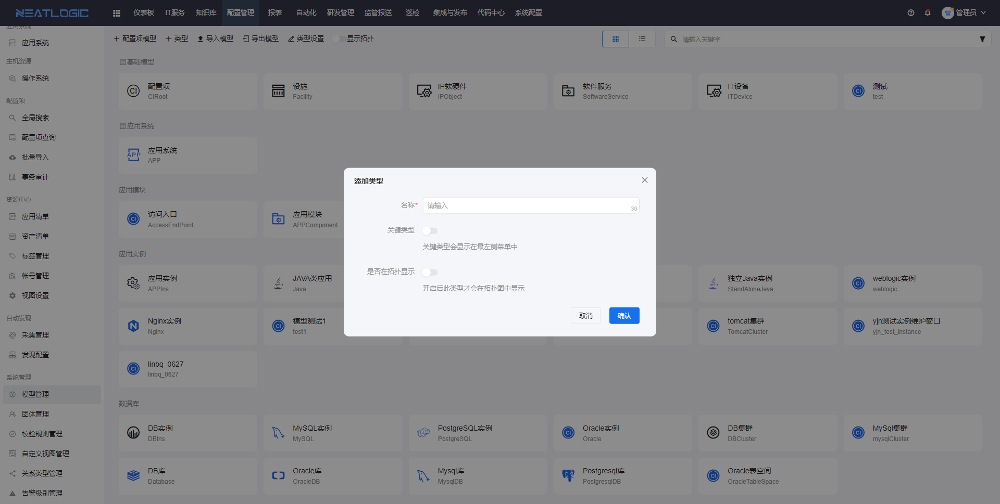
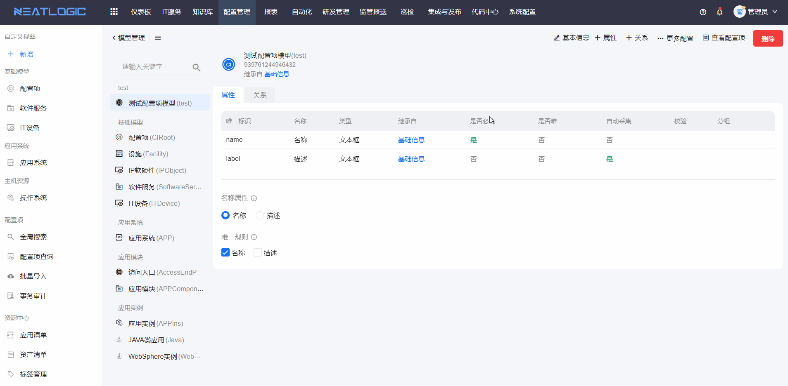
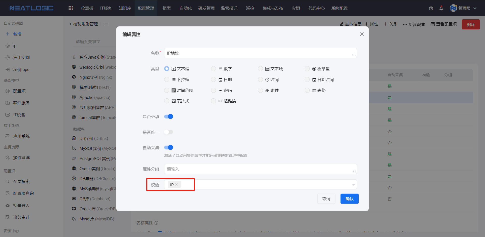
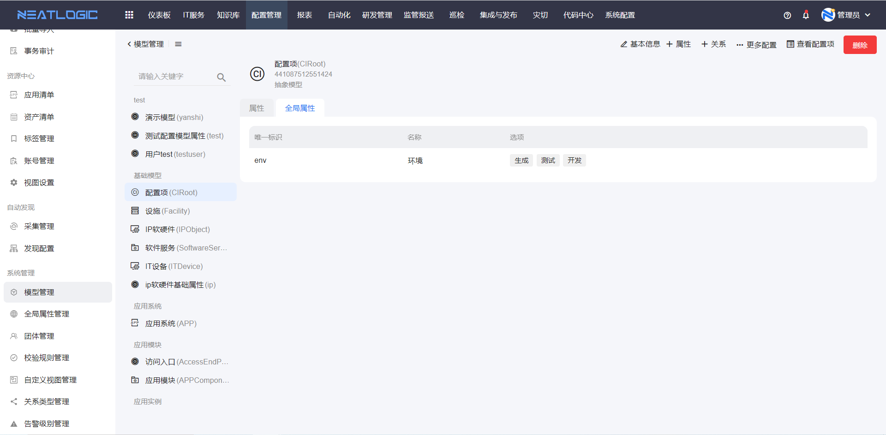
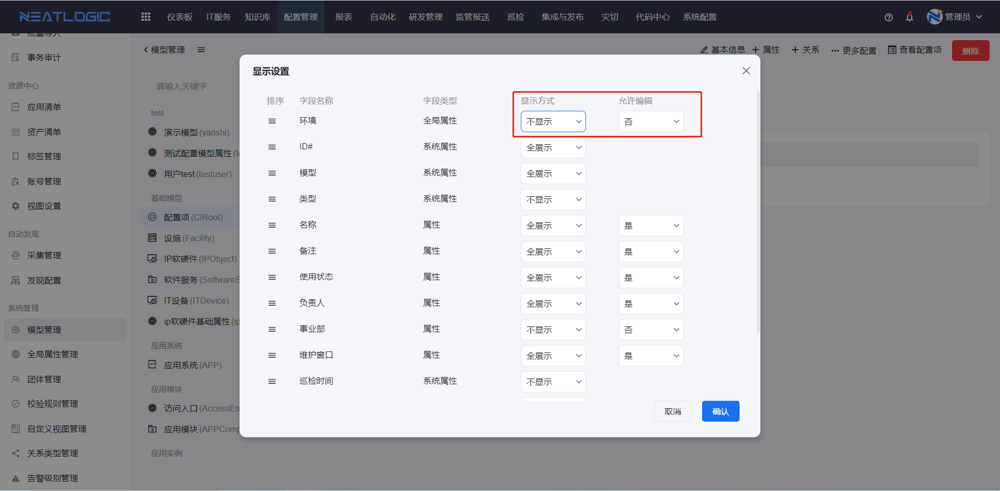
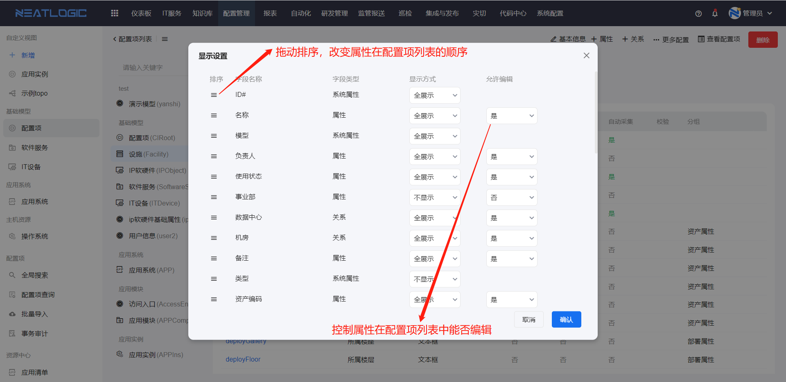
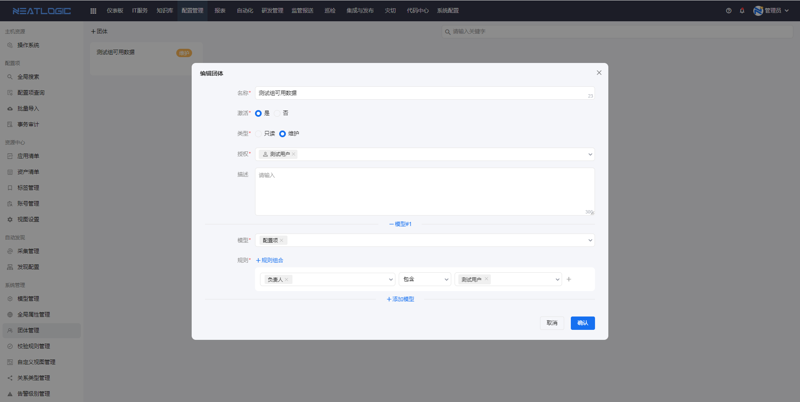
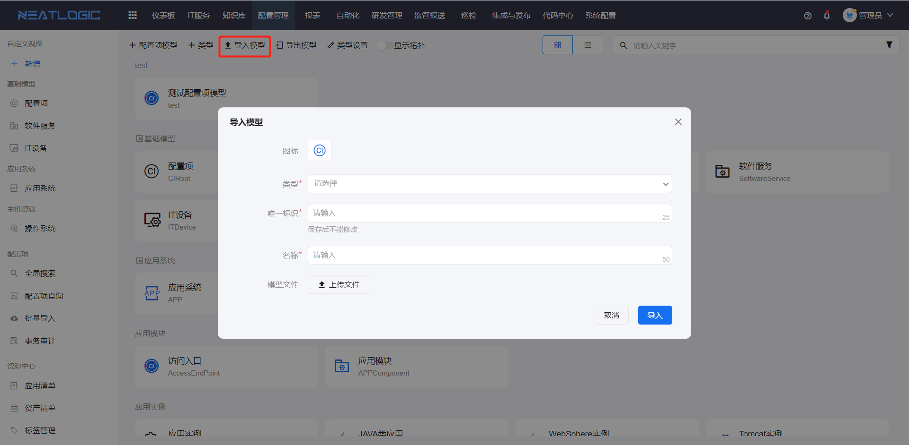

# 模型管理
## 名词解释
* 抽象模型：抽象模型主要用于继承，代表一类实体，用于管理公共属性，也可以用于组成拓扑图的骨干网络。例如应用实例是一个抽象模型，泛指所有应用进程，可以分别创建java实例、nginx实例、tomcat实例、weblogic实例等“普通模型”来继承它。抽象模型会汇总所有继承该模型的模型配置项数据。
  
* 虚拟模型：用于把外部数据纳入CMDB进行管理，让其数据可以作为一个配置项进行消费。应用比较广泛的场景是引入用户信息或组织架构信息。虚拟模型的本质是通过视图来获取数据，所以配置项数据不能编辑和删除。需要回到数据的源头进行管理。
  
* 普通模型：代表具体的实体，可以录入配置项，就是上面提到的java实例等模型。普通模型也能被继承。
* 名称属性：在拓扑展示和关系展示时，作为配置项名称的属性值，名称属性只能选一个。
* 唯一规则：选择一个或多个属性作为配置项的唯一性校验的规则。
## 模型类型
访问位置：配置管理>系统管理>模型管理
 
模型类型相关功能包括添加、类型设置和删除。引用模型类型的配置项模型为0时，模型类型隐藏。
 

### 添加类型

### 类型设置
设置类型名称、排序、关键类型、在拓扑中显示和删除类型。关联模型数量为零的类型才允许删除，且在模型列表中隐藏。

关键类型：重点显示在左侧导航目录中的类型，方便用户快速找到类型及其下的关键模型。当关键类型下无关键模型时，导航列表隐藏关键类型。

在拓扑中显示：显示拓扑图时，显示类型中所有的配置项模型。

## 配置项模型
配置项模型可手动添加，或通过导入添加。
添加配置项模型主要包括两个步骤，首先是填写模型基础信息，然后是根据需求添加模型的属性和关系。

### 模型基本信息
模型基本信息有类型、图标、唯一标识、名称、继承、抽象模型、虚拟模型等设置。

### 模型属性
模型的属性类型总共有十种，分别是文本框、数字、文本域、枚举型、下拉框、日期、时间、日期时间、时间范围、密码、附件、表格、表达式和超链接。其中下拉框、表格和表达式比较特殊，存在引用关系。

下图是添加一般属性的示意图，属性名称、唯一名必填，属性分组选填。属性分组用于对模型属性分组归类，效果在[配置项](../配置项查询/配置项查询.md/#配置项详情)详情页面可见。

属性-下拉框

属性-表格

属性-表达式

如果模型的属性需要[采集数据](../数据采集/1.数据采集和巡检.md)，必须在属性设置中启用自动采集配置，采集映射管理中才能配置属性的映射关系。

如果模型的属性需要限制输入的规则，例如文本框只允许输入ip地址，但是文本框输入默认没有限制，可以通引入校验规则来限制输入的值，校验的选项来自[校验规则管理](../系统管理/校验规则管理.md)。

### 全局属性
 模型的全局属性数据来自[全局属性管理]()，模型中不能修改全局属性。如果全局属性中没有数据，所有模型都会隐藏全局属性页签。
 
 如果不想使用全局属性，可以在显示编辑设置中设置不显示和不允许编辑。
 

### 模型关系
模型关系是用于建立与其他模型的关联关系的，包括关系类型、上下游、关联个数、是否唯一、级联删除等配置。

* 关系类型：用于定义两个关联模型之前的关系，例如属于、包含等。在查看配置项详情的拓扑图时，可以通过关系来过滤关联配置项。关系类型的数据源可在[关系类型管理](../系统管理/关系类型管理.md)页面自定义。
* 上下游：上下游就是定义在拓扑图中模型所处的上下游关系。
* 关联个数：这里是控制上、下游模型的一个配置项可否关联多个配置项，或可否同时被多个配置项关联。
* 是否唯一：启用了唯一的模型，即在这个关联关系中其配置项只能被关联一次。
* 级联删除：启用级联删除的上（下）游模型，删除该模型的配置项，自动删除配置项关联的下（上）游配置项。
* 级联关系：系统会根据当前关系计算两个模型之间的所有潜在关系，然后自动生成关系数据。
 
### 显示设置
显示设置中，有排序、是否显示和是否编辑设置。排序设置可改变属性在配置项列表的顺序，“是否显示”配置可控制模型的属性和关系数据在配置项列表和配置项详情页面的显示情况，“是否编辑”控制在添加或编辑配置项时能够编辑属性数据。

显示设置说明
* 不显示：同时不在配置项列表和配置项详情中显示属性或关系的数据
* 全展示：同时在配置项列表和配置项详情中显示属性或关系的数据
* 仅列表：只在配置项列表展示属性或关系的数据
* 仅明细：只在配置项详情页面显示属性或关系的数据

### 授权
管理配置项和事务的增删改查等功能，模型的管理权限优先级最高。模型的权限是白名单机制，仅授权的普通用户能执行该权限控制的操作。

在模型管理的中的权限是操作层面的，如果想在一个模型的数据层面对不同用户群做数据过滤，可以通过团体管理页面实现。为不同模型加上不同规则，符合规则的配置项就会进入这个团体，根据团体的授权来决定能否编辑。

### 模型导出

### 模型导入
