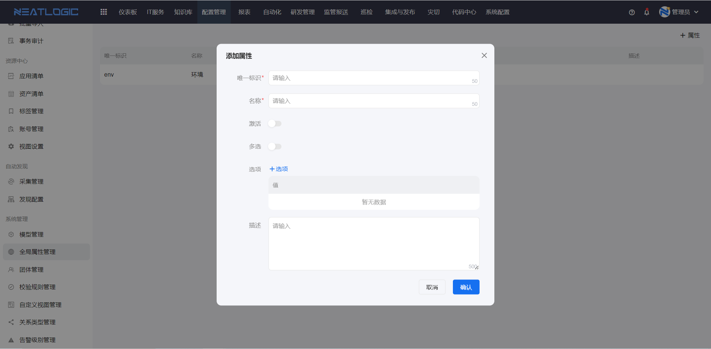
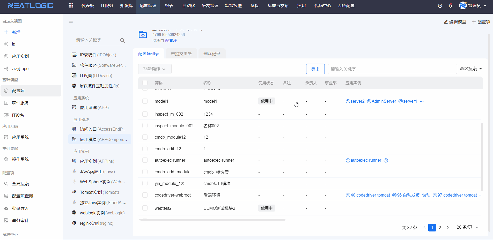

# 全局属性
全局属性是应用于所有模型的属性，只能在全局属性管理页面定义，全局属性目前只有选择组件一种类型。满足跨模型的资产可以通过一个公共属性来标签化分类，并用于全局性过滤，且过滤会沿着关系传播出去。

### 添加属性
全局属性的配置信息有唯一标识、名称、是否多选、激活、选项数据源和描述。

- 唯一标识，在全局属性中唯一即可。
- 名称，全局属性的名称，在全局属性中唯一。
- 是否多选，全局属性的类型包括单选框和复选框，不启用多选，则为单选框，反之则是复选框。
- 激活，激活的全局属性才能使用

### 全局属性应用
可以用在环境，受益人等场景。例如展开某个应用的topo图时，就可以这个全局属性过滤某个环境的节点。

模型关系：应用模块-->应用实例() 
查看某个模块的详情，在topo图下，可以按照全局属性过滤实例。
