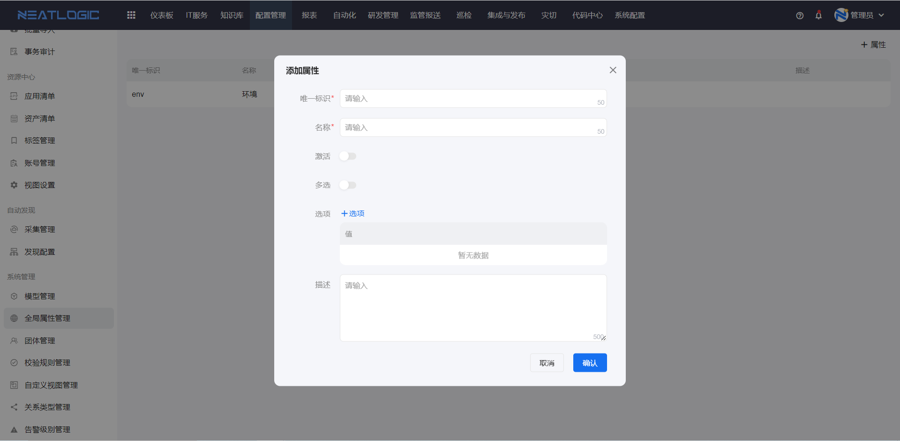
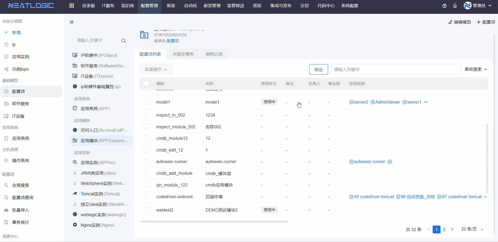

# 全局属性管理
全局属性是应用于所有模型的公共属性，仅能在全局属性管理页面定义。目前全局属性仅支持选择组件一种类型，可实现跨模型资产的标签化分类，并支持全局性过滤，且过滤效果会沿关系传播。

## 添加全局属性
全局属性的配置信息包括唯一标识、名称、是否多选、激活状态、选项数据源和描述。

- **唯一标识**：在全局属性范围内保持唯一即可
- **名称**：全局属性的显示名称，在全局属性范围内必须唯一
- **是否多选**：控制全局属性的类型，不启用多选则为单选框，启用则为复选框
- **激活**：仅激活状态的全局属性可被使用

## 全局属性应用场景
全局属性可应用于环境、受益人等场景。例如，在展开某个应用的拓扑图时，可通过全局属性过滤特定环境的节点。

**模型关系**：应用模块 → 应用实例

查看某个模块的详情时，在拓扑图中可按照全局属性过滤实例：

