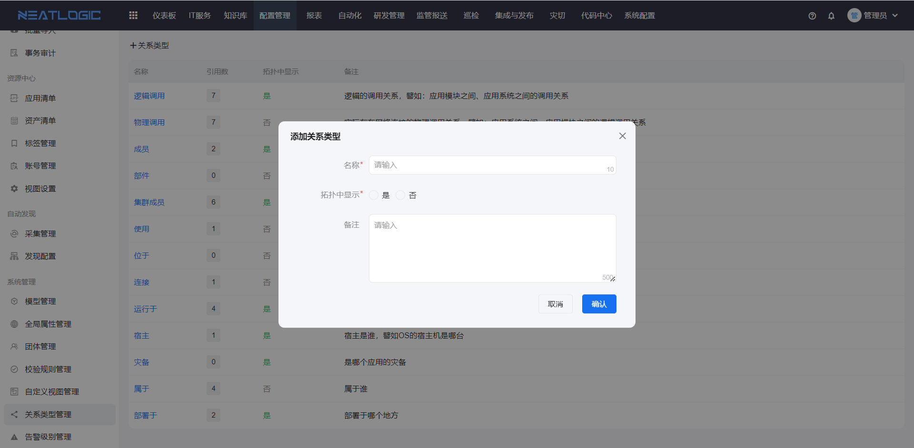
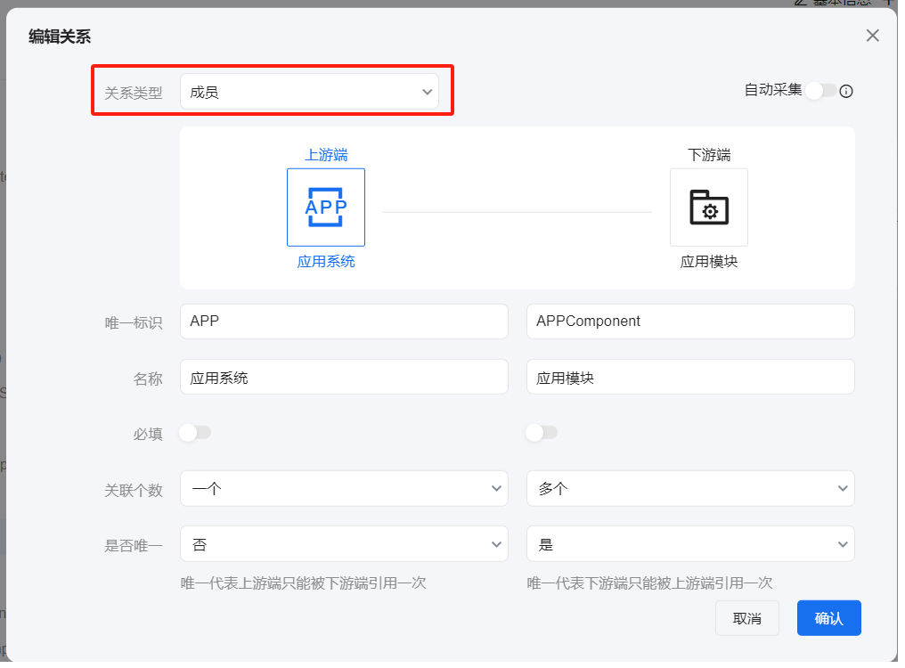
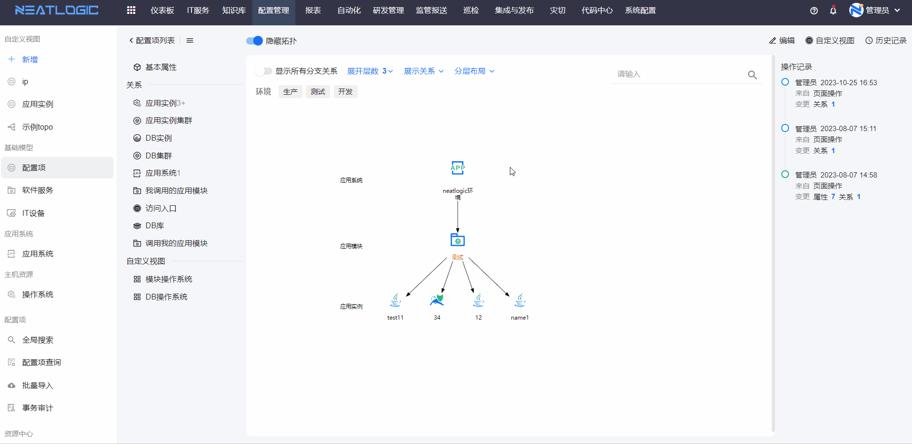

# 关系类型管理
关系类型是指模型与模型之间的关系，只是对关系进行命名分类。

### 添加
添加关系类型只要填写名称、是否在拓扑中显示和描述即可。

### 应用
关系类应用于模型管理的[关系配置](../模型管理/模型管理.md)中。

关于在拓扑图中显示配置，控制关系类型是否能在配置项拓扑图中用来过滤关联配置项。例如：应用系统的成员是应用模块，“成员”是关系类型且启用在拓扑图中显示，查看应用模块的配置项拓扑图时，可以通过“成员”关系过滤。
