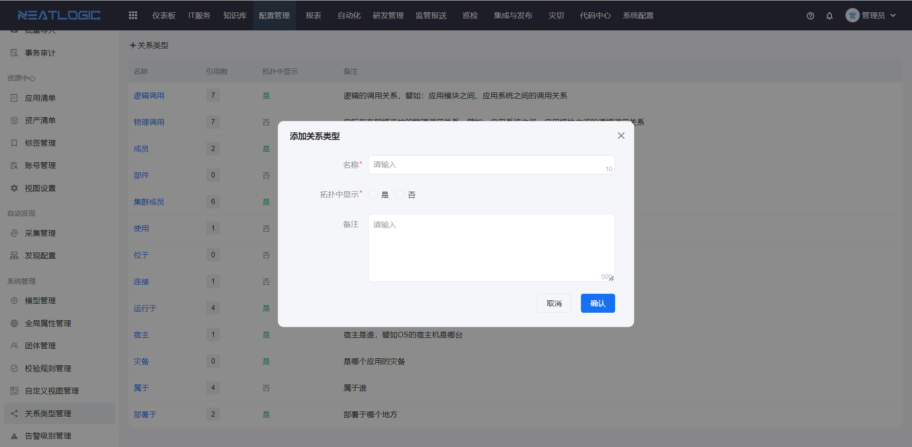
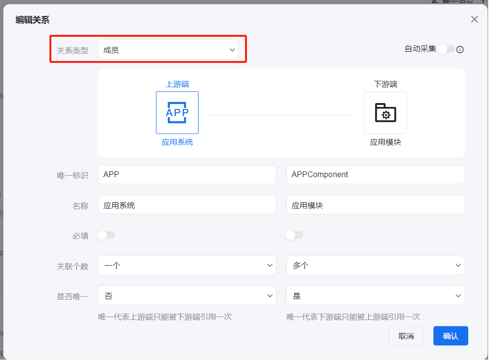
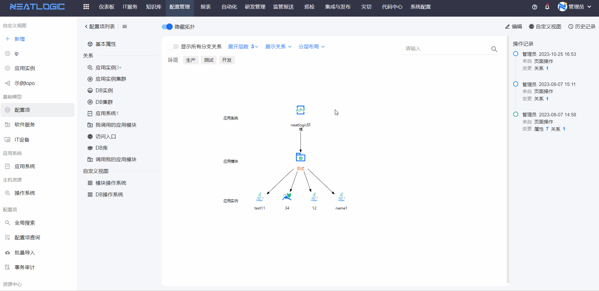

# 关系类型管理
关系类型用于定义模型与模型之间的关系，主要对关系进行命名和分类。

## 添加关系类型
添加关系类型时，只需填写名称、是否在拓扑中显示和描述即可。

## 应用场景
关系类型应用于模型管理的[关系配置](模型管理.md)中。

**在拓扑图中显示**配置用于控制关系类型是否可在配置项拓扑图中用于过滤关联配置项。例如：应用系统的成员是应用模块，若“成员”关系类型启用了在拓扑图中显示，则在查看应用模块的配置项拓扑图时，可通过“成员”关系进行过滤。

