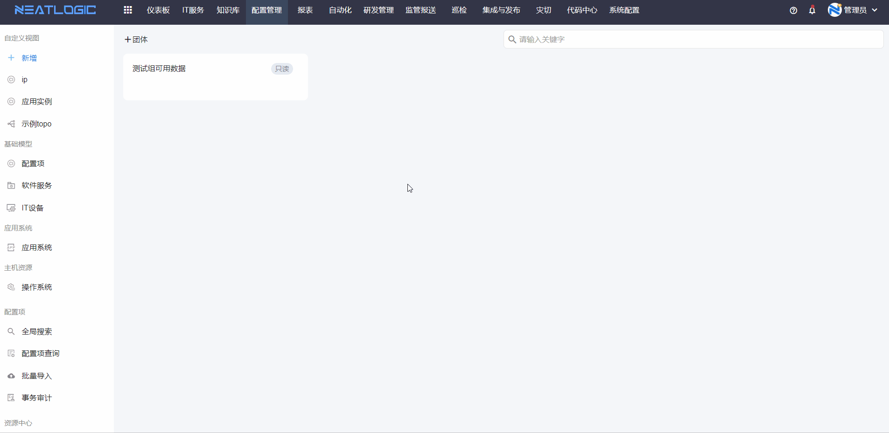
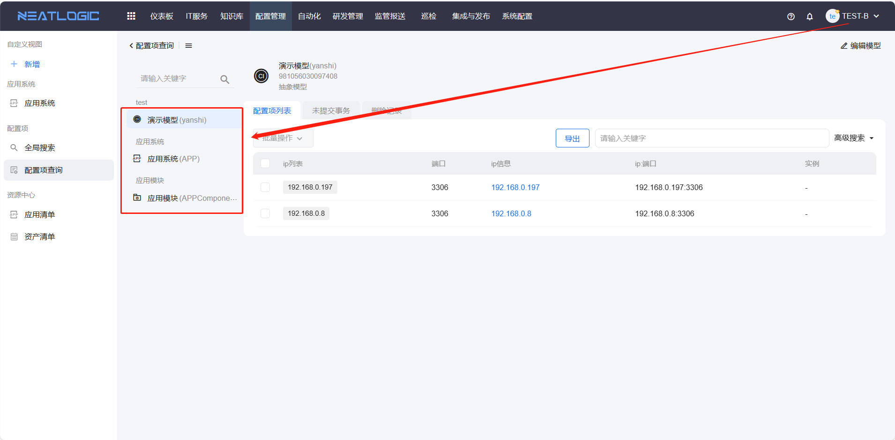
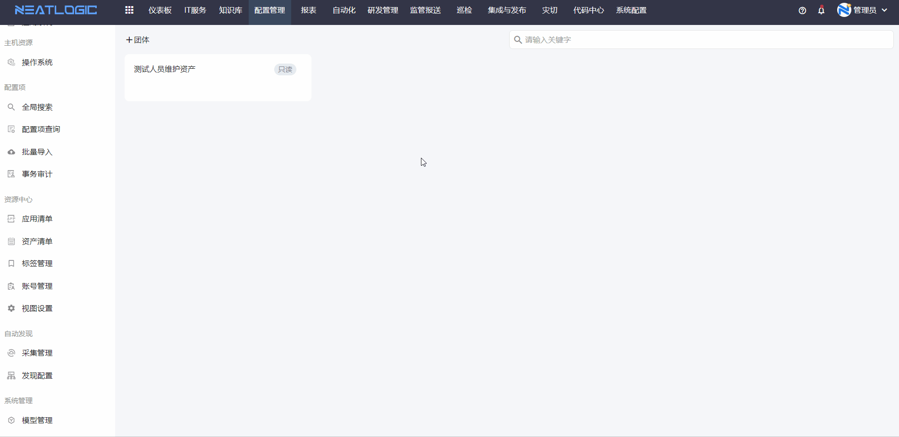

# 团体管理
团体是将模型中满足一定过滤条件的资产，给指定用户、角色或分组查看数据或者编辑权限。

团体的授权与模型授权区别：
- 模型授权只是在模型的层面授权，且是全量授权。
- 团体是可以对多个模型，每个模型设置相应过滤条件，满足各自模型过滤条件的资产才能授权。

### 添加团体
团体的主要配置是授权类型、授权对象、模型和过滤规则

- 授权类型：有只读和维护两种授权。
- 授权对象：分配到权限的人员，支持选择用户、角色和分组。
- 模型和规则：模型是确定资产所在的模型，每个模型下都有一个规则，规则是用来筛选资产的，如果规则为空，则筛选的结果也为空，一个团体可以添加多个模型。

### 应用
应用是指把满足团体的资产筛选出来，并关联到团体，然后按照团体的权限类型授权给指定的对象。新增或编辑的团体都必须应用后才能生效。

例如：如图所示，TEST-B用户只被三个模型授权了。

管理员添加了一个团体，团体的配置如图

应用团体后，回显关联的资产数，授权的用户也有了对相应资产的权限。

