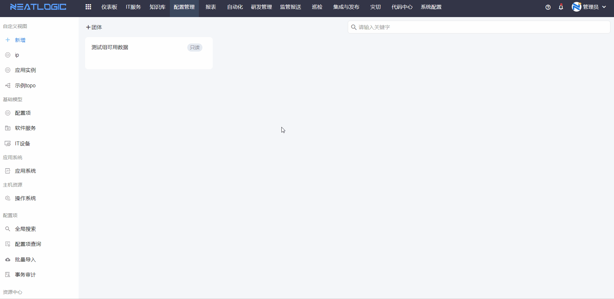
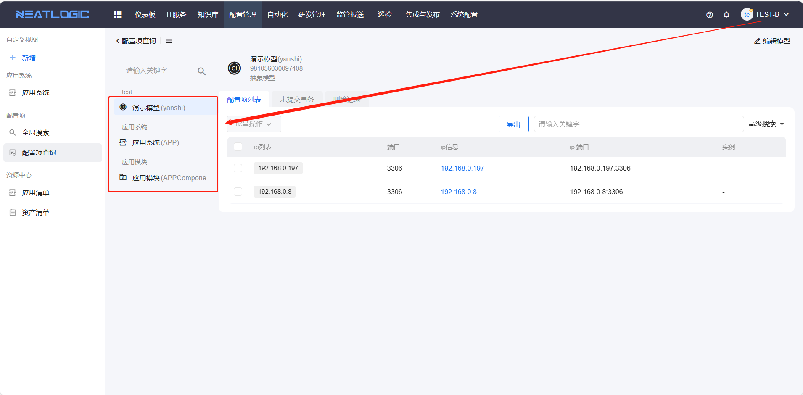
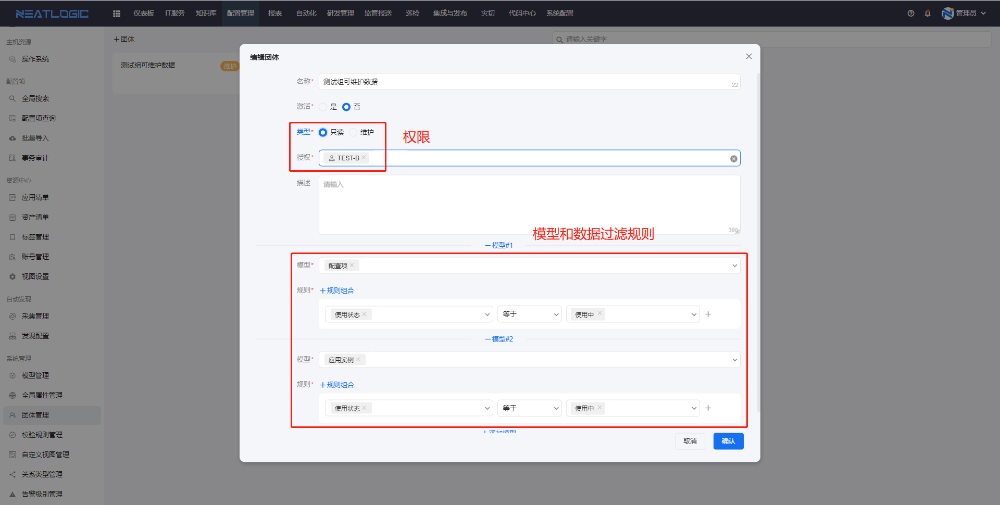
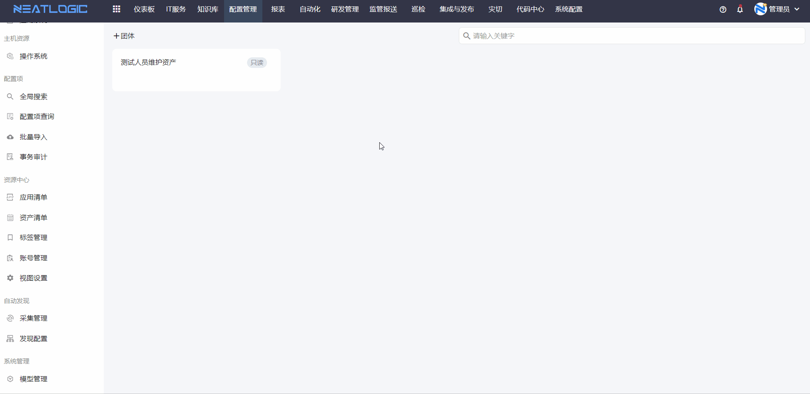
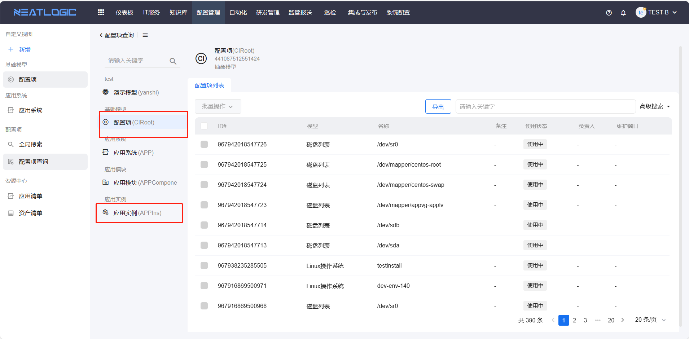

# 团体管理
团体用于将模型中满足特定过滤条件的资产，授权给指定用户、角色或分组，使其具备查看或编辑权限。

## 团体授权与模型授权的区别
- **模型授权**：仅在模型层面进行授权，属于全量授权
- **团体授权**：可对多个模型进行授权，每个模型可设置相应过滤条件，仅对满足过滤条件的资产进行授权

## 添加团体
团体的主要配置包括授权类型、授权对象、模型和过滤规则。

- **授权类型**：支持只读、维护和自动化操作三种授权类型
- **授权对象**：指被分配权限的人员，支持选择用户、角色和分组
- **模型和规则**：模型用于确定资产所属的模型，每个模型下可设置一个过滤规则用于筛选资产。若规则为空，则筛选结果也为空。一个团体可添加多个模型

## 应用团体
应用团体是指将满足团体过滤条件的资产筛选出来并关联到团体，然后按照团体的权限类型授权给指定对象。新增或编辑的团体必须应用后才能生效。

**示例**：
如图所示，TEST-B用户原本仅被三个模型授权：

管理员添加了一个团体，配置如下：

应用团体后，系统会回显关联的资产数量，授权用户也将获得对相应资产的权限：

