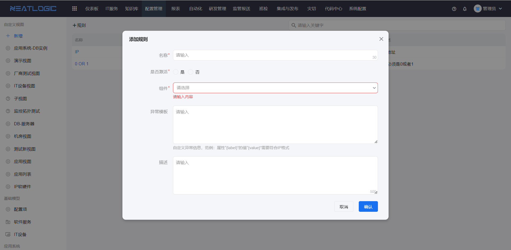
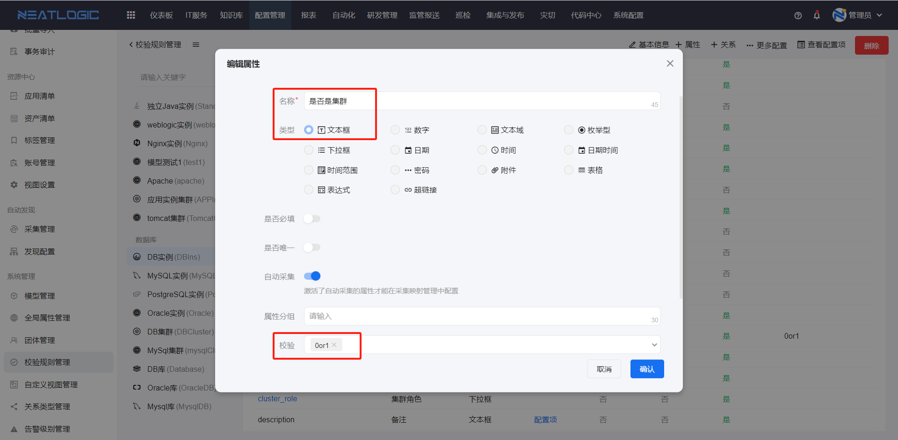

# 校验规则管理
校验规则应用于模型属性的规则校验，编辑模型配置项数据时，属性的值要满足校验规则才能通过并保存。

校验规则配置有名称、激活状态、组件、异常模板和描述，激活状态为是的规则才能使用。


## 校验规则的组件配置
校验规则的组件配置，这个是控制校验规则可通过那种方式来书写规则，目前包括正则表达式校验组件。
```
例如
限制输入的值是0或者1，表达式可以写:  ^[0-1]$
限制输入Email地址: ^\w+([-+.]\w+)*@\w+([-.]\w+)*\.\w+([-.]\w+)*$
```


## 应用
校验规则目前应用于[模型管理](../模型管理/模型管理.md/#模型属性)的模型属性设置，用来校验属性的值。
