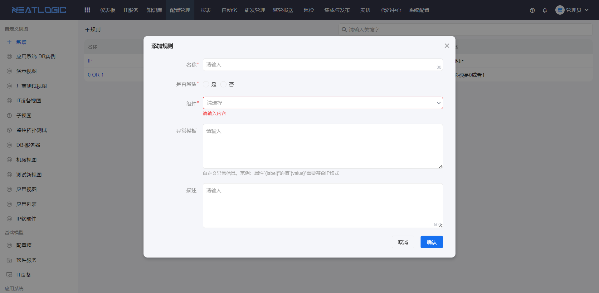
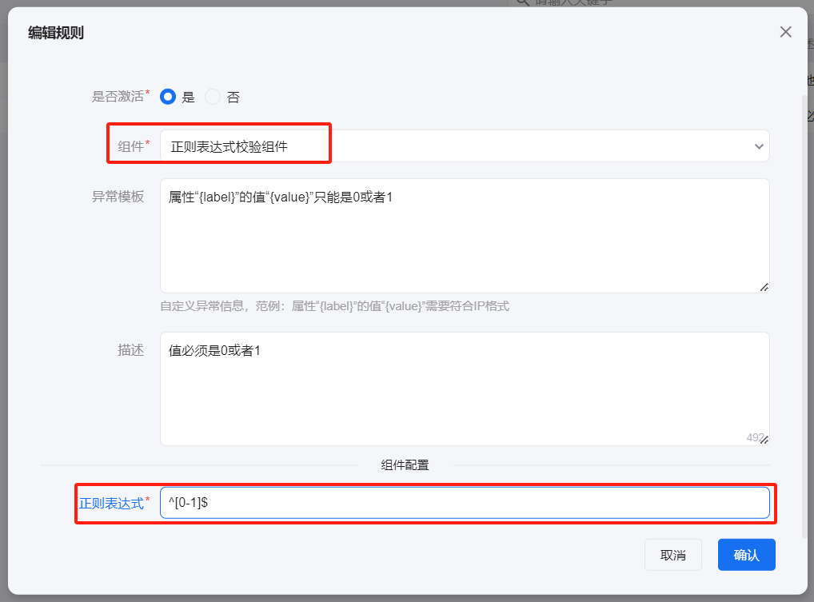
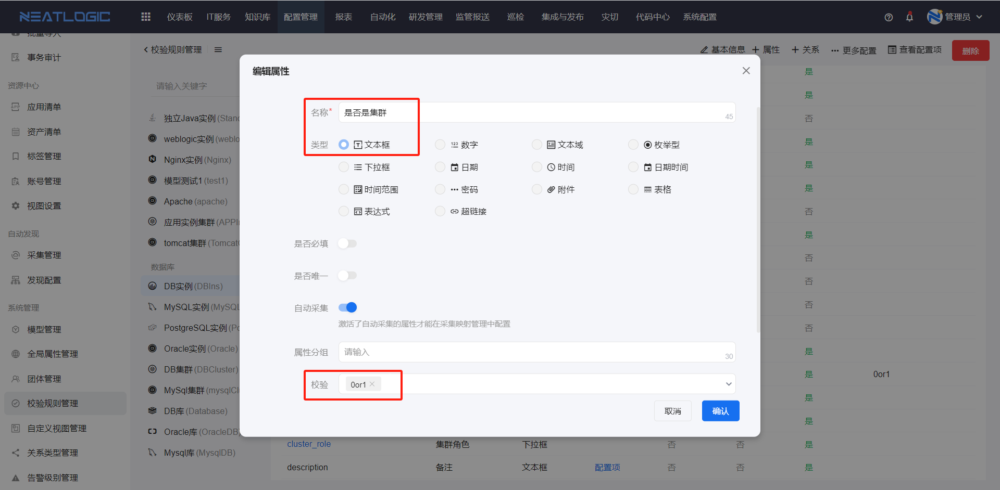

# 校验规则管理
校验规则用于模型属性的规则校验，在编辑模型配置项数据时，属性值必须满足校验规则才能通过验证并保存。

## 校验规则配置
校验规则的配置信息包括名称、激活状态、组件、异常模板和描述。其中，仅激活状态为“是”的规则可被使用。

## 校验规则组件配置
校验规则组件配置用于控制校验规则的书写方式，目前支持正则表达式校验组件。

**示例**：
- 限制输入值为0或1：`^[0-1]$`
- 限制输入为Email地址：`^\w+([-+.]\w+)*@\w+([-.]\w+)*\.\w+([-.]\w+)*$`

## 应用场景
校验规则目前应用于[模型管理](模型管理.md)的模型属性设置，用于校验属性值的合法性。

