# 模型管理
模型管理模块负责管理配置项的模型，模型管理页面按照层级分类展示配置项模型，右侧提供层级导航列表，辅助用户快速定位到选中的层级。
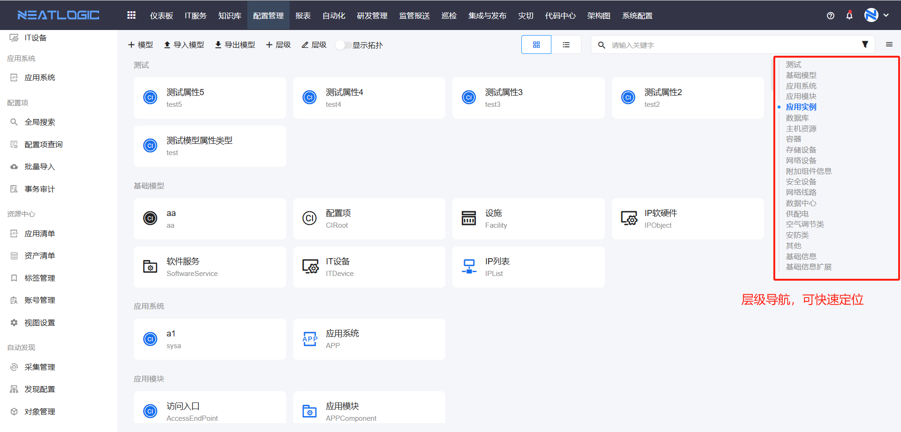

**相关权限**：系统配置-权限管理-配置项模型管理权限

## 名词解释
- **抽象模型**：主要用于继承，代表一类实体，用于管理公共属性，也可用于组成拓扑图的骨干网络。例如，应用实例是一个抽象模型，泛指所有应用进程，可创建Java实例、Nginx实例、Tomcat实例、WebLogic实例等普通模型来继承它。抽象模型会汇总所有继承该模型的配置项数据。
  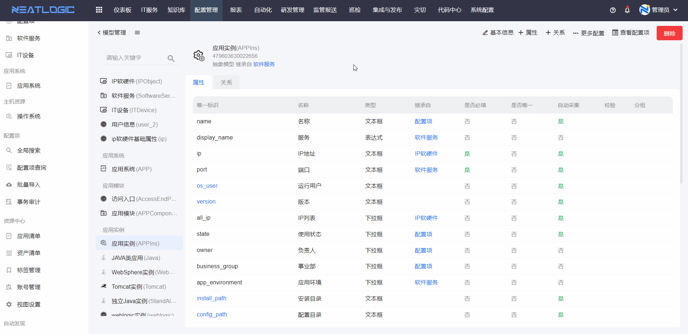
- **虚拟模型**：用于将外部数据纳入CMDB进行管理，使其数据可作为配置项被消费。广泛应用于引入用户信息或组织架构信息等场景。虚拟模型本质上通过视图获取数据，因此配置项数据无法编辑和删除，需回到数据源头进行管理。
  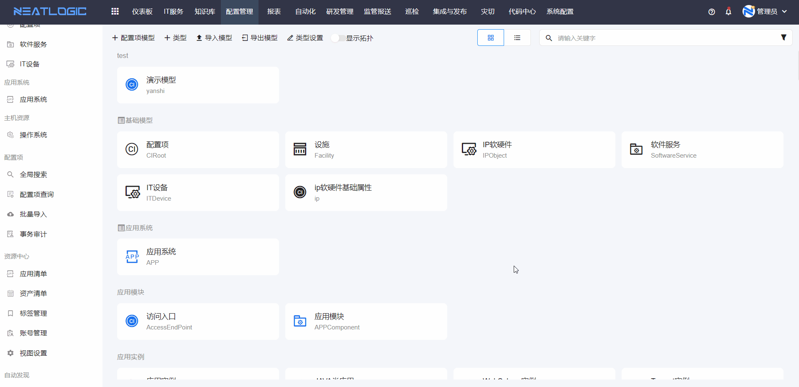
- **普通模型**：代表具体的实体，可录入配置项，如上述的Java实例等模型。普通模型也可被继承。
- **名称属性**：在拓扑展示和关系展示时，作为配置项名称的属性值，每个模型只能选择一个名称属性。
- **唯一规则**：选择一个或多个属性作为配置项的唯一性校验规则。

## 层级管理
**访问位置**：配置管理 > 系统管理 > 模型管理

模型层级相关功能包括添加和管理模型层级。当引用某模型类型的配置项模型数量为0时，该模型类型将被隐藏。

### 添加层级
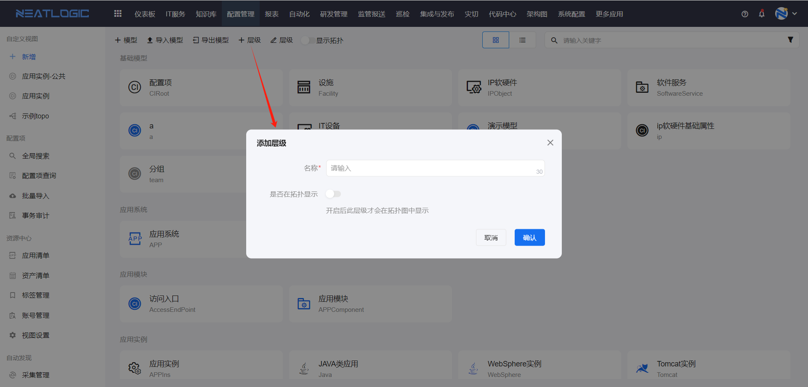

### 管理层级
可设置层级名称、排序、在拓扑中显示状态，并支持删除层级。仅当层级关联的模型数量为零时，才允许删除该层级，且删除后该层级在模型列表中会被隐藏。

**在拓扑中显示**：显示拓扑图时，将展示该层级中所有的配置项模型。
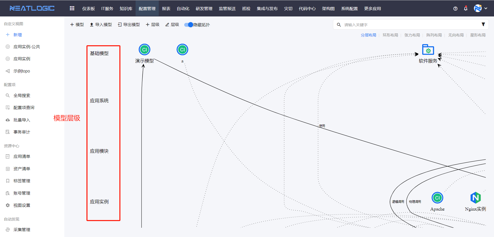

模型编辑页面和配置项列表页面的模型列表支持按模型层级展示，模型层级仅支持一级。
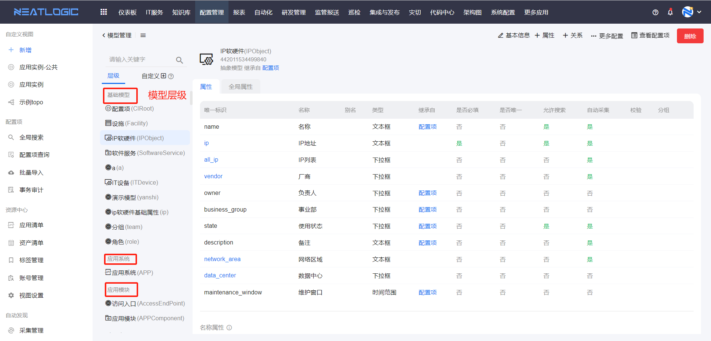

## 自定义目录
在模型编辑页面左侧目录列表中，包含“层级”和“自定义”两个分类：

- **层级**：基于模型所属层级对所有模型进行归类，具体内容参考上方[层级管理](#层级管理)部分。
- **自定义**：在自定义列表下，用户可手动拖动模型以修改其层级和排序。自定义目录仅用于辅助查看，无其他实际业务意义。
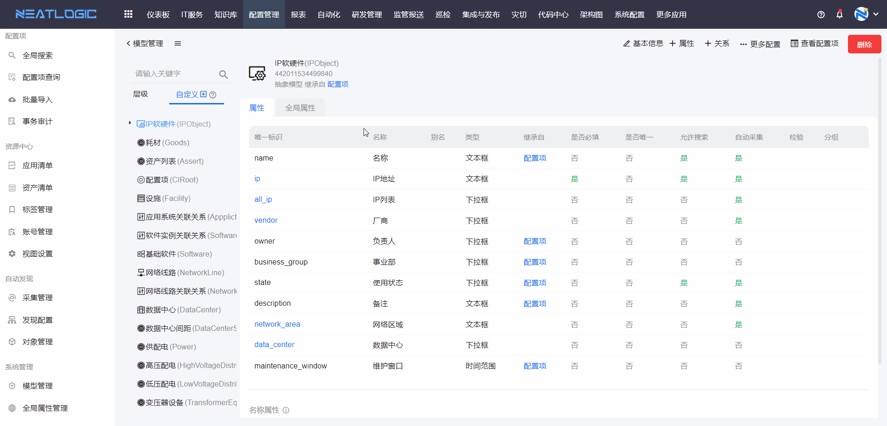

## 配置项模型管理
配置项模型可通过手动添加或导入方式创建。添加配置项模型主要包括两个步骤：填写模型基础信息，以及根据需求添加模型的属性和关系。

### 模型基本信息
模型基本信息包括类型、模型目录、图标、唯一标识、名称、继承关系、抽象模型、虚拟模型等设置。
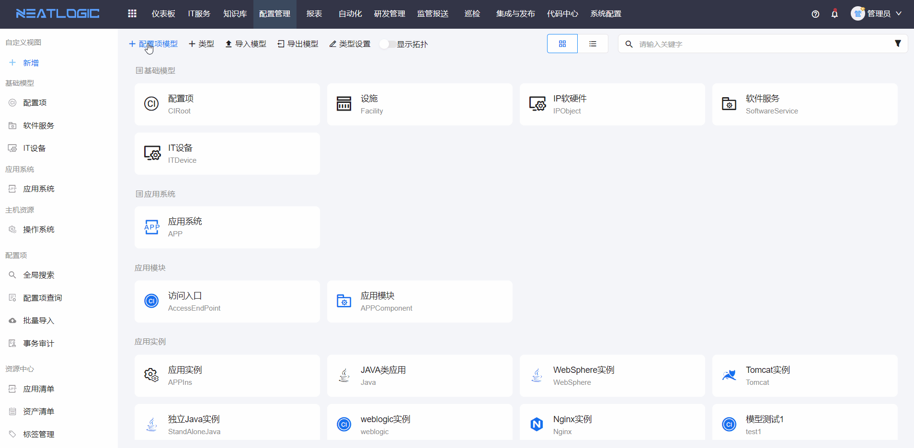

**注意**：当模型已有数据时，继承下拉框会被隐藏，无法修改继承模型对象。

### 模型属性
模型的属性类型共有十四种：文本框、数字、文本域、枚举型、下拉框、日期、时间、日期时间、时间范围、密码、附件、表格、表达式和超链接。其中，下拉框、表格和表达式较为特殊，存在引用关系。

下图是添加一般属性的示意图，属性名称和唯一名为必填项，属性分组为可选项。属性分组用于对模型属性进行分组归类，其效果可在[配置项](../配置项/配置项查询.md)详情页面查看。
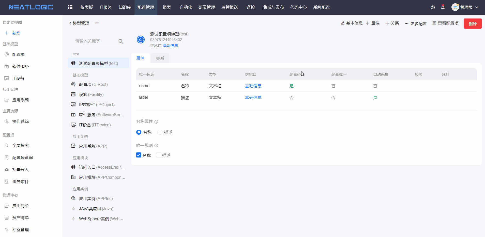

- **属性-下拉框**
  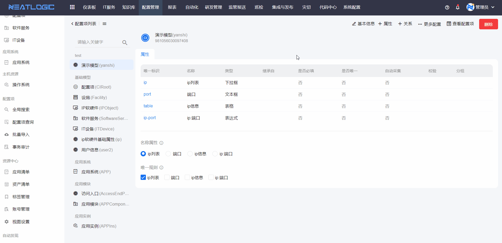
- **属性-表格**
  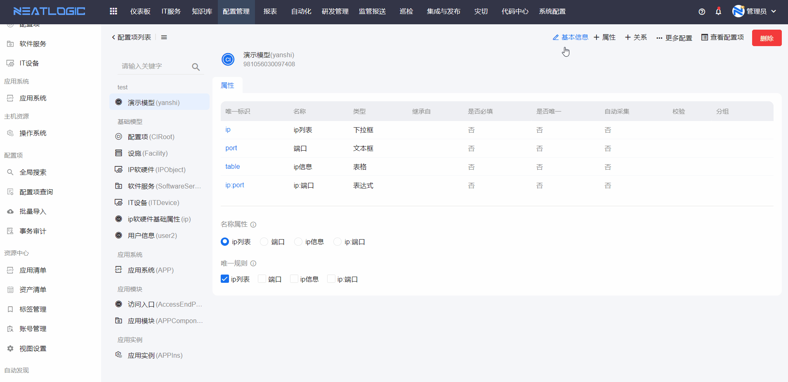
- **属性-表达式**
  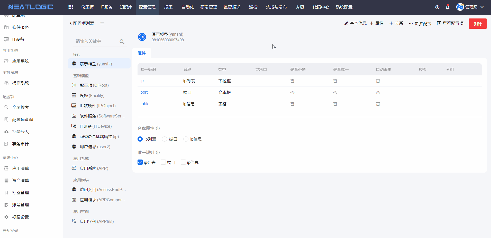

若模型的属性需要[采集数据](../数据采集/1.数据采集和巡检.md)，必须在属性设置中启用自动采集配置，否则无法在采集映射管理中配置属性的映射关系。

若需限制属性的输入规则（例如文本框仅允许输入IP地址），可通过引入校验规则来实现。校验规则的选项来源于[校验规则管理](../系统管理/校验规则管理.md)。
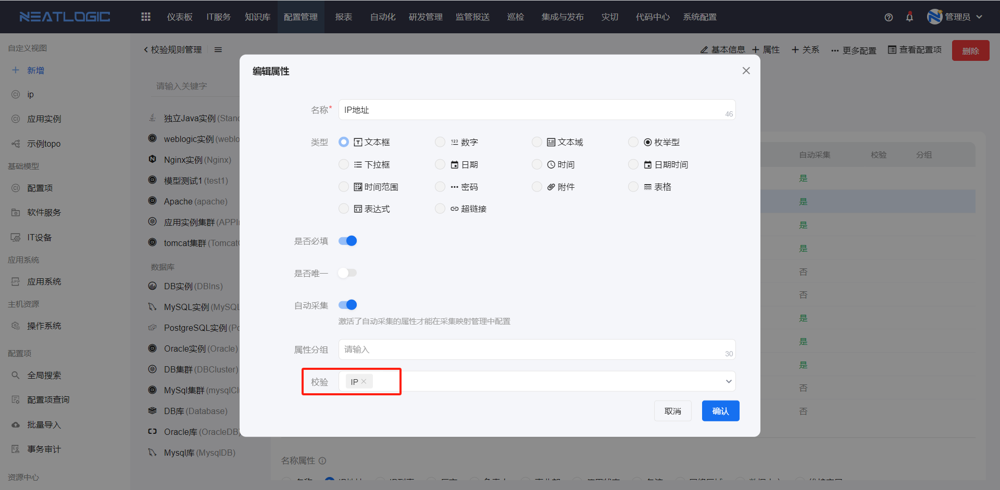

**允许搜索**
启用该配置后，属性可在高级搜索中作为搜索条件；在自定义视图中，可连接其他模型的属性作为匹配条件。
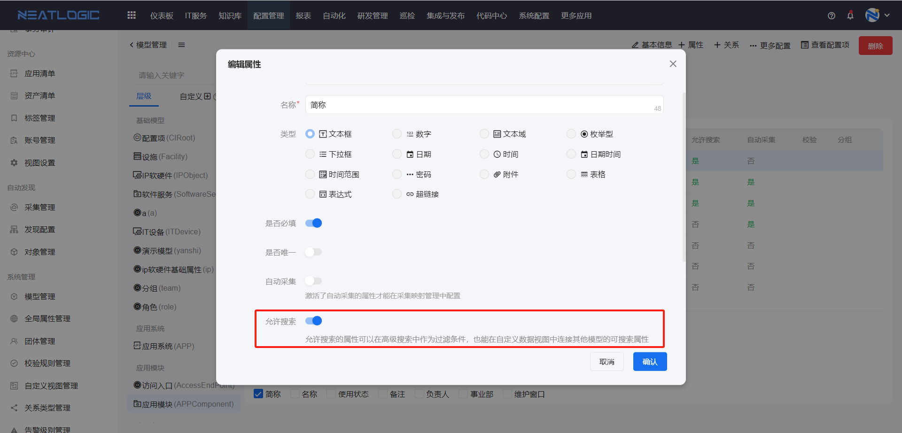

### 全局属性
模型的全局属性数据来源于[全局属性管理](../系统管理/全局属性管理.md)，在模型中无法修改全局属性。若全局属性中无数据，所有模型都会隐藏全局属性页签。
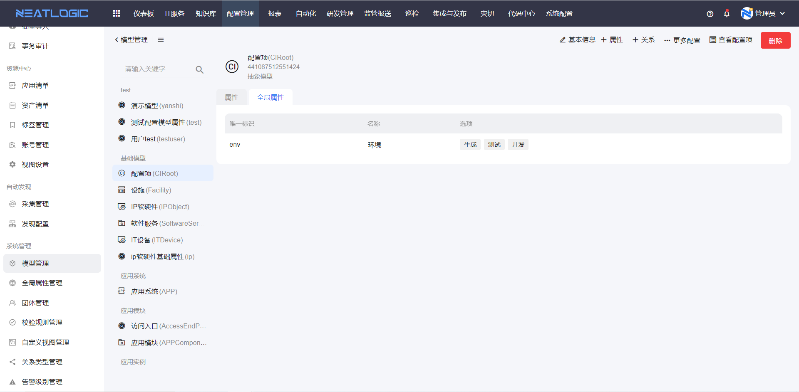

若不需要使用全局属性，可在显示编辑设置中配置为不显示和不允许编辑。
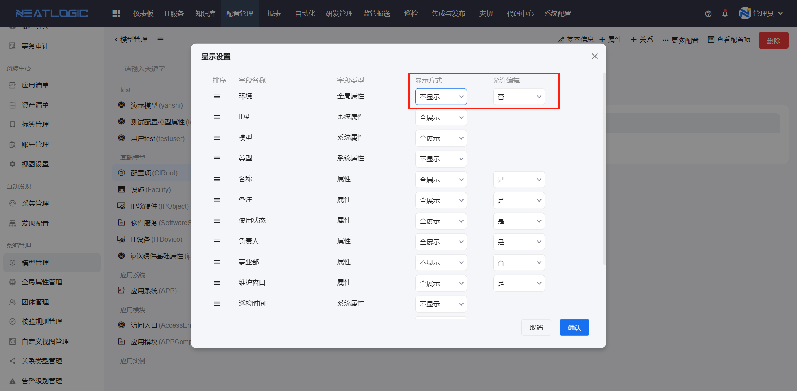

### 模型关系
模型关系用于建立与其他模型的关联关系，包括关系类型、上下游、关联个数、是否唯一、级联删除等配置。

- **关系类型**：用于定义两个关联模型之间的关系，例如“属于”、“包含”等。在查看配置项详情的拓扑图时，可通过关系类型过滤关联配置项。关系类型的数据源可在[关系类型管理](../系统管理/关系类型管理.md)页面自定义。
- **上下游**：定义在拓扑图中模型所处的上下游关系。
- **关联个数**：控制上、下游模型的配置项是否可关联多个配置项，或是否可同时被多个配置项关联。
- **是否唯一**：启用后，在该关联关系中，配置项只能被关联一次。
- **级联删除**：启用后，删除上游（或下游）模型的配置项时，系统会自动删除与该配置项关联的下游（或上游）配置项。
- **级联关系**：系统会根据当前关系计算两个模型之间的所有潜在关系，并自动生成关系数据。

### 显示设置
显示设置包括排序、是否显示和是否编辑设置：
- **排序设置**：可调整属性在配置项列表中的显示顺序
- **是否显示**：控制模型的属性和关系数据在配置项列表和配置项详情页面的显示情况
- **是否编辑**：控制在添加或编辑配置项时是否可编辑属性数据

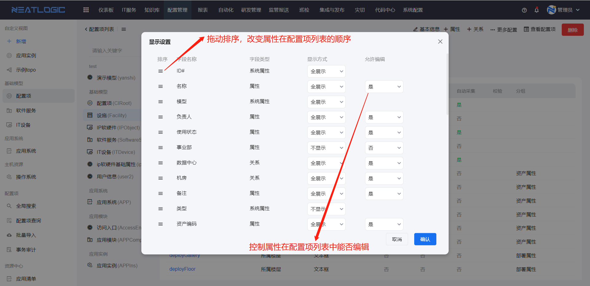

**显示设置说明**：
- **不显示**：同时不在配置项列表和配置项详情中显示属性或关系的数据
- **全展示**：同时在配置项列表和配置项详情中显示属性或关系的数据
- **仅列表**：仅在配置项列表中展示属性或关系的数据
- **仅明细**：仅在配置项详情页面中显示属性或关系的数据

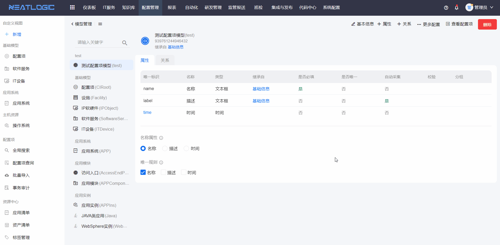

### 授权管理
模型授权用于管理配置项和事务的增删改查等功能，其中模型的管理权限优先级最高。模型权限采用白名单机制，仅授权的普通用户可执行该权限控制的操作。

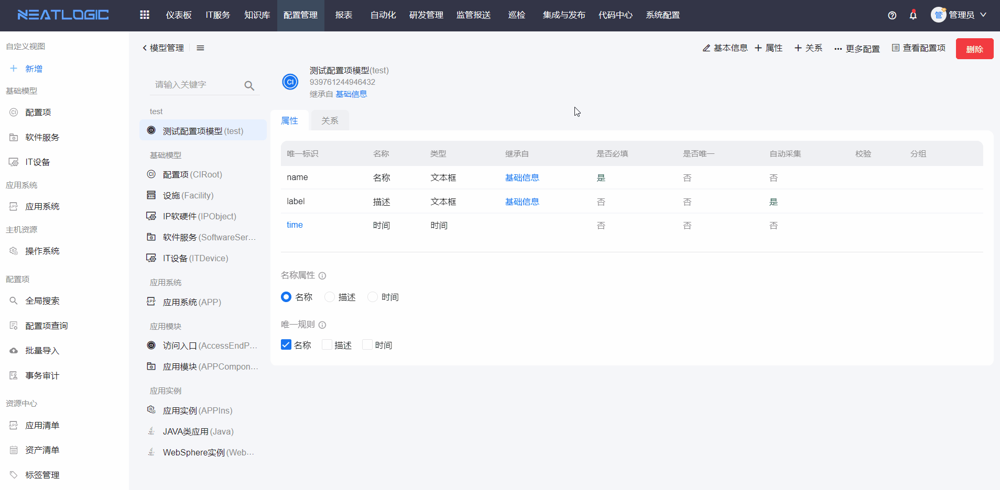

模型管理中的权限属于操作层面的权限。若需在模型的数据层面对不同用户群体进行数据过滤，可通过团体管理页面实现：为不同模型设置不同规则，符合规则的配置项会进入相应团体，根据团体的授权决定用户是否可编辑。

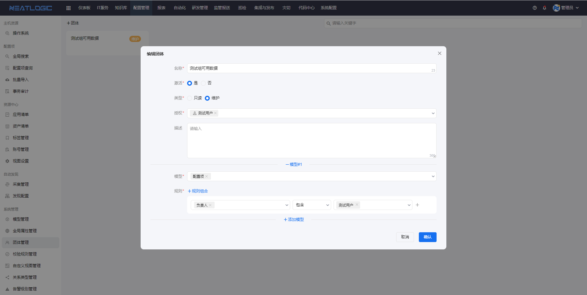

### 合规检查
合规检查通过设置条件规则，筛选出不满足规则的配置项。

在模型编辑页面，展开“更多配置”，点击“合规检查”：

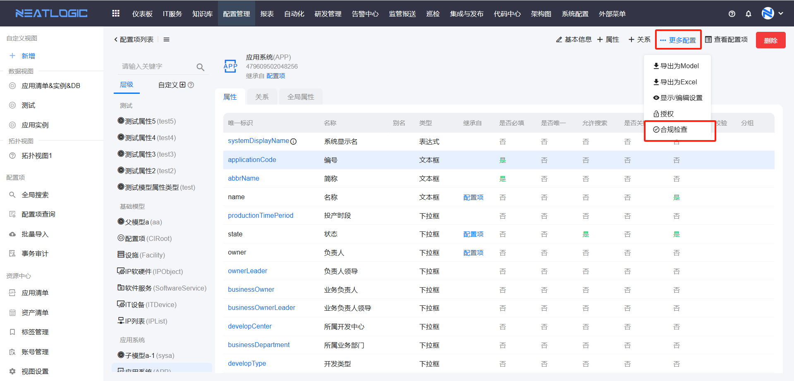
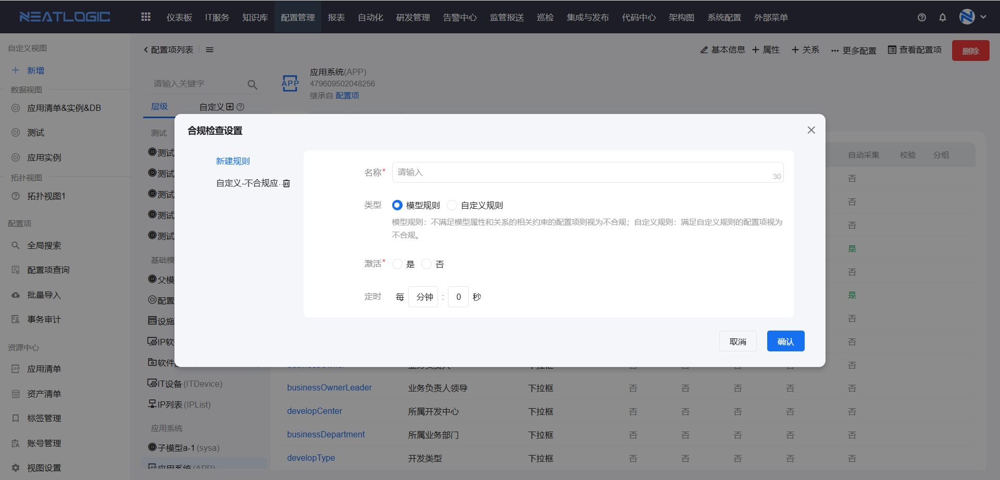

不合规规则类型分为模型规则和自定义规则两种：

1. **模型规则**
   基于模型属性中设置的校验规则，筛选出不满足属性校验规则的配置项。
   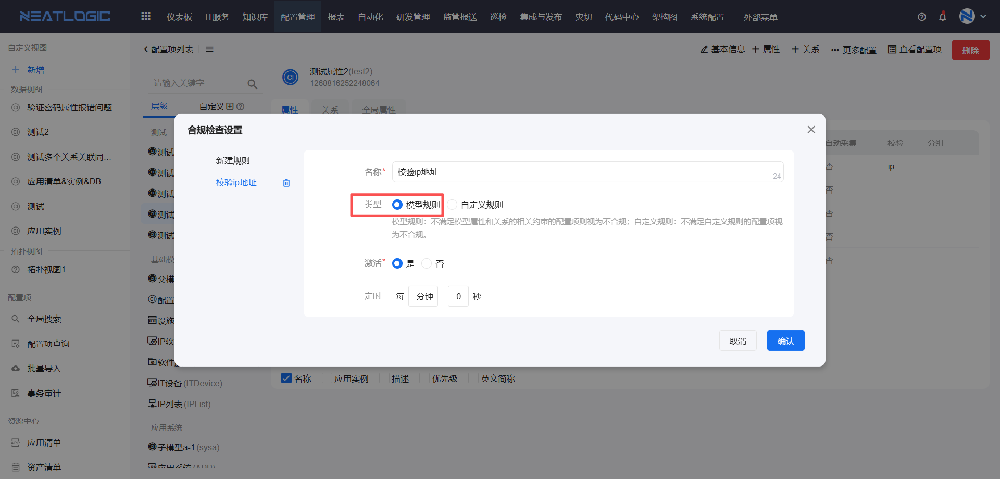
   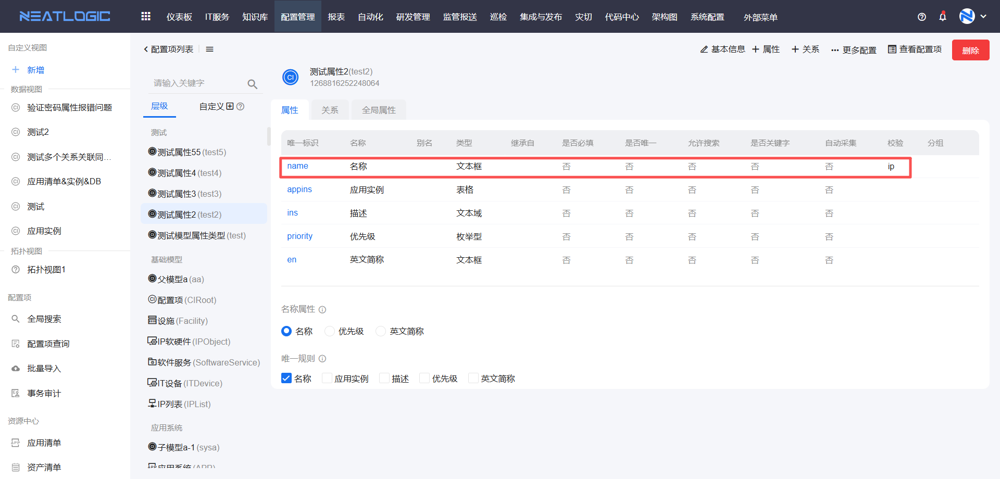
   **模型规则校验效果**：
   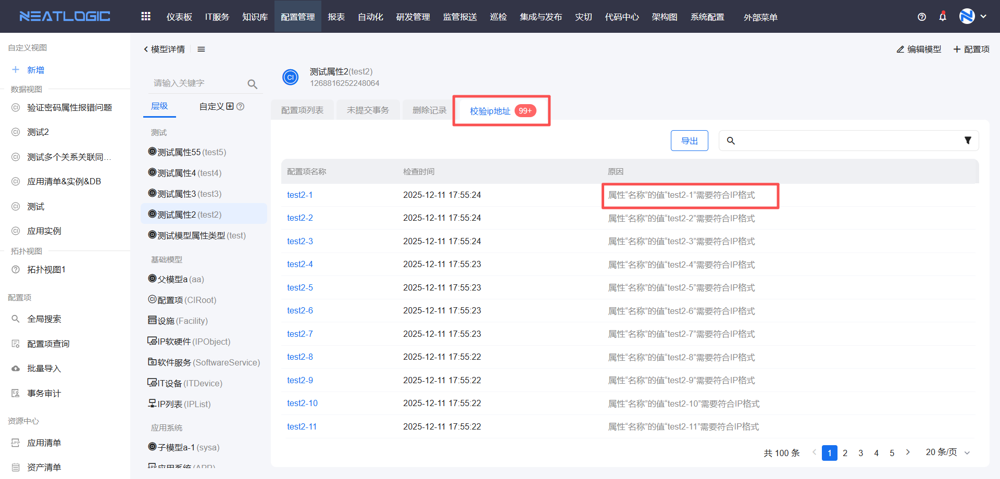

2. **自定义规则**
   自定义合规检查的校验条件。
   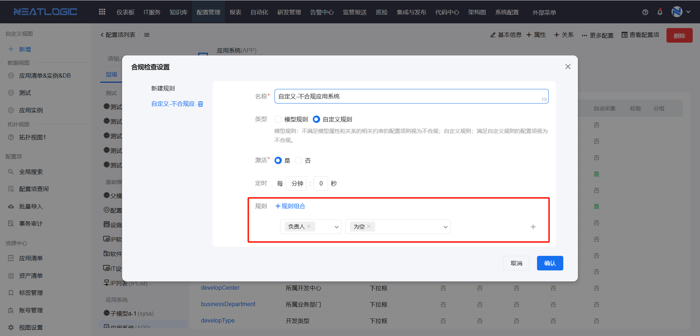
   **自定义规则校验效果**：
   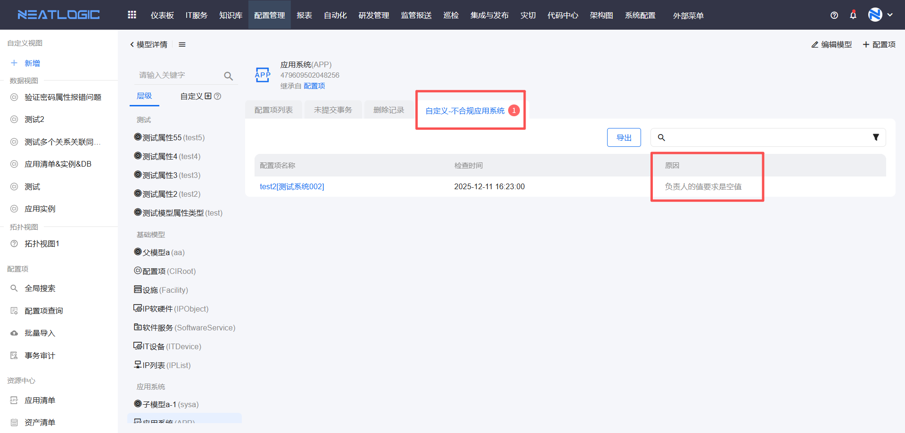

### 模型导出

### 模型导入
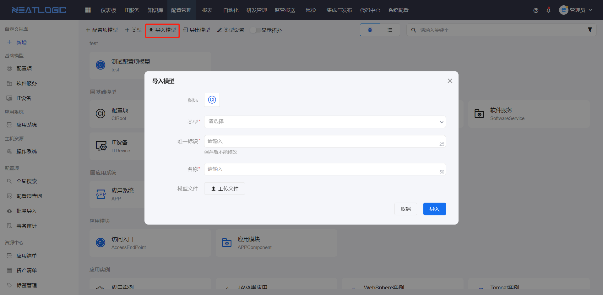