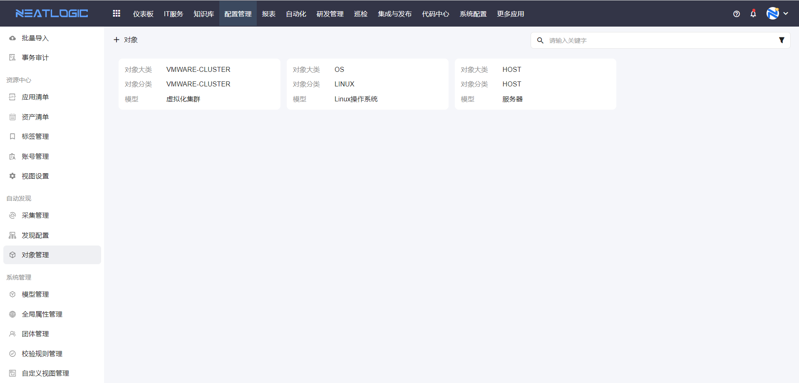
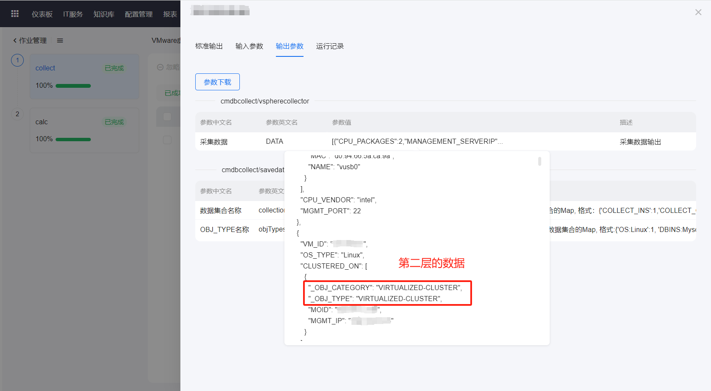
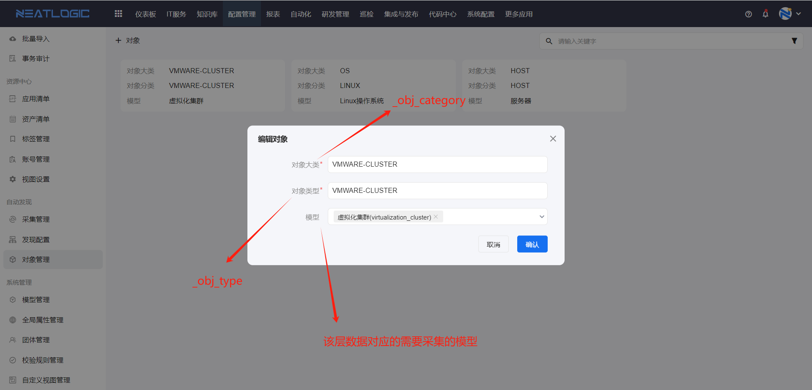

# 对象管理
对象管理是管理集合分类与模型的关联关系，采集管理中配置模型属性采集映射时，只能选择对应的分类下的属性。

## 配置
1. 确认采集的数据有几层
   
   手动执行采集作业，找到采集脚本的返回值
    
   找到每个层级_obj_category和_obj_type的值，分别对应对象配置的“对象大类”和“对象分类”，与模型关联，如图所示。

2. 根据采集数据的层级关系添加对象配置。
   
   第一层是主动采集可以不配置，往下的所有层级时被动采集，都要配置正确的对象管理，不配会自动跳过。
   
   