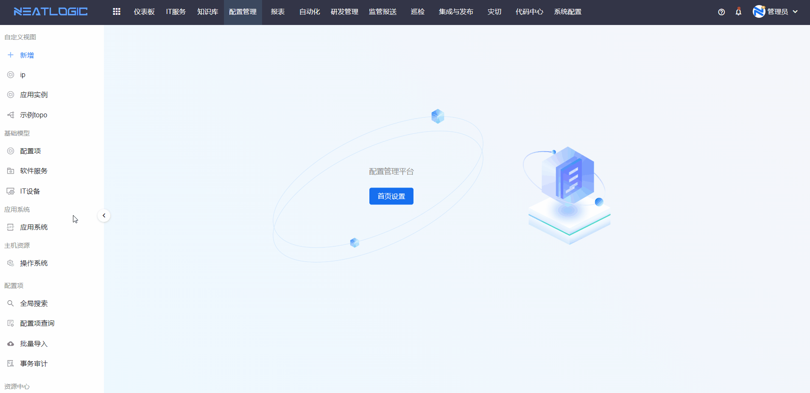
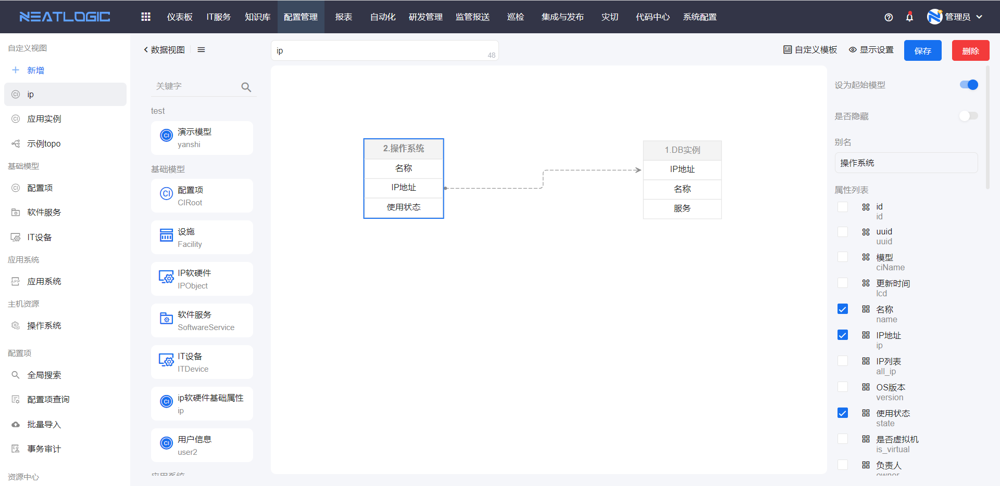
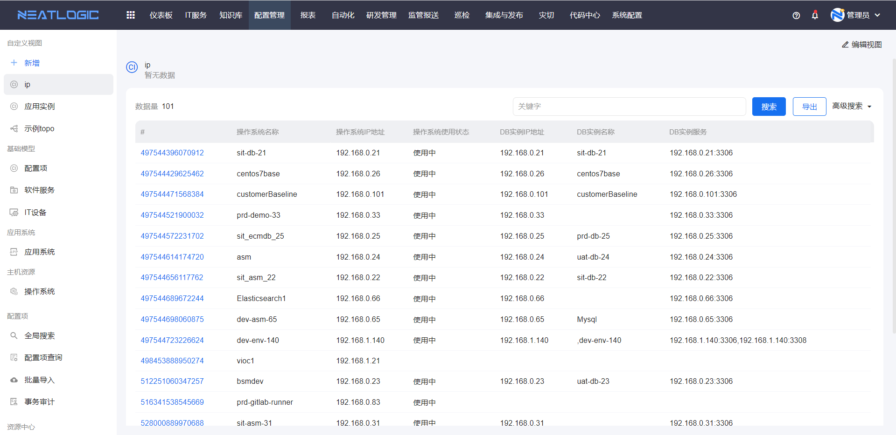
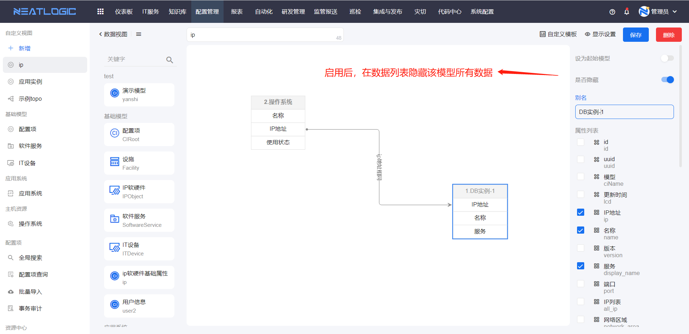
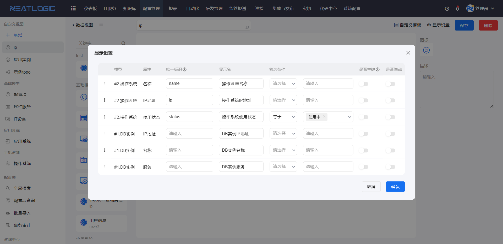
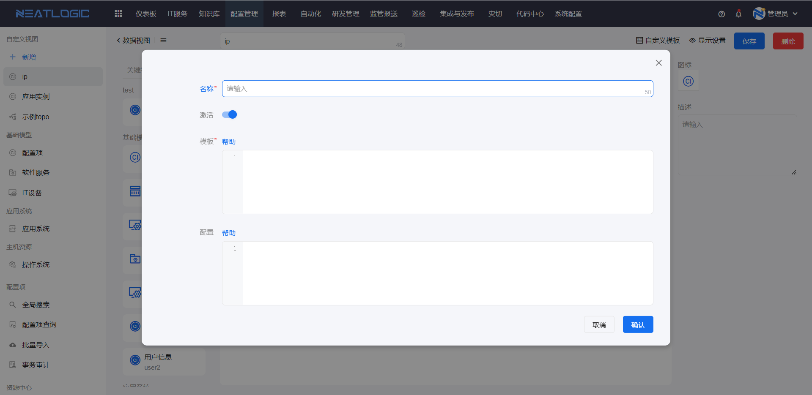
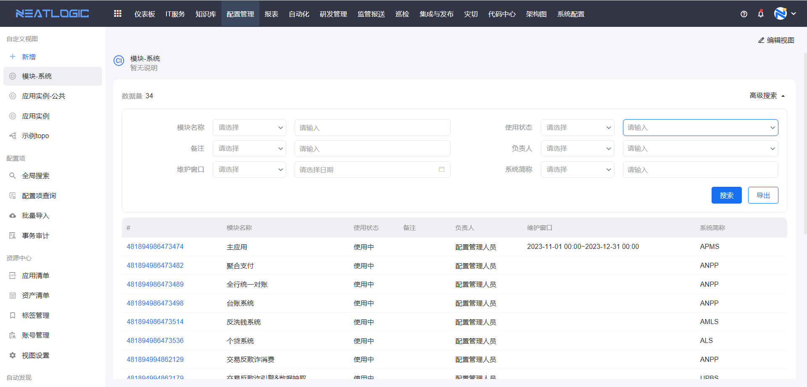
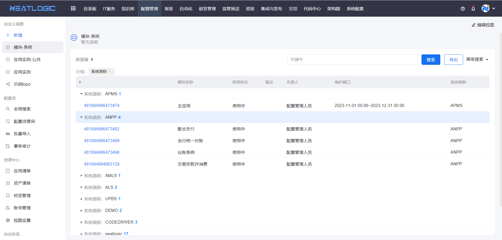
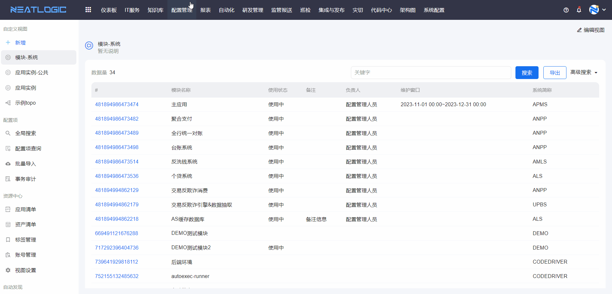
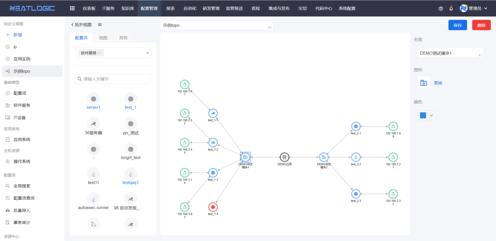

# 自定义视图
视图从是否可权限的角度，可以分成个人视图和系统视图，在此基础上，视图还分成数据视图和拓扑视图两种类型。
## 个人视图和系统视图
个人视图是指当前登录用户独有的视图，当前登录用户自己创建，不能授权给其他用户使用，添加的入口如图所示。

系统视图时由系统视图管理员配置并授权给指定用户使用的视图，被授权的用户只能查看视图效果，不能编辑视图。添加入口如图所示

## 数据视图
数据视图是通过绘制模型关系图，可视化的方式将两个或两个以上的模型通过连线连接，模型间支持通过属性相连，汇总相连属性数据相同的数据。下面分别是编辑视图效果图和数据效果图。

### 数据视图配置说明

1. 必须有且只有一个起始模型，其实模型的属性连线只能连出，不能连入，连线方向是根据全连接时的方向来判断的。

2. 所有的模型都不能独立存在，必须和其他模型存在相连的连线，连线类型有全连接、左连接、右连接，三种链接方式代表数据的匹配关系。 
全连接是指相连属性数据相同就合并为一条数据，并汇总到视图数据中。 
左连接是在全连接基础上，将连线连出（以全连接的方向为准）的模型剩余数据合并到视图数据中； 
右连接是在全连接基础上，将连线连入（以全连接的方向为准）的模型剩余数据合并到视图数据中。

3. 模型设置包括起始模型、是否隐藏、别名、属性列表，属性列表勾选的属性才能使用。

4. 显示设置用于管理视图数据列表中属性排序、属性显示名、是否隐藏以及数据默认过滤条件等。

5. 自定义模板支持用户根据自己的需求自定义数据列表的展示效果。补充说明，显示设置中定义了唯一标识的属性才能使用。

    **注意：模型管理中启用了允许搜索的属性才能用于连接。**

### 查看数据视图
数据视图是列表展示，按照视图的显示设置展示表头字段，id字段是起始模型中的配置项的id。列表支持高级搜索，搜索条件是当前列表的字段。

分组查看，点击表头字段名即可进行分组。

查看配置项详情，点击数据的id。

## 拓扑视图
拓扑视图是可以将任意模型的配置项做为拓扑图节点，并且自由连接配置项上、下游关系,最终。

1. 配置项：长按配置项拖到到视图画布中，新增拓扑图节点成功，然后根据需求链接节点。

2. 视图：在拓扑视图的基础上，支持再嵌套拓扑视图，长按添加视图图标拖动到画布中即可。

3. 分组：在其他中，拖动添加分组图标到画布中，出现一个可自定义大小、名称、变框宽度和背景色的矩形框。分组变框的作用主要是将目标节点圈在变框中，设置变框名称为分组名，效果如图所示。

